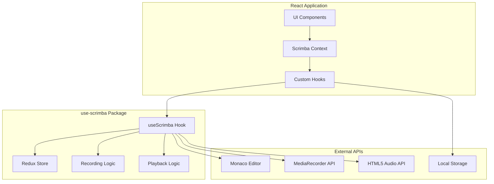

# Interactive Coding Platform Architecture

## Overview

This document describes the architecture of the Interactive Coding Platform (Scrimba-like), focusing on the **use-scrimba** package integration and the **Independent Master Timeline** synchronization system.

## High-Level Architecture



## Core Components

### 1. useScrimba Hook (Core Package)

The main hook that orchestrates all functionality:

**Responsibilities:**
- State management via Redux Toolkit
- Monaco Editor event capture
- Audio synchronization
- Timeline management
- Recording lifecycle

**Key Features:**
- Independent master timeline using `performance.now()`
- Direct Monaco manipulation for zero-latency updates
- Redux-based state with React integration
- Granular event capture control

### 2. Master Timeline System

The core innovation ensuring perfect synchronization:

```typescript
// Master Timeline Architecture
performance.now() Master Timeline
    ├─ Audio Element (slave)
    └─ Editor State (slave)
```

**Implementation:**

```typescript
// Master timeline update loop
const masterTimelineUpdate = () => {
  // MASTER TIMELINE: Independent time source
  const elapsed = performance.now() - masterTimelineStartRef.current.perfTime;
  const masterTime = masterTimelineStartRef.current.currentTime + 
    (elapsed * currentState.playbackSpeed);
  
  // Sync audio to master timeline
  const expectedAudioTime = masterTime / 1000;
  if (Math.abs(audio.currentTime - expectedAudioTime) > 0.1) {
    audio.currentTime = expectedAudioTime;
  }
  
  // Apply editor state synchronously
  if (hasEditor && editor) {
    const currentSnapshot = findSnapshotAtTime(masterTime);
    if (currentSnapshot && currentSnapshot !== lastAppliedSnapshot) {
      applyContentDiff(editor, currentSnapshot.state.content);
      editor.setPosition(currentSnapshot.state.position);
      editor.setSelection(currentSnapshot.state.selection);
    }
  }
  
  // Continue timeline
  requestAnimationFrame(masterTimelineUpdate);
};
```

**Benefits:**
- **Zero Drift**: High-precision timing prevents accumulation errors
- **Zero Latency**: Audio and editor updates in same frame
- **Perfect Seeking**: Timeline resets maintain sync during scrubbing
- **Clean Audio**: Proper pause/stop prevents audio artifacts

### 3. Recording System

**Event Capture:**

```typescript
// Monaco Editor event listeners
editor.onDidChangeContent(() => captureSnapshot('content'));
editor.onDidChangeCursorPosition(() => captureSnapshot('position'));
editor.onDidChangeCursorSelection(() => captureSnapshot('selection'));
editor.onDidScrollChange(() => captureSnapshot('scroll'));

const captureSnapshot = (eventType: string) => {
  const timestamp = Date.now() - recordingStartTime;
  const snapshot: EditorSnapshot = {
    timestamp,
    state: {
      content: editor.getValue(),
      position: editor.getPosition(),
      selection: editor.getSelection(),
      viewState: editor.saveViewState(),
    },
  };
  
  store.dispatch(addSnapshot(snapshot));
};
```

**Audio Capture:**

```typescript
// MediaRecorder API integration
const mediaRecorder = new MediaRecorder(audioStream);
mediaRecorder.start();

mediaRecorder.ondataavailable = (event) => {
  audioChunks.push(event.data);
};

mediaRecorder.onstop = () => {
  const audioBlob = new Blob(audioChunks, { type: 'audio/webm' });
  stopRecording({ audioBlob });
};
```

### 4. Redux Store Architecture

**State Structure:**

```typescript
interface ScrimbaState {
  recording: {
    isRecording: boolean;
    recordingStartTime: number | null;
    currentRecording: {
      snapshots: EditorSnapshot[];
      duration: number;
      audioBlob?: Blob;
    } | null;
  };
  playback: {
    isPlaying: boolean;
    isPaused: boolean;
    hasEnded: boolean;
    currentTime: number;
    playbackSpeed: number;
    loadedRecording: Recording | null;
    currentSnapshot: EditorSnapshot | null;
    editorState: EditorState;
  };
}
```

**Action Flow:**

```typescript
// Recording actions
startRecording() → recordingSlice/startRecording
captureEvent() → recordingSlice/addSnapshot
stopRecording() → recordingSlice/stopRecording

// Playback actions
play() → playbackSlice/play
pause() → playbackSlice/pause
seekTo(time) → playbackSlice/seekTo
updateCurrentTime(time) → playbackSlice/updateCurrentTime
```

### 5. React Context Integration

**Context Provider:**

```typescript
const ScrimbaProvider: React.FC<{ children: React.ReactNode }> = ({ children }) => {
  const editorRef = useRef<monaco.editor.IStandaloneCodeEditor | null>(null);
  const audioRef = useRef<HTMLAudioElement | null>(null);
  
  const scrimba = useScrimba({
    editorRef,
    audioRef,
    onRecordingStop: (recording) => {
      // Save to storage
      storage.save(recording);
    },
  });
  
  return (
    <ScrimbaContext.Provider value={scrimba}>
      {children}
    </ScrimbaContext.Provider>
  );
};
```

**Context Consumption:**

```typescript
const useScrimbaContext = () => {
  const context = useContext(ScrimbaContext);
  if (!context) {
    throw new Error('useScrimbaContext must be used within ScrimbaProvider');
  }
  return context;
};
```

## Data Flow

### Recording Flow

1. **User Starts Recording**
   ```
   UI Button → scrimba.startRecording() → Redux: startRecording
   ```

2. **Events Captured**
   ```
   Monaco Events → handleEditorChange() → captureSnapshot() → Redux: addSnapshot
   ```

3. **Audio Recording**
   ```
   MediaRecorder → ondataavailable → audioChunks.push(data)
   ```

4. **Stop Recording**
   ```
   UI Button → scrimba.stopRecording() → createAudioBlob → Redux: stopRecording
   → onRecordingStop callback → Storage.save()
   ```

### Playback Flow

1. **Load Recording**
   ```
   UI Selection → scrimba.loadRecording(recording) → Redux: loadRecording
   → setup audio source
   ```

2. **Start Playback**
   ```
   UI Button → scrimba.play() → Redux: play → masterTimelineUpdate loop
   ```

3. **Timeline Synchronization**
   ```
   performance.now() → calculate masterTime → sync audio.currentTime
   → find snapshot at masterTime → apply to Monaco Editor
   ```

4. **Seeking**
   ```
   UI Scrub → scrimba.seekTo(time) → pause → Redux: seekTo
   → reset masterTimelineRef → apply snapshot state → resume if needed
   ```

## Component Architecture

### CodeEditor Component

```typescript
const CodeEditor: React.FC = () => {
  const { editorRef, handleEditorMount, handleEditorChange } = useScrimbaContext();
  
  return (
    <Editor
      onMount={(editor) => {
        editorRef.current = editor;
        handleEditorMount(editor);
      }}
      onChange={handleEditorChange}
      options={{
        theme: 'vs-dark',
        language: 'typescript',
        automaticLayout: true,
      }}
    />
  );
};
```

### MediaControls Component

```typescript
const MediaControls: React.FC = () => {
  const {
    isRecording,
    isPlaying,
    currentTime,
    currentRecording,
    startRecording,
    stopRecording,
    play,
    pause,
    seekTo,
  } = useScrimbaContext();
  
  const handleSeek = (e: React.ChangeEvent<HTMLInputElement>) => {
    const newTime = (parseInt(e.target.value) / 100) * currentRecording!.duration;
    seekTo(newTime);
  };
  
  return (
    <div className="media-controls">
      <button onClick={isRecording ? stopRecording : startRecording}>
        {isRecording ? 'Stop Recording' : 'Record'}
      </button>
      
      <button onClick={isPlaying ? pause : play}>
        {isPlaying ? 'Pause' : 'Play'}
      </button>
      
      <input
        type="range"
        min="0"
        max="100"
        value={currentRecording ? (currentTime / currentRecording.duration) * 100 : 0}
        onChange={handleSeek}
      />
    </div>
  );
};
```

### AudioPlayer Component

```typescript
const AudioPlayer: React.FC = () => {
  const { audioRef } = useScrimbaContext();
  
  return (
    <audio
      ref={audioRef}
      style={{ display: 'none' }}
      preload="metadata"
    />
  );
};
```

## Storage Architecture

### Local Storage Adapter

```typescript
class JsonStorage implements StorageProvider {
  private readonly storageKey = 'scrimba-recordings';
  
  async save(recording: Recording): Promise<void> {
    const recordings = await this.load();
    recordings.push(recording);
    
    // Convert audio Blob to base64 for storage
    const recordingWithBase64Audio = {
      ...recording,
      audioBlob: recording.audioBlob ? await this.blobToBase64(recording.audioBlob) : undefined,
    };
    
    localStorage.setItem(this.storageKey, SuperJSON.stringify(recordings));
  }
  
  async load(): Promise<Recording[]> {
    const stored = localStorage.getItem(this.storageKey);
    if (!stored) return [];
    
    const recordings = SuperJSON.parse(stored) as Recording[];
    
    // Convert base64 back to Blob
    return recordings.map(recording => ({
      ...recording,
      audioBlob: recording.audioBlob ? this.base64ToBlob(recording.audioBlob as string) : undefined,
    }));
  }
}
```

## Performance Considerations

### Memory Management

1. **Snapshot Optimization**: Only store essential state changes
2. **Audio Blob Handling**: Convert to base64 for storage, back to Blob for playback
3. **Editor State**: Use Monaco's built-in diff algorithms
4. **Cleanup**: Proper disposal of timers and audio resources

### Synchronization Performance

1. **requestAnimationFrame**: Smooth 60fps updates
2. **Direct DOM Manipulation**: Bypass React re-renders for editor updates
3. **Debounced Events**: Prevent excessive snapshot captures
4. **Efficient Seeking**: Binary search for snapshot lookup

## Error Handling

### Recording Errors

```typescript
try {
  store.dispatch(startRecording());
} catch (error) {
  onError?.(error as Error);
  // Cleanup partial state
  store.dispatch(clearCurrentRecording());
}
```

### Playback Errors

```typescript
// Audio error handling
audioRef.current.addEventListener('error', (e) => {
  console.error('Audio playback error:', e);
  store.dispatch(pause());
  onError?.(new Error('Audio playback failed'));
});

// Monaco error handling
try {
  applyContentDiff(editor, newContent);
} catch (error) {
  console.warn('Editor sync error:', error);
  // Continue playback without breaking
}
```

## Testing Strategy

### Unit Tests

- Redux slice reducers
- Utility functions (validation, diff algorithms)
- Hook logic with React Testing Library

### Integration Tests

- Monaco Editor integration
- Audio synchronization
- Storage operations

### E2E Tests

- Complete recording → playback flow
- Seeking accuracy
- Multi-recording management

## Future Enhancements

### Planned Features

1. **Collaborative Recording**: Multi-user sessions
2. **Cloud Storage**: API backend integration
3. **Video Capture**: Screen recording alongside code
4. **Advanced Editing**: Cut, trim, splice recordings
5. **Export Options**: Various format support

### Architecture Considerations

1. **Microservices**: Separate recording, playback, and storage services
2. **WebRTC**: Real-time collaboration
3. **CDN Integration**: Large file handling
4. **Compression**: Efficient audio/video encoding

This architecture ensures scalable, maintainable, and performant Scrimba-like functionality while providing a clean API for developers to integrate into their own applications.