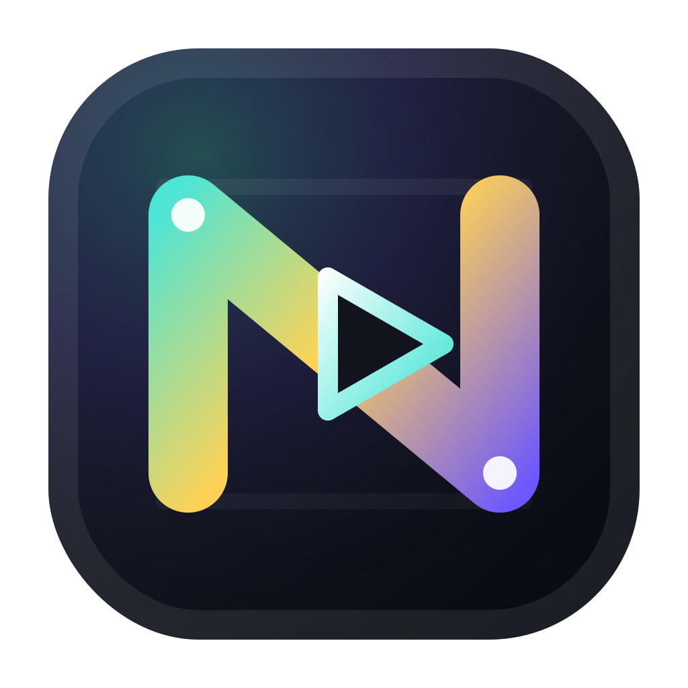

# Next Editor

<div align="center">
  
  <br />
  <h1>Interactive Code Recording For Real Workspaces</h1>
</div>

Next Editor is a browser-based lesson editor and replay engine for real coding projects. It combines a Monaco editor, a multi-file workspace, WebContainer-backed runtime playback for Node lessons, static preview for HTML/CSS lessons, synchronized slides, optional instructor camera capture, and streamed `.ne` recordings that can begin playback before the full file has downloaded.

## Overview

- Multi-file workspace editing with file and folder management in the sidebar.
- Two lesson surfaces:
  - `Node App Lesson` runs inside WebContainers with preview, terminal, and runtime dock state captured into the recording timeline.
  - `HTML/CSS Lesson` renders a lightweight static preview from local HTML, CSS, and JavaScript files.
- Recording captures more than text deltas: it stores workspace changes, preview DOM state, slide events, cursor motion, runtime events, audio, and optional camera video.
- Playback restores the recorded project state and replays it from a single timeline.
- Import and export use the SCR3 `.ne` container.
- Progressive loading lets `/code?url=...` start playing a recording from a partial download.

## Current Capabilities

- Monaco-powered editing across a real workspace.
- Runtime-backed preview for package-based Node lessons.
- Static preview mode for HTML/CSS lessons.
- Timeline replay for frames, cursor motion, slide transitions, preview DOM patches, workspace events, and runtime events.
- Portable `.ne` export and import.
- Optional instructor camera recording with synced playback overlay.
- Built-in reveal.js slide support.

## Browser Support

- Chromium-based browsers are the supported target for `Node App Lesson` runtime features because WebContainers require modern browser APIs and cross-origin isolation.
- The static HTML/CSS preview path works without the runtime dock when full WebContainer support is not needed.

## Tech Stack

- UI: React 19, Vite 8, Rolldown 1.0
- Editor and state: Monaco Editor, XState 5
- Runtime: `@webcontainer/api`
- Slides: reveal.js
- Styling: Tailwind CSS 4, Motion
- Recording/storage: SCR3 stream container, msgpack, pako, JSZip
- Quality checks: vite-plus, Oxlint, TypeScript native preview (`tsgo`)

## Project Structure

- `src/core`: recording/playback state machines, frame delta encoding, slide and preview types, and public editor APIs.
- `src/components`: editor UI, preview surfaces, media controls, slides, runtime dock, and camera overlay.
- `src/contexts`: editor, workspace, slides, runtime, and provider wiring.
- `src/storage`: SCR3 codec, IndexedDB persistence, import/export helpers, and worker-backed decoding.
- `src/hooks`: URL loading, live stream forwarding, workspace/runtime hooks, and app adapters.
- `public`: static assets, wasm artifacts, fonts, and sample recordings.

## Local Development

### Prerequisites

- [Bun](https://bun.sh/)
- A Chromium-based browser for full runtime support

### Install Dependencies

```bash
bun install
```

### Start The App

```bash
vp dev
```

Routes:

- Landing page: `http://localhost:5173/`
- Editor: `http://localhost:5173/code`
- Streamed sample recording: `http://localhost:5173/code?url=/introduction.ne`

### Validation Commands

```bash
vp check --fix
vp check
vp build
```

Additional scripts:

```bash
vp test
vp preview
```

## Recording And Storage Model

Next Editor records a timeline of delta-compressed editor frames plus timed side-channel events for slides, preview state, preview DOM patches, workspace mutations, runtime events, cursor samples, audio, and optional camera video.

Recordings are stored and exported as base64-encoded SCR3 `.ne` files. SCR3 is append-only and prefix-decodable, which enables progressive playback from an incomplete download and live forwarding through `recordingStreamSink`.

## Streaming And Camera Notes

- `useUrlLoader` progressively decodes larger SCR3 prefixes and updates playback in place through `extendRecording`.
- Finalized recordings place audio near the end of the stream, so visuals can start first while audio finishes loading.
- Camera capture is optional. Playback uses `cameraStartOffsetMs` to align the overlay video with the main timeline.

## Learn More

- [SLIDES_USAGE.md](SLIDES_USAGE.md) for slide authoring and synchronization.
- [SELF_HOSTING.md](SELF_HOSTING.md) for Docker deployment and hosting requirements.
- [docs/core.md](docs/core.md) for the core module boundaries and public API.
- [docs/data-flow.md](docs/data-flow.md) for capture, playback, and storage flow.
- [docs/data-structures.md](docs/data-structures.md) for the recording model and core types.
- [docs/state-machines.md](docs/state-machines.md) for the XState architecture.
- [docs/streaming-playback.md](docs/streaming-playback.md) for partial-download and live-stream playback.

## License

This project is licensed under the MIT License. See [LICENSE](LICENSE).
