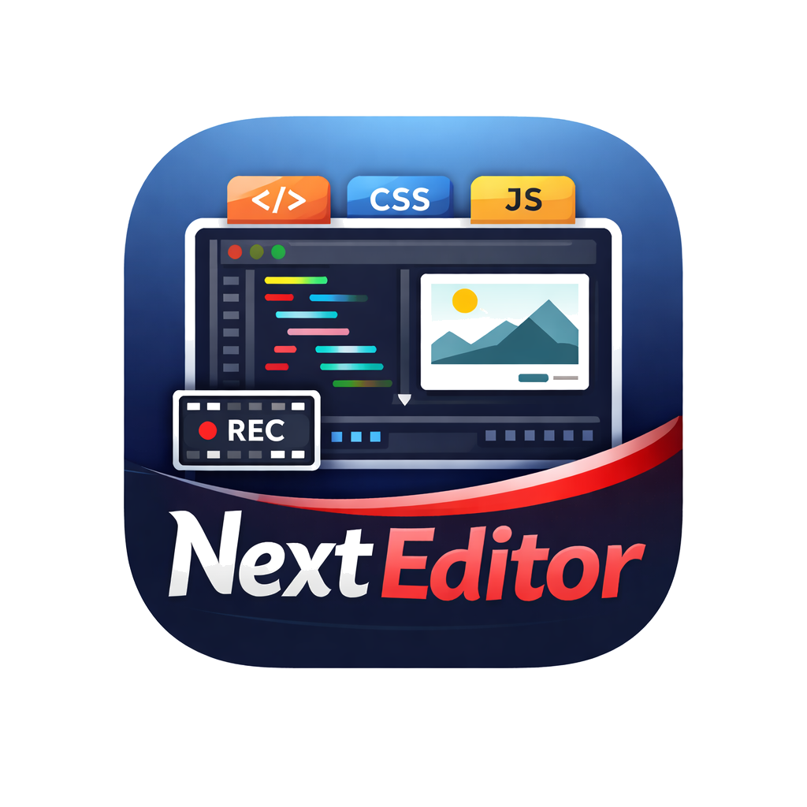

# Next Editor

<div align="center">
  
  <br />
  <h1>Interactive Code Recording For Real Workspaces</h1>
</div>

Next Editor is a browser-based coding lesson editor and recording engine. It combines a Monaco-powered editor, a multi-file workspace, WebContainers runtime support for Node app lessons, static preview for HTML/CSS lessons, synchronized slides, and portable recording export so learners can replay an interactive coding session instead of watching a flat video.

## Overview

- Multi-file workspace with file and folder management from the sidebar.
- Two lesson modes:
  - `Node App Lesson` runs inside WebContainers with npm packages, terminal commands, runtime preview, and a dock for runner, terminal, and console output.
  - `HTML/CSS Lesson` renders a static preview from local HTML, CSS, and vanilla JavaScript files and supports pinning a file as the preview entry.
- High-fidelity recording that captures editor frames and timed workspace/runtime events, not just final snapshots.
- Playback that restores the recorded active file, preview state, reruns, runtime dock state, and synced slide state from the timeline.
- Import and export of portable `.ne` recordings.
- Built-in [reveal.js](https://revealjs.com/) slide support for interactive lesson playback.

## Key Features

- Workspace-first editing: create, rename, delete, and switch files without leaving the editor.
- Runtime-backed Node app preview: run package-based apps, including server-style apps, in-browser through WebContainers.
- Static lesson preview: preview HTML/CSS lessons without the runtime dock.
- Recording and replay: capture cursor movement, content changes, file switches, preview interactions, and runtime state changes.
- Local persistence: save the current workspace with `CMD+S` or `CTRL+S` and continue where you left off.
- Portable lesson files: export recordings as `.ne` files for sharing and import them back later.
- Integrated slides: combine code playback and slide transitions in one lesson flow.

## Browser Support

- Chromium-based browsers are the primary supported target for `Node App Lesson` runtime features because WebContainers require cross-origin isolation and modern browser capabilities.
- `HTML/CSS Lesson` mode continues to work as the lightweight static preview path when a full runtime is not needed.

## Tech Stack

- Core UI: [React 19](https://react.dev/), [Vite 8](https://vitejs.dev/), [Rolldown 1.0](https://rolldown.rs/)
- Recording engine: [XState 5](https://stately.ai/docs/xstate), Monaco Editor, AssemblyScript core modules
- Runtime: [@webcontainer/api](https://webcontainers.io/)
- Slides: [reveal.js](https://revealjs.com/)
- Styling and motion: Tailwind CSS 4 and [Motion](https://motion.dev/)
- Serialization and export: SuperJSON, Pako, JSZip
- Linting: [Oxlint](https://oxc.rs/)

## Project Structure

- `src/core`: recording/playback state machines, delta logic, and AssemblyScript integration.
- `src/components`: editor UI, preview surfaces, runtime dock, slides, and sidebar.
- `src/contexts`: recorder, workspace, slides, and runtime providers.
- `src/storage`: `.ne` import/export and persistent recording storage.
- `src/hooks`: app-level hooks for workspace, runtime, slides, and URL loading.
- `public`: static assets, wasm artifacts, fonts, and sample recordings.

## Local Development

### Prerequisites

- [Bun](https://bun.sh/) (Recommended package manager)
- A Chromium-based browser for full runtime support

### Install Dependencies

```bash
bun install
```

### Start The App

```bash
bun dev
```

Routes:

- Landing page: `http://localhost:5173/`
- Editor: `http://localhost:5173/code`

### Useful Commands

```bash
bun run lint
bun run build
bun run preview
```

## Recording Model

Next Editor records editor frames plus timed workspace and runtime events. That means replay is not limited to raw text changes; it can also restore the recorded active file, runtime dock state, preview behavior, and slide state from the timeline itself.

Recordings are exported as `.ne` files.

## Learn More

- [SLIDES_USAGE.md](SLIDES_USAGE.md) for slide authoring and synchronization.
- [docs/core.md](docs/core.md) for core concepts.
- [docs/data-flow.md](docs/data-flow.md) for data flow.
- [docs/state-machines.md](docs/state-machines.md) for the recording/playback machine architecture.

## Production Build

```bash
bun run build
```

## License

Private / Confidential
