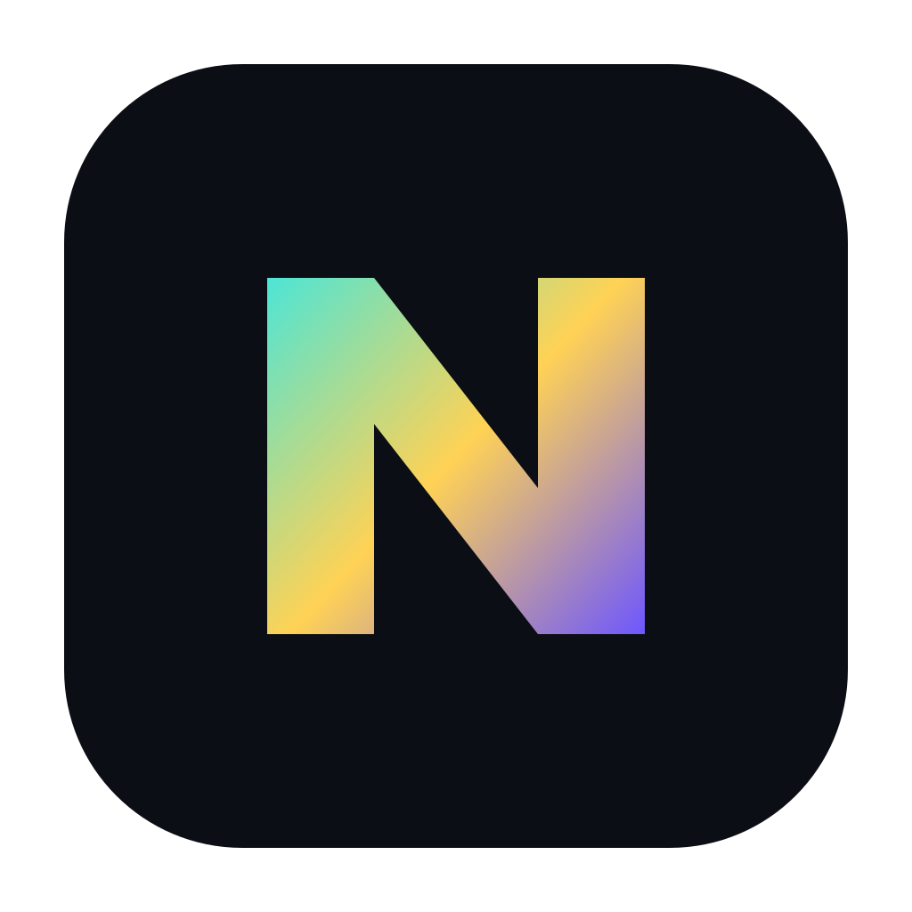

# Next Editor

<div align="center">
  
  <br />
  <h1>Interactive Code Recording & Replay</h1>
</div>

Next Editor records and replays coding lessons built on real projects, in the browser. A lesson is
not a video: the editor, the workspace files, the running program's output and preview, slides, a
whiteboard, and a coding-agent chat are captured as events beside the narration and replayed from
one timeline. A learner can pause at any moment, edit and run the code, and then carry on with the
lesson.

It runs at [nexteditor.dev](https://nexteditor.dev). One Cloudflare Worker serves the app, the
`/learn` catalog of published lessons, live collaboration rooms with voice chat, and `/studio`,
which turns a written lesson script into a narrated, recorded lesson.

## Features

### Workspace and Lesson Types

Every lesson is a real multi-file workspace, edited in Monaco: files and folders in the sidebar,
binary assets (images, video, audio, fonts, PDF, Wasm) by drag-and-drop or upload, and `.zip`
import and export.
There are 19 lesson types, chosen from the **Starter Template** menu (the gear in the editor
header). Each runs in one of three places:

| Runs on                                                            | Lesson types                                                                                                                                                                                                          |
| ------------------------------------------------------------------ | --------------------------------------------------------------------------------------------------------------------------------------------------------------------------------------------------------------------- |
| WebContainer — Node.js in the browser, with preview and a terminal | HTML / CSS, React (TanStack Start), Vue, Solid, Svelte, HTMX + Express, Alpine AJAX + Express, Express + TypeScript, JavaScript / Node.js, TypeScript, Kite + Vite (web), and Python (console only, WASI interpreter) |
| The Worker's playground proxies, with no sign-in needed            | Go (play.golang.org), Kotlin (api.kotlinlang.org), Rust (play.rust-lang.org), Zig (zig-play.dev), and Haskell (play.haskell.org)                                                                                      |
| The page itself, with no service                                   | Kite, on a Wasm build of `kitec`; x86-64 Assembly, on a first-party NASM-syntax assembler and x86-64 Linux machine in `src/core/x86`                                                                                  |

- The runtime dock under the editor holds the runner, the preview's console, terminal tabs
  (xterm.js over the WebContainer shell), and the coding agent. Playground and in-page lessons get
  a runner console with Run, plus Format for Go, Rust, Zig, and Kite.
- The preview panel shows the running app. Its **API** mode is a built-in HTTP client that sends
  requests from inside the preview frame (same origin, so no CORS), with a response viewer and a
  request history.
- Monaco carries first-party grammars for Zig, Haskell, Kite, and x86-64 assembly.

### Recording

- A take records one timeline of:
  - editor frames — a keyframe every 120 frames and deltas between them (exact Monaco edits, or
    diff-match-patch patches from a Rust codec compiled to WASM) — with caret, selection, scroll,
    and pointer
  - workspace snapshots, with each binary asset stored once
  - runtime dock state, with terminal output stored as deltas
  - the preview as rrweb events, plus preview and API-client interactions
  - slide changes, whiteboard changes, and the coding agent's chat
  - chapters and captions
  - narration and optional camera video, kept as sibling media files rather than inside the `.ne`
- A microphone check before a take picks the input (remembered per browser) and shows its live
  level with a plain-language verdict; during the take, a meter beside the timer warns when no
  sound has arrived.
- A take can pause and resume, or be retaken from its last safe point. Every take stays a
  recoverable draft in IndexedDB until it is saved, so a closed tab or a crash does not lose it.
- A finished take can be edited: cut or mute stretches on the narration waveform, or let the
  editor suggest dead air. An edited narration is re-encoded to Ogg/Opus with WebCodecs (WAV where
  WebCodecs is missing).
- Optional desktop screen recording saves a local video file. It never becomes part of the lesson.

### Playback

- Playback restores the recorded project and replays every track from one clock, at 0.5–2×
  speed with the narration's pitch preserved.
- A learner can pause and edit or run the code. When playback resumes or seeks, those edits are
  saved as a version the learner can restore later (up to 10 per lesson).
- Chapters, and links that open a lesson at a moment (`?t=90`, `?t=1m30s`).
- Video-player keyboard shortcuts: Space/K, ←/→ and J/L to seek, `,`/`.` to step, `<`/`>` for
  speed, `[`/`]` for chapters, 0–9, Home/End, M, C, and `?` to list them.
- Progressive loading: `/code?url=<file>.ne` starts playing from the first playable prefix of the
  download and extends the timeline as the rest arrives.
- `.ne` import and export, with audio and camera as sibling files. Dropping a `.ne` file or URL
  onto the page opens it.

### Slides and Whiteboard

- Slides are written in Markdown or HTML, or imported from a Google Slides deck published to the
  web (**File → Share → Publish to web**). A deck arrives as SVG with its build-step animations,
  and its Google-hosted images are copied to R2 (or served through `/api/proxy` when that fails).
- Every slide renders in a sandboxed iframe: scripts are off for Markdown and HTML, and a Google
  deck may run only one nonce-locked animation script. Markdown and HTML slides can use a preset
  or uploaded background.
- The whiteboard is Excalidraw, loaded on demand. It records element changes rather than
  snapshots, so strokes draw themselves again on replay.

### Captions

- Import `.vtt` or `.srt`, or generate captions from the narration on your own device: Whisper
  (`whisper-base`, int8 ONNX, about 79 MB, downloaded once and cached) runs in a worker on ONNX
  Runtime Web, prompted with the lesson's libraries and file names. The audio never leaves the
  browser, and the result downloads as `.vtt` for correction.
- Several language tracks per lesson, right-to-left layout, and caption files published alongside
  a hosted lesson.

### Coding Agent

- An **Agent** tab in the runtime dock, built on `@openrouter/agent` with your own OpenRouter key
  (kept in memory unless you choose to store it). It reads, searches, writes, and edits workspace
  files. In WebContainer lessons it can also inspect the preview and run shell commands, each
  command only after you confirm it.
- The Worker's `/api/openrouter/responses` route only forwards requests so the SDK's headers pass
  CORS. It holds no key.
- The chat is recorded with the lesson and replays with it.

### Live Collaboration and Voice

- Rooms with owner, editor, and viewer roles and invitation links. Edits travel as Yjs updates
  over binary WebSockets to one Durable Object per room, which keeps the room's history in SQLite.
- Remote cursors; following any participant's file, slide, or whiteboard; a shared slide deck and
  whiteboard; and private, content-addressed room assets in R2. Only the host can record a room.
- Opt-in, audio-only voice chat over the Cloudflare Realtime SFU, behind a per-room voice Durable
  Object that checks every call. Members join muted, and remote voices are never recorded.

### Publishing and `/learn`

- Sign in with Google (redirect or One Tap) or a passkey. Uploading a lesson sends its `.ne`,
  audio, camera video, captions, and thumbnail to R2 and creates a draft, published when the
  author is ready.
- `/learn` is the catalog: search, author pages (`/learn/@username`), each author's library
  (publish, unpublish, rename, re-thumbnail, delete), and ordered playlists
  (`/learn/playlist/:slug`). Lesson pages are resolved at the edge, so crawlers see each lesson's
  title and description.

### Studio

- `/studio` renders a narrated lesson from a LessonScript: YAML whose narration carries
  `[[mark:…]]` anchors for editor, runtime, preview, slide, and whiteboard actions.
- English narration is synthesized in the browser (Kyutai Pocket TTS on ONNX Runtime Web, with
  optional local voice cloning). Burmese narration comes from VoxCPM2 on Modal through the Worker,
  for signed-in users who have the `studio.burmese-voxcpm2` feature flag.
- A deterministic performer drives the real editor while the normal recorder captures it. QA
  gates check the result, and a render that passes every gate can become a draft through the
  normal upload flow; publishing stays a human decision.
- Scripts live in `src/studio/scripts/`. The authoring contract is
  [docs/lesson-script-authoring.md](docs/lesson-script-authoring.md).

## Browser Support

- WebContainer lessons need cross-origin isolation (the dev server and the Worker send COOP and
  COEP headers on every response) and a desktop browser: use desktop Chromium or Firefox. On
  mobile the runtime does not start, but recorded previews still replay.
- Playground and in-page lessons (Go, Kotlin, Rust, Zig, Haskell, Kite, and assembly) do not use
  the WebContainer.

## Tech Stack

- App: React 19 with the React Compiler, React Router 8, TanStack Query, Tailwind CSS 4
- Editor and state: Monaco Editor, XState 5, `@xstate/store-react`
- Runtimes: `@webcontainer/api`, xterm.js, a Wasm build of `kitec`, a first-party x86-64
  assembler and emulator
- Recording: rrweb for the preview; a Rust diff-match-patch codec compiled to WASM; MessagePack
  and fflate in the SCR3 container; MediaRecorder, with WebCodecs for Ogg/Opus
- Slides and whiteboard: marked, Google Slides SVG import, Excalidraw
- In-browser models: ONNX Runtime Web for Whisper captions and Pocket TTS narration
- Coding agent: `@openrouter/agent`
- Collaboration: Yjs, y-monaco, Durable Objects with SQLite; voice through partytracks and the
  Cloudflare Realtime SFU
- Platform: Cloudflare Workers + Hono, D1, R2, Workers KV, Durable Objects, Workers Rate
  Limiting, and Static Assets; Upstash QStash for delayed room cleanup
- Analytics: PostHog, Workers Logs and traces
- Tooling: bun; Vite+ (`vp`: Vite 8, Rolldown, Oxc, Vitest, Oxlint, Oxfmt); TypeScript 7

## Project Structure

- `src/core`: the recording engine — the recorder/player machine, the recording model, and replay;
  `dmp` (the Rust diff-match-patch crate and its WASM), `kite` (the Wasm `kitec`), and `x86` (the
  assembler and machine)
- `src/components`, `src/contexts`, `src/hooks`, `src/stores`: the editor UI, its providers,
  hooks, and `@xstate/store-react` stores
- `src/storage`: the SCR3 codec (run in a worker), IndexedDB and OPFS persistence, drafts, and
  import/export
- `src/starters`: starter templates for every lesson type
- `src/runtime`: the playground and in-page runners
- `src/monaco`: Monaco setup and the first-party grammars
- `src/agent`: the coding agent
- `src/captions`: caption parsing and on-device Whisper
- `src/googleSlides`: published-deck import
- `src/studio`: Studio — the LessonScript schema, director, performer, QA gates, and scripts
- `src/collaboration`, `src/voice`: live rooms and voice chat
- `src/shared`: code shared by the app and the Worker, such as the fetch and OpenRouter proxies
- `tube`: the `/learn` catalog, author pages, and playlists
- `infra/worker`: the Hono Worker — routes, auth, the collaboration Durable Objects, and edge
  rendering
- `infra/client`: the browser side of the Worker's APIs (auth, upload, library, playlists,
  search, and Studio capabilities)
- `infra/db`: D1 queries and migrations
- `integrations/modal`: the VoxCPM2 narration service on Modal
- `scripts`: the Studio command-line tools, the WASM build, and benchmarks
- `share/lesson-script-skill`: the lesson-script agent skill, generated from `docs/` by
  `scripts/build-lesson-script-skill.ts`
- `public`: static assets, fonts, and the sample lesson

## Local Development

### Prerequisites

- [Bun](https://bun.sh/)
- Desktop Chromium or Firefox for WebContainer lessons

### Setup

```bash
bun install
cp .env.example .env
cp infra/.dev.vars.example infra/.dev.vars
bun run d1:migrate:local
```

- `.env` must set `POSTHOG_PROJECT_ID` and `POSTHOG_API_KEY`: `vite.config.ts` loads PostHog's
  source-map plugin on every run, and it refuses to start without them. Placeholders are enough
  for development and tests; a production build uploads its source maps and needs the real
  values.
- `infra/.dev.vars` holds the Worker's secrets. `GOOGLE_CLIENT_ID`, `GOOGLE_CLIENT_SECRET`, and
  `SESSION_SECRET` are needed for anything behind sign-in; QStash, voice chat, and Burmese
  narration are optional.

### Run

```bash
bun run dev         # the app on http://localhost:5173
bun run dev:worker  # the Worker on http://localhost:8787
bun run dev:all     # both
```

- `bun run dev` alone covers the editor, recording and playback, WebContainer, Kite, and assembly
  lessons, and the coding agent; the Vite dev server serves `/api/proxy` and `/api/openrouter`
  itself.
- Sign-in, uploads and media, Studio capabilities and narration, slide-image import, and the
  language playgrounds need the Worker. The Vite dev server forwards those routes to port 8787.
- Live rooms, playlists, author pages, and search are reached only through the Worker itself: run
  `bun run build`, then open http://localhost:8787, which serves `dist/` as production does.
- The Google redirect sign-in builds its callback URL from `PUBLIC_URL`, which points at
  production. To use it locally, set `PUBLIC_URL` to your local origin in `infra/.dev.vars` and
  register `<origin>/api/auth/google/callback` on your OAuth client. Passkeys work on `localhost`.
- Streamed sample lesson: http://localhost:5173/code?url=/lessons/introduction/introduction.ne
- Other routes: `/learn`, `/studio`, and `/architecture` (the system diagram).

### Checks

```bash
vp check                                           # format and lint
bun run typecheck                                  # the app and the Worker
vp test                                            # app, tube, infra/client, and infra/db tests
vp test run --config infra/worker/vitest.config.ts # Worker tests
bun run build                                      # typecheck, then build into dist/
```

## Deployment

The Worker serves `dist/` through its Static Assets binding, and `wrangler deploy` does not
rebuild it, so build first:

```bash
bun run build
bunx wrangler deploy --config infra/wrangler.toml
```

When a change adds a file under `infra/db/migrations/`, apply it to production before deploying:
`bunx wrangler d1 migrations apply next-editor-tube --remote --config infra/wrangler.toml`.
Provisioning, secrets, and the custom domain are covered in
[docs/cloudflare-deploy-guide.md](docs/cloudflare-deploy-guide.md).

## Recording Format

- A `.ne` file is an SCR3 stream: raw binary, append-only, and decodable from any prefix, which
  is what lets playback start before the download finishes. It holds a header, time-clustered
  segments of MessagePack compressed with fflate, and a footer index. The current byte layout is
  version 5, and versions 2–5 still load. Encoding and decoding run in a Web Worker.
- Workspace binaries ride once in raw asset segments; project snapshots keep only their
  descriptors.
- Narration and camera video are sibling files named in the header. Captions are stored as cues,
  or as sibling caption files listed in `captionFiles`.
- In the browser, drafts, workspace assets (keyed by SHA-256), and learner versions live in
  IndexedDB, `.ne` payloads of 8 MiB or more in OPFS, and the Whisper and TTS models in Cache
  Storage.

## Learn More

- [docs/core.md](docs/core.md): the core module boundaries and public API
- [docs/data-flow.md](docs/data-flow.md): capture, playback, and storage flow
- [docs/data-structures.md](docs/data-structures.md): the recording model and core types
- [docs/state-machines.md](docs/state-machines.md): the XState architecture
- [docs/streaming-playback.md](docs/streaming-playback.md): playback from a partial download
- [docs/cloudflare-architecture.md](docs/cloudflare-architecture.md): the deployed platform and
  who stores what
- [docs/cloudflare-deploy-guide.md](docs/cloudflare-deploy-guide.md): provisioning, secrets,
  migrations, and deployment
- [docs/live-collaboration.md](docs/live-collaboration.md) and
  [docs/collaborator-following-plan.md](docs/collaborator-following-plan.md): Yjs collaboration
  and following
- [docs/live-collaboration-voice-cloudflare-realtime-sfu.md](docs/live-collaboration-voice-cloudflare-realtime-sfu.md):
  voice chat
- [docs/observability-privacy.md](docs/observability-privacy.md): what analytics may and may not
  receive
- [docs/go-lessons-selective-runtime-plan.md](docs/go-lessons-selective-runtime-plan.md): how
  playground-backed lessons run, starting with Go
- [docs/x86-assembly-runner.md](docs/x86-assembly-runner.md): the in-page assembly runner
- [docs/agent-lesson-production.md](docs/agent-lesson-production.md) and
  [docs/lesson-script-authoring.md](docs/lesson-script-authoring.md): Studio's design and its
  authoring contract
- [docs/modal-voxcpm2-burmese.md](docs/modal-voxcpm2-burmese.md): Burmese narration on Modal

## License

This project is licensed under the MIT License. See [LICENSE](LICENSE).
