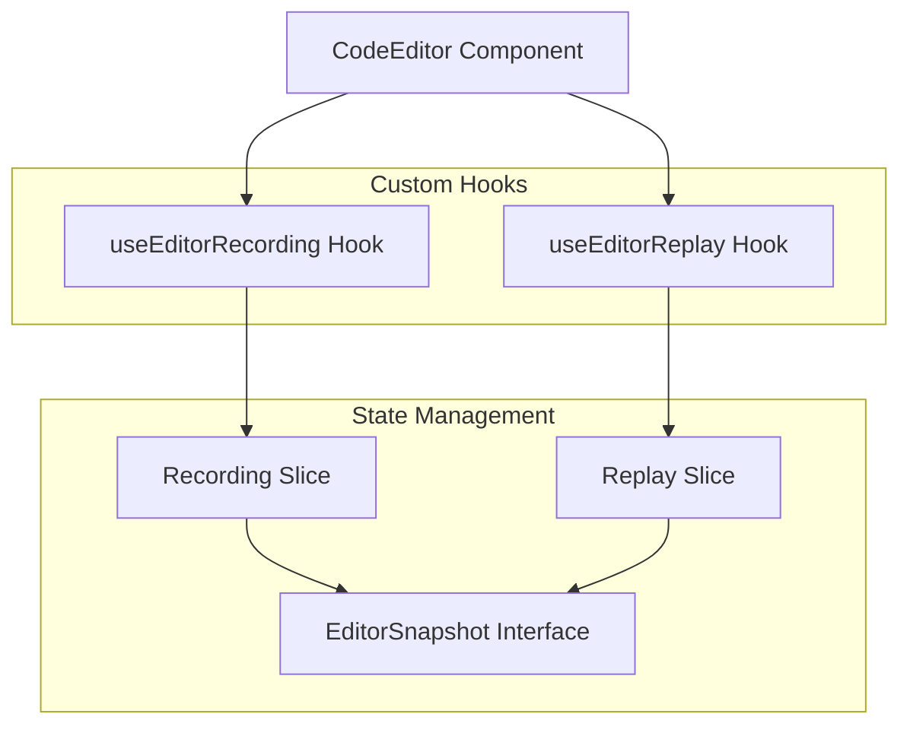
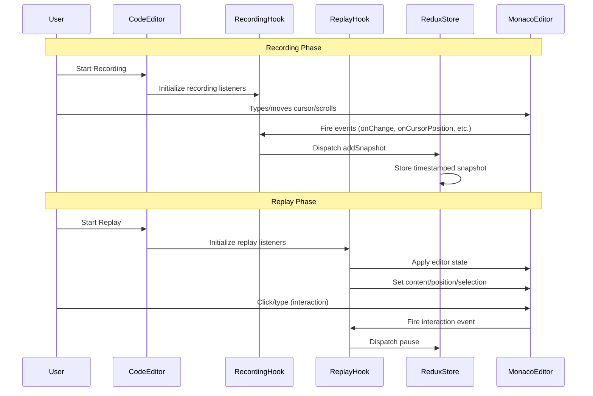
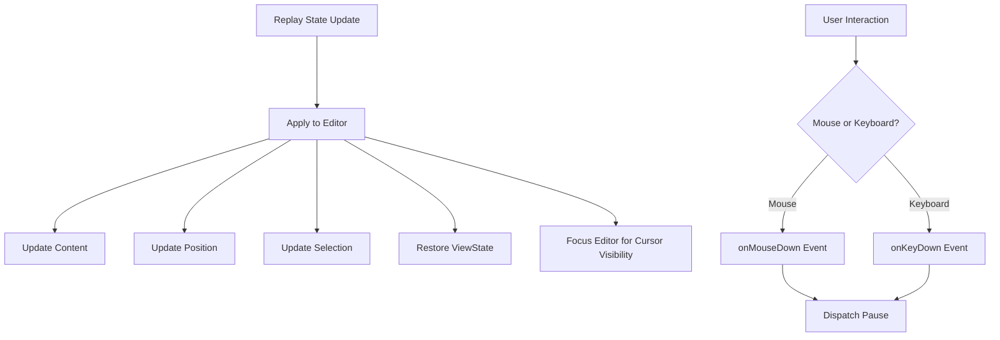
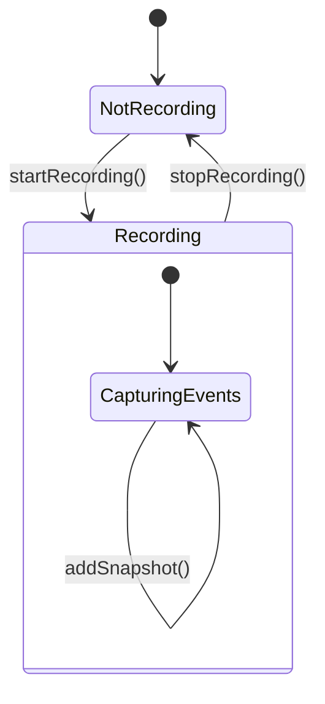
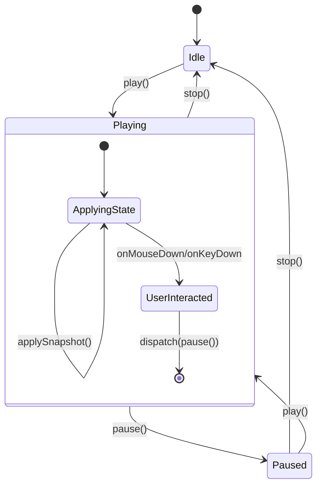
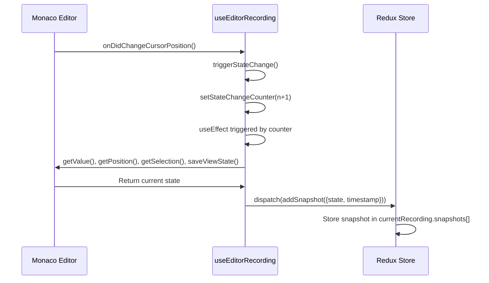
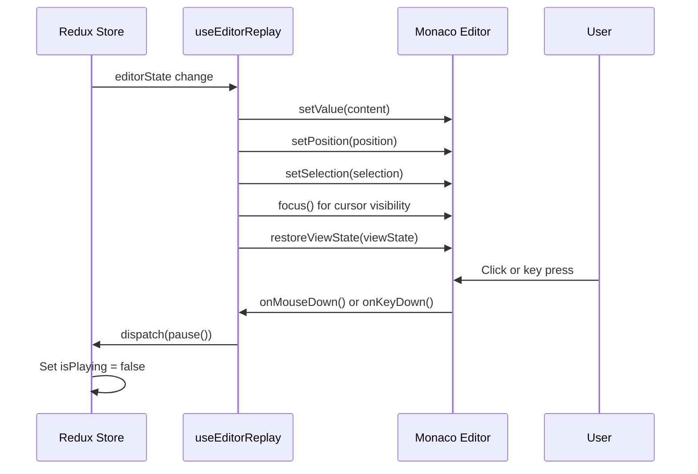

# Monaco Editor Recording & Replay System

## Overview

This system provides Scrimba-like functionality for recording and replaying Monaco Editor interactions. It captures every editor state change including content modifications, cursor movements, selections, and scroll positions with precise timestamps for synchronized playback.

## Architecture

### Components Structure



### Data Flow



## Core Components

### 1. CodeEditor Component (`src/components/CodeEditor.tsx`)

**Purpose**: Main Monaco Editor wrapper that orchestrates recording and replay functionality.

**Key Features**:
- Renders Monaco Editor with custom configuration
- Manages editor reference for hook communication
- Provides clean interface for recording/replay modes

**Configuration**:
```typescript
{
  readOnly: false,              // Allows cursor blinking during replay
  cursorStyle: 'line',          // Line cursor style
  cursorBlinking: 'blink',      // Enable cursor blinking
  automaticLayout: true,        // Auto-resize
  quickSuggestions: false,      // Disable IntelliSense during recording
  // ... other Monaco options
}
```

### 2. useEditorRecording Hook (`src/hooks/useEditorRecording.ts`)

**Purpose**: Manages all recording-related functionality.

**Captured Events**:
- `onDidChangeContent` - Content modifications
- `onDidChangeCursorPosition` - Cursor movement
- `onDidChangeCursorSelection` - Text selection changes
- `onDidScrollChange` - Viewport scroll changes

**Snapshot Creation Process**:
```mermaid
flowchart TD
    A[Editor Event Triggered] --> B[triggerStateChange]
    B --> C[Increment stateChangeCounter]
    C --> D[useEffect Triggered]
    D --> E[Capture Editor State]
    E --> F[Create EditorSnapshot]
    F --> G[Dispatch to Redux Store]
    
    E --> E1[Get content via getValue()]
    E --> E2[Get position via getPosition()]
    E --> E3[Get selection via getSelection()]
    E --> E4[Get viewState via saveViewState()]
```

**State Captured**:
```typescript
interface EditorSnapshot {
  timestamp: number;
  state: {
    content: string;                                    // Full editor content
    selection: monaco.Selection;                        // Text selection range
    position: monaco.Position;                          // Cursor position
    viewState: monaco.editor.ICodeEditorViewState;     // Scroll, folding, etc.
  };
}
```

### 3. useEditorReplay Hook (`src/hooks/useEditorReplay.ts`)

**Purpose**: Handles replay functionality and user interaction detection.

**Replay Process**:


**User Interaction Detection**:
- **Mouse Events**: `editor.onMouseDown()` - Detects clicks anywhere in editor
- **Keyboard Events**: `editor.onKeyDown()` - Detects any key press
- **Content Protection**: `onDidChangeModelContent()` - Reverts unauthorized changes

**Pause Triggers**:
1. User clicks in editor area
2. User presses any key
3. Content modification attempts (reverted automatically)

## State Management

### Recording Slice (`src/store/slices/recordingSlice.ts`)



**Key Actions**:
- `startRecording()` - Initialize recording session
- `addSnapshot(snapshot)` - Add timestamped editor state
- `stopRecording(audioBlob)` - Finalize and save recording

### Replay Slice (`src/store/slices/replaySlice.ts`)



**Key Actions**:
- `play()` - Start replay
- `pause()` - Pause replay (triggered by user interaction)
- `stop()` - Stop and reset replay
- `seekTo(time)` - Jump to specific timestamp
- `applySnapshot(snapshot)` - Apply editor state

## Event Flow Diagrams

### Recording Event Flow



### Replay Event Flow



### Content Protection During Replay

```mermaid
flowchart TD
    A[User Types During Replay] --> B[onDidChangeModelContent Triggered]
    B --> C{Current Content != Expected Content?}
    C -->|Yes| D[Revert Changes]
    C -->|No| E[Allow Change]
    D --> F[setValue(expectedContent)]
    D --> G[setPosition(expectedPosition)]
    D --> H[setSelection(expectedSelection)]
```

## Technical Details

### Timestamp Precision

Timestamps are calculated relative to recording start time:
```typescript
const snapshot: EditorSnapshot = {
  timestamp: Date.now() - recordingStartTime,
  state: { /* editor state */ }
};
```

### Cursor Visibility Strategy

During replay, the editor must show a blinking cursor while preventing edits:
1. **Problem**: `readOnly: true` hides cursor completely
2. **Solution**: `readOnly: false` + content change interception
3. **Implementation**: Revert unauthorized changes immediately via `onDidChangeModelContent`

### Memory Management

All event listeners are properly cleaned up:
```typescript
useEffect(() => {
  if (condition) {
    const disposable = editor.onSomeEvent(() => {});
    return () => disposable.dispose(); // Cleanup
  }
}, [dependencies]);
```

### Performance Considerations

1. **Debounced State Changes**: Uses counter-based triggering to batch rapid changes
2. **Selective State Capture**: Only captures state when actually needed
3. **Efficient Comparisons**: Content comparison before applying changes
4. **Proper Cleanup**: All disposables are cleaned up to prevent memory leaks

## Usage Examples

### Basic Recording

```typescript
// Start recording
dispatch(startRecording());

// User interacts with editor (automatic capture)
// - Types code
// - Moves cursor
// - Selects text
// - Scrolls

// Stop recording
dispatch(stopRecording({ audioBlob }));
```

### Basic Replay

```typescript
// Load a recording
dispatch(loadRecording(savedRecording));

// Start replay
dispatch(play());

// User clicks in editor -> automatic pause
// Resume with dispatch(play())

// Stop replay
dispatch(stop());
```

### Seeking

```typescript
// Jump to specific time (in milliseconds)
dispatch(seekTo(5000)); // Jump to 5 seconds

// Editor state is reconstructed to match that timestamp
```

## Error Handling

### Common Issues and Solutions

1. **Missing Editor Reference**
   - **Issue**: Hooks called before editor mounts
   - **Solution**: Guard clauses check `editorRef.current`

2. **State Inconsistency During Replay**
   - **Issue**: User modifications during replay
   - **Solution**: Content change interception and reversion

3. **Memory Leaks**
   - **Issue**: Event listeners not cleaned up
   - **Solution**: Proper disposable cleanup in useEffect returns

4. **Timing Issues**
   - **Issue**: Events firing before state is ready
   - **Solution**: Dependency arrays and conditional execution

## Future Enhancements

### Potential Improvements

1. **Compression**: Implement delta compression for large content changes
2. **Streaming**: Real-time streaming of recording data
3. **Collaborative**: Multi-user recording and replay
4. **Performance**: Virtual scrolling for large files
5. **Debugging**: Enhanced debugging tools and visualizations

### API Integration Ready

The system is designed to easily integrate with backend APIs:

```typescript
// Save recording to server
const saveRecording = async (recording: Recording) => {
  await api.post('/recordings', {
    name: recording.name,
    snapshots: recording.snapshots,
    audioBlob: recording.audioBlob,
    duration: recording.duration
  });
};

// Load recording from server
const loadRecording = async (id: string): Promise<Recording> => {
  const response = await api.get(`/recordings/${id}`);
  return response.data;
};
```

This documentation provides a comprehensive overview of the Monaco Editor recording and replay system, including architecture decisions, implementation details, and usage patterns.