# Agent Lesson Production — Architecture and Delivery Plan

- **Status:** M0–M4 implemented (2026-07-21) in `src/studio/` — see [studio-m0-runbook.md](./studio-m0-runbook.md) and [studio-persona.md](./studio-persona.md). M1: YAML `LessonScript`, marker compiler, TTS cache, Director CLI. M2: slide/whiteboard surfaces, silent runtime retry, unattended render command. M3: compiled timing gate + draft creation through the standard upload flow with provenance disclosure. M4: persona guide v1, advisory critic, citation requirements, three pilots (go-cube, go-cube-tour, go-swap — each passed 2× unattended renders with repeatability PASS). The remaining gates are human by design: watch/rate the pilots, publish decisions, and the scale/revise/stop call. Post-M4 (2026-07-21): narration moved to per-dialog in-page synthesis over onnxruntime-web with joint dialog/action scheduling and build-time stitching — marker timing is exact by construction and the `say`/macOS dependency is gone. Default voice: **pocket-tts** (Kyutai) via KevinAHM's ONNX export, ported with seeded flow-matching noise for byte-reproducible dialogs; Kokoro-82M kept as fallback profile
- **Repository audit:** 2026-07-20 at `2a7ec794ecbc`
- **Primary decision:** build a versioned `LessonScript`, compile it into a content-addressed plan, and run that plan through a deterministic in-app Performer while the existing recorder captures the lesson
- **Release policy:** generated lessons remain drafts until a human reviews and publishes them

## Goal

Build a production harness that can turn approved source material into a complete Next Editor lesson—narration, captions, editor changes, cursor guidance, workspace/runtime state, preview, whiteboard, and slides—without requiring a human to perform the recording.

The target operating model is:

```text
human defines curriculum and taste
  → agents draft and revise a lesson script
  → deterministic tooling builds and performs it
  → automated checks reject broken artifacts
  → a human approves the release
```

### V1 success criteria

A first production slice is successful when it can:

1. Build a 30–100 second lesson from a checked-in script and pinned workspace.
2. Produce a replayable `.ne`, sibling narration audio, captions, a build manifest, and a QA report.
3. Render without an LLM or computer-use agent making decisions during performance.
4. Execute every runnable checkpoint and fail closed on errors or timeouts.
5. Render the same compiled plan twice with the same logical actions, final workspace hashes, captions, and media hashes; timing may vary only within an explicit tolerance.
6. Create a Tube **draft** through the existing upload/API flow; publishing remains a separate human action.

### Non-goals for V1

- Fully autonomous publishing.
- Byte-for-byte identical browser recordings.
- An offline compiler that writes `Recording` tracks directly.
- Scene splicing, bulk localization, or interactive learner checkpoints.
- Imitating a living creator's voice or identity. The channel should develop an original short-form technical style.

## 1. Executive summary

The architecture is viable, but the original thesis needs one important qualification: Next Editor already has most **output tracks**, not most of the production system. The missing control plane—script schema, timing compiler, stable surface adapters, Performer, build manifest, QA, and render CLI—is the hard part.

The recommended split is:

- **Creative loop:** humans and agents plan, write, and critique `LessonScript` files.
- **Asset build:** the Director resolves narration markers, synthesizes speech, derives captions, and freezes all generated assets by hash.
- **Performance loop:** the Performer receives only a compiled plan and immutable inputs. It uses no generative decision-making.
- **Release loop:** mechanical checks can reject a build; a human is the final editorial gate.

This boundary is narrower and more reproducible than “`f(script, seed) → .ne`.” TTS providers can change output, browsers introduce scheduling variance, and runtime execution may be nondeterministic. The reproducible unit is therefore:

```text
perform(compiled plan, pinned workspace, pinned media, runtime profile, seed)
  → recording bundle + report
```

Every input above must be content-addressed or versioned in the build manifest.

## 2. Verified repository baseline

Next Editor's `Recording.version = 4` model is serialized in the SCR3 container. The repository already records and replays the following surfaces:

| Capability        | Exists today                                                                                                                                                | Production-harness gap                                                                         |
| ----------------- | ----------------------------------------------------------------------------------------------------------------------------------------------------------- | ---------------------------------------------------------------------------------------------- |
| Editor            | Keyframes plus deltas; ordinary Monaco edits can be captured as verified exact edit batches, with DMP fallback                                              | A stable automation adapter for open/select/type/reveal actions and action acknowledgements    |
| Captions          | `CaptionTrack`, `CaptionCue`, and millisecond `CaptionWord` timings                                                                                         | Narration-to-display token mapping, cue segmentation, and alignment validation                 |
| External audio    | `START_RECORDING` accepts an audio `Blob`; recordings support `audioSource: "external"`, sibling `audioFile`, resolved `audioUrl`, and `audioStartOffsetMs` | A build/export step that preserves the original audio hash and the recorder-measured offset    |
| Cursor            | Target-aware samples and playback remapping through `CursorTargetSnapshot`                                                                                  | A supported injection seam, stable target registry, and deterministic path generator           |
| Workspace/sidebar | Timestamped project, active-file, folder, scroll, sidebar-width, and preview-dock-width snapshots                                                           | Commands that mutate state through the same path as the UI and expose completion signals       |
| Runtime/dock      | Timestamped runtime and dock snapshots                                                                                                                      | Execution-kind-specific run/wait/assert adapters; arbitrary shell commands cannot be assumed   |
| Preview           | rrweb initial documents and patch batches, plus API-client replay state                                                                                     | Readiness signals, deterministic fixtures, assertion helpers, and render-time error collection |
| Whiteboard        | Element upserts/removals plus view/open/maximize state                                                                                                      | A supported automation adapter and an authored-asset format                                    |
| Slides            | Native slide content/events and Google Slides ingestion                                                                                                     | A supported show/step/close adapter and pinned slide assets                                    |
| Chat              | Recorded chat deltas and checkpoints                                                                                                                        | Out of V1 unless a pilot explicitly requires it                                                |
| Publishing        | Authenticated upload to R2, D1-backed draft/publish APIs, and a static seed catalog                                                                         | A render-to-draft command and provenance/disclosure fields                                     |

Playback already applies editor diffs to live Monaco and restores workspace, runtime, slide, preview, whiteboard, cursor, and chat state. That code is useful precedent, but it is not yet a Performer API.

### Constraints discovered during the audit

1. There is no stable “drive the studio” interface. The recorder's cursor callback and several surface handlers are internal implementation details, so the Performer needs an intentional adapter instead of reaching into XState actors or DOM internals.
2. The in-app OpenRouter agent is not a universal beat verifier. File tools work across execution kinds, while `bash`, runtime diagnostics, and preview inspection are currently limited to WebContainer lessons. Go, Kotlin, and Rust use explicit Playground run paths.
3. Playback uses isolated Monaco models and does not currently provide a supported “pause, fork this state into a writable workspace, and run it” learner flow. That remains a valuable product extension, not a property to claim today.
4. The standalone Cloudflare remote runtime is implemented and reviewed, but editor integration and environment validation are still pending. V1 must work with the execution kinds available in the editor today.
5. The repository contains one checked-in lesson, `public/lessons/introduction/introduction.ne`. The previously claimed ~41-lesson Go benchmark corpus is not present in this tree. Any external corpus must be located, licensed, inventoried, and pinned before it becomes a project dependency.
6. Tube's lesson model has no dedicated AI-production or provenance field. Disclosure requires a small data/API/UI decision; it is not available “for free” in current metadata.

## 3. Product hypothesis

The durable advantage is not “AI video.” It is a structured lesson artifact whose state can be inspected and tested.

| Dimension             | Pixel-first output               | Next Editor lesson                                                          |
| --------------------- | -------------------------------- | --------------------------------------------------------------------------- |
| Authoring source      | Prompt, timeline, or final video | Versioned script plus pinned workspace/assets                               |
| Repair                | Re-record or edit pixels         | Patch the script or source state and rebuild                                |
| Mechanical QA         | Mostly audiovisual inspection    | Decode tracks; execute checkpoints; assert state and output                 |
| Review                | Visual comparison                | Script diff, build report, and playback                                     |
| Localization          | Dub/re-render video              | Potentially rebuild narration, captions, and marker-relative timing; not V1 |
| Learner interactivity | Usually none                     | Structured replay today; fork-and-run checkpoints are a future extension    |

This is a hypothesis to validate with pilots, not a claim that no competitor can build the same thing. The first measurement should be whether the harness reduces correction time while maintaining the quality of a human-produced lesson.

### What prior art actually validates

| System                     | Useful precedent                                                                     | What it does not prove for this project                                       |
| -------------------------- | ------------------------------------------------------------------------------------ | ----------------------------------------------------------------------------- |
| Scrimba                    | Event-based coding lessons can make playback more useful than pixels alone           | That autonomous lesson authoring meets an editorial quality bar               |
| VHS                        | A small declarative script can drive deterministic demonstrations and golden tests   | Multi-surface IDE orchestration, narration sync, or interactive code playback |
| Remotion                   | Coding agents can author a reviewable artifact while a separate renderer performs it | That generated lesson scripts are factually or pedagogically sound            |
| NotebookLM Video Overviews | Source-grounded input can produce narrated visual explanations at product scale      | Runnable code, semantic event tracks, or mechanical code QA                   |
| Demosmith                  | The vendor reports autonomous browser capture, narration, captions, and localization | Independent quality evidence or reproducibility suitable for coding lessons   |
| Coursera Course Builder    | AI assistance can reduce curriculum and course-structure authoring work              | Automated performance of a lesson inside an IDE                               |

The shared lesson is architectural: keep creative output reviewable, keep execution bounded, and validate the result independently.

## 4. Architecture decision

### 4.1 Selected approach: a scripted Performer inside the app

The Performer runs in a dedicated studio route or package, invokes typed surface commands, and lets the existing recorder create the canonical `.ne` representation.

```mermaid
flowchart LR
  Sources[Approved sources and starter workspace] --> Author[Human or agent authoring]
  Author --> Script[LessonScript]
  Script --> Director[Director and schema checks]
  Director --> TTS[TTS and alignment cache]
  TTS --> Plan[Compiled plan and build manifest]
  Plan --> Performer[Deterministic Performer]
  Performer --> Recorder[Existing recorder]
  Recorder --> Bundle[.ne, audio, captions, report]
  Bundle --> QA[Mechanical QA]
  QA --> Draft[Tube draft via upload and API]
  Draft --> Human[Human playback and publish]
  QA -->|structured failures| Author
  Human -->|editorial notes| Author
```



The synthetic cursor is an attention track, not the mechanism that causes an action. For example, `workspace.openFile` moves the cursor toward the file target and invokes the semantic workspace command; it does not depend on a fragile pixel click.

### 4.2 Required application seam

Introduce a narrow `StudioDriver` implemented by the application, rather than exposing stores or actor refs to scripts:

```ts
interface StudioDriver {
  openFile(path: string): Promise<ActionReceipt>;
  typeText(input: TypeTextInput): Promise<ActionReceipt>;
  setCursorTarget(input: CursorTargetInput): Promise<ActionReceipt>;
  runWorkspace(): Promise<RunReceipt>;
  waitForRuntime(input: RuntimeExpectation): Promise<ActionReceipt>;
  showSlide(input: SlideAction): Promise<ActionReceipt>;
  applyWhiteboard(input: WhiteboardAction): Promise<ActionReceipt>;
}
```

Each command must:

- call the same domain operation used by the UI;
- resolve only after the requested state is observable;
- return actual start/end timestamps on the recording clock;
- be idempotent or declare why retry is unsafe;
- support cancellation and a bounded timeout; and
- emit enough context for the render report to diagnose failure.

The final interface will be larger than this sketch, but scripts must never import it directly. The Director compiles script actions into a closed, versioned action union.

### 4.3 Alternatives

| Approach                              | Decision                                                              | Reason                                                                                                                  |
| ------------------------------------- | --------------------------------------------------------------------- | ----------------------------------------------------------------------------------------------------------------------- |
| Computer-use agent drives the real UI | Reject as the production core; retain only for exploratory prototypes | Inference latency, pixel targeting, and nondeterministic decisions make narration sync and repeatable retries difficult |
| Scripted in-app Performer             | **Build first**                                                       | Exercises the real capture path and every current recording invariant                                                   |
| Offline track compiler                | Defer                                                                 | Faster in principle, but duplicates recorder semantics and still needs real runtime/preview execution                   |

## 5. `LessonScript` V1

Use YAML for authoring and validate it with a strict Zod schema. JSON is the canonical compiled representation. Every action is a tagged object with an ID; dotted YAML keys such as `edit.type:` should not double as the type system.

```yaml
schemaVersion: 1

lesson:
  slug: go-generics-in-100s
  title: Go Generics in 100 Seconds
  locale: en-US
  persona: next-editor-short-v1
  workspace:
    template: starters/go-basic
    revision: sha256:WORKSPACE_HASH

build:
  voiceProfile: next-editor-en-v1
  seed: 42

scenes:
  - id: generic-min
    narration: >
      Before generics, separate numeric types often meant duplicate helpers.
      [[mark:type-min]] A type set lets one Min work for integers and floats.
      The tilde also accepts named types with those underlying types.
      [[mark:run]] Run it.
    actions:
      - id: open-main
        type: workspace.openFile
        at: { scene: start }
        path: main.go

      - id: type-min
        type: editor.type
        at: { mark: type-min, offsetMs: -250 }
        target:
          file: main.go
          after: "package main\n\n"
          occurrence: 1
        cadence: fast-explainer
        text: |
          import "fmt"

          func Min[T ~int | ~float64](a, b T) T {
            if a < b {
              return a
            }
            return b
          }

          func main() {
            fmt.Println(Min(3, 7), Min(1.5, 2.5))
          }

      - id: run
        type: runtime.run
        at: { mark: run, offsetMs: -150 }

      - id: output
        type: expect.output
        at: { afterAction: run }
        contains: "3 1.5"
        timeoutMs: 8000

checks:
  - { type: recording.decodes }
  - { type: runtime.noErrors }
  - { type: captions.anchorP95Ms, max: 300 }
```

### Script rules

- `[[mark:name]]` tokens are control markers removed before TTS and captions. Each referenced marker must occur exactly once. Translators must preserve marker IDs.
- Text targets require a file, an anchor, and an occurrence. Compilation fails on a missing or ambiguous target; the Performer never guesses.
- The compiler calculates action durations and rejects impossible overlaps, such as a run action scheduled before a typed edit can finish.
- `runtime.run` maps to the active execution kind. It is not synonymous with arbitrary `bash` execution.
- `expect.*` actions are QA gates and appear in the report, not as lesson tracks.
- `afterAction` means after the referenced action completes unless the script explicitly selects its start receipt.
- Absolute wall-clock times are forbidden in source scripts. The compiled plan contains absolute recording-clock times.
- Provider credentials and raw secrets never appear in the script or build manifest.

## 6. Narration, alignment, and captions

Provider selection should follow a pronunciation/alignment/licensing spike, not a general “best voice” claim. Confirmed timing surfaces include:

| Provider     | Confirmed timing surface                                                                                            | Integration implication                                                 |
| ------------ | ------------------------------------------------------------------------------------------------------------------- | ----------------------------------------------------------------------- |
| ElevenLabs   | Character-level alignment from the with-timestamps endpoint; a separate forced-alignment API can return word timing | Preserve a mapping from synthesized characters back to display tokens   |
| Cartesia     | Word and phoneme timestamp messages when timestamps are requested                                                   | Word timing maps closely to `CaptionWord`; still validate normalization |
| Azure Speech | `WordBoundary` events in the Speech SDK                                                                             | Collect boundary events alongside the encoded audio                     |

The Director should:

1. Keep separate **display text** and **speech text** representations.
2. Remove control markers while retaining their positions in the token map.
3. Apply a versioned pronunciation lexicon to speech text only.
4. Synthesize once, then store the audio, raw alignment, provider/model/voice/settings metadata, and request hash in a content-addressed cache.
5. Map normalized provider output back to display tokens; reject missing, reordered, overlapping, or non-monotonic spans.
6. Segment words into readable `CaptionCue` entries and emit millisecond `CaptionWord` values.
7. Start recording with the generated audio blob so the existing recording clock and audio playback path own synchronization. Preserve the recorder-measured `audioStartOffsetMs`; do not assume it is always zero.

Captions are derived from the approved script, but that does not make alignment trivial. Pronunciation substitutions, Unicode, punctuation, number expansion, and provider normalization all require explicit token mapping and tests.

## 7. Attention choreography

The purpose of synthetic motion is to guide attention, not impersonate a human.

- **Cursor:** generate seeded, eased paths between registered semantic targets. Use a short approach pause before activation. Micro-jitter and decorative overshoot are off by default because they add noise and event volume.
- **Typing:** emit bounded chunks through Monaco at a cadence chosen per action. Pause at line and statement boundaries; do not add fake mistakes unless the lesson is explicitly teaching a debugging sequence.
- **Lead time:** let a cursor or selection arrive shortly before the related narration marker. The exact lead should be measured in pilots rather than fixed globally.
- **Reduced motion:** the Performer should support a low-motion profile, and QA should reject rapid flashing or excessive panel movement.
- **Stable targets:** every automatable UI region needs a durable target ID. Missing targets are build failures, not reasons to fall back to coordinates.

The seed controls path shape and typing cadence. The compiled plan records the generated durations so replaying the plan does not re-roll them.

## 8. Verification and release gates

| Stage                | Blocking checks                                                                                                                                                                          |
| -------------------- | ---------------------------------------------------------------------------------------------------------------------------------------------------------------------------------------- |
| Script compile       | Schema version; unique scene/action IDs; marker resolution; target uniqueness; supported actions; no secrets or unapproved URLs                                                          |
| Workspace preflight  | Pinned starter hash; lockfiles where applicable; execution kind available; initial tests/run succeed; required assets exist                                                              |
| Performance          | Every command acknowledges before its deadline; runtime/preview readiness uses signals rather than sleeps; retries follow declared idempotency                                           |
| Artifact             | SCR3 decodes; durations are finite; event and caption times are monotonic and in bounds; required tracks exist; audio/caption files resolve                                              |
| Semantic checkpoints | Expected files, diagnostics, console/output, preview DOM text, slide, or whiteboard state matches the script at named checkpoints                                                        |
| Timing               | Compare planned marker times with action receipts; start with a 300 ms p95 target and revise it using measured pilot data                                                                |
| Repeatability        | Same logical target sequence, final workspace hashes, exact caption text/audio hash, and equivalent checkpoint state; timestamps compared within tolerance rather than raw-byte equality |
| Editorial            | Automated critic may propose structured notes, but cannot approve release; a human watches the complete lesson and publishes the draft                                                   |

The render report should include input hashes, environment versions, action receipts, retries, assertion results, console/runtime errors, timing percentiles, and links or paths to diagnostic screenshots.

### Content quality

The script is the highest-leverage artifact. Maintain a versioned persona guide that defines:

- audience and prerequisite assumptions;
- learning objective and one-concept scope;
- sentence length, pace, and terminology;
- humor boundaries and banned clichés;
- when code should be narrated versus shown; and
- required claim sourcing.

Pacing thresholds should be learned from approved internal lessons and pilot ratings. Avoid presenting unmeasured words-per-minute or cut-density figures as universal rules.

## 9. Security and operational constraints

Agent-authored scripts are untrusted build input.

- Run each build in a disposable workspace/runtime with CPU, memory, output, and wall-time limits.
- Disable network egress by default. If a template requires network access, use an allowlist or recorded fixtures.
- Keep publishing credentials, TTS credentials, and user data outside the Performer. The render job receives scoped artifact handles, not long-lived secrets.
- Allow only action types supported by the selected lesson template. Arbitrary shell execution requires a separately reviewed policy.
- Pin dependency locks, runtime/toolchain versions, starter workspace hash, slide/whiteboard assets, and generated media.
- Redact environment values and tokens from logs, terminal output, screenshots, preview DOM, and the final recording.
- On failure, stop audio/performance, terminate child processes, retain a bounded diagnostic bundle, and never create or publish a lesson automatically.

## 10. Publishing model

The build output is a bundle, not only a `.ne` file:

```text
lesson.ne
lesson.ogg (or another supported audio format)
thumbnail.webp
build-manifest.json
render-report.json
```

Captions live in `Recording`. A `.vtt` may be emitted for local tooling, but the current lesson upload allowlist does not accept caption files and would need an explicit extension before publishing them as siblings.

Production publishing should reuse the existing authenticated flow:

1. Upload lesson media to the lesson's R2 prefix.
2. Create or update a D1-backed lesson draft through `/api/lessons`.
3. Attach provenance/disclosure metadata once its schema and UI are defined.
4. Require a human owner to publish the draft.

`tube/data/lessons.json` is the static seed catalog, not the production publishing database. Automation should not append to it for ordinary generated lessons.

## 11. Cost and throughput measurement

Do not commit to a per-lesson price before a pilot. Provider prices and model behavior change, and editorial revision is likely to dominate cash cost.

Track these quantities per build:

- authoring and critic input/output tokens;
- synthesized and forced-aligned characters or seconds;
- runtime and browser minutes, including retries;
- artifact bytes and storage operations;
- human review minutes;
- number of script revisions and full re-renders; and
- time from approved brief to publishable draft.

Report p50 and p95 build time, cash cost, failure rate, and human review time across the first three pilots. Use those measurements for capacity planning.

## 12. Delivery plan

### M0 — vertical-slice feasibility

Build one hard-coded 30-second plan that opens a file, performs a small edit, runs it through the current execution kind, asserts output, records with pre-generated external audio, and exports a playable lesson.

**Exit criteria:** two consecutive headless or unattended renders pass semantic comparison; audio can start reliably in the chosen browser harness; failures produce actionable receipts and cleanup succeeds.

### M1 — script, Director, and immutable assets

Add the Zod schema, YAML loader, marker compiler, typed action plan, pronunciation/token mapper, one TTS provider adapter, content-addressed media cache, captions, and build manifest.

**Exit criteria:** invalid markers/targets/overlaps fail before render; cached inputs reproduce the same compiled plan and media hashes; captions pass monotonicity and token-coverage tests.

### M2 — production Performer surfaces

Implement the `StudioDriver` adapters for editor, cursor, workspace, current runtimes, preview, slides, and whiteboard. Add timeouts, cancellation, readiness signals, and a Playwright render command.

**Exit criteria:** one pilot uses at least four surfaces, survives a retryable runtime failure, and produces no unacknowledged actions.

### M3 — QA and draft publishing

Add artifact decoding checks, semantic checkpoint helpers, normalized repeatability comparison, diagnostic screenshots, render reports, R2 upload, and D1 draft creation.

**Exit criteria:** corrupted, mistimed, or semantically wrong builds are rejected; a passing build creates a draft but cannot publish without a separate owner action.

### M4 — authoring and editorial loop

Add the persona guide, curriculum/scriptwriter workflow, source citation requirements, and an advisory critic. Produce three pilots: one minimal regression lesson, one representative multi-surface lesson, and one net-new short explainer.

**Exit criteria:** all three pass mechanical gates and human review; revision time, build cost, failure rate, and reviewer ratings are recorded; the team decides whether to scale, revise the format, or stop.

### Deferred until pilots justify them

- Direct-to-`Recording` Tier C compiler.
- Scene-level splicing and partial re-render.
- Bulk localization.
- Fork-and-run learner checkpoints and hidden tests.
- Automated publishing.
- Chat-as-performance lessons.

## 13. Open decisions

1. Does the Performer live in a dev-only main-app route or a separate `studio/` package that imports app adapters?
2. Which execution kinds are supported in the first pilot, and what is the fallback when a runtime is unavailable?
3. Which licensed voice and provider pass pronunciation, alignment, stability, and cost evaluation?
4. Where is the claimed handmade lesson corpus, and can it be legally checked in or fetched reproducibly?
5. Should provenance be stored on the lesson row, in a public build manifest, inside `Recording`, or in more than one place?
6. What human rating and correction-time threshold is good enough to continue after three pilots?

## Sources

### Repository evidence

- [Recording schema and track types](../src/core/src/types.ts)
- [Recorder capture and external-audio path](../src/core/src/machine/captureActions.ts)
- [Editor diff application](../src/core/src/utils/editorDiff.ts)
- [Cursor coordinate remapping](../src/core/src/utils/cursorCoordinates.ts) and [cursor replay](../src/core/src/utils/cursorReplay.ts)
- [Sibling media and caption resolution](../src/hooks/useUrlLoader.ts)
- [Execution-kind-scoped agent tools](../src/agent/tools/index.ts)
- [Production lesson draft/publish API](../infra/worker/routes/lessons.ts) and [upload client](../infra/client/upload/uploadLesson.ts)
- [Static Tube seed catalog](../tube/data/lessons.json)
- [Remote runtime status](./remote-runtime-design.md)

### External primary sources

- Scrimba: [interactive screencast description](https://scrimba.com/articles/scrimba-vs-frontend-masters-which-coding-platform-should-you-choose-in-2026/)
- VHS: [repository and tape command reference](https://github.com/charmbracelet/vhs)
- Remotion: [coding-agent workflow](https://www.remotion.dev/docs/ai/coding-agents), [Agent Skills](https://www.remotion.dev/docs/ai/skills), and [structured LLM output](https://www.remotion.dev/docs/ai/generate)
- NotebookLM: [Video Overviews](https://blog.google/innovation-and-ai/models-and-research/google-labs/notebooklm-video-overviews-studio-upgrades/) and [Cinematic Video Overviews](https://blog.google/innovation-and-ai/products/notebooklm/generate-your-own-cinematic-video-overviews-in-notebooklm/)
- Coursera: [Course Builder](https://blog.coursera.org/coursera-launches-course-builder/)
- Demosmith: [vendor product page](https://demosmith.ai/) (capability claims are vendor-reported)
- ElevenLabs: [TTS with timestamps](https://elevenlabs.io/docs/api-reference/text-to-speech/convert-with-timestamps) and [forced alignment](https://elevenlabs.io/docs/api-reference/forced-alignment/create)
- Cartesia: [WebSocket TTS timestamps](https://docs.cartesia.ai/api-reference/tts/websocket)
- Azure Speech: [speech synthesis and word-boundary events](https://learn.microsoft.com/en-us/azure/ai-services/speech-service/how-to-speech-synthesis)

External capabilities, licensing, and prices must be reverified when an implementation decision is made.
