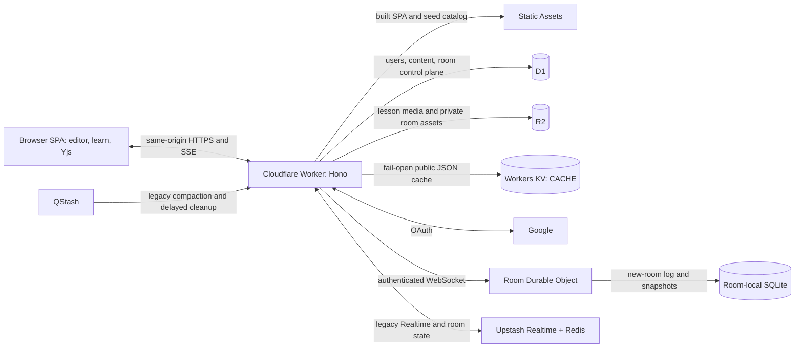

# Next Editor on Cloudflare — Architecture

> Status: **implemented.** Last reviewed 2026-07-17. Use
> [cloudflare-deploy-guide.md](./cloudflare-deploy-guide.md) for deployment and
> [live-collaboration.md](./live-collaboration.md) for the collaboration protocol.

This describes the current same-origin Cloudflare platform behind the editor,
the `/learn` catalog, lesson publishing, playlists, and live collaboration.

## Decisions locked in

| Question              | Decision                                                                                                                                              |
| --------------------- | ----------------------------------------------------------------------------------------------------------------------------------------------------- |
| Deployment topology   | **Full Cloudflare, same-origin.** SPA served by Workers Static Assets; API, OAuth, and R2 all live behind the same origin via one Hono Worker.        |
| Lesson lifecycle      | **Draft → Publish.** Uploaded lessons start as private drafts; only `published` rows appear in the public gallery.                                    |
| Who can create        | **Any Google account.** Sign in with Google → you can record, upload, and publish.                                                                    |
| Existing JSON catalog | **Kept as-is.** The curated seed (e.g. `introduction`) stays static and D1-free — frequent-access, edge-cached. D1 only holds user-generated lessons. |
| Public read cache     | **Cloudflare Workers KV.** Public lesson/playlist JSON uses the fail-open `CACHE` binding; search remains uncached.                                   |
| Live collaboration    | **Versioned room durability.** New WebSocket rooms use Durable Object SQLite; legacy/Realtime rooms use dedicated Upstash Redis, never the KV cache.  |

## Why same-origin is not negotiable here

The app ships with cross-origin isolation on **every** response:

```
Cross-Origin-Embedder-Policy: require-corp
Cross-Origin-Opener-Policy:   same-origin
```

(see `infra/worker/index.ts`, `vite.config.ts` `crossOriginHeaders`). This is
required for `SharedArrayBuffer` / the WebContainer runtime. Under
`require-corp`, **any subresource** — the `.ne` stream, the `.ogg`/`.weba`
audio, the camera `.webm`, the thumbnail — must either be same-origin, or
carry `Cross-Origin-Resource-Policy: cross-origin` **and** be requested with
the CORS `crossorigin` attribute. Serving lesson media from a separate origin
(a static SPA + a `api.*` Worker, or a public R2 bucket domain) means
retrofitting CORP + CORS onto every asset and every `<audio>`/`<video>` tag,
plus cross-site cookie handling for the OAuth session.

Serving the SPA, the API, and R2 bytes from **one Cloudflare origin** makes all
of that disappear: subresources are same-origin, so COEP is satisfied for free,
and the session cookie is a plain first-party `HttpOnly` cookie.

## Component boundaries

Cloudflare server bindings stay in `infra/worker`; browser composition can
consume the exported `@next-editor/infra` client package at route boundaries.
The editor and recording core do not directly access D1, R2, KV, Worker
secrets, or Upstash credentials.

```
infra/
  worker/  Hono API, OAuth, D1/R2/KV bindings, collaboration gateway
  db/      D1 migrations and typed content/collaboration queries
  client/  auth, upload, playlist, and lesson-management browser adapters

src/       editor/runtime/recorder, Yjs project model, room provider and UI
tube/      /learn gallery, lesson detail, authors, playlists and search
```

`CodeRoute` and the lesson detail route are composition roots: they connect the
generic editor seams to `UploadLessonModal`, authentication, and collaboration
without exposing server bindings or credentials to browser code.

## Runtime topology (production)



Everything is one hostname, so COEP `require-corp` is satisfied and the session
cookie is first-party. Cloudflare's CDN caches static assets and (with cache
headers) `/media/*` at the edge. Workers KV serves only disposable public
lesson/playlist cache entries. Durable Object SQLite is fail-closed for new
WebSocket room history; Upstash Redis is fail-closed and reserved for legacy
collaboration/Realtime rooms.

## Data model — D1

The migrations in [`infra/db/migrations`](../infra/db/migrations) are the
authoritative schema. D1 currently holds:

| Area                        | Tables and responsibility                                            |
| --------------------------- | -------------------------------------------------------------------- |
| Identity                    | `users` (including public usernames) and revocable `sessions`        |
| Published content           | `lessons`, `playlists`, and ordered `playlist_lessons` membership    |
| Collaboration control plane | rooms, members, invitations/claims, audit events, and asset metadata |

The public gallery reads only published lessons; owner-scoped routes expose
drafts. D1 does **not** store the live Yjs update log or presence state. New
WebSocket logs live in room-local Durable Object SQLite; version-1 logs live in
the dedicated collaboration Redis data plane.

## Storage model — R2

One bucket, one folder per lesson id. Mirrors the sibling-file convention the
player already relies on (`useUrlLoader` resolves `audioFile`/`cameraFile`/
captions relative to the `.ne` URL), so **no player changes are needed**.

```
next-editor-tube-media/
  lessons/
    <lesson-id>/
      <lesson-id>.ne          # SCR3 stream (small, delta-compressed)
      <lesson-id>.ogg|.weba   # externalized audio  (sibling of the .ne)
      <lesson-id>.webm        # externalized camera (optional)
      <lesson-id>.en.vtt      # captions (optional)
      thumbnail.png|svg
  slide-images/
    <sha256-of-source-url>    # Google Slides deck images copied at import time
                              # (POST /api/slide-images); keyed by source URL so
                              # the same image is stored once across all decks
  collaboration/
    rooms/<room-id>/assets/<sha256>  # private, membership-checked room assets
```

Bytes are served **through the Worker** at `/media/lessons/<id>/<file>` from the
R2 binding (`env.BUCKET.get(key)`), with `Content-Type`, long-lived
`Cache-Control: public, max-age=31536000, immutable`, and `Range` support for
audio/video streaming. Serving through the Worker (rather than a public bucket
domain) keeps media same-origin → COEP-clean and cache-friendly.

D1 stores the **path** (`/media/lessons/<id>/<id>.ne`), not the raw R2 key, so
the value drops straight into `lesson.ne` and the player's existing sibling
resolution finds the audio/captions with zero special-casing.

## Catalog resolution — seed stays static, D1 layered on top

Two sources, merged by the tube client (this is the "Swap point for a real
backend" the existing `tube/vite/lessonsApiPlugin.ts` and `tube/src/lib/lessons.ts`
comments already call out):

| Source                                  | Path                                              | Backed by                             | D1 hit? | Cache     |
| --------------------------------------- | ------------------------------------------------- | ------------------------------------- | ------- | --------- |
| **Seed** (curated, e.g. `introduction`) | `/lessons/page-*.json`, `/lessons/by-slug/*.json` | Static assets (unchanged vite plugin) | No      | Edge/CDN  |
| **Dynamic** (user, published)           | `/api/lessons?page=`, `/api/lessons/:slug`        | D1 via Worker                         | Yes     | Short TTL |

- **Gallery** (`fetchLessonsPage`): serve the seed shard(s) first, then continue
  the infinite scroll into D1 pages. The `nextPage` cursor encodes which source
  and offset comes next, so the existing `useInfiniteQuery` wiring is untouched.
- **Detail** (`findLessonBySlug`): try the seed `by-slug` shard; on 404 fall
  back to `/api/lessons/:slug`. Returns `null` on a real miss (unchanged
  contract), so `LessonDetailRoute` still distinguishes not-found from error.

The introduction lesson therefore **never touches D1** and keeps being served as
plain edge-cached JSON + static assets — exactly the "frequent access" carve-out
requested.

## Caching — Cloudflare Workers KV

The "Short TTL" cache in the table above is `infra/worker/cache.ts`: a
cache-aside Workers KV layer in front of the highest-traffic public D1 reads.
Lesson lists use a 60s key TTL, lesson details use 300s, and public playlist
details use 60s. Search (`/api/search`) is deliberately **not** cached because
its unbounded query cardinality has low reuse and would create unnecessary KV
reads and writes.

- **Cloudflare binding, fail-open behavior.** `infra/wrangler.toml` declares
  the `CACHE` KV binding. Wrangler persists it locally and can automatically
  provision the production namespace on first deploy. `getCache(env)` still
  returns `null` when a non-Wrangler/self-hosted environment omits the binding,
  and every operation in `cached()`/`invalidateCache()` is wrapped so KV errors
  fall back to D1.
- **Encoding and expiry.** Values are JSON-serialized and written with
  `expirationTtl`. Reads use KV's JSON mode and a 30s regional `cacheTtl`, the
  current platform minimum, to keep cross-edge staleness shorter than the
  stored entry TTL.
- **Invalidation and consistency.** Lesson and playlist mutations delete the
  affected slug key. Workers KV is eventually consistent: a delete is visible
  immediately where it was issued, while another location can briefly retain
  its cached value. The 30s read-cache setting bounds the normal regional cache
  window; failed deletes fall back to the key's 60s or 300s expiration. The
  paginated lesson list relies on its 60s expiration rather than per-page
  invalidation.
- **Quota behavior.** KV reads, writes, and deletes each consume their own
  operation quotas. Every cache miss can cause one write, so production should
  monitor the `CACHE` namespace—especially the Free plan's much smaller write
  allowance. Quota errors remain fail-open and therefore increase D1 traffic
  instead of failing requests.
- **Deployment requirements.** No cache secret or `.dev.vars` value is needed.
  A CI deploy token must have account-level **Workers KV Storage: Edit** in
  addition to its existing Worker permissions. The ID-less binding is
  auto-provisioned on first deploy; operators can instead create a namespace
  manually and add its public ID to `wrangler.toml`.
- **Migration boundary.** Existing Redis cache entries are disposable and are
  not copied. After the KV-backed release is smoke-tested, remove only the old
  `UPSTASH_REDIS_REST_*` Worker secrets. Keep `COLLAB_REDIS_REST_*`, which are
  required by live collaboration.

See Cloudflare's documentation for [KV consistency](https://developers.cloudflare.com/kv/concepts/how-kv-works/),
[KV pricing](https://developers.cloudflare.com/kv/platform/pricing/), and
[automatic Wrangler provisioning](https://developers.cloudflare.com/workers/wrangler/configuration/#automatic-provisioning),
plus the [API token permission reference](https://developers.cloudflare.com/fundamentals/api/reference/permissions/).

## Auth — Google OAuth, first-party session

Authorization Code flow with PKCE, terminated server-side in the Worker so the
client never sees the client secret or Google tokens.

```
1. Browser → GET /api/auth/google/login?returnTo=/code
             Worker sets short-lived signed cookie {state, code_verifier, returnTo},
             302 → accounts.google.com  (scope: openid email profile)

2. Google  → GET /api/auth/google/callback?code&state
             Worker verifies state (CSRF), exchanges code+verifier for tokens
             (server-to-server), fetches userinfo, UPSERTs users row by google_sub,
             creates sessions row, sets:
               Set-Cookie: ne_session=<token>; HttpOnly; Secure; SameSite=Lax; Path=/
             302 → returnTo

3. Browser → GET /api/auth/me         → { user } | 401
             POST /api/auth/logout     → delete session row + clear cookie
```

`SameSite=Lax` is sufficient because everything is same-origin. The session
token is opaque (random), validated against D1 on each authed request; sessions
expire (`expires_at`) and can be revoked by deleting the row.

**OAuth redirect + the recording:** a full-page redirect to Google would drop an
open modal and in-memory state. Mitigation: the finished recording is already
persisted to IndexedDB by the recorder, so before redirecting the modal stores a
small "resume intent" (recording id + `returnTo`); on return, the host reopens
the upload modal against the persisted recording.

## API surface (Hono routes)

| Method & path                                                      | Auth             | Current responsibility                                                                    |
| ------------------------------------------------------------------ | ---------------- | ----------------------------------------------------------------------------------------- |
| `GET /api/auth/google/login`, `/callback`                          | —                | OAuth PKCE handshake and first-party session creation                                     |
| `GET /api/auth/me`, `PATCH /username`, `POST /logout`              | cookie           | Session and profile lifecycle                                                             |
| `GET /api/lessons`, `GET /api/lessons/:slug`                       | —                | Published lesson reads through Workers KV, then D1                                        |
| `/api/lessons/mine`, create/update/publish/unpublish/delete routes | owner            | Draft and published lesson lifecycle                                                      |
| `PUT /api/uploads/:id/media/:filename`                             | owner/sign-in    | Validate and stream a lesson object through the Worker to R2                              |
| `/api/playlists/*`                                                 | mixed            | Public playlist detail plus owner CRUD, membership, and ordering                          |
| `/api/authors/:username`, `/api/search`                            | —                | Public author/catalog discovery; search is intentionally uncached                         |
| `/api/collaboration/rooms/*`, `/invitations/*`, `/realtime`        | member/role      | D1 control plane, private R2 assets, versioned SQLite/Redis persistence, and Realtime SSE |
| `POST /api/collaboration/jobs/maintenance`                         | QStash signature | Legacy compaction and retained-room cleanup                                               |
| `GET /media/*`                                                     | —                | Stream R2 objects with Range and immutable-cache support                                  |
| `POST /api/slide-images`                                           | cookie           | Ingest Google Slides images into content-addressed R2 keys                                |
| `GET /api/proxy?url=`, `POST /api/openrouter/responses`            | route-specific   | Guarded same-origin external-service proxies                                              |

## Upload & publish sequence

```
recording stops
   │
   ▼  src fires renderPostRecordingModal({ recording, onClose })
infra <UploadLessonModal>
   │  ── not signed in? → "Sign in with Google" (store resume intent, redirect)
   │  ── signed in:
   │       1. user fills title / description / tags / thumbnail
   │       2. build files: buildRecordingFiles(recording)  ← src helper (pure)
   │            → { ne: Blob, audio?: {name,blob}, camera?: {name,blob} }
   │       3. PUT each blob to /api/uploads/:id/media/:filename
   │            Worker validates owner/type/size and streams the body to R2
   │       4. POST /api/lessons {id, title, ne path, …}  → D1 draft row
   │       5. success: show "Draft saved" + [Publish] + link to /learn/:slug
   │            Publish → POST /api/lessons/:id/publish
   ▼
gallery shows it (once published) alongside the static seed
```

`.ne` files are small; audio/camera can be tens of MB. The implemented route
streams each request body into `env.BUCKET.put()` without buffering the whole
file in Worker memory. Lesson media has a 200 MB application limit; thumbnails
use their smaller shared client/server constraint.

## Security notes

- Google, legacy collaboration Redis, and QStash credentials live only as **Worker secrets**, never in the browser bundle.
- Session cookie is `HttpOnly; Secure; SameSite=Lax`; tokens are opaque and DB-validated; PKCE + `state` guard the OAuth handshake.
- Ownership is enforced server-side on every mutating route (`owner_id === session.user_id`); "any Google account can create" does **not** mean any account can edit another's lesson.
- The upload route validates authentication, existing-lesson ownership, exact content length, filename/extension, and size before writing under `lessons/<id>/…`.
- Draft lessons are never returned by the public gallery query; only `/api/lessons/mine` (owner-scoped) exposes them.
- Collaboration routes re-check room membership and roles server-side; browser clients never receive Redis or QStash credentials.

## Cost / free-tier fit

Keeping the curated seed static means the highest-traffic lesson
(`introduction`) costs no D1 or KV operations. Workers KV's Free plan currently
allows 100,000 key reads and 1,000 key writes per day; a hot key with a short
expiration can consume the write allowance faster than the read allowance, so
production must monitor the `CACHE` namespace. Quota or KV availability errors
fall through to D1 rather than failing public requests. Check the linked
Cloudflare pricing pages again before changing traffic or TTL assumptions.

## What explicitly does **not** change

- The `.ne` / SCR3 format, the codec, the recorder machine, playback, sibling media resolution.
- The static seed catalog and `public/lessons/introduction/*` assets.
- Standalone editor behavior when no collaboration room is selected; Redis is never a fallback cache for ordinary editor or catalog requests.
