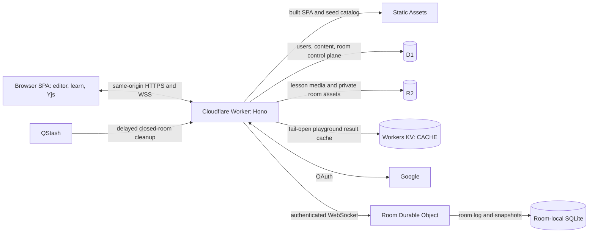

# Next Editor on Cloudflare — Architecture

> Status: **implemented.** Last reviewed 2026-07-17. Use
> [cloudflare-deploy-guide.md](./cloudflare-deploy-guide.md) for deployment and
> [live-collaboration.md](./live-collaboration.md) for the collaboration protocol.

This describes the current same-origin Cloudflare platform behind the editor,
the `/learn` catalog, lesson publishing, playlists, and live collaboration.

## Decisions locked in

| Question              | Decision                                                                                                                                                                                                                       |
| --------------------- | ------------------------------------------------------------------------------------------------------------------------------------------------------------------------------------------------------------------------------ |
| Deployment topology   | **Full Cloudflare, same-origin.** SPA served by Workers Static Assets; API, OAuth, and R2 all live behind the same origin via one Hono Worker.                                                                                 |
| Lesson lifecycle      | **Draft → Publish.** Uploaded lessons start as private drafts; only `published` rows appear in the public gallery.                                                                                                             |
| Who can create        | **Any Google account.** Sign in with Google → you can record, upload, and publish.                                                                                                                                             |
| Existing JSON catalog | **Kept as-is.** The curated seed (e.g. `introduction`) stays static and D1-free — frequent-access, edge-cached. D1 only holds user-generated lessons.                                                                          |
| Public read cache     | **None for the catalog.** Public lesson/playlist JSON reads D1 directly; the fail-open `CACHE` Workers KV binding only caches playground Run/Format results; search remains uncached.                                          |
| Live collaboration    | **Room Durable Objects.** Binary WebSockets and per-room SQLite are the only collaboration transport and durability path.                                                                                                      |
| Voice chat            | **Direct Cloudflare Realtime SFU.** Audio-only WebRTC coordinated by a separate per-room voice Durable Object behind a room-scoped gateway; fails closed on the `VOICE_CHAT_ENABLED` flag and never touches the Yjs transport. |

## Why same-origin is not negotiable here

The app ships with cross-origin isolation on **every** response:

```
Cross-Origin-Embedder-Policy: require-corp
Cross-Origin-Opener-Policy:   same-origin
```

(see `infra/worker/index.ts`, `vite.config.ts` `crossOriginHeaders`). This is
required for `SharedArrayBuffer` / the WebContainer runtime. Under
`require-corp`, **any subresource** — the `.ne` stream, the `.ogg`/`.weba`
audio, the camera `.webm`, the thumbnail — must either be same-origin, or
carry `Cross-Origin-Resource-Policy: cross-origin` **and** be requested with
the CORS `crossorigin` attribute. Serving lesson media from a separate origin
(a static SPA + a `api.*` Worker, or a public R2 bucket domain) means
retrofitting CORP + CORS onto every asset and every `<audio>`/`<video>` tag,
plus cross-site cookie handling for the OAuth session.

Serving the SPA, the API, and R2 bytes from **one Cloudflare origin** makes all
of that disappear: subresources are same-origin, so COEP is satisfied for free,
and the session cookie is a plain first-party `HttpOnly` cookie.

## Component boundaries

Cloudflare server bindings stay in `infra/worker`; browser composition can
consume the exported `@next-editor/infra` client package at route boundaries.
The editor and recording core do not directly access D1, R2, KV, Worker
secrets, or collaboration credentials.

```
infra/
  worker/  Hono API, OAuth, D1/R2/KV bindings, collaboration + voice/SFU gateways
  db/      D1 migrations and typed content/collaboration queries
  client/  auth, upload, playlist, and lesson-management browser adapters

src/       editor/runtime/recorder, Yjs project model, room provider and UI
src/voice/ voice-chat engine and partytracks adapter (browser media only)
tube/      /learn gallery, lesson detail, authors, playlists and search
```

`CodeRoute` and the lesson detail route are composition roots: they connect the
generic editor seams to `UploadLessonModal`, authentication, and collaboration
without exposing server bindings or credentials to browser code.

## Runtime topology (production)


```mermaid
flowchart LR
    Browser[Browser SPA: editor, learn, Yjs] <-->|same-origin HTTPS and WSS| Worker[Cloudflare Worker: Hono]
    Worker -->|built SPA and seed catalog| Assets[Static Assets]
    Worker -->|users, content, room control plane| D1[(D1)]
    Worker -->|lesson media and private room assets| R2[(R2)]
    Worker -->|fail-open playground result cache| KV[(Workers KV: CACHE)]
    Worker <-->|OAuth| Google[Google]
    Worker -->|authenticated WebSocket| Room[Room Durable Object]
    Room -->|room log and snapshots| SQL[(Room-local SQLite)]
    QStash[QStash] -->|delayed closed-room cleanup| Worker
```

Everything is one hostname, so COEP `require-corp` is satisfied and the session
cookie is first-party. Cloudflare's CDN caches static assets and (with cache
headers) `/media/*` at the edge. Workers KV holds only disposable playground
results. Durable Object SQLite is fail-closed for
WebSocket room history.

## Data model — D1

The migrations in [`infra/db/migrations`](../infra/db/migrations) are the
authoritative schema. D1 currently holds:

| Area                        | Tables and responsibility                                                                      |
| --------------------------- | ---------------------------------------------------------------------------------------------- |
| Identity                    | `users` (including public usernames) and revocable `sessions`                                  |
| Published content           | `lessons`, `playlists`, and ordered `playlist_lessons` membership                              |
| Collaboration control plane | rooms, members, invitations/claims, audit events, and asset metadata                           |
| Studio narration            | `user_provider_credentials` (AES-256-GCM-encrypted AthanLab API keys), `provider_auth_breaker` |

The public gallery reads only published lessons; owner-scoped routes expose
drafts. D1 does **not** store the live Yjs update log or presence state. Room
logs live in room-local Durable Object SQLite.

## Storage model — R2

One bucket, one folder per lesson id. Mirrors the sibling-file convention the
player already relies on (`useUrlLoader` resolves `audioFile`/`cameraFile`/
captions relative to the `.ne` URL), so **no player changes are needed**.

```
next-editor-tube-media/
  lessons/
    <lesson-id>/
      <lesson-id>.ne          # SCR3 stream (small, delta-compressed)
      <lesson-id>.ogg|.weba   # externalized audio  (sibling of the .ne)
      <lesson-id>.webm        # externalized camera (optional)
      <lesson-id>.en.vtt      # captions (optional; a second track in the same
                              # language is <lesson-id>-2.en.vtt, then -3, …)
      <lesson-id>-thumbnail-<timestamp>.png|jpg|webp  # a new key per upload
  slide-images/
    <sha256-of-source-url>    # Google Slides deck images copied at import time
                              # (POST /api/slide-images); keyed by source URL so
                              # the same image is stored once across all decks
  collaboration/
    rooms/<room-id>/assets/<sha256>  # private, membership-checked room assets
```

Bytes are served **through the Worker** at `/media/lessons/<id>/<file>` from the
R2 binding (`env.BUCKET.get(key)`), with `Content-Type`, an ETag with
`Cache-Control: public, max-age=0, must-revalidate` (an upload retry or an edit
may replace a key, so a cached copy is revalidated, and a current one is answered
with 304), and `Range` support for audio/video streaming. The two write-once
key shapes, `slide-images/<sha256>` and timestamped
`<id>-thumbnail-<timestamp>` images, are never rewritten, so they are sent as
`public, max-age=31536000, immutable` and kept in the serving location's Cache
API (`caches.default`), which answers repeat views without an R2 read. So a
re-encode or backfill of those images must write new keys and repoint the rows,
never overwrite in place. Deleting the R2 object (a lesson delete, a replaced
thumbnail) leaves any location's cached copy servable until eviction; when one
must disappear everywhere (a takedown), purge it from the `nexteditor.dev` zone
cache by prefix (`nexteditor.dev/media/lessons/<id>/`) or with Purge Everything,
since `cache.delete` in the Worker only clears the location it runs in.
Browsers that already hold a copy keep it. Serving through the Worker (rather
than a public bucket domain) keeps media same-origin → COEP-clean and
cache-friendly.

D1 stores the **path** (`media/lessons/<id>/<id>.ne`, no leading slash), not the
raw R2 key, so the value drops straight into `lesson.ne` (the client requests
`/${lesson.ne}`) and the player's existing sibling resolution finds the
audio/captions with zero special-casing.

## Catalog resolution — seed stays static, D1 layered on top

Two sources, merged by the tube client (this is the "Swap point for a real
backend" the existing `tube/vite/lessonsApiPlugin.ts` and `tube/src/lib/lessons.ts`
comments already call out):

| Source                                  | Path                                              | Backed by                             | D1 hit? | Cache    |
| --------------------------------------- | ------------------------------------------------- | ------------------------------------- | ------- | -------- |
| **Seed** (curated, e.g. `introduction`) | `/lessons/page-*.json`, `/lessons/by-slug/*.json` | Static assets (unchanged vite plugin) | No      | Edge/CDN |
| **Dynamic** (user, published)           | `/api/lessons?page=`, `/api/lessons/:slug`        | D1 via Worker                         | Yes     | None     |

- **Gallery** (`fetchLessonsPage`): page through D1 newest first (`d1:<n>`
  cursors) and append the bundled seed to the last D1 page, so the introduction
  appears only once the infinite scroll reaches the oldest lessons. An empty
  catalog's single page is that last page, so the seed still shows there.
- **Detail** (`findLessonBySlug`): try the seed `by-slug` shard; on 404 fall
  back to `/api/lessons/:slug`. Returns `null` on a real miss (unchanged
  contract), so `LessonDetailRoute` still distinguishes not-found from error.

The introduction lesson therefore **never touches D1** and keeps being served as
plain edge-cached JSON + static assets — exactly the "frequent access" carve-out
requested.

### Who resolves the slug, and when

`findLessonBySlug` above is the _fallback_, not the usual path. A lesson row
reaches the detail route by whichever of these got there first:

| Arrival                        | Resolver                                                      | Client fetch? |
| ------------------------------ | ------------------------------------------------------------- | ------------- |
| In-app click from a list       | The list query seeds `["lessons","detail",slug]`              | No            |
| Direct URL / refresh / crawler | Worker resolves at the edge, dehydrates into the document     | No            |
| Anything else                  | `findLessonBySlug` (seed manifest, then `/api/lessons/:slug`) | Yes           |

- **Seeding** (`primeLessonDetails`, `infra/lessons/queryKeys.ts`, beside the
  lesson and playlist query keys tube and infra share): the gallery, playlist,
  search and author-profile queries already download whole `Lesson` objects for
  every card they render, so their query functions write each one to the detail
  key. Opening a card — or auto-advancing through a playlist — then resolves from
  cache.
- **Edge render** (`infra/worker/ssr/lessonDetail.ts`): `GET /learn/:slug` in the
  Worker resolves the slug through the same `findPublishedLessonBySlug` the JSON
  API uses (`infra/worker/lessonCatalog.ts`, so the two can't disagree), rewrites
  the shell's generic `<title>`/OG/Twitter/canonical tags with the lesson's own,
  appends `Course` JSON-LD (`inLanguage` is `my` when the title or description
  contains Myanmar script, otherwise `en`), and parks a dehydrated React Query cache in a
  `<script type="application/json">`. `hydrateServerQueryState()` adopts it before
  the first render (`src/queryClient.ts`). After that the client owns the title:
  every route view calls `useDocumentTitle` (`src/hooks/useDocumentTitle.ts`), and
  `LessonDetailRoute` sets the same `<lesson title> | Next Editor`, so client-side
  navigation never leaves the first lesson's title on another page.

This is **data-only SSR**: `#root` ships empty, because the lesson page _is_ the
editor (Monaco, WebContainers, the whole provider stack) and none of that renders
on a Worker. The browser still mounts the app exactly as before — it just does so
with the lesson already in hand. An unknown slug gets a `noindex` 404 shell with
the miss dehydrated too, so the client can render "Lesson not found" without
repeating the lookup, and any edge failure degrades to the untouched SPA shell.

## Caching — Cloudflare Workers KV

`infra/worker/cache.ts` exposes the `CACHE` Workers KV binding. Its one user is
the playground proxies (`/api/<language>-playground/run` and `/format`), which
cache deterministic results under a content hash of the program, because the
upstream compile they save takes seconds. The result goes back to the learner
before the KV write finishes (`waitUntil`).

The public catalog reads (`/api/lessons`, `/api/lessons/:slug`,
`/api/playlists/:slug` and the `/learn/:slug` edge render) used to read through
KV and now query D1 directly. KV's per-location read cache lasts 30s, and at
this site's traffic nearly every catalog read fell outside it and paid KV's
central store (~180–195 ms from Singapore) in front of an indexed D1 query that
costs ~55–90 ms. Reading D1 also makes a publish, unpublish or edit visible on
the next request. Search (`/api/search`) was never cached.

- **Cloudflare binding, fail-open behavior.** `infra/wrangler.toml` declares
  the `CACHE` KV binding. Wrangler persists it locally and can automatically
  provision the production namespace on first deploy. `getCache(env)` still
  returns `null` when a non-Wrangler/self-hosted environment omits the binding,
  and every KV read and write is wrapped, so the playground runs uncached
  rather than failing.
- **Encoding and expiry.** Values are JSON-serialized and written with
  `expirationTtl`; a read is re-validated by the route's own parser before it
  is served.
- **Quota behavior.** KV reads and writes each consume their own operation
  quotas, and every uncached Run or Format can cause one write. Quota errors
  remain fail-open.
- **Deployment requirements.** No cache secret or `.dev.vars` value is needed.
  A CI deploy token must have account-level **Workers KV Storage: Edit** in
  addition to its existing Worker permissions. The ID-less binding is
  auto-provisioned on first deploy; operators can instead create a namespace
  manually and add its public ID to `wrangler.toml`.
- **Migration boundary.** Catalog entries written before the switch to D1 are
  never read again and expire on their own (60–300s TTLs). Existing Redis cache
  entries were likewise disposable; remove obsolete `UPSTASH_REDIS_REST_*` and
  `COLLAB_REDIS_REST_*` Worker secrets.

See Cloudflare's documentation for [KV consistency](https://developers.cloudflare.com/kv/concepts/how-kv-works/),
[KV pricing](https://developers.cloudflare.com/kv/platform/pricing/), and
[automatic Wrangler provisioning](https://developers.cloudflare.com/workers/wrangler/configuration/#automatic-provisioning),
plus the [API token permission reference](https://developers.cloudflare.com/fundamentals/api/reference/permissions/).

## Auth — Google OAuth, first-party session

Authorization Code flow with PKCE, terminated server-side in the Worker so the
client never sees the client secret or Google tokens.

```
1. Browser → GET /api/auth/google/login?returnTo=/code
             Worker sets short-lived signed cookie {state, code_verifier, returnTo},
             302 → accounts.google.com  (scope: openid email profile)

2. Google  → GET /api/auth/google/callback?code&state
             Worker verifies state (CSRF), exchanges code+verifier for tokens
             (server-to-server), fetches userinfo, UPSERTs users row by google_sub,
             creates sessions row, sets:
               Set-Cookie: ne_session=<token>; HttpOnly; Secure; SameSite=Lax; Path=/
             302 → returnTo

3. Browser → GET /api/auth/me         → { user } | 401
             POST /api/auth/logout     → delete session row + clear cookie
```

`SameSite=Lax` is sufficient because everything is same-origin. The session
token is opaque (random), validated against D1 on each authed request; sessions
expire (`expires_at`) and can be revoked by deleting the row.

**OAuth redirect + the recording:** a full-page redirect to Google would drop an
open modal and in-memory state. Mitigation: before redirecting, the modal saves
the finished recording to IndexedDB and then a small "resume intent" (recording
id + `returnTo`) pointing at it, and it stays on the page if either save fails;
on return, the host reopens the upload modal against the persisted recording and
deletes the stored copy along with the intent.

## API surface (Hono routes)

| Method & path                                                      | Auth                | Current responsibility                                                                                                |
| ------------------------------------------------------------------ | ------------------- | --------------------------------------------------------------------------------------------------------------------- |
| `GET /api/auth/google/login`, `/callback`                          | —                   | OAuth PKCE handshake and first-party session creation                                                                 |
| `POST /api/auth/google/onetap`                                     | —                   | Google One Tap sign-in with a JWKS-verified credential                                                                |
| `/api/auth/passkey/*`                                              | cookie / —          | Passkey registration (signed in) and discoverable-credential sign-in                                                  |
| `GET /api/auth/me`, `PATCH /username`, `POST /logout`              | cookie              | Session and profile lifecycle                                                                                         |
| `GET /api/lessons`, `GET /api/lessons/:slug`                       | —                   | Published lesson reads straight from D1                                                                               |
| `/api/lessons/mine`, create/update/publish/unpublish/delete routes | owner               | Draft and published lesson lifecycle                                                                                  |
| `PUT /api/uploads/:id/media/:filename`                             | owner/sign-in       | Validate and stream a lesson object through the Worker to R2                                                          |
| `/api/playlists/*`                                                 | mixed               | Public playlist detail plus owner CRUD, membership, and ordering                                                      |
| `/api/authors/:username`, `/api/search`                            | —                   | Public author/catalog discovery; search is intentionally uncached                                                     |
| `/api/collaboration/rooms/*`, `/invitations/*`                     | member/role         | D1 control plane, private R2 assets, binary WebSockets, and room-local SQLite                                         |
| `/api/collaboration/rooms/:id/voice/*`                             | member + capability | Voice availability probe, JSON coordination WebSocket, and the authorized SFU gateway (feature-flagged, fails closed) |
| `POST /api/collaboration/jobs/maintenance`                         | QStash signature    | Delayed closed-room cleanup                                                                                           |
| `GET /media/*`                                                     | —                   | Stream public R2 objects (`lessons/`, `slide-images/`) with Range and ETag revalidation                               |
| `POST /api/slide-images`                                           | cookie              | Ingest Google Slides images into content-addressed R2 keys                                                            |
| `GET /api/proxy?url=`, `POST /api/openrouter/responses`            | route-specific      | Guarded same-origin external-service proxies                                                                          |
| `POST /api/<language>-playground/run`, `/format`                   | —                   | Kill-switched, cached proxies, limited per user or IP: Go, Kotlin, Rust, Zig, Haskell (`/format`: Go, Rust, Zig)      |
| `GET /api/studio/capabilities`                                     | cookie              | Studio capability discovery (`athanlab`, `burmeseVoxCpm2`)                                                            |
| `/api/studio/athanlab/*` (key, voices, sample, usage)              | cookie + stored key | Connect, check, and remove the user's own AthanLab API key; list voices, play free samples, show the balance          |
| `POST /api/studio/tts/athanlab`                                    | cookie + stored key | Burmese narration: one AthanLab job per uncached dialog, charged to the user's AthanLab balance                       |
| `POST /api/studio/tts/voxcpm2`                                     | cookie + D1 flag    | Private Burmese narration on Modal                                                                                    |

## Upload & publish sequence

```
recording stops
   │
   ▼  src fires renderPostRecordingModal({ recording, onClose })
infra <UploadLessonModal>
   │  ── not signed in? → "Sign in with Google" (store resume intent, redirect)
   │  ── signed in:
   │       1. user fills title / description / tags / thumbnail
   │       2. build files: buildRecordingFiles(recording)  ← src helper (pure)
   │            → { ne: Blob, audio?: {name,blob}, camera?: {name,blob} }
   │       3. PUT each blob to /api/uploads/:id/media/:filename
   │            Worker validates owner/type/size and streams the body to R2
   │       4. POST /api/lessons {id, title, ne path, …}  → D1 draft row
   │       5. success: show "Draft saved" + [Publish] + link to /learn/:slug
   │            Publish → POST /api/lessons/:id/publish
   ▼
gallery shows it (once published) alongside the static seed
```

`.ne` files are small; audio/camera can be tens of MB. The implemented route
streams each request body into `env.BUCKET.put()` without buffering the whole
file in Worker memory. Lesson media has a 100 MB limit, Cloudflare's own
request-body cap (`MAX_MEDIA_BYTES`, infra/lessons/uploadLimits.ts);
thumbnails and captions use their smaller limits from the same module, which
the client and the upload route share.

## Security notes

- Google and QStash credentials live only as **Worker secrets**, never in the browser bundle.
- Session cookie is `HttpOnly; Secure; SameSite=Lax`; tokens are opaque and DB-validated; PKCE + `state` guard the OAuth handshake.
- Ownership is enforced server-side on every mutating route (`owner_id === session.user_id`); "any Google account can create" does **not** mean any account can edit another's lesson.
- The upload route validates authentication, existing-lesson ownership, exact content length, filename/extension, and size before writing under `lessons/<id>/…`.
- Draft lessons are never returned by the public gallery query; only `/api/lessons/mine` (owner-scoped) exposes them.
- Collaboration routes re-check room membership and roles server-side; browser clients never receive QStash credentials.
- Users' AthanLab API keys are sealed with AES-256-GCM before they reach D1 (Worker secret `ATHANLAB_KEY_ENCRYPTION_SECRET`; the additional data binds each key to its user). The Worker decrypts a key only to call `https://api.athanlab.com` for that user, never returns or logs it, and stops sending it after AthanLab answers 401. AthanLab blocks a whole network after 20 failed authentications in 5 minutes, and every user reaches it through Cloudflare's shared egress, so two D1 guards limit ours. A key check (`PUT /api/studio/athanlab/key`) runs only after one conditional upsert on `provider_auth_breaker` has counted it as a failure in the current fixed 5-minute window, which it does only while that window holds fewer than 8; the check gets its slot back only when AthanLab gives a definite answer other than 401 (a call that threw or timed out keeps it, since AthanLab may have counted the key), and is refused if D1 fails. So at most 8 failed key checks are admitted per window and 16 in any 5-minute span, each failing at most once and within about a minute of being admitted. Each request's first call with a stored key (for a synthesis, its first submit with its retries) is made under a per-user lease on its `user_provider_credentials` row, bound to the sealed key the request decrypted, released when that call is finished and otherwise lapsing 5 s after that call's own timeout; a 401 marks the key invalid before the lease is released. So concurrent requests with a revoked key cost one failed authentication between them, not one each, even when the user replaces the key meanwhile (requests still holding the old key answer `key_busy` and retry with the new one); only a first submit still retrying transient AthanLab errors past its lease lets another request try too. Those failures count in the same window and pause key checks sooner, but are not capped by it. Per-user Rate Limiting bindings (`ATHANLAB_KEY_RATE_LIMITER`, `ATHANLAB_API_RATE_LIMITER`) fail closed. Without the secret, AthanLab narration is off; rotating it makes every user connect their key again.
- The Realtime SFU application ID and token are Worker secrets. Every SFU operation is re-authenticated (session + D1 membership) and then authorized inside the room's voice Durable Object against per-connection capabilities and a session/track/mid ownership registry; upstream responses are sanitized before reaching the browser.

## Cost / free-tier fit

Keeping the curated seed static means the highest-traffic lesson
(`introduction`) costs no D1 operations. Every other catalog read is one indexed
D1 query over a small table, well inside D1's free daily row-read allowance at
current traffic; if traffic grows by orders of magnitude, a per-location cache
in front of those reads is the lever to revisit. Workers KV's Free plan
currently allows 100,000 key reads and 1,000 key writes per day, which the
playground result cache must stay inside, so production should monitor the
`CACHE` namespace. Quota or KV availability errors make a Run go uncached
rather than fail. Check the linked Cloudflare pricing pages again before
changing traffic or TTL assumptions.

## What explicitly does **not** change

- The `.ne` / SCR3 format, the codec, the recorder machine, playback, sibling media resolution.
- The static seed catalog and `public/lessons/introduction/*` assets.
- Standalone editor behavior when no collaboration room is selected.
