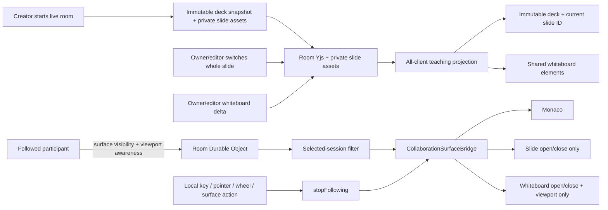

# Live Teaching Collaboration and Collaborator Following — Implementation Plan

Status: implemented in code; deployed three-profile smoke validation pending

Priority: P0

Parent design: [Live Collaboration Feature Plan](./live-collaboration.md)

Product inspiration:
[Zed Channels — Following Collaborators](https://zed.dev/docs/collaboration/channels#following-collaborators)

## Summary

Replace the current `Follow host's active file` toggle with person-centered, cross-surface
following, make whiteboard content collaborative, and make the room's presentation position
shared. A user selects any online participant once; the local app then follows that exact
session's visible surface:

1. the code editor — active text file, cursor, selection, and vertical/horizontal viewport;
2. presentation slides — whether that participant has the shared room presentation open;
3. the whiteboard — whether it is open plus that participant's pan/zoom viewport.

Any intentional local interaction stops following before the action is processed. The follower
keeps the last applied surface and position rather than jumping back.

Following is only the view layer. Slide and whiteboard work must be divided into deliberately
separate state classes:

- the room creator's deck is captured once when the live room starts and is immutable for that
  room; while the room is live, the slide control is presentation-only, as it is during recording,
  and never opens the slide manager;
- shared presentation state is durable and room-wide but contains only the current slide ID;
- shared whiteboard content is durable and room-wide: element upserts/removals converge for every
  participant just like Monaco text and workspace tree changes;
- active surface, open/closed state, and per-participant viewport are ephemeral awareness and are
  applied only by followers;
- the selected follow target is browser-tab-local UI state and is never sent to the server.

Slides and whiteboard content are currently browser-local stores. Therefore, room startup must
capture and distribute the creator's presentation snapshot, and whiteboard collaboration must
project the room scene. The room deck is not a live collaborative authoring surface: imports,
add/edit/delete/reorder operations, build-step state, and iframe interactions are outside this
plan. The teaching-surface foundation is a P0 prerequisite for exposing cross-surface following.

The Zed reference is behavioral inspiration only. The implementation should use Next Editor's
existing Yjs, awareness, recording, slide, and Excalidraw primitives rather than copying Zed
source.

## Recommendation

Ship room-wide slide switching and whiteboard collaboration together with one follow concept
across all first-class teaching surfaces. Do not make the room slide position or collaborative
whiteboard content conditional on following a participant.

Internally, deliver the work in two gates:

1. capture the creator's deck when the room starts, make slide switching and whiteboard element
   deltas authoritative and visible to the whole room, and force slide controls into the existing
   recording-style presentation-only mode;
2. enable the participant follow UI after editor, slide, and whiteboard surface adapters pass the
   same lifecycle and local-intent tests.

The surface adapters may land incrementally behind the protocol revision, but the visible
`Follow` action should not promise cross-surface following until all three are ready.

## Why this is the next improvement

The current collaboration implementation already provides the core distributed-system
foundation:

- stable participant identity through application user ID plus per-tab session ID;
- active-file presence;
- Yjs-relative cursors and standard `y-monaco` relative selections;
- remote cursor and selection decorations;
- coalesced binary awareness over the room Durable Object;
- awareness TTL, reconnect, roles, room lifecycle, and content-addressed room assets.

The current behavior follows only the host's `activeFileNodeId`. It cannot select another
participant, mirror a viewport, track a surface transition, or stop in response to local
interaction. The participant list is informational instead of actionable.

Next Editor also differs from a code-only IDE: presentations and the whiteboard are first-class
teaching surfaces. Following a presenter should continue when that presenter leaves Monaco to
explain a slide or draw a diagram.

## Goals

- Let any room participant follow any other online participant in the same room.
- Follow one exact participant session across editor, slides, and whiteboard.
- Follow the target's text file and CRDT-anchored vertical/horizontal Monaco viewport.
- Keep the target's existing remote editor cursor and selection visible.
- Capture one immutable room deck from the creator when the live room starts and distribute that
  snapshot without exposing slide-manager actions while connected.
- Apply authorized current-slide switches to every live participant, whether or not they follow
  the author.
- Use follow state only to mirror whether the target has slides open; the current shared slide is
  room state rather than participant awareness.
- Apply whiteboard element upserts/removals to every participant using the same delta semantics as
  the recording codec.
- Follow the target's Excalidraw `scrollX`, `scrollY`, and zoom without replacing the follower's
  shared canvas with awareness data.
- Use follow state only for whiteboard open/close and viewport; drawing changes never require a
  follow target.
- Make follow state obvious, surface-aware, and keyboard-accessible above modal surfaces.
- Stop immediately on intentional local editor, slide, whiteboard, or surface-navigation input.
- Allow owners, editors, and viewers to follow; write permissions remain unchanged.
- Suspend application during transient reconnect and resume when the same target session returns.
- Keep awareness bounded, ephemeral, coalesced, and compatible with Durable Object hibernation.
- Preserve standalone stores, playback isolation, host-only recording, and existing cursor
  rendering.

## Non-goals

- Split-pane or pane-specific following. Next Editor currently has one primary editor surface.
- Following preview routes, runtime state, terminals, logs, audio/video calls, or screen shares.
- Sharing arbitrary authored JavaScript execution inside slides. Only the trusted, bounded
  recording/playback path may execute supported behavior.
- Opening the slide manager or adding, editing, deleting, reordering, or importing slides while a
  live room is active. Authors prepare the deck before starting the room.
- Synchronizing Google Slides build-step/reveal indices. Live slide collaboration switches whole
  slides only.
- Synchronizing iframe clicks, focus, input, scroll, hover, or key interactions between live-room
  participants.
- Replacing the immutable room-start deck snapshot after the room is live.
- Showing a remote whiteboard pointer, selected Excalidraw tool, selected elements, or collaborator
  cursors in the first release.
- Remote-controlling the followed participant or granting the follower write permission.
- Persisting the follower's target in Yjs, D1, SQLite, a URL, a recording, or local storage.
- Following an offline member or silently switching to a replacement tab for the same account.
- Follower-graph visualization, cycle detection, or guaranteed transitive following behavior.
- Replacing the follower's Monaco selection with the target selection. Existing colored remote
  decorations continue to represent the target.
- Changing host assignment, recording ownership, invitation behavior, SCR3 encoding, or runtime
  execution boundaries.

## Collaboration versus following

| Surface    | Room-wide collaboration for every participant                      | Follow-only view state                                                      |
| ---------- | ------------------------------------------------------------------ | --------------------------------------------------------------------------- |
| Editor     | Existing Yjs project nodes/texts and workspace commands            | active file, relative viewport anchor, horizontal scroll, cursor, selection |
| Slides     | immutable room-start deck snapshot and shared current slide ID     | presentation open/close/maximize/minimize                                   |
| Whiteboard | `upserts` and `removedIds` using `WhiteboardEvent` delta semantics | open/close/maximize/minimize and `scrollX`/`scrollY`/zoom                   |

Receiving a room-wide change never opens or closes a participant's slide/whiteboard UI. It updates
the underlying shared state so the content is already current if the surface is visible now or
opened later. Only following a participant can mirror that participant's surface visibility or
viewport.

The awareness layer never transports slide markup, current slide ID, Google SVG, build-step data,
or whiteboard elements. The immutable room deck, current slide ID, and whiteboard content use the
durable/shared teaching plane described below.

## User experience contract

### Starting a live room with slides

Starting a live room is the slide-authoring boundary:

1. Capture the creator's current ordered deck and payloads as the immutable room presentation
   snapshot.
2. On every connected client, and on each later join, close any open `SlidesManager` and put the
   slide button into the same presentation-toggle-only behavior used while recording.
3. Keep slide add/edit/delete/reorder/import controls unavailable until the participant leaves or
   the room ends.
4. Initialize the shared current slide ID from the presentation snapshot without publishing a
   build-step index.

Presentation-only mode does not itself force the overlay open. The creator may open it with the
slide button, and a follower may open it by following a participant who is presenting. If the
creator has no slides, the presentation control remains unavailable and no deck can be imported
after the room starts.

### Starting and switching follow

1. Every remote participant row in `Online now` exposes a `Follow` action.
2. The current tab/session is not a followable target.
3. Activating `Follow` selects that participant's exact `sessionId`.
4. Activating another participant switches targets immediately.
5. Activating the current target again, the visible `Stop` action, or `Escape` stops following.
6. The host remains visibly identified but is no longer the only follow target.

The row shows the participant's active surface:

- `index.ts · line 42` or the resolvable active filename for the editor;
- `Slides · 3/12` when the immutable room-start deck is available;
- `Whiteboard`;
- `Loading shared slide…` when a durable content reference arrived before its asset.

The follow action must have an accessible name such as `Follow Ada` and an accessible pressed
state. Color alone must not communicate follow state.

### Active follow indicator

While following:

- render an EditorLayout-level overlay such as `Following Ada · Slides · Esc to stop`;
- outline the currently visible editor, slide, or whiteboard surface with the target's existing
  participant color;
- show `Following` on the target's participant row;
- keep the overlay above the slide and whiteboard modal layers without intercepting their input;
- do not steal focus from the active surface or collaboration panel;
- apply remote view changes immediately rather than queuing animations.

The overlay belongs above all three surfaces, not inside `CodeEditor`, because Monaco may be
covered while the target is presenting.

### Surface switching

Only one local visible surface is active at a time:

- opening slides closes the whiteboard;
- opening the whiteboard closes slides;
- closing either returns to the editor;
- a transient legacy state with both open resolves deterministically to whiteboard, then closes
  the obscured slide surface.

Target-driven open/close switches run under a programmatic-application guard. Local header buttons,
backdrop clicks, and close controls stop following before changing surfaces. None of these local
visibility changes alter the immutable room deck, shared current slide ID, or whiteboard elements.

### Editor application

For each accepted target editor state:

1. Resolve the target file node through the current collaboration projection.
2. Navigate to a different text file as follow navigation, not local navigation.
3. Wait until Monaco has attached the matching model.
4. Resolve the target's CRDT-relative top-of-viewport anchor against the matching Y.Text.
5. Apply the resolved vertical position, bounded intra-line pixel delta, and horizontal scroll.
6. Leave cursor and selection rendering to the existing awareness decoration path.
7. If the viewport is missing but the target cursor resolves, reveal that cursor without changing
   the follower's selection.

If the target opens a binary file, follow the file selection but do not apply a text viewport.

### Slide presentation and follow application

The room-start deck snapshot and current slide are room-wide, independent of following:

1. The creator prepares or imports slides before starting the room.
2. Room startup captures the ordered deck and payload assets once; connected clients project that
   immutable snapshot even when their presentation overlay is closed.
3. An authorized `slide_change` updates only the room's current `slideId`.
4. Deck CRUD/order/import, build-step indices, and `slide_interaction` events are never published
   to live collaboration.

Following controls only local visibility. When the selected target publishes the `slides` surface:

1. Resolve the room's current slide from the immutable room snapshot, never a standalone
   local-storage slide.
2. Wait for its payload asset to hydrate if durable state arrived before the asset.
3. Close the whiteboard and open the presentation overlay under the application guard.
4. Render the current room slide and apply subsequent whole-slide switches. Do not apply or infer a
   remote build-step index.

When that target leaves the slide surface, close it for the follower without changing shared
presentation state. If content is missing, retain following and show a nonfatal loading/unavailable
state; never display a different local slide as a fallback.

`slide_change` must not be placed in participant awareness or filtered by `followedSessionId`.
Live collaboration has no `slide_interaction` message.

### Whiteboard application

Whiteboard element changes are room-wide. Every valid local `upserts`/`removedIds` delta becomes a
collaborative document transaction and every participant projects it, whether the whiteboard is
open, closed, followed, or independently viewed.

For each accepted target whiteboard view state:

1. Ensure the room whiteboard element projection is attached.
2. Close slides and open the whiteboard under the application guard.
3. Apply only `scrollX`, `scrollY`, and zoom through `ExcalidrawImperativeAPI.updateScene`.
4. Use `CaptureUpdateAction.NEVER` and preserve the projected shared elements.
5. Do not copy the target's tool, selection, pointer, or app-local preferences.

When the target closes the whiteboard, close it for the follower without clearing elements.
Following controls only local open/close and which participant's viewport is applied.

### Stopping follow

Stop before processing any intentional local action:

- Monaco key, pointer, wheel/trackpad, scrollbar, paste, or IME input;
- selecting a file in the sidebar;
- slide previous/next controls, arrow-key navigation, backdrop/close, or iframe interaction (which
  remains local and is not published to the room);
- whiteboard pointer, wheel, pan, zoom, keyboard shortcut, tool choice, drawing, or close action;
- opening another surface from the header;
- leaving/closing the room, entering playback, or selecting another target.

The first `Escape` while following is consumed by follow mode and leaves the current surface open.
A second `Escape` may perform the surface's normal close behavior.

After stopping, the current surface and viewport stay where they were. Remote content updates,
layout changes, model/asset attachment, recording capture, and guarded follow application are not
local intent.

For an owner/editor, the action that stopped following still proceeds through the room-wide write
path: whole-slide navigation changes the shared current slide ID, and whiteboard drawing emits a
shared delta. A viewer stops following but remains read-only. Slide-manager actions cannot be the
cause because the manager is unavailable while the room is live.

### Target loss, reconnect, and playback

- During local reconnect, retain `followedSessionId` but suspend all surface application.
- Resume only when the connection is live and the same session is present.
- Stop on an explicit target leave, awareness TTL expiry, or room replacement.
- A target page reload creates a new session ID and requires a new follow action.
- Entering playback stops following and pauses live teaching-surface projection.
- Unloading playback reprojects the immutable room deck, current slide ID, and whiteboard before
  live input is enabled.

### Recording behavior

Recording authority remains host-only and browser-local.

- The immutable room deck snapshot, `slide_change`, and whiteboard element deltas project into the
  host's existing stores and recording actions whether or not the host follows their author.
- If the recording host deliberately follows another participant, the host's visibly applied
  slide/whiteboard open/close and whiteboard view changes are recorded exactly once.
- Follow-applied visibility/view changes must not be republished as the host's local awareness.
- Room-wide slide switches and whiteboard content events are forwarded to the recorder exactly once
  from their canonical collaboration application path; projection in multiple browsers must not
  duplicate them in the host's SCR3.
- A non-host follower never gains recording controls.

Reuse the semantic `SlideEvent` and `WhiteboardEvent` shapes when feeding the recorder, but do not
use SCR3 segments as the network transport. Split fields by ownership before transport:

- `slide_open`/`slide_close`/maximize/minimize and whiteboard open/view are local/follow view events;
- `slide_change` (slide ID only) and whiteboard `upserts`/`removedIds` are canonical room-wide
  collaboration events;
- slide-manager mutations, imports, build-step indices, and `slide_interaction` remain outside live
  collaboration and are not synthesized for the recorder.

The current slide replay fold may infer an open presentation from a non-close slide event. Refactor
it so only the host's recorded open/close view events control visibility; a shared `slide_change`
updates retained presentation state without forcing the overlay open during replay.

Use separate guards for room-write echo suppression, awareness echo suppression, and recording
capture.

## State model and invariants

`CollaborationContext` owns the local follow choice:

```ts
type CollaborationFollowStopReason =
  | "user"
  | "local-editor-input"
  | "local-scroll"
  | "local-file-navigation"
  | "local-slide-input"
  | "local-whiteboard-input"
  | "local-surface-change"
  | "target-left"
  | "room-changed"
  | "playback";

interface CollaborationFollowState {
  followedSessionId: string | null;
}
```

The public context should expose:

```ts
followedSessionId: string | null;
followedParticipant: CollaborationParticipant | null;
followParticipant(sessionId: string): void;
stopFollowing(reason?: CollaborationFollowStopReason): void;
publishSurface(surface: LocalCollaborationSurface): void;
isApplyingFollow: boolean;
```

Required invariants:

- at most one target per browser tab;
- the target is never the provider's own `awarenessSessionId`;
- follow does not grant write access or bypass viewer guards;
- the target choice is not encoded in shared content, awareness, URL, invitation, recording, or
  recovery export;
- follow-view application runs only for a live provider, a current target, and a non-playback
  editor;
- only awareness from the selected `sessionId` can move the local view;
- the immutable room deck, current-slide changes, and whiteboard element deltas apply regardless of
  `followedSessionId`;
- viewers receive every canonical shared change but cannot publish current-slide or whiteboard
  updates;
- every target awareness revision is applied at most once;
- stale revisions, stale sessions, and late asset hydration cannot overwrite a newer surface;
- room projection does not publish write echoes;
- programmatic follow application does not cancel itself or publish an awareness echo;
- stopping is idempotent.

Use `sessionId`, not `actorId`, because the same account can have multiple tabs with independent
surfaces and viewports.

## Shared teaching-surface content

### Current gap

`slidesStore` persists one browser-local deck under `next-editor-slides`, and `whiteboardStore`
holds a browser-local Excalidraw scene. Neither is currently seeded into or projected from the room
Y.Doc. `SlideEvent` and `WhiteboardEvent` currently feed only the recording machine; they are not a
live collaboration protocol. The feature must snapshot the creator's deck at room startup, share
only its current slide ID after startup, and turn whiteboard content changes into room operations.
It must not assume each follower has matching local stores or turn `slidesStore` into a
collaborative slide manager.

### Recording-event ownership map

Reuse existing event semantics after splitting them by ownership:

| Existing event field/type                      | Live collaboration ownership | Delivery/application                                                  |
| ---------------------------------------------- | ---------------------------- | --------------------------------------------------------------------- |
| room-start slide snapshot                      | immutable room content       | one-time manifest/order plus private payload assets; projected by all |
| `slide_change` (`slideId` only)                | durable room presentation    | convergent current slide ID; projected by everyone                    |
| slide add/edit/delete/reorder/import           | excluded                     | manager is unavailable while the room is live                         |
| build-step `indexv` and `slide_interaction`    | excluded                     | remain recording/playback or standalone concerns; never sent live     |
| `slide_open`, `slide_close`, maximize/minimize | participant view             | awareness; applied only by followers of that exact session            |
| whiteboard `upserts`, `removedIds`             | durable room content         | Yjs element transactions; projected by everyone                       |
| whiteboard `view`, `isOpen`, `isMaximized`     | participant view             | awareness; applied only by followers of that exact session            |

Do not serialize a mixed `WhiteboardEvent` wholesale onto one transport. Split its element delta
from its view fields first, then recompose the semantic event only when feeding the host recorder.

### Additive document model

Add an optional `teaching` child under the existing `project` root:

```text
project
  schemaVersion
  metadata
  nodes
  texts
  teaching
    initialized
    slideOrder: ordered stable slide IDs
    slides: slide ID -> immutable validated manifest record + content asset descriptor
    presentation: current slide ID + revision
    whiteboardElements: element ID -> validated Excalidraw JSON snapshot/tombstone
```

Do not store slide/whiteboard open/closed/maximized state, whiteboard viewport, or follow targets
here. Those are participant awareness or local UI state. The shared current slide ID is room
content and is intentionally stored; build-step state is not.

Treat this as a backward-compatible optional extension to document schema version 1:

- old project projection ignores the additional child map;
- a missing `teaching` map means “not initialized,” not “copy whichever local store joined first”;
- new rooms seed it once from the creator's current deck and whiteboard as part of room startup;
- an existing room requires an explicit owner action to initialize it from the owner's current
  surfaces, preventing a join race;
- once initialized, the room slide snapshot cannot be edited or replaced; only its current slide
  ID and the room whiteboard may change.

Because the stored project schema remains readable and existing room documents need no rewrite,
keep `COLLABORATION_DOCUMENT_SCHEMA_VERSION` at 1. If implementation discovers that the existing
projection or compaction path cannot preserve unknown optional children, stop and promote this to
a version-2 document migration instead of silently dropping teaching data.

### Slide manifest and payload assets

Slide records retain a stable, bounded opaque ID so existing Google page IDs and recordings remain
resolvable. Normalize duplicate IDs before the one-time room seed; new IDs are not generated after
the room starts because the slide manager is unavailable.

Keep only bounded metadata and a content-addressed payload descriptor in Yjs. Store each slide's
`content` and any pre-authored Google rendering data needed for the immutable snapshot as a
validated room asset. This prevents multi-megabyte SVG strings from exceeding the 64 KiB Yjs
update limit or 4 MiB snapshot limit. Rendering data does not make build-step position a shared
live-room field.

Requirements:

- upload every payload before publishing the room-start manifest;
- hydrate assets through the existing private room asset path;
- preflight per-asset, room-byte, and room-count quotas with an actionable error;
- reuse hashes within the snapshot and include slide payload references in room cleanup;
- never render a missing asset as a different local slide;
- reject unsafe or malformed manifest/payload fields before store projection;
- fail room startup recoverably if the immutable snapshot cannot be published completely; do not
  create dangling asset references or fall back to a participant's standalone deck.

Snapshot order is fixed for the room. Deduplicate repeated IDs by first occurrence during startup,
reject invalid references, and do not expose add/delete/reorder transactions after initialization.

### Room slide snapshot and switching

`slide_change` is analogous to a shared workspace command, not active-file awareness. An
owner/editor navigation transaction updates only the room presentation's current slide ID. Every
client applies the converged value if the slide UI is mounted and keeps it ready if the UI is
closed. Concurrent navigation resolves through Yjs transaction order, and all clients converge on
one whole-slide position.

The command schema accepts only a slide ID that exists in the immutable room snapshot. It does not
carry `indexv`, an imported payload, a deck mutation, or an iframe interaction. Build-step changes
may continue to exist inside standalone/recording behavior, but live-room projection neither
publishes nor applies them. `slide_interaction` remains on the recording/playback path and requires
no live-room binary frame, checkpoint, queue, iframe apply bridge, or CSP change.

### Whiteboard element projection

Images remain disabled, matching the current whiteboard scope. Store validated element snapshots
by Excalidraw element ID and keep soft-deleted tombstones long enough to prevent resurrection.
Preserve Excalidraw fractional `index` ordering.

The adapter must:

- reconcile concurrent element versions deterministically using Excalidraw version/versionNonce
  semantics before projecting;
- reuse `snapshotWhiteboardDelta` so mutable Excalidraw elements become cloned
  `upserts`/`removedIds` snapshots in the existing 100 ms window;
- translate those deltas into Yjs element-map transactions instead of sending full scenes;
- translate remote Yjs key changes back into the same delta shape and fold them with the extracted
  `applyWhiteboardEvent` logic;
- apply remote element deltas through `updateScene` without replacing the local viewport or
  opening the whiteboard;
- suppress CRDT/store feedback when projecting remote transactions;
- bound element count, serialized element size, and total scene size below room update/snapshot
  limits;
- reject an oversized stroke with a recoverable UI error rather than disconnecting the room;
- exclude awareness-only open/close/maximize/pan/zoom fields from durable element updates.

Every connected participant receives element deltas even with no follow target. If its whiteboard
is closed, the store still advances so opening later renders the converged scene immediately.

### Store scoping

Entering a room must not overwrite the user's standalone slide deck in global local storage.

- Snapshot the standalone slide/whiteboard stores before room projection.
- While connected, project room content into a room scope, disable the existing unscoped slide
  persistence subscriber for those changes, and force `SlidesButton` into
  presentation-toggle-only mode.
- A room-specific cache, if added, must be keyed by room ID and schema and remain non-authoritative.
- On leave, restore the standalone snapshots; on room switch, fully detach the old observers first.
- Playback store writes never publish to the live room.

## View awareness and shared slide-position protocol

### Discriminated surface state

Replace `activeFileNodeId` plus the editor-only viewport with one bounded discriminated union:

```ts
interface CollaborationEditorViewport {
  topAnchor: string; // base64 Yjs relative position in fileNodeId
  topDeltaPx: number;
  scrollLeftPx: number;
}

type CollaborationSurface =
  | {
      kind: "editor";
      fileNodeId: string | null;
      viewport: CollaborationEditorViewport | null;
    }
  | {
      kind: "slides";
      isMaximized: boolean;
    }
  | {
      kind: "whiteboard";
      isMaximized: boolean;
      viewport: {
        scrollX: number;
        scrollY: number;
        zoom: number;
      };
    };
```

The version-3 awareness state becomes:

```ts
{
  sessionId,
  revision,
  surface: CollaborationSurface,
  cursor: CollaborationCursor | null,
}
```

Keep the standard optional `selection` alongside `collaboration` for `y-monaco`. Clear custom
cursor and standard selection when publishing a slide or whiteboard surface so stale Monaco
decorations do not imply the target is still editing.

Remove `followingHost`. Follow target identity is local-only, and no server behavior should consume
it.

### Validation

View awareness:

- editor `fileNodeId`: existing collaboration UUID schema;
- editor `topAnchor`: existing encoded-relative-position limit, currently 2 KiB;
- editor `topDeltaPx`: finite and clamped to `0..4096`;
- editor `scrollLeftPx`: finite and clamped to `0..1_000_000`;
- slide/whiteboard `isMaximized`: strict boolean;
- whiteboard `scrollX` and `scrollY`: finite and bounded to safe Excalidraw world coordinates;
- whiteboard zoom: finite and bounded to the Excalidraw-supported zoom range;
- reject unknown fields and mixed-surface shapes;
- keep the complete binary awareness frame below the existing 16 KiB server limit.

Room-wide slide switching:

- `slideId`: bounded and required to resolve to the immutable room snapshot;
- `revision`: nonnegative safe integer used to reject stale projection;
- sender identity and role come from the authenticated collaboration connection;
- only owner/editor connections may publish a change;
- reject `indexv`, payload content, order changes, import data, iframe interactions, and unknown
  fields at the live-collaboration boundary.

Every field is untrusted. The server validates strict shapes and canonicalizes actor/session/role;
the client revalidates the presentation revision and slide ID before applying.

### Capturing and publishing view awareness

Use one active-surface bridge beneath `SlidesProvider` and `WhiteboardProvider`:

- editor is active when neither modal teaching surface is visible;
- slides are active when the presentation overlay is visible;
- whiteboard is active when its overlay is visible;
- whiteboard wins a transient both-open state before exclusivity repair.

Reuse the current 75 ms awareness coalescer for all surfaces. Do not add a separate scroll or
whiteboard socket stream.

Publish after:

- Monaco scroll, model attachment, active-file change, and view-state restoration;
- slide open, close, maximize, and minimize;
- whiteboard open, close, pan, and zoom.

Do not publish the current slide ID, build-step changes, slide iframe interactions, whiteboard
element deltas, content-size-only Monaco scroll events, or follow-applied view changes as
awareness. Whole-slide navigation uses the durable room presentation transaction; the other slide
fields have no live collaboration path. Continue the 15-second heartbeat with the latest complete
surface state and remain below 20 awareness updates per second.

### Monaco viewport anchors

Add pure helpers, preferably in `src/collaboration/editorViewport.ts`:

1. Read Monaco's first visible range.
2. Convert its top-line start to an offset in the matching Y.Text.
3. encode a Yjs relative position;
4. compute the intra-line pixel delta and horizontal scroll;
5. return `null` for a missing/binary/mismatched model.

Resolve the anchor only against the Y.Text for the target file node. A relative anchor keeps the
same logical content visible through concurrent insertions above the viewport. Fall back to the
target cursor when it cannot resolve.

### Versioning decision

The strict awareness payload changes, so increment `COLLABORATION_BINARY_PROTOCOL_VERSION` from 2
to 3. Binary v3 carries the existing sync/update and awareness frames; it adds no slide-interaction
frame. Keep
`COLLABORATION_PROTOCOL_VERSION` at 2 and, subject to the additive-root preservation test above,
keep `COLLABORATION_DOCUMENT_SCHEMA_VERSION` at 1.

Deploy browser and Worker from the same revision. A stale binary-v2 client must receive the
existing protocol-mismatch/reload path rather than having awareness reinterpreted.

No D1 or Durable Object SQLite migration is expected. Reconnect state uses the immutable slide
snapshot, shared current slide ID, and whiteboard state in the Yjs teaching subtree. Slide payloads
use existing private room R2 assets, and their references must participate in existing room
cleanup.

## Component architecture

`CollaborationProvider` currently sits above `SlidesProvider` and `WhiteboardProvider`, so it cannot
directly call their controllers. Avoid a broad provider reorder. Add a
`CollaborationSurfaceBridge` below all three providers and mount it next to `EditorLayout`.

The bridge:

- observes slide and whiteboard controllers plus the active Monaco adapter;
- publishes the one current surface through `CollaborationContext`;
- applies open/close and viewport awareness only from the selected participant;
- projects the immutable room deck, current slide ID, and whiteboard element changes for every
  participant;
- coordinates mutually exclusive overlays;
- owns distinct document and awareness-application guards;
- observes/projects the optional teaching Yjs subtree;
- retries a pending visible surface after its durable slide asset or whiteboard projection arrives.

`CollaborationContext` remains responsible for participant lifecycle, the selected session,
provider state, coalesced awareness, validated current-slide transactions, and room-level seeding.
It can read the ancestor low-level slide/whiteboard stores during `createRoom`; controller-level UI
application stays in the bridge.

## Data flow



The room-start snapshot, whole-slide switches, and whiteboard changes fan out without a follow
filter. Awareness may arrive before the related durable update or R2 download; the bridge holds
only the latest target revision and retries visibility after content hydration. It never applies
an older pending surface after a newer awareness state.

## Implementation phases

### Phase 1 — shared teaching-surface foundation

| Task | Files                                                                                          | Work                                                                                                                                         | Acceptance                                                                                                                     |
| ---- | ---------------------------------------------------------------------------------------------- | -------------------------------------------------------------------------------------------------------------------------------------------- | ------------------------------------------------------------------------------------------------------------------------------ |
| 1.1  | `src/collaboration/teachingDocument.ts` (new), `src/collaboration/projectDocument.ts`          | Add optional teaching roots, an immutable slide snapshot, current-slide-only presentation state, whiteboard schemas, and projection origins. | Two Y.Docs converge on snapshot/order/current slide/whiteboard elements; no build-step or slide-interaction state exists.      |
| 1.2  | `src/contexts/CollaborationContext.tsx`, collaboration asset client/Worker paths               | Upload and publish the creator's complete slide snapshot during room startup, hydrate it on join, and clean it up with the room.             | A multi-megabyte Google SVG stays outside Yjs and appears in a second browser; incomplete/quota failures abort startup safely. |
| 1.3  | slide controller and teaching adapter                                                          | Route only whole-slide `slide_change` commands through authorized Yjs transactions; reject manager mutations, imports, and `indexv`.         | Two editors converge on current slide without following; build steps and iframe interactions never enter room state.           |
| 1.4  | `src/stores/slidesStore.ts`, `src/contexts/SlidesStoreContext.tsx`, teaching adapter           | Add standalone/room scoping and prevent room projection from overwriting `next-editor-slides`.                                               | Joining/leaving a room restores the exact standalone deck and detaches all old room observers.                                 |
| 1.5  | `src/hooks/useWhiteboardController.ts`, `src/components/WhiteboardPanel.tsx`, teaching adapter | Reuse recording deltas for bounded Yjs element transactions; project them for everyone while preserving local view/open state.               | Two editors see the same strokes without following and may pan independently; viewer writes remain blocked.                    |
| 1.6  | existing-room initialization UI                                                                | Offer an owner-only explicit immutable snapshot when the optional teaching root is absent; never auto-adopt a joiner's local store.          | Concurrent joins cannot seed competing decks, and the initialized snapshot cannot be replaced while live.                      |

### Phase 2 — room state, view awareness, and follow lifecycle

| Task | Files                                                                              | Work                                                                                                                    | Acceptance                                                                                                      |
| ---- | ---------------------------------------------------------------------------------- | ----------------------------------------------------------------------------------------------------------------------- | --------------------------------------------------------------------------------------------------------------- |
| 2.1  | `src/collaboration/protocol.ts`                                                    | Add strict view-awareness and current-slide command schemas; remove `followingHost` and top-level `activeFileNodeId`.   | Views and slide IDs validate separately; `indexv`, payload/import data, iframe events, and unknown fields fail. |
| 2.2  | `src/collaboration/binaryProtocol.ts`, Worker collaboration route/room object      | Rev binary awareness to v3 while retaining existing Yjs update transport and role checks; add no interaction frame.     | Version 2 fails explicitly; current slide converges through Yjs and no live iframe-event frame is accepted.     |
| 2.3  | `src/collaboration/roomProvider.ts`                                                | Publish view awareness and authorized current-slide transactions separately; preserve/clear Monaco selection correctly. | Provider tests carry every view surface and current-slide state without cross-plane echoes.                     |
| 2.4  | `src/contexts/CollaborationContext.tsx`                                            | Replace `isFollowingHost` with `followedSessionId`; add follow/stop/publish APIs and lifecycle cleanup.                 | Any remote session can be followed; self/unrelated/stale sessions cannot move the UI.                           |
| 2.5  | `src/components/CollaborationSurfaceBridge.tsx` (new), `src/components/Editor.tsx` | Project room state for all; apply only visibility/viewport from the target; add separate echo/recording guards.         | Shared changes work with no target; target view transitions apply once even when awareness precedes content.    |

### Phase 3 — editor adapter

| Task | Files                                                                   | Work                                                                                            | Acceptance                                                                                                  |
| ---- | ----------------------------------------------------------------------- | ----------------------------------------------------------------------------------------------- | ----------------------------------------------------------------------------------------------------------- |
| 3.1  | `src/collaboration/editorViewport.ts` (new), relative-position helpers  | Create/resolve bounded CRDT-relative Monaco viewport anchors.                                   | The logical top line survives concurrent insertion above it and fails safely for a deleted/mismatched text. |
| 3.2  | `src/components/CodeEditor.tsx`                                         | Capture meaningful local scroll and apply target file/viewport after matching model attachment. | Vertical/horizontal following works without awareness echo or animation backlog.                            |
| 3.3  | `src/components/CodeEditor.tsx`, `src/collaboration/monacoAwareness.ts` | Keep target decorations visible and use cursor reveal when viewport is absent.                  | Standard `y-monaco` and fallback cursor modes remain useful.                                                |
| 3.4  | `src/components/CodeEditor.tsx`, `src/components/FileSidebar.tsx`       | Stop before Monaco input or explicit file navigation while ignoring guarded/layout events.      | Key, pointer, wheel, scrollbar, paste, IME, and file click all hand control back locally.                   |

### Phase 4 — slides and whiteboard adapters

| Task | Files                                                                        | Work                                                                                                                              | Acceptance                                                                                                  |
| ---- | ---------------------------------------------------------------------------- | --------------------------------------------------------------------------------------------------------------------------------- | ----------------------------------------------------------------------------------------------------------- |
| 4.1  | slide controller/panel/preview and teaching adapter                          | Apply the shared slide ID at baseline build state to mounted previews and retain it while closed; publish only whole-slide moves. | Two non-following editors see the same slide; build steps and iframe interactions remain local-only.        |
| 4.2  | `src/components/SlidesButton.tsx`, `src/components/EditorHeader.tsx`         | On live-room startup close the manager and use recording-style presentation-toggle-only behavior until room exit.                 | No participant can open manager CRUD/import UI while live; the standalone manager returns after leaving.    |
| 4.3  | slide presentation controls and follow guard                                 | Follow only slide open/close/maximize state; stop before local controls, then publish authorized whole-slide changes.             | Local close does not change room position; owner/editor slide switching remains room-wide after stop.       |
| 4.4  | `src/components/WhiteboardPanel.tsx`, `src/hooks/useWhiteboardController.ts` | Apply room element deltas for all; follow only open/close and pan/zoom with `CaptureUpdateAction.NEVER`.                          | Drawing appears room-wide without moving independent clients; followers additionally mirror view.           |
| 4.5  | whiteboard wrapper/header controls                                           | Stop before local intent, then allow authorized drawing delta or local pan/zoom to proceed on the right plane.                    | Drawing after stop remains shared; local open/close/pan/zoom is never written as room content.              |
| 4.6  | Next Editor recording actions, replay fold/bridge, and focused tests         | Feed canonical slide switches, whiteboard events, and host-visible follow view events to recording shapes exactly once.           | SCR3 replays collaborative slide switches/whiteboard changes and host view without duplication/forced open. |

### Phase 5 — participant UI, hardening, and rollout

| Task | Files                                                                                             | Work                                                                                                                   | Acceptance                                                                                       |
| ---- | ------------------------------------------------------------------------------------------------- | ---------------------------------------------------------------------------------------------------------------------- | ------------------------------------------------------------------------------------------------ |
| 5.1  | `src/components/CollaborationPanel.tsx`                                                           | Replace the host checkbox with follow/stop actions and surface-aware participant labels.                               | Owner, editor, and viewer can follow any other online participant by keyboard or pointer.        |
| 5.2  | `src/components/CollaborationFollowOverlay.tsx` (new), `src/components/Editor.tsx`, `src/App.css` | Add the global label and target-colored outline above editor/slide/whiteboard layers.                                  | Follow state remains visible and accessible on every surface and is not conveyed by color alone. |
| 5.3  | focused suites below                                                                              | Cover content convergence, protocol, lifecycle, surface application, input cancellation, recording, and accessibility. | Targeted suites pass without a full-repository run.                                              |
| 5.4  | collaboration/deployment docs                                                                     | Replace follow-host wording, document optional teaching content and binary v3, and extend smoke/rollback procedures.   | Documentation matches the shipped boundaries and deployment coupling.                            |
| 5.5  | privacy-safe metrics                                                                              | Count aggregate follow start, target-surface transitions, and stop reasons without identifiers or content.             | Adoption and cancellation are measurable without logging room data.                              |

## Focused testing plan

### Protocol and pure helpers

- `src/collaboration/protocol.test.ts`
  - valid editor, slides, and whiteboard awareness;
  - valid current-slide command resolves only an ID from the immutable room snapshot;
  - strict rejection of mixed surface fields and removed `followingHost`;
  - reject slide `indexv`, deck/import payloads, iframe interactions, invalid IDs/anchors,
    coordinates, zoom, NaN/infinity, and unknown fields;
  - awareness states and current-slide commands remain below their separate limits.
- `src/collaboration/editorViewport.test.ts`
  - anchor survives concurrent insertion/deletion above the viewport;
  - offsets clamp safely;
  - missing/deleted/mismatched Y.Text returns `null`;
  - empty text file and binary transition.
- `src/collaboration/roomProvider.test.ts`
  - send/receive all binary-v3 surfaces;
  - standard selection preserved for editor and cleared for modal surfaces;
  - current-slide Yjs state reaches all clients, including clients with no follow target;
  - stale presentation revision is ignored and viewer publication is rejected;
  - no binary slide-interaction frame is encoded, decoded, or accepted;
  - binary-v2 frame rejected cleanly.

### Shared content

- `src/collaboration/teachingDocument.test.ts`
  - seed an empty and populated deck/scene;
  - optional root is preserved by existing project projection;
  - deterministic immutable slide order from the creator's room-start snapshot;
  - shared current slide ID converges under concurrent whole-slide navigation;
  - build-step indices, deck mutations, imports, and iframe interactions cannot enter the teaching
    root;
  - duplicate legacy slide IDs normalized before seed;
  - `snapshotWhiteboardDelta` upserts/removals converge under concurrent update/delete and preserve
    fractional order;
  - malformed/oversized element and manifest rejection;
  - slide content bytes do not enter the Yjs snapshot.
- asset integration tests
  - all room-start payloads upload before the immutable manifest is published;
  - hash reuse, hydration, missing asset retry, and quota error;
  - partial snapshot failure aborts room startup without dangling references;
  - room cleanup includes slide payloads.
- store-scoping tests
  - room projection never persists into the standalone key;
  - room entry closes the slide manager and enables presentation-toggle-only behavior;
  - leave, room switch, provider replacement, and playback restore/reproject correctly;
  - late old-room updates cannot mutate the new scope.

### Room-wide teaching collaboration

- slide command tests
  - the creator's prepared deck is captured once at room start and appears in every client without
    following;
  - add/edit/delete/reorder/import controls are unavailable and cannot mutate the room snapshot;
  - `slide_change` changes only the shared slide ID and never opens a closed overlay;
  - build-step navigation and iframe interaction stay local and emit no live collaboration update;
  - local and remote transaction origins do not echo;
  - viewer receives state and cannot publish.
- whiteboard collaboration tests
  - local mutable Excalidraw elements become cloned upserts/removals;
  - every client applies a stroke with no follow target and with its board closed;
  - hard removal versus soft-delete upsert;
  - remote element projection preserves local open state and viewport;
  - viewer cannot publish elements.

### Follow lifecycle and view components

- `src/contexts/CollaborationContext.test.tsx`
  - follow owner, editor, and viewer sessions;
  - reject self-follow and switch targets;
  - ignore unrelated/stale participant revisions;
  - leave/TTL/room cleanup;
  - reconnect suspension/resume and playback stop.
- bridge tests
  - editor → slides → whiteboard → editor;
  - deterministic repair if both overlays are open;
  - awareness-before-document and awareness-before-asset ordering;
  - newer target state cancels an older pending hydration;
  - shared slide/whiteboard changes apply when `followedSessionId` is `null` or points elsewhere;
  - programmatic changes neither cancel nor republish.
- slide tests
  - target open/close mirrors visibility only;
  - shared whole-slide changes apply independently from target awareness and reset to baseline
    build state;
  - missing room-snapshot slide never falls back to standalone content;
  - arrows stop following and then publish an authorized whole-slide change;
  - iframe input stops following but remains local and publishes no room update;
  - backdrop/close stops following without changing shared slide position.
- whiteboard tests
  - remote elements apply without following and preserve local open/viewport state;
  - followed viewport preserves shared elements;
  - `CaptureUpdateAction.NEVER` and guard prevent feedback;
  - drawing stops follow and then publishes a room delta; pan/zoom/close stay view-only.
- recording tests
  - host-visible followed slide/whiteboard transitions recorded once;
  - shared whole-slide changes and whiteboard deltas reach host recording regardless of follow;
  - live-room build steps and iframe interactions are not synthesized as remote recording events;
  - a shared slide change received while the host overlay is closed does not synthesize
    `slide_open`;
  - non-host follow has no recording authority;
  - playback never publishes room content or awareness.
- accessibility tests
  - participant actions have names and pressed state;
  - global overlay announces target and surface without focus theft;
  - stop action works by keyboard on modal surfaces.

Prefer pure transition and adapter tests over mounting full Monaco or Excalidraw instances for every
case.

### Three-profile smoke test

Use two authenticated profiles plus a viewer:

1. Before creating the room, prepare/import a deck with a custom slide and a Google SVG slide, and
   create an existing whiteboard drawing.
2. Start the room and verify the slide manager closes immediately, every profile gets
   presentation-toggle-only controls, and the creator's prepared deck becomes the immutable room
   snapshot.
3. Join all profiles without following and verify they receive the identical room-start deck and
   whiteboard content.
4. Switch whole slides and verify every profile receives the current slide ID while closed slide
   overlays remain closed. Advance a build step and interact with HTML-slide controls; verify those
   actions remain local and emit no room update.
5. Verify slide add/edit/delete/reorder/import UI stays unavailable for the entire live room.
6. Draw/move/delete whiteboard elements; verify every profile's scene advances while its local
   open/closed state and viewport remain independent.
7. Follow owner, editor, and viewer in turn.
8. Change text files, cursor/selection, vertical scroll, and long-line horizontal scroll.
9. Insert/delete text above the target viewport and verify the relative anchor stays on the same
   logical content.
10. Open/close slides and verify only followers mirror visibility while all clients retain the same
    room slide ID at baseline build state.
11. Throttle one follower's asset download and verify it shows loading, then applies only the latest
    slide.
12. Open/close the whiteboard, pan, and zoom; verify only followers mirror visibility/viewport while
    drawing deltas remain room-wide.
13. Move editor → slides → whiteboard → editor rapidly and verify no obscured modal or stale
    application remains.
14. Stop from every editor, slide, whiteboard, surface-button, and first-`Escape` interaction;
    verify the authorized content action still reaches the room after follow stops.
15. Disconnect/reconnect the follower; verify follow suspension/resume plus durable teaching-state
    catch-up.
16. Reload the target; verify the old session is not followed automatically.
17. Verify a viewer receives all shared changes and can follow all surfaces but cannot publish
    project, current-slide, or whiteboard changes.
18. Record as host while another participant switches slides/draws and while the host follows their
    visibility/view; replay both planes exactly once without remote build-step/iframe events.
19. Leave the room and verify each profile's standalone deck/whiteboard state and slide-manager
    access are restored.

## Performance, security, and privacy constraints

- Reuse one coalesced awareness path only for cursor, local surface visibility, and viewport state.
- Never put slide payloads, the shared current slide ID, build-step state, iframe interactions, or
  whiteboard elements in awareness.
- Keep slide payloads out of Yjs; use private content-addressed room assets.
- Publish slide payloads only during the immutable room-start snapshot; live-room commands may
  reference an existing slide ID but cannot carry or replace content.
- Convert whiteboard element deltas to bounded Yjs changes; do not publish them as viewport
  awareness or full-scene messages.
- Do not animate each remote view update.
- Resolve editor anchors and slide IDs through existing indexes, not a full project rebuild.
- Bound whiteboard element/update/snapshot sizes before Yjs publication.
- Keep the existing viewer server guard for all durable document updates.
- Enforce viewer rejection and canonical sender identity for current-slide transactions.
- Continue sanitizing HTML/Markdown/Google SVG slide content. Live collaboration adds no iframe
  execution/apply bridge and does not expand existing script, form, navigation, or network access.
- Never log file paths, slide IDs, source URLs, asset IDs, element IDs, relative anchors,
  participant/session IDs, coordinates, zoom, source text, or raw awareness/Yjs payloads.
- Metrics may contain only aggregate counts, surface kind, and enumerated stop reason.
- A malformed surface or teaching record may reject presence/content projection but must never
  mutate an unrelated store, crash the room object, or execute code.
- Following a collaborator does not expand the existing code-execution trust boundary.

## Rollout and rollback

1. Land optional teaching-root preservation and recording-event split/convergence tests first.
2. Land immutable room-start deck/current-slide and whiteboard delta projection behind disabled
   collaboration UI.
3. Land recording-style presentation-only room controls, including manager closure and blocked
   deck mutation/import paths, behind a feature flag.
4. Verify existing schema-1 rooms without `teaching` remain readable and require explicit owner
   initialization.
5. Enable shared current-slide and whiteboard changes first and prove they work with no follow
   target; verify build steps and iframe interactions stay out of the room protocol.
6. Land binary-v3 view awareness, follow lifecycle, and all three view adapters.
7. Deploy Worker and browser client together.
8. Run targeted tests and the three-profile smoke test against local Wrangler.
9. Enable participant `Follow` actions after shared-change, content hydration, recording, security,
   and input-cancel checks pass.

Rollback deploys the previous Worker and client together. The optional teaching Yjs subtree is
ignored but preserved by the previous project projection; room project content remains usable.
Slide assets remain private room assets and expire through normal room cleanup. If preservation is
not proven, a document schema migration is required before rollout and this rollback claim must be
revised.

## Definition of done

- [ ] Any remote online participant can be followed from the collaboration panel.
- [ ] Starting a live room captures the creator's deck once, closes the slide manager, and enables
      recording-style presentation-toggle-only controls for the duration of the room.
- [ ] Only the shared current slide ID converges for all participants without following.
- [ ] Deck CRUD/reorder/import, build-step indices, and iframe interactions never enter live
      collaboration; the immutable room snapshot cannot be replaced while live.
- [ ] Whiteboard `upserts`/`removedIds` converge for all participants, including when their boards
      are closed and no follow target exists.
- [ ] One follow session tracks editor, slides, and whiteboard surface transitions.
- [ ] Editor following tracks text file, CRDT-anchored viewport, cursor, and selection.
- [ ] Slide following controls only local open/close/maximize state; room whole-slide changes
      remain independent of follow.
- [ ] Whiteboard following controls only local open/close/maximize and pan/zoom while shared
      elements remain independent of follow.
- [ ] Room slide/whiteboard content never overwrites standalone browser state.
- [ ] Awareness contains only bounded ephemeral view state; the room slide snapshot/current ID and
      whiteboard content use their dedicated collaboration paths.
- [ ] Every documented local interaction stops following before it takes effect.
- [ ] The first `Escape` stops following without also closing the active surface.
- [ ] Programmatic application does not cancel itself, publish an echo, or apply a stale pending
      state.
- [ ] Target leave, TTL expiry, room replacement, playback, and reconnect follow the contract.
- [ ] Owners, editors, and viewers receive identical follow capability without permission changes.
- [ ] A recording host captures canonical room-wide whole-slide/whiteboard changes plus followed
      visible view changes exactly once without synthesizing live build-step/iframe events or
      changing authority/SCR3 format.
- [ ] Binary protocol v3 rejects stale clients explicitly; schema-1 project data remains usable.
- [ ] Awareness, Yjs updates, snapshots, and room assets stay within their limits.
- [ ] Targeted tests and the three-profile smoke test pass.
- [ ] Collaboration and deployment documentation describe the final behavior.

## Suggested implementation commit sequence

1. `feat(collaboration): snapshot room teaching surfaces`
2. `feat(collaboration): sync whole-slide presentation changes`
3. `feat(collaboration): enforce presentation-only live rooms`
4. `feat(collaboration): add cross-surface view awareness`
5. `feat(collaboration): follow any participant across surfaces`
6. `test(collaboration): cover teaching collaboration and following`
7. `docs(collaboration): document teaching collaboration and following`
