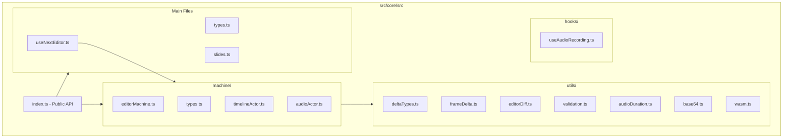
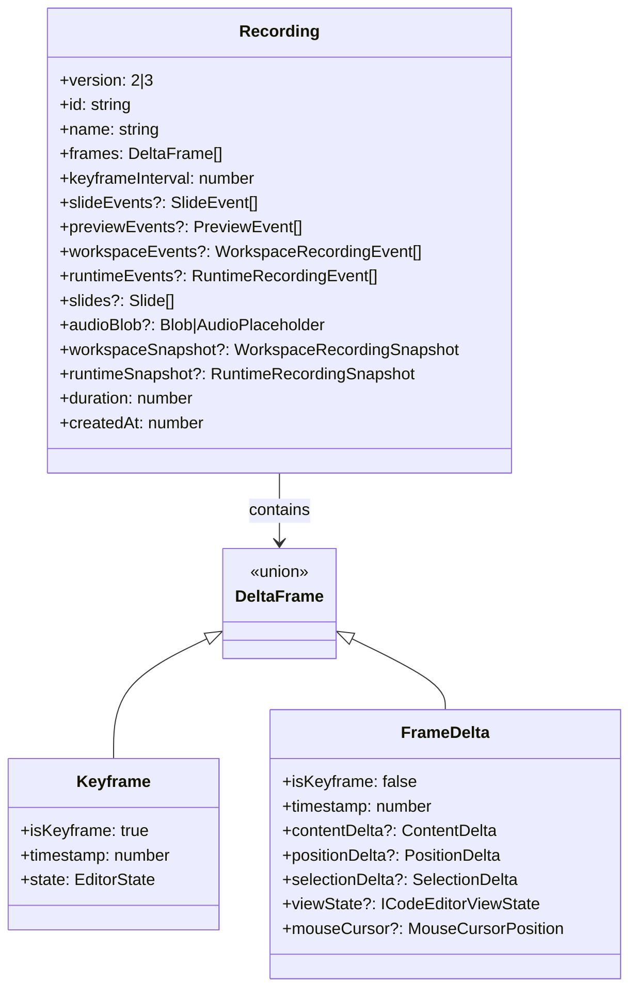
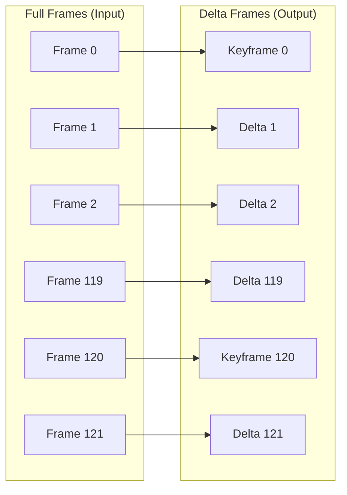
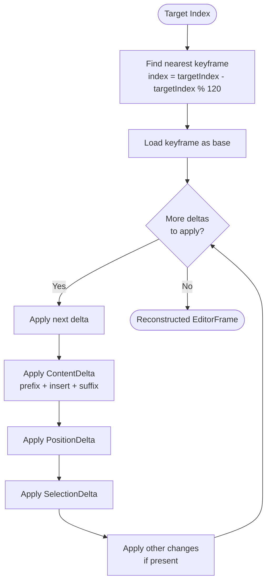
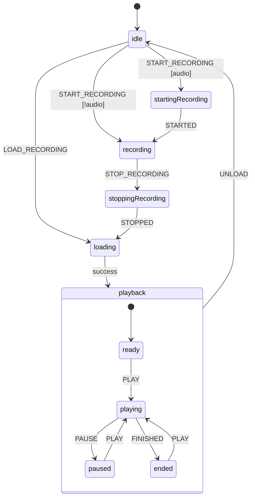

# Core Module Documentation

The `src/core` module is the heart of Next Editor, providing recording, playback, and state management functionality as an independent, reusable library.

---

## Module Structure



---

## Public API Exports

```typescript
// Main Hook
export { useNextEditor } from './useNextEditor';

// Types
export type { Recording, EditorFrame, EditorState, MouseCursorPosition, AudioPlaceholder, EditorSelection, EditorPosition };
export type { Slide, SlideEvent, SlidePreviewState, PreviewState, PreviewEvent };
export type { EditorMachineStatus, EditorMachineContext, EditorMachineEvent };
export type { UseNextEditorConfig };

// Advanced
export { editorMachine } from './machine/editorMachine';
export { useAudioRecording } from './hooks/useAudioRecording';
export { initWasm } from './utils/wasm';
```

**Note:** Component exports (CodeEditor, MediaControls, Preview, etc.) are provided by the application layer, not the core module.

---

## Data Structures

### Recording Format (v2 & v3)



**Version Notes:**
- **v2**: Single-file editor recording with slides/preview/audio support
- **v3**: Multi-file workspace recording with workspace/runtime snapshots for full environment capture
- v2 recordings remain supported on import for backward compatibility

### Delta Compression



**Keyframe Interval:** Every 120 frames (~2 seconds at 60fps)

### ContentDelta Structure

Efficient text diff storage:

```typescript
interface ContentDelta {
  prefixLen: number;  // Bytes to keep from start
  suffixLen: number;  // Bytes to keep from end
  insert: string;     // New content in middle
}
```

**Example:**
```
Previous: "Hello World"
Next:     "Hello TypeScript World"

ContentDelta = {
  prefixLen: 6,      // "Hello "
  suffixLen: 5,      // "World"
  insert: "TypeScript "
}
```

---

## Core Flows

### Frame Compression Flow

```mermaid
flowchart TB
    Start([Full Frames Array]) --> Check{Index % 120 === 0?}
    Check -->|Yes| CreateKeyframe[Create Keyframe<br/>Full state copy]
    Check -->|No| CreateDelta[Create FrameDelta]
    
    CreateDelta --> ContentDiff[Compute ContentDelta<br/>prefix/suffix/insert]
    ContentDiff --> PosDiff[Compute PositionDelta<br/>line/column deltas]
    PosDiff --> SelDiff[Compute SelectionDelta]
    SelDiff --> OtherChanges[Include changed:<br/>viewState, mouseCursor,<br/>slideState, previewState]
    
    CreateKeyframe --> Output
    OtherChanges --> Output([DeltaFrame[] Output])
```

### Frame Reconstruction Flow



### Frame Search Algorithm

Binary search with linear hint optimization:

```typescript
function findFrameIndexAtTime(
  frames: Array<{ timestamp: number }>,
  time: number,
  startIndex: number = 0
): number {
  // Try linear search from hint first (fast for sequential access)
  if (startIndex >= 0 && startIndex < frames.length) {
    if (frames[startIndex].timestamp <= time) {
      // Search forward
      for (let i = startIndex; i < frames.length - 1; i++) {
        if (frames[i + 1].timestamp > time) return i;
      }
      return frames.length - 1;
    }
  }
  
  // Fall back to binary search
  let low = 0, high = frames.length - 1;
  while (low < high) {
    const mid = Math.floor((low + high + 1) / 2);
    if (frames[mid].timestamp <= time) low = mid;
    else high = mid - 1;
  }
  return low;
}
```

---

## State Machine Architecture

### Machine States



### Child Actors

| Actor | Purpose | Events |
|-------|---------|--------|
| `timelineActor` | Playback timing via RAF | TICK, FINISHED |
| `audioRecordingActor` | MediaRecorder management | STARTED, STOPPED |
| `audioPlaybackActor` | HTMLAudioElement sync | PLAY, PAUSE, SEEK |
| `mouseTrackingActor` | Cursor position capture | CAPTURE_FRAME |

---

## Utility Functions

### frameDelta.ts

| Function | Purpose |
|----------|---------|
| `compressFrames(frames)` | Convert full frames to delta frames |
| `reconstructFrameAtIndex(frames, index)` | Rebuild full frame from deltas |
| `createContentDelta(prev, next)` | Compute text diff |
| `applyContentDelta(base, delta)` | Apply text diff |
| `findFrameIndexAtTime(frames, time)` | Binary search with hint |

### editorDiff.ts

| Function | Purpose |
|----------|---------|
| `applyContentDiff(editor, content)` | Update Monaco content |
| `applyPositionDiff(editor, position)` | Set cursor position |
| `applySelectionDiff(editor, selection)` | Set text selection |

### validation.ts

| Function | Purpose |
|----------|---------|
| `isValidFrameState(state)` | Validate frame structure |
| `isEditorReady(editor)` | Check Monaco availability |

### wasm.ts

WebAssembly acceleration for string operations:

```typescript
// Initialize WASM module
await initWasm();

// Accelerated string comparison
const prefixLen = wasmModule.find_common_prefix(bytes1, bytes2);
const suffixLen = wasmModule.find_common_suffix(bytes1, bytes2);

// Accelerated base64 encoding
const encoded = wasmModule.base64_encode(bytes);
const decoded = wasmModule.base64_decode(encoded);
```

---

## Integration Example

```typescript
import { 
  useNextEditor, 
  NextEditorProvider,
  type Recording 
} from '@/core/src';

// In your component
const {
  startRecording,
  stopRecording,
  play,
  pause,
  seekTo,
  isRecording,
  isPlaying,
  currentTime,
  currentRecording
} = useNextEditor({
  editorRef,
  enableAudioRecording: true,
  pauseOnUserInteraction: true,
  onRecordingStop: (recording) => {
    saveRecording(recording);
  }
});
```
