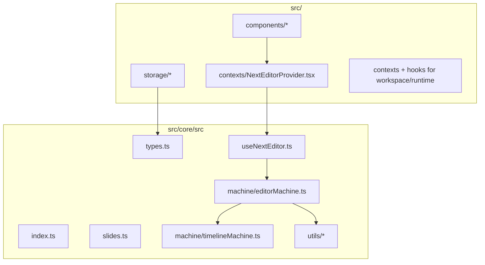
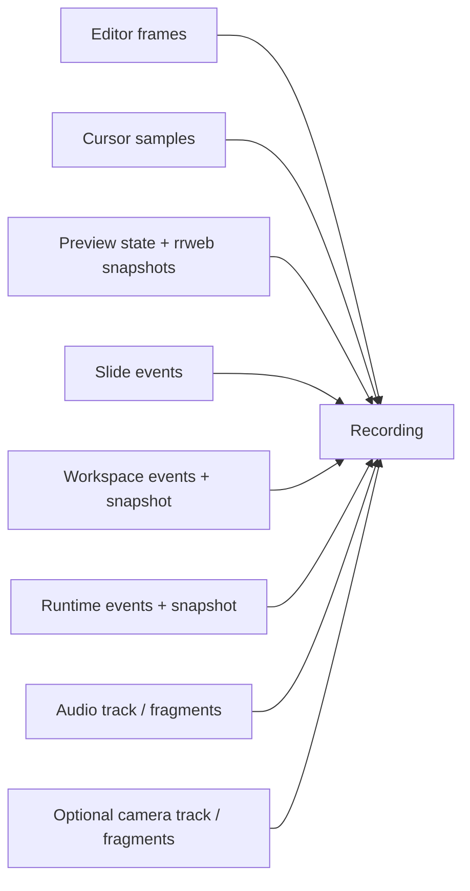
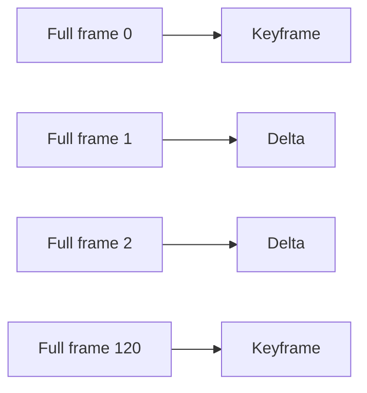

# Core Module Documentation

The core module in `src/core/src` owns the recording timeline, playback state machines, editor integration, and the public API that the app-level React layer builds on top of.

## What The Core Owns



Core responsibilities:

- Maintain the editor machine and playback timeline.
- Capture editor frames, cursor samples, preview events (including API client requests/responses), rrweb preview snapshots, workspace events, and runtime events.
- Normalize recordings into the `Recording` shape used across the app.
- Expose stable controls such as `startRecording`, `play`, `seekTo`, `loadRecording`, `extendRecording`, and caption-track management (`addCaptionTrack` / `removeCaptionTrack`).

The app layer is responsible for React composition, WebContainer integration, IndexedDB persistence, import/export UI, and route-level behavior.

## Public API Surface

The main public entrypoint is `src/core/src/index.ts`.

Key exports:

- `useNextEditor`
- `NextEditorProvider`
- `useNextEditorActions`
- `useNextEditorMetadata`
- `useNextEditorPlayback`
- `editorMachine`
- `timelineMachine`
- `initWasm`
- `Recording`, `EditorFrame`, `EditorState`
- `RecordingStreamSink`, `UseNextEditorConfig`, `UseNextEditorReturn`
- Slide and preview types such as `SlideEvent`, `PreviewEvent`, `PreviewInitialDocument`, `PreviewDomPatchBatch`, and `PreviewRecordedEvent`
- Caption types such as `CaptionTrack`, `CaptionCue`, and `CaptionWord`

The core module also re-exports app-level components such as `CodeEditor`, `MediaControls`, `Preview`, and `SlidePanel`, but the recording and playback logic lives underneath those components in the machine and hook layer.

## Recording Model

Next Editor records a timeline, not just source text.



Important current details:

- Frames are delta-compressed during capture, not as a final batch-only step.
- The current app emits version `3` recordings and stores them in the SCR3 stream container.
- The public `Recording` facade now carries stream-oriented metadata through `tracks`, `clusters`, and `mediaFragments` in addition to the assembled playback blobs.
- `previewInitialDocuments` and `previewPatchBatches` are first-class parts of the recording. They carry rrweb events verbatim (`PreviewRecordedEvent`): the seed document holds the rrweb Meta + FullSnapshot pair, and each patch batch holds the incremental events for a frame. Replay drives an rrweb `Replayer`, so the preview is restored without requiring a runtime rerun.
- `cursorEvents` are stored separately from frame deltas for smoother fake-cursor playback.
- `audioStartOffsetMs` and `cameraStartOffsetMs` align media tracks to the editor timeline.
- `cameraStartOffsetMs` aligns instructor camera playback with the recording timeline.

## Delta Encoding

Frames are stored as keyframes plus deltas.



- Keyframes are emitted at most every 120 frames.
- Intermediate frames store only changed content and state.
- Playback reconstructs a target frame by starting from the nearest prior keyframe and replaying forward.

This keeps exports compact while allowing deterministic restore of editor state at any point on the timeline.

## Playback Model

The playback side is intentionally append-friendly.

- `loadRecording(recording)` sets up an initial timeline.
- `extendRecording(recording)` swaps in a longer append-only prefix of the same SCR3 recording without resetting playback position.
- The machine keeps replay cursors such as `lastAppliedFrameIndex` and `lastAppliedPreviewPatchBatchIndex` so it can continue forward efficiently.
- Progressive audio uses the same `HTMLAudioElement` surface in blob or stream mode; when later prefixes extend the audio track, the actor reattaches the growing blob snapshot and stays synchronized to the editor timeline.
- Progressive camera playback stays in the React `CameraOverlay` boundary: `extendRecording` replaces `cameraBlob` with a larger reassembled snapshot, and the overlay reattaches that blob while continuing to derive video time from the timeline.

That design is what makes partial-download playback and live stream replay possible.

## Extension Points

The main extension hooks in `UseNextEditorConfig` are:

- `recordingStreamSink` to forward a live SCR3 byte stream.
- Snapshot getters and appliers for slides, preview, workspace, and runtime state.
- `applyPreviewPatchReplay` to feed recorded rrweb preview events into the current preview surface's `Replayer`.
- Lifecycle callbacks such as `onRecordingStop`, `onPlaybackStart`, and `onError`.

## Related Docs

- `docs/data-flow.md` explains how the app moves data through capture, storage, and playback.
- `docs/data-structures.md` documents the concrete recording types.
- `docs/state-machines.md` covers the XState topology.
  if (frames[mid].timestamp <= time) low = mid;
  else high = mid - 1;
  }
  return low;
  }

````

---

## State Machine Architecture

### Machine States

```mermaid
stateDiagram-v2
    [*] --> idle
    idle --> startingRecording : START_RECORDING [audio]
    idle --> recording : START_RECORDING [!audio]
    idle --> loading : LOAD_RECORDING

    startingRecording --> recording : STARTED
    recording --> stoppingRecording : STOP_RECORDING [audio || camera]
    stoppingRecording --> loading : STOPPED

    loading --> playback : success

    state playback {
        [*] --> ready
        ready --> playing : PLAY
        playing --> paused : PAUSE
        playing --> ended : FINISHED
        paused --> playing : PLAY
        ended --> playing : PLAY
    }

    playback --> idle : UNLOAD
````

### Child Actors

| Actor                  | Purpose                        | Events                         |
| ---------------------- | ------------------------------ | ------------------------------ |
| `timelineActor`        | Playback timing via RAF        | TICK, FINISHED                 |
| `audioRecordingActor`  | MediaRecorder management       | STARTED, STOPPED               |
| `cameraRecordingActor` | Video MediaRecorder management | CAMERA_STARTED, CAMERA_STOPPED |
| `audioPlaybackActor`   | HTMLAudioElement sync          | PLAY, PAUSE, SEEK              |
| `mouseTrackingActor`   | Cursor position capture        | CAPTURE_FRAME                  |

---

## Utility Functions

### frameDelta.ts

| Function                                 | Purpose                             |
| ---------------------------------------- | ----------------------------------- |
| `compressFrames(frames)`                 | Convert full frames to delta frames |
| `reconstructFrameAtIndex(frames, index)` | Rebuild full frame from deltas      |
| `createContentDelta(prev, next)`         | Compute text diff                   |
| `applyContentDelta(base, delta)`         | Apply text diff                     |
| `findFrameIndexAtTime(frames, time)`     | Binary search with hint             |

### editorDiff.ts

| Function                                | Purpose               |
| --------------------------------------- | --------------------- |
| `applyContentDiff(editor, content)`     | Update Monaco content |
| `applyPositionDiff(editor, position)`   | Set cursor position   |
| `applySelectionDiff(editor, selection)` | Set text selection    |

### validation.ts

| Function                   | Purpose                   |
| -------------------------- | ------------------------- |
| `isValidFrameState(state)` | Validate frame structure  |
| `isEditorReady(editor)`    | Check Monaco availability |

### wasm.ts

WebAssembly acceleration for string operations:

```typescript
// Initialize WASM module
await initWasm();

// Accelerated string comparison
const prefixLen = wasmModule.find_common_prefix(bytes1, bytes2);
const suffixLen = wasmModule.find_common_suffix(bytes1, bytes2);

// Accelerated base64 encoding
const encoded = wasmModule.base64_encode(bytes);
const decoded = wasmModule.base64_decode(encoded);
```

---

## Integration Example

```typescript
import { useNextEditor, NextEditorProvider, type Recording } from "@/core/src";

// In your component
const {
  startRecording,
  stopRecording,
  play,
  pause,
  seekTo,
  isRecording,
  isPlaying,
  currentTime,
  currentRecording,
} = useNextEditor({
  editorRef,
  enableAudioRecording: true,
  pauseOnUserInteraction: true,
  onRecordingStop: (recording) => {
    saveRecording(recording);
  },
});
```
