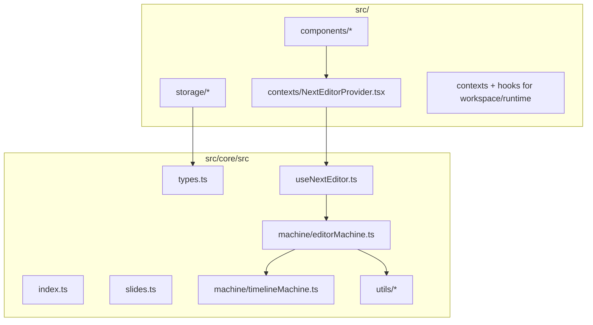
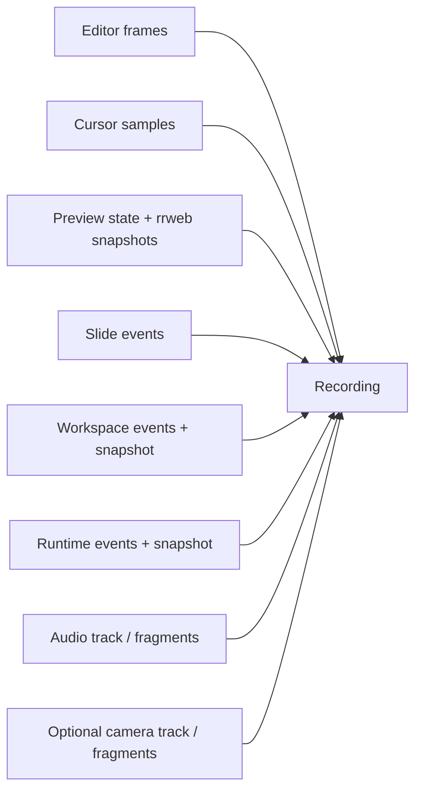
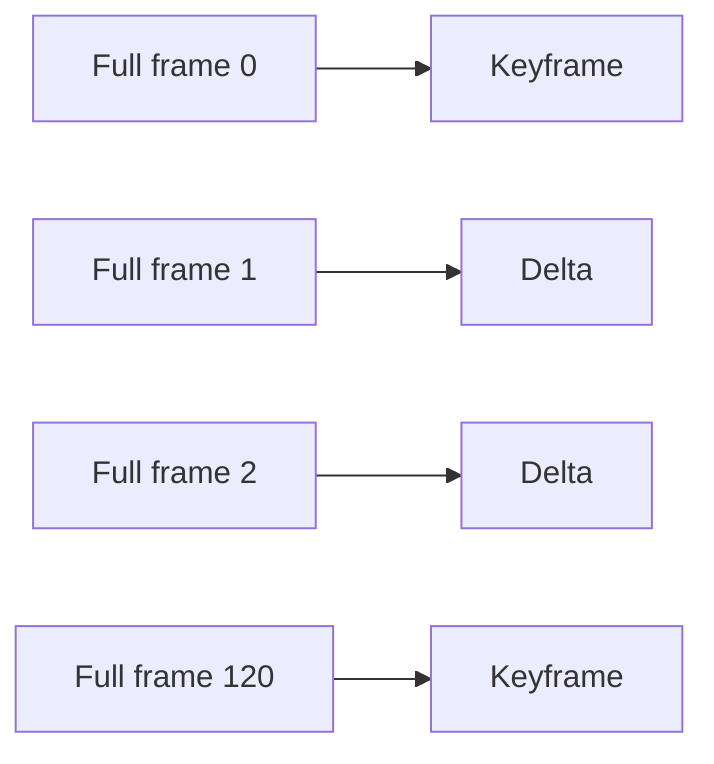

# Core Module Documentation

The core module in `src/core/src` owns the recording timeline, playback state machines, editor integration, and the public API that the app-level React layer builds on top of.

## What The Core Owns


```mermaid
flowchart TB
  subgraph Core["src/core/src"]
    Index[index.ts]
    Types[types.ts]
    Slides[slides.ts]
    Hook[useNextEditor.ts]
    Machine[machine/editorMachine.ts]
    Timeline[machine/timelineMachine.ts]
    Utils[utils/*]
  end

  subgraph App["src/"]
    Provider[contexts/NextEditorProvider.tsx]
    Components[components/*]
    Storage[storage/*]
    Runtime[contexts + hooks for workspace/runtime]
  end

  Components --> Provider
  Provider --> Hook
  Hook --> Machine
  Machine --> Timeline
  Machine --> Utils
  Storage --> Types
```

Core responsibilities:

- Maintain the editor machine and playback timeline.
- Capture editor frames, cursor samples, preview events (including API client requests/responses), rrweb preview snapshots, workspace events, and runtime events.
- Normalize recordings into the `Recording` shape used across the app.
- Expose stable controls such as `startRecording`, `play`, `seekTo`, `loadRecording`, `extendRecording`, and caption-track management (`addCaptionTrack` / `removeCaptionTrack`).

The app layer is responsible for React composition, WebContainer integration, IndexedDB persistence, import/export UI, and route-level behavior.

## Public API Surface

The main public entrypoint is `src/core/src/index.ts`.

Key exports:

- `useNextEditor`
- `NextEditorProvider`
- `useNextEditorActions`, `useNextEditorMetadata`, `useNextEditorPlayback`
- `editorMachine`, `timelineMachine`, `EditorActorRef`, `TimelineActorRef`
- `EditorMachineStatus`, `EditorMachineContext`, `EditorMachineEvent`
- `Recording`, `EditorFrame`, `EditorState`
- `RecordingStreamSink`, `UseNextEditorConfig`, `UseNextEditorReturn`
- Slide and preview types such as `SlideEvent`, `PreviewEvent`, `PreviewState`, `PreviewInitialDocument`, `PreviewDomPatchBatch`, and `PreviewRecordedEvent`
- Caption types such as `CaptionTrack`, `CaptionCue`, and `CaptionWord`
- Track/cluster metadata types: `RecordingTrackKind`, `RecordingTrackMeta`, `RecordingClusterMeta`, `RecordingMediaFragment`

The core module also re-exports app-level components such as `CodeEditor`, `MediaControls`, `Preview`, `CursorComponent`, and `SlidePanel`, but the recording and playback logic lives underneath those components in the machine and hook layer.

## Recording Model

Next Editor records a timeline, not just source text.


```mermaid
flowchart LR
  Editor[Editor frames] --> Recording
  Cursor[Cursor samples] --> Recording
  Preview[Preview state + rrweb snapshots] --> Recording
  Slides[Slide events] --> Recording
  Workspace[Workspace events + snapshot] --> Recording
  Runtime[Runtime events + snapshot] --> Recording
  Audio[Audio track / fragments] --> Recording
  Camera[Optional camera track / fragments] --> Recording
```

Important current details:

- Frames are delta-compressed during capture, not as a final batch-only step — the recording session keeps an incremental `FrameStreamEncoderState` (`src/core/src/utils/frameStreamEncoder.ts`) rather than compressing after the fact.
- The current app emits schema version `4` recordings in SCR3 format v4. Ordinary local Monaco changes carry exact edit batches with base/result integrity checks. Append-only agent snapshots emit a checked equal/insert delta containing only the suffix without running Myers; provider rewrites, bulk/imported/remote editor changes, and preview changes retain the verified DMP fallback. Raw workspace assets use dedicated v4 segments, while SCR3 formats v2 and v3 remain readable.
- The public `Recording` facade carries stream-oriented metadata through `tracks`, `clusters`, and `mediaFragments` in addition to the assembled playback blobs.
- `previewInitialDocuments` and `previewPatchBatches` are first-class parts of the recording. They carry rrweb events verbatim (`PreviewRecordedEvent`): the seed document holds the rrweb Meta + FullSnapshot pair, and each patch batch holds the incremental events for a frame. Replay drives an rrweb `Replayer`, so the preview is restored without requiring a runtime rerun.
- `cursorEvents` are stored separately from frame deltas for smoother fake-cursor playback.
- `audioStartOffsetMs` and `cameraStartOffsetMs` align media tracks to the editor timeline.
- Camera bytes never live inside the SCR3 stream itself — only a reference (`cameraFile`/`cameraUrl`) plus `cameraStartOffsetMs`; see `docs/data-structures.md` for the full storage story.

## Delta Encoding

Frames are stored as keyframes plus deltas.


```mermaid
flowchart LR
  F0[Full frame 0] --> K0[Keyframe]
  F1[Full frame 1] --> D1[Delta]
  F2[Full frame 2] --> D2[Delta]
  F120[Full frame 120] --> K120[Keyframe]
```

- Keyframes are emitted at most every 120 frames.
- Intermediate frames store only changed content and state.
- Playback reconstructs a target frame by starting from the nearest prior keyframe and replaying forward (`reconstructFrameAtIndex` in `src/core/src/utils/frameDelta.ts`).

This keeps exports compact while allowing deterministic restore of editor state at any point on the timeline.

## Playback Model

The playback side is intentionally append-friendly.

- `loadRecording(recording)` sets up an initial timeline.
- `extendRecording(recording)` swaps in a longer append-only prefix of the same SCR3 recording without resetting playback position.
- The machine keeps per-stream replay cursors — `lastAppliedFrameIndex`, `lastAppliedPreviewEventIndex`, `lastAppliedPreviewPatchBatchIndex`, `lastAppliedSlideEventIndex`, `lastAppliedWorkspaceEventIndex`, `lastAppliedRuntimeEventIndex` — so it can continue forward efficiently.
- Progressive audio uses the same `HTMLAudioElement` surface in blob or stream mode; when later prefixes extend the audio track, the actor reattaches the growing blob snapshot and stays synchronized to the editor timeline.
- Progressive camera playback stays in the React `CameraOverlay` boundary: `extendRecording` replaces `cameraBlob` with a larger reassembled snapshot, and the overlay reattaches that blob while continuing to derive video time from the timeline.

That design is what makes partial-download playback and live stream replay possible; see `docs/streaming-playback.md` for the full mechanics.

## Extension Points

The main extension hooks in `UseNextEditorConfig` are:

- `recordingStreamSink` to forward a live SCR3 byte stream.
- Snapshot getters and appliers for slides, preview, workspace, and runtime state.
- `applyPreviewPatchReplay` to feed recorded rrweb preview events into the current preview surface's `Replayer`.
- Lifecycle callbacks such as `onRecordingStop`, `onPlaybackStart`, and `onError`.
- Granular callbacks such as `onFrame`, `onStateChange`, and `onPlaybackUpdate`.

## Utility Modules (`src/core/src/utils`)

| File                                   | Purpose                                                                                                        |
| -------------------------------------- | -------------------------------------------------------------------------------------------------------------- |
| `frameDelta.ts`                        | `compressFrames`, `reconstructFrameAtIndex`, `createContentDelta`, `applyContentDelta`, `findFrameIndexAtTime` |
| `editorDiff.ts`                        | `applyContentDiff`, `applyPositionDiff`, `applySelectionDiff` — apply a diff to a live Monaco editor           |
| `validation.ts`                        | `isValidFrameState`, `isValidEditorState`, `isEditorReady`                                                     |
| `deltaTypes.ts`                        | `DeltaFrame` and related delta wire types                                                                      |
| `frameStreamEncoder.ts`                | Incremental keyframe/delta encoder state used during live capture                                              |
| `editorState.ts`                       | Reads/builds `EditorState` snapshots from a Monaco editor instance                                             |
| `cursorCoordinates.ts`                 | Maps recorded cursor samples onto the current UI layout (viewport/root coordinate spaces)                      |
| `cursorReplay.ts`                      | Fake-cursor tween/replay logic driven by `cursorEvents`                                                        |
| `audioContext.ts` / `audioDuration.ts` | Shared `AudioContext` helpers and exact-duration calculation for audio blobs                                   |
| `stringAffix.ts`                       | Small string prefix/suffix helpers used by content diffing                                                     |

### dmpCodec (WASM diffing)

WebAssembly-accelerated content diffing backs `createContentDelta` / `applyContentDelta` in `frameDelta.ts` (see `src/core/dmp/README.md` for the Rust module and wire format):

```typescript
// Load the zero-import diff-match-patch WASM module
await loadDmpCodec();

// Compute/apply a delta via the loaded codec
const codec = getDmpCodec();
const delta = codec.diffDelta(bytesA, bytesB);
const rebuilt = codec.applyDelta(bytesA, delta);
```

## Integration Example

```typescript
import { useNextEditor, NextEditorProvider, type Recording } from "@/core/src";

// In your component
const {
  startRecording,
  stopRecording,
  play,
  pause,
  seekTo,
  isRecording,
  isPlaying,
  currentTime,
  currentRecording,
} = useNextEditor({
  editorRef,
  enableAudioRecording: true,
  pauseOnUserInteraction: true,
  onRecordingStop: (recording) => {
    saveRecording(recording);
  },
});
```

## Related Docs

- `docs/data-flow.md` explains how the app moves data through capture, storage, and playback.
- `docs/data-structures.md` documents the concrete recording types.
- `docs/state-machines.md` covers the XState topology.
- `docs/streaming-playback.md` covers progressive/streamed playback in detail.
