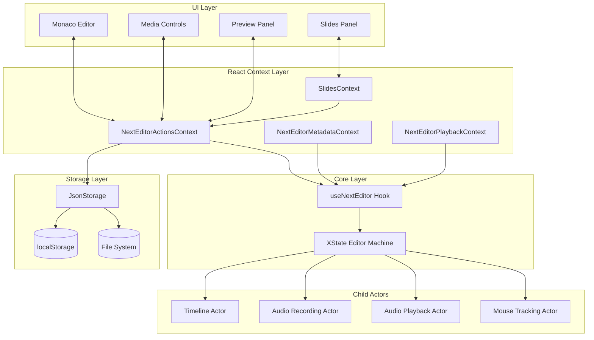
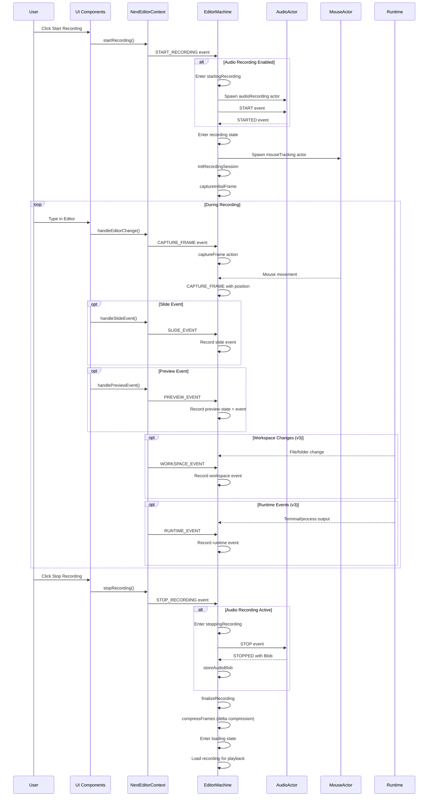
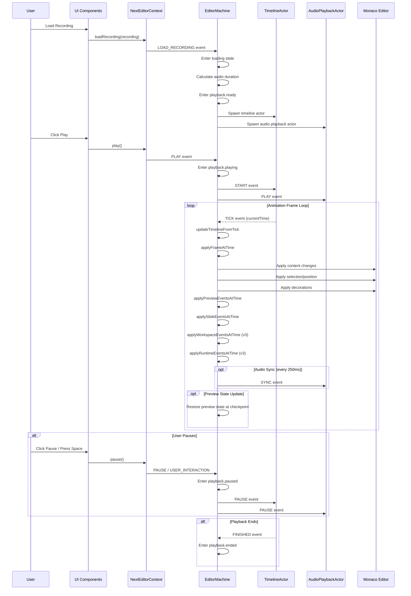
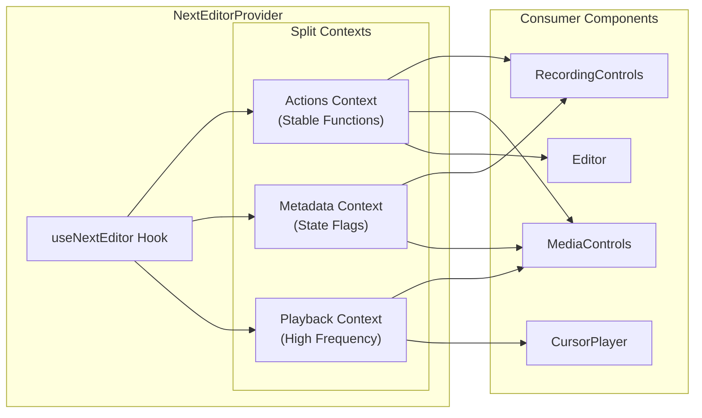
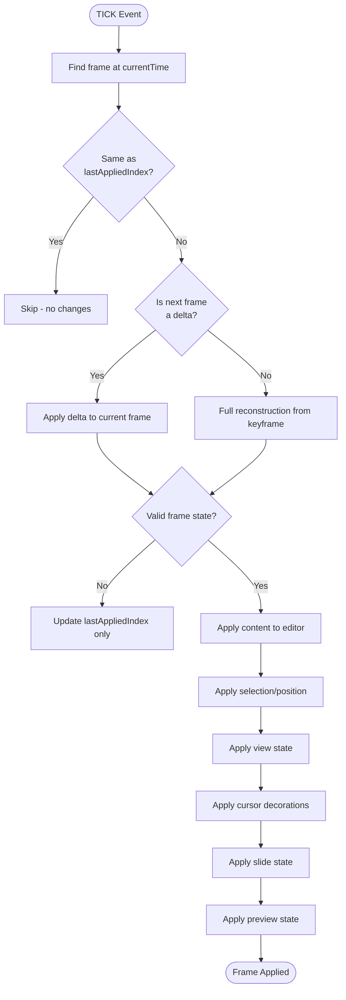

# Data Flow Documentation

This document describes the data flow patterns in the Next Editor application.

---

## High-Level Architecture



---

## Recording Flow



---

## Playback Flow



---

## Storage Flow

```mermaid
flowchart TB
    subgraph Export["Export Flow"]
        R1[Recording] --> E1[Extract Audio Data]
        E1 --> E2[Replace with Placeholders]
        E2 --> E3[SuperJSON Serialize]
        E3 --> E4[Pako Compress]
        E4 --> E5[Create Binary Header]
        E5 --> E6[Concatenate Audio Data]
        E6 --> E7[Base64 Encode]
        E7 --> E8[Save to File/localStorage]
    end

    subgraph Import["Import Flow"]
        I1[Read File/localStorage] --> I2[Base64 Decode]
        I2 --> I3[Parse Binary Header]
        I3 --> I4[Extract Compressed JSON]
        I4 --> I5[Pako Inflate]
        I5 --> I6[SuperJSON Parse]
        I6 --> I7[Extract Audio Data]
        I7 --> I8[Reconstruct Blobs]
        I8 --> I9[Recording]
    end
```



### Binary File Format

```
┌─────────────────────────────────────────┐
│ Magic Number: "SCRM" (4 bytes)          │
├─────────────────────────────────────────┤
│ Version: 2 (2 bytes, Uint16)            │
├─────────────────────────────────────────┤
│ JSON Length (4 bytes, Uint32)           │
├─────────────────────────────────────────┤
│ Compressed JSON Data                    │
│ (variable length, deflate compressed)   │
├─────────────────────────────────────────┤
│ Audio Data                              │
│ (raw binary, concatenated)              │
└─────────────────────────────────────────┘
```

---

## Context Data Flow



This context splitting pattern prevents unnecessary re-renders:

- **Actions Context**: Stable function references, rarely changes
- **Metadata Context**: Recording state flags, changes on state transitions
- **Playback Context**: Current time and cursor, updates every animation frame

---

## Frame Application Flow


