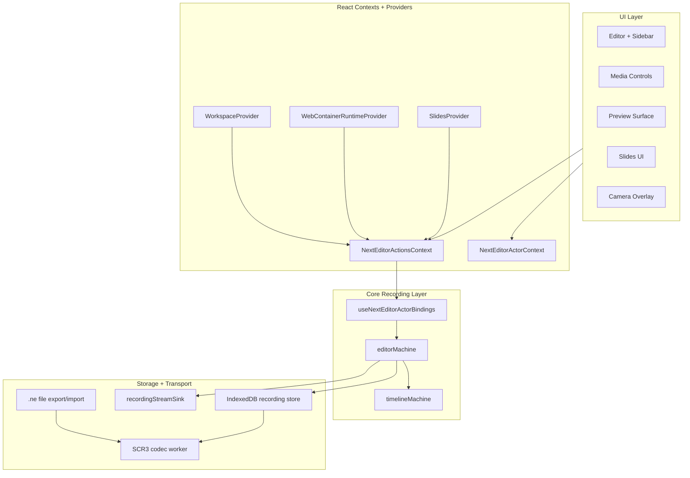
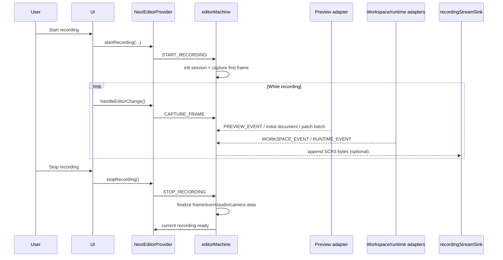
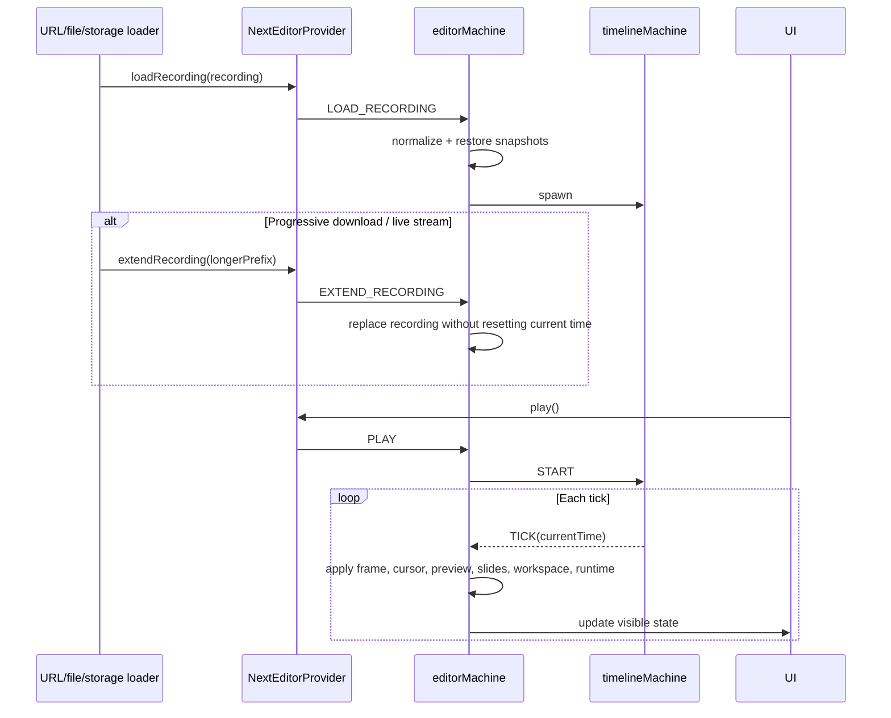
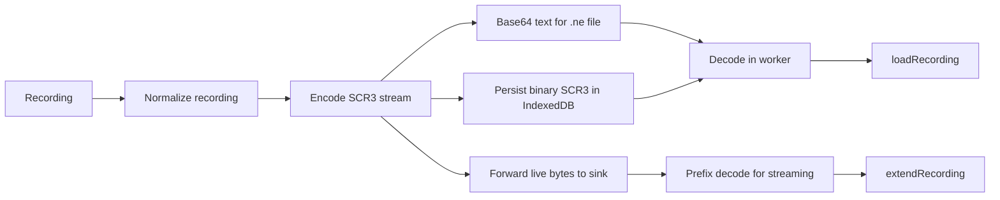

# Data Flow Documentation

This document tracks the current data flow across the UI, core machine, runtime adapters, and SCR3 storage pipeline.

## High-Level Architecture



## Recording Flow



Key points:

- Frames are compressed incrementally during capture.
- Preview replay data is captured with rrweb: a seed document (Meta + FullSnapshot) plus later patch batches of incremental rrweb events.
- API client interactions on a runtime lesson are captured as preview events: switching to API mode, each request, its response (or timeout), request-tab switches, and history inspections all land on the timeline.
- Workspace and runtime snapshots are captured alongside timed events so playback can restore the full lesson context.
- If `recordingStreamSink` is configured, the provider forwards a live SCR3 stream while capture is in progress.

## Playback Flow



Current playback behavior:

- The machine keeps replay cursors for each append-only event stream so `extendRecording` can continue from the current point efficiently.
- Audio playback is lazy when a progressive load first gains usable audio, then stays in sync by updating the same `HTMLAudioElement` with larger contiguous blob snapshots as more fragments arrive.
- Camera playback is rendered by `CameraOverlay`, which derives the correct video time from timeline time minus `cameraStartOffsetMs`.

## Storage Flow



Current storage rules:

- The app stores and exports SCR3 recordings.
- IndexedDB persists metadata plus append-only recording segments.
- Exported `.ne` files contain base64-wrapped SCR3 bytes for portability, and the runtime loader also accepts raw SCR3 byte streams.
- Worker-backed decode keeps msgpack and deflate work off the main thread.

## URL Loading Flow

The shipped URL loader supports both same-origin and cross-origin recording URLs.

- Same-origin files are fetched directly.
- Cross-origin URLs try `/api/proxy?url=...` first and fall back to direct fetch if the proxy is missing.
- When the response body is streamable, the loader sniffs raw SCR3 bytes vs base64 text, decodes progressively, and uses `extendRecording` for later prefixes.
- After the recording loads, the loader resolves any `captionFiles` the recording declares relative to the `.ne` URL, fetches and parses each one, and adds it via `addCaptionTrack`. Captions are never inferred from sibling filenames — HTTP exposes no directory listing.

## API Client Transport

The API client does not call the runtime server over the network from the host page.
Instead `useApiClient` posts the composed request into the preview iframe through a
same-origin message bridge (`src/utils/apiClientBridge.ts`): a tiny proxy script injected
into the preview `fetch`es the path inside the iframe and posts the response back to the
parent. Because the request runs in the iframe's origin there is no CORS, and the host only
ever sees a serialized request/response pair — which is exactly what gets recorded and
replayed.

## Where To Look Next

- `docs/data-structures.md` for concrete type shapes.
- `docs/state-machines.md` for the event/state topology.
- `docs/streaming-playback.md` for the partial-download behavior in detail.
  ┌─────────────────────────────────────────┐
  │ Magic Number: "SCR3" (4 bytes) │
  ├─────────────────────────────────────────┤
  │ Format version + flags │
  ├─────────────────────────────────────────┤
  │ Deflated msgpack metadata │
  ├─────────────────────────────────────────┤
  │ Frame and event segments │
  ├─────────────────────────────────────────┤
  │ Audio chunk segment (optional) │
  ├─────────────────────────────────────────┤
  │ Camera chunk segment (optional, last) │
  ├─────────────────────────────────────────┤
  │ Footer segment index │
  └─────────────────────────────────────────┘

````

---

## Context Data Flow

```mermaid
flowchart LR
    subgraph Provider["NextEditorProvider"]
        direction TB
        Hook[useNextEditor Hook]

        subgraph Contexts["Split Contexts"]
            Actions["Actions Context<br/>(Stable Functions)"]
            Metadata["Metadata Context<br/>(State Flags)"]
            Playback["Playback Context<br/>(High Frequency)"]
        end

        Hook --> Actions
        Hook --> Metadata
        Hook --> Playback
    end

    subgraph Consumers["Consumer Components"]
        RC[RecordingControls]
        MC[MediaControls]
        CP[CursorPlayer]
        ED[Editor]
    end

    Actions --> RC
    Actions --> MC
    Actions --> ED
    Metadata --> RC
    Metadata --> MC
    Playback --> MC
    Playback --> CP
````

This context splitting pattern prevents unnecessary re-renders:

- **Actions Context**: Stable function references, rarely changes
- **Metadata Context**: Recording state flags, changes on state transitions
- **Playback Context**: Current time and cursor, updates every animation frame

---

## Frame Application Flow

```mermaid
flowchart TB
    Start([TICK Event]) --> FindIndex[Find frame at currentTime]
    FindIndex --> CheckIndex{Same as<br/>lastAppliedIndex?}

    CheckIndex -->|Yes| Skip[Skip - no changes]
    CheckIndex -->|No| CheckDelta{Is next frame<br/>a delta?}

    CheckDelta -->|Yes| ApplyDelta[Apply delta to current frame]
    CheckDelta -->|No| Reconstruct[Full reconstruction from keyframe]

    ApplyDelta --> Validate{Valid frame state?}
    Reconstruct --> Validate

    Validate -->|No| UpdateIndex[Update lastAppliedIndex only]
    Validate -->|Yes| ApplyContent[Apply content to editor]

    ApplyContent --> ApplySelection[Apply selection/position]
    ApplySelection --> ApplyView[Apply view state]
    ApplyView --> ApplyDecorations[Apply cursor decorations]
    ApplyDecorations --> ApplySlides[Apply slide state]
    ApplySlides --> ApplyPreview[Apply preview state]
    ApplyPreview --> Done([Frame Applied])
```
