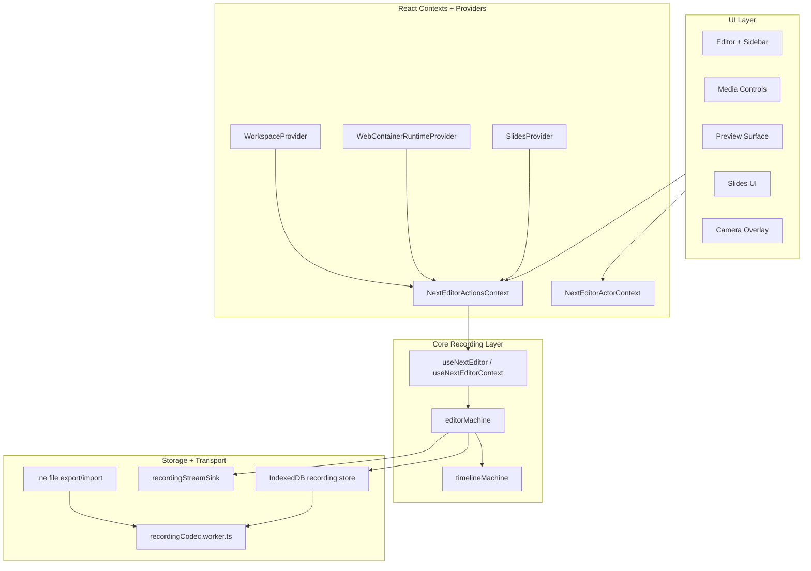
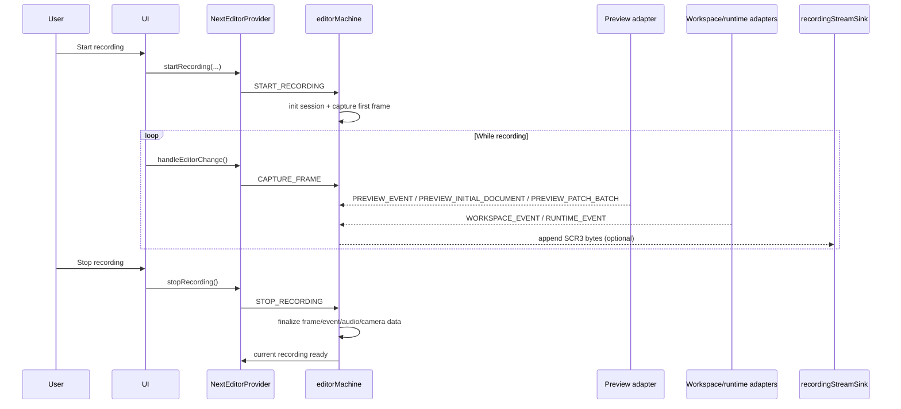
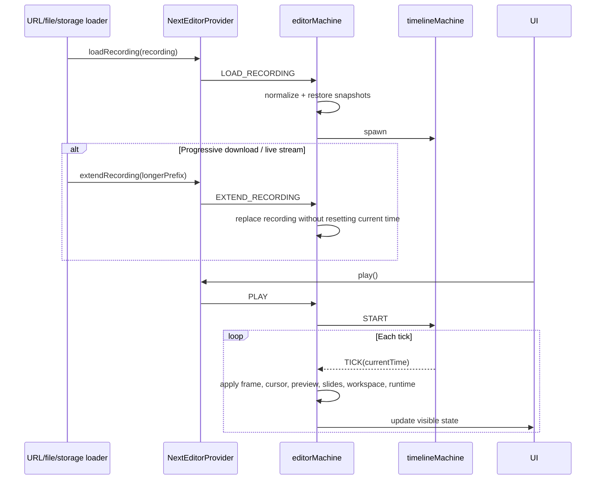
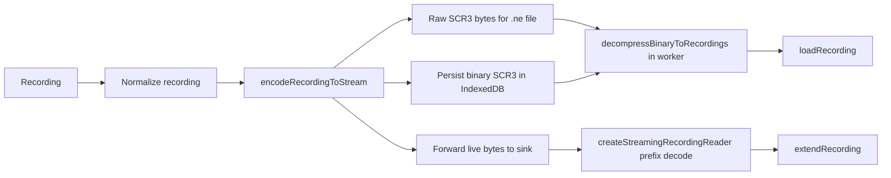
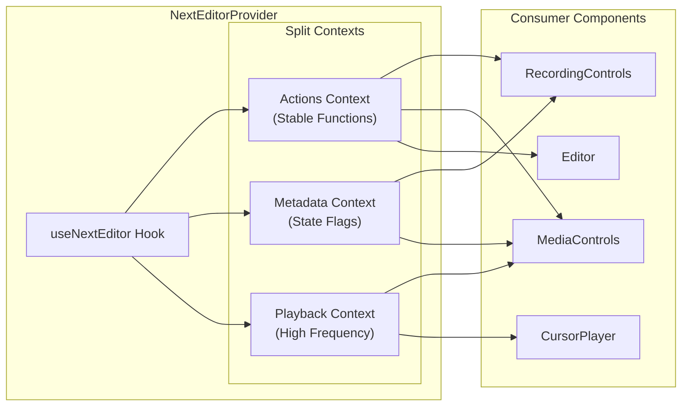
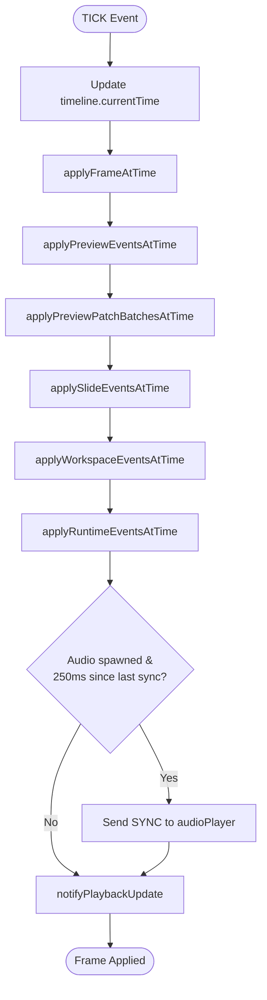

# Data Flow Documentation

This document tracks the current data flow across the UI, core machine, runtime adapters, and SCR3 storage pipeline.

## High-Level Architecture

```mermaid
flowchart TB
    subgraph UI["UI Layer"]
        Editor[Editor + Sidebar]
        Controls[Media Controls]
        Preview[Preview Surface]
        Slides[Slides UI]
        Camera[Camera Overlay]
    end

    subgraph Contexts["React Contexts + Providers"]
        Actions[NextEditorActionsContext]
        Actor[NextEditorActorContext]
        Workspace[WorkspaceProvider]
        Runtime[WebContainerRuntimeProvider]
        SlidesCtx[SlidesProvider]
    end

    subgraph Core["Core Recording Layer"]
        Hook[useNextEditor / useNextEditorContext]
        Machine[editorMachine]
        Timeline[timelineMachine]
    end

    subgraph Persistence["Storage + Transport"]
        IndexedDB[IndexedDB recording store]
        Codec[recordingCodec.worker.ts]
        Stream[recordingStreamSink]
        Export[.ne file export/import]
    end

    UI --> Actions
    UI --> Actor
    Workspace --> Actions
    Runtime --> Actions
    SlidesCtx --> Actions
    Actions --> Hook
    Hook --> Machine
    Machine --> Timeline
    Machine --> IndexedDB
    Machine --> Stream
    Export --> Codec
    IndexedDB --> Codec
```

## Recording Flow

```mermaid
sequenceDiagram
    participant User
    participant UI
    participant Provider as NextEditorProvider
    participant Machine as editorMachine
    participant Preview as Preview adapter
    participant Runtime as Workspace/runtime adapters
    participant Sink as recordingStreamSink

    User->>UI: Start recording
    UI->>Provider: startRecording(...)
    Provider->>Machine: START_RECORDING
    Machine->>Machine: init session + capture first frame

    loop While recording
        UI->>Provider: handleEditorChange()
        Provider->>Machine: CAPTURE_FRAME
        Preview-->>Machine: PREVIEW_EVENT / PREVIEW_INITIAL_DOCUMENT / PREVIEW_PATCH_BATCH
        Runtime-->>Machine: WORKSPACE_EVENT / RUNTIME_EVENT
        Machine-->>Sink: append SCR3 bytes (optional)
    end

    User->>UI: Stop recording
    UI->>Provider: stopRecording()
    Provider->>Machine: STOP_RECORDING
    Machine->>Machine: finalize frame/event/audio/camera data
    Machine->>Provider: current recording ready
```

Key points:

- Frames are compressed incrementally during capture via an in-session `FrameStreamEncoderState`, not as a final batch pass.
- Preview replay data is captured with rrweb: a seed document (Meta + FullSnapshot) plus later patch batches of incremental rrweb events.
- API client interactions on a runtime lesson are captured as preview events: switching to API mode, each request, its response (or timeout), request-tab switches, and history inspections all land on the timeline.
- Workspace and runtime snapshots are captured alongside timed events so playback can restore the full lesson context.
- If `recordingStreamSink` is configured, the provider forwards a live SCR3 stream while capture is in progress.

## Playback Flow

```mermaid
sequenceDiagram
    participant Loader as URL/file/storage loader
    participant Provider as NextEditorProvider
    participant Machine as editorMachine
    participant Timeline as timelineMachine
    participant UI

    Loader->>Provider: loadRecording(recording)
    Provider->>Machine: LOAD_RECORDING
    Machine->>Machine: normalize + restore snapshots
    Machine->>Timeline: spawn

    alt Progressive download / live stream
        Loader->>Provider: extendRecording(longerPrefix)
        Provider->>Machine: EXTEND_RECORDING
        Machine->>Machine: replace recording without resetting current time
    end

    UI->>Provider: play()
    Provider->>Machine: PLAY
    Machine->>Timeline: START

    loop Each tick
        Timeline-->>Machine: TICK(currentTime)
        Machine->>Machine: apply frame, cursor, preview, slides, workspace, runtime
        Machine->>UI: update visible state
    end
```

Current playback behavior:

- The machine keeps a replay cursor for each append-only event stream (frames, preview events, preview patch batches, slides, workspace, runtime) so `extendRecording` can continue from the current point efficiently.
- Audio playback is lazy when a progressive load first gains usable audio, then stays in sync by updating the same `HTMLAudioElement` with larger contiguous blob snapshots as more fragments arrive; the machine throttles resyncs to roughly every 250ms during a `TICK`.
- Camera playback is rendered by `CameraOverlay`, which derives the correct video time from timeline time minus `cameraStartOffsetMs`.

## Storage Flow

```mermaid
flowchart LR
    Recording --> Normalize[Normalize recording]
    Normalize --> Encode[encodeRecordingToStream]
    Encode --> NeFile[Raw SCR3 bytes for .ne file]
    Encode --> IndexedDB[Persist binary SCR3 in IndexedDB]
    Encode --> Live[Forward live bytes to sink]
    NeFile --> Decode[decompressBinaryToRecordings in worker]
    IndexedDB --> Decode
    Live --> PrefixDecode[createStreamingRecordingReader prefix decode]
    Decode --> Load[loadRecording]
    PrefixDecode --> Extend[extendRecording]
```

Current storage rules:

- The app stores and exports SCR3 recordings.
- IndexedDB persists metadata plus append-only recording segments.
- Exported `.ne` files are raw SCR3 bytes with no base64 wrapping; the runtime loader reads the same raw byte stream.
- `src/storage/recordingCodec.worker.ts` (backing `recordingCodecClient.ts`) keeps msgpack and deflate work off the main thread for whole-file decodes; `src/storage/streamingRecordingCodec/decode.ts` does incremental prefix decoding for progressive/live loads.

## URL Loading Flow

The shipped URL loader supports both same-origin and cross-origin recording URLs.

- Same-origin files are fetched directly.
- Cross-origin URLs try `/api/proxy?url=...` first and fall back to direct fetch if the proxy is missing.
- When the response body is streamable, the loader feeds raw SCR3 bytes to an incremental `StreamingRecordingReader`, decodes progressively, and uses `extendRecording` for later prefixes.
- After the recording loads, the loader resolves any `captionFiles` the recording declares relative to the `.ne` URL, fetches and parses each one, and adds it via `addCaptionTrack`. Captions are never inferred from sibling filenames — HTTP exposes no directory listing.

## API Client Transport

The API client does not call the runtime server over the network from the host page.
Instead `useApiClient` posts the composed request into the preview iframe through a
same-origin message bridge (`src/utils/apiClientBridge.ts`): a tiny proxy script injected
into the preview `fetch`es the path inside the iframe and posts the response back to the
parent. Because the request runs in the iframe's origin there is no CORS, and the host only
ever sees a serialized request/response pair — which is exactly what gets recorded and
replayed.

## Context Data Flow

```mermaid
flowchart LR
    subgraph Provider["NextEditorProvider"]
        direction TB
        Hook[useNextEditor Hook]

        subgraph Contexts["Split Contexts"]
            Actions["Actions Context<br/>(Stable Functions)"]
            Metadata["Metadata Context<br/>(State Flags)"]
            Playback["Playback Context<br/>(High Frequency)"]
        end

        Hook --> Actions
        Hook --> Metadata
        Hook --> Playback
    end

    subgraph Consumers["Consumer Components"]
        RC[RecordingControls]
        MC[MediaControls]
        CP[CursorPlayer]
        ED[Editor]
    end

    Actions --> RC
    Actions --> MC
    Actions --> ED
    Metadata --> RC
    Metadata --> MC
    Playback --> MC
    Playback --> CP
```

This context splitting pattern prevents unnecessary re-renders:

- **Actions Context** (`useNextEditorActions`): Stable function references, rarely changes.
- **Metadata Context** (`useNextEditorMetadata`): Recording state flags, changes on state transitions.
- **Playback Context** (`useNextEditorPlayback`): Timeline actor, speed, volume, duration — high-frequency, tick-driven consumers should prefer the narrower `useLiveTime` / `useLiveCursor` selectors.

## Frame Application Flow

```mermaid
flowchart TB
    Start([TICK Event]) --> UpdateTimeline[Update timeline.currentTime]
    UpdateTimeline --> ApplyFrame[applyFrameAtTime]
    ApplyFrame --> ApplyPreviewEvents[applyPreviewEventsAtTime]
    ApplyPreviewEvents --> ApplyPreviewPatches[applyPreviewPatchBatchesAtTime]
    ApplyPreviewPatches --> ApplySlides[applySlideEventsAtTime]
    ApplySlides --> ApplyWorkspace[applyWorkspaceEventsAtTime]
    ApplyWorkspace --> ApplyRuntime[applyRuntimeEventsAtTime]
    ApplyRuntime --> SyncAudio{Audio spawned &<br/>250ms since last sync?}
    SyncAudio -->|Yes| SyncAudioActor[Send SYNC to audioPlayer]
    SyncAudio -->|No| NotifyUpdate
    SyncAudioActor --> NotifyUpdate[notifyPlaybackUpdate]
    NotifyUpdate --> Done([Frame Applied])
```

Each `applyXAtTime` action reads its own `lastApplied*Index` cursor from context, applies only newly-reached events since that cursor, and advances the cursor — so a `TICK` (or an `EXTEND_RECORDING`) only does incremental work regardless of total recording length.

## Where To Look Next

- `docs/data-structures.md` for concrete type shapes.
- `docs/state-machines.md` for the event/state topology.
- `docs/streaming-playback.md` for the partial-download behavior in detail.
