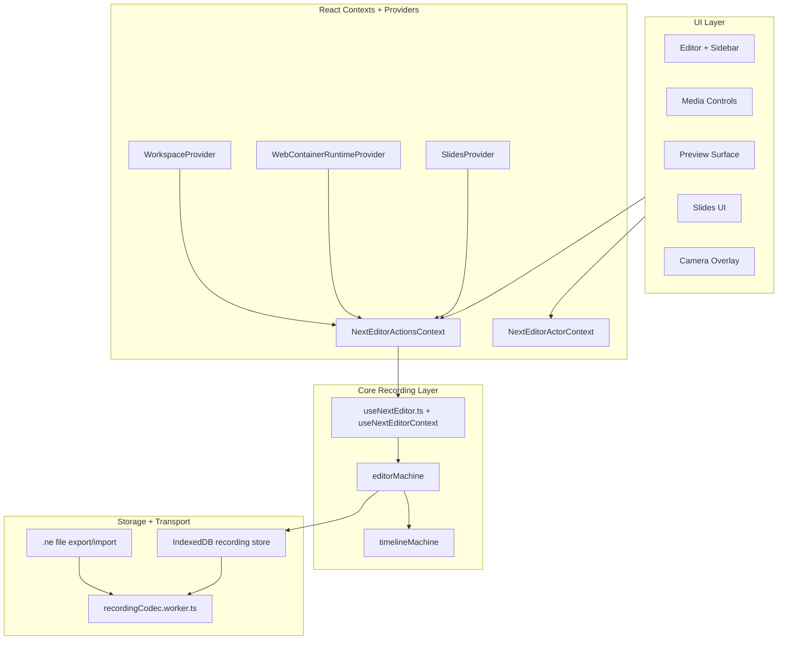
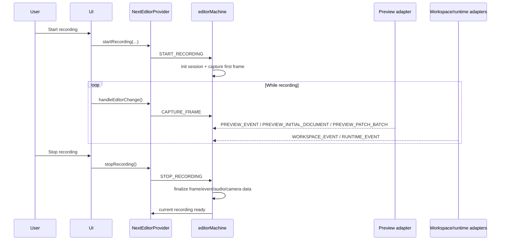
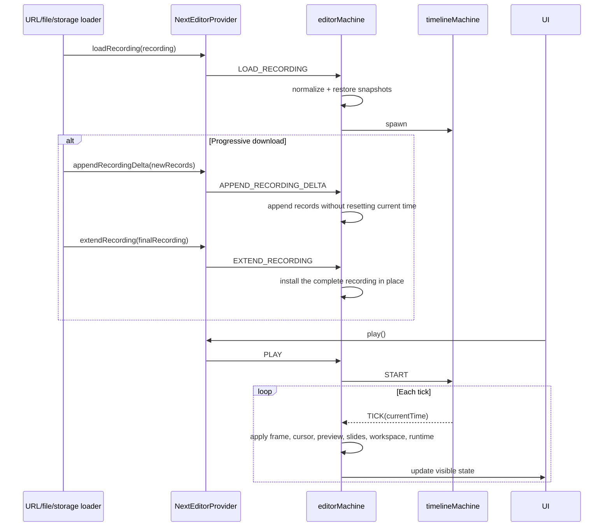
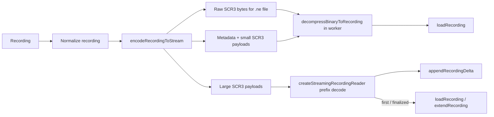
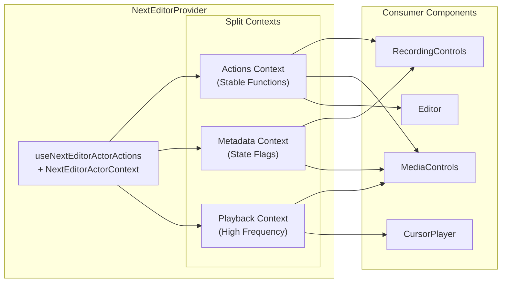
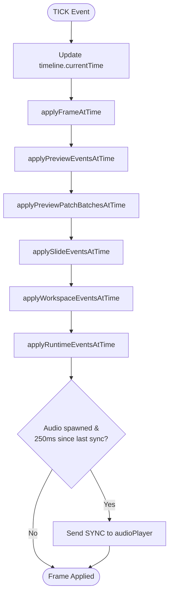

# Data Flow Documentation

This document tracks the current data flow across the UI, core machine, runtime adapters, and SCR3 storage pipeline.

## High-Level Architecture

```mermaid
flowchart TB
    subgraph UI["UI Layer"]
        Editor[Editor + Sidebar]
        Controls[Media Controls]
        Preview[Preview Surface]
        Slides[Slides UI]
        Camera[Camera Overlay]
    end

    subgraph Contexts["React Contexts + Providers"]
        Actions[NextEditorActionsContext]
        Actor[NextEditorActorContext]
        Workspace[WorkspaceProvider]
        Runtime[WebContainerRuntimeProvider]
        SlidesCtx[SlidesProvider]
    end

    subgraph Core["Core Recording Layer"]
        Hook[useNextEditor.ts + useNextEditorContext]
        Machine[editorMachine]
        Timeline[timelineMachine]
    end

    subgraph Persistence["Storage + Transport"]
        IndexedDB[IndexedDB recording store]
        Codec[recordingCodec.worker.ts]
        Export[.ne file export/import]
    end

    UI --> Actions
    UI --> Actor
    Workspace --> Actions
    Runtime --> Actions
    SlidesCtx --> Actions
    Actions --> Hook
    Hook --> Machine
    Machine --> Timeline
    Machine --> IndexedDB
    Export --> Codec
    IndexedDB --> Codec
```

## Recording Flow

```mermaid
sequenceDiagram
    participant User
    participant UI
    participant Provider as NextEditorProvider
    participant Machine as editorMachine
    participant Preview as Preview adapter
    participant Runtime as Workspace/runtime adapters

    User->>UI: Start recording
    UI->>Provider: startRecording(...)
    Provider->>Machine: START_RECORDING
    Machine->>Machine: init session + capture first frame

    loop While recording
        UI->>Provider: handleEditorChange()
        Provider->>Machine: CAPTURE_FRAME
        Preview-->>Machine: PREVIEW_EVENT / PREVIEW_INITIAL_DOCUMENT / PREVIEW_PATCH_BATCH
        Runtime-->>Machine: WORKSPACE_EVENT / RUNTIME_EVENT
    end

    User->>UI: Stop recording
    UI->>Provider: stopRecording()
    Provider->>Machine: STOP_RECORDING
    Machine->>Machine: finalize frame/event/audio/camera data
    Machine->>Provider: current recording ready
```

Key points:

- Frames are compressed incrementally during capture via an in-session `FrameStreamEncoderState`, not as a final batch pass.
- Preview replay data is captured with rrweb: a seed document (Meta + FullSnapshot) plus later patch batches of incremental rrweb events.
- API client interactions on a runtime lesson are captured as preview events: switching to API mode, each request, its response (or timeout), request-tab switches, and history inspections all land on the timeline.
- Workspace and runtime snapshots are captured alongside timed events so playback can restore the full lesson context.

## Playback Flow

```mermaid
sequenceDiagram
    participant Loader as URL/file/storage loader
    participant Provider as NextEditorProvider
    participant Machine as editorMachine
    participant Timeline as timelineMachine
    participant UI

    Loader->>Provider: loadRecording(recording)
    Provider->>Machine: LOAD_RECORDING
    Machine->>Machine: normalize + restore snapshots
    Machine->>Timeline: spawn

    alt Progressive download
        Loader->>Provider: appendRecordingDelta(newRecords)
        Provider->>Machine: APPEND_RECORDING_DELTA
        Machine->>Machine: append records without resetting current time
        Loader->>Provider: extendRecording(finalRecording)
        Provider->>Machine: EXTEND_RECORDING
        Machine->>Machine: install the complete recording in place
    end

    UI->>Provider: play()
    Provider->>Machine: PLAY
    Machine->>Timeline: START

    loop Each tick
        Timeline-->>Machine: TICK(currentTime)
        Machine->>Machine: apply frame, cursor, preview, slides, workspace, runtime
        Machine->>UI: update visible state
    end
```

Current playback behavior:

- The machine keeps a replay cursor for each append-only event stream (frames, preview events, slides, workspace, runtime) so streamed growth (`appendRecordingDelta`, `extendRecording`) can continue from the current point efficiently. rrweb preview replay needs no cursor: it is seeked to the current time on every apply.
- Audio playback is lazy when a progressive load first gains usable audio, then stays in sync by updating the same `HTMLAudioElement` with larger contiguous blob snapshots as more fragments arrive; the machine throttles resyncs to roughly every 250ms during a `TICK`.
- Camera playback is rendered by `CameraOverlay`, which derives the correct video time from timeline time minus `cameraStartOffsetMs`.
- The player takes video-player keys while a recording is loaded (`usePlayerShortcuts`, "?" lists
  them): Space/K play and pause, ←/→ and J/L seek 5 s and 10 s, `,`/`.` pause and step a second,
  `<`/`>` change speed within 0.5×–2× (remembered like the slider), `[`/`]` move between chapters,
  0–9 jump to tenths, Home/End, M mutes, C toggles captions. Keys are left alone while the editor,
  terminal, whiteboard, a field, a dialog or a menu has focus, when a modifier is held, and when
  another handler already took them (`defaultPrevented`): during playback Space still reaches
  `useNextEditor`'s capture-phase listener first, which pauses without typing into the editor.
  The "Single-key shortcuts" switch in the player's settings (`playbackSettingsStore`, stored as
  `playback-character-shortcuts`, on by default) turns off the letter, number and punctuation
  keys (WCAG 2.1.4); Space, the arrows, Home and End keep working.
  The slide overlay (`SlidePreview`) takes ←/→ for slide navigation only while playback is paused
  and focus is not in a field or on a slider, so the seek keys keep working while slides are shown
  during playback.

## Storage Flow

```mermaid
flowchart LR
    Recording --> Normalize[Normalize recording]
    Normalize --> Encode[encodeRecordingToStream]
    Encode --> NeFile[Raw SCR3 bytes for .ne file]
    Encode --> IndexedDB[Metadata + small SCR3 payloads]
    Encode --> OPFS[Large SCR3 payloads]
    NeFile --> Decode[decompressBinaryToRecording in worker]
    IndexedDB --> Decode
    OPFS --> PrefixDecode[createStreamingRecordingReader prefix decode]
    Decode --> Load[loadRecording]
    PrefixDecode --> Append[appendRecordingDelta]
    PrefixDecode -->|first / finalized| Extend[loadRecording / extendRecording]
```

Current storage rules:

- The app stores and exports SCR3 recordings.
- IndexedDB persists searchable metadata, media blobs, and SCR3 payloads below 8 MiB.
- Larger SCR3 payloads move to OPFS. A dedicated worker writes them with a synchronous access
  handle when supported (and an async OPFS writer otherwise), while loads stream `File` chunks
  into the bounded SCR3 reader instead of calling IndexedDB `getAll()` and concatenating buffers.
- OPFS is origin-private, so explicit `.ne` export/import remains the portable backup path.
- Exported `.ne` files are raw SCR3 bytes with no base64 wrapping; the runtime loader reads the same raw byte stream.
- Workspace snapshots carry only content-addressed asset descriptors. SCR3 writes each referenced
  asset once as a raw segment; progressive readers verify/persist the bytes in workspace asset
  storage and release them after delta delivery.
- `src/storage/recordingCodec.worker.ts` (backing `recordingCodecClient.ts`) keeps whole-file
  MessagePack/deflate codec work off the main thread. `src/storage/streamingRecordingCodec/decode.ts`
  does incremental prefix decoding for progressive loads.

### Take drafts (crash recovery)

A take is held in memory until it is uploaded or exported. So that a crash, a reload or a
closed tab does not lose it, `useRecordingDraftJournal` (run by `NextEditorProvider`, off for
studio renders) journals every take to its own IndexedDB database,
`next-editor-recording-drafts` (`src/storage/recordingDrafts/`):

- Every 3 s, on a pause, and when the tab is hidden, it writes what each session track gained
  since the last write, with the draft's meta, in one transaction; a failed write stops the
  journal, so a draft is always a consistent prefix of its take. Workspace events are written
  with only the files that changed since the one before.
- The microphone and camera recorders' chunks are appended as they arrive (the journal listens
  to the same MediaRecorders); a selected narration file is stored whole.
- A tab holds a Web Lock per draft it owns. The editor's recovery prompt
  (`RecordingDraftRecovery`) offers the newest draft no open tab owns, and rebuilds it through
  the same `assembleRecording` the stop uses.
- A draft is deleted once its take is uploaded, exported, or replaced with New Recording, or
  when the author discards it from the prompt.

### Editing a recording

`RecordingEditPanel` (the scissors in the player bar, for a recording in record mode) cuts and
mutes stretches of a finished recording through `applyRecordingEdit` (`src/core/src/recordingEdit.ts`).
A stretch is selected by dragging across the narration's waveform, or without a pointer by seeking
and pressing "Start at playhead" and "End at playhead"; the selected range is announced as a status.

- A cut span is collapsed into `CUT_WINDOW_MS` at its start on every track, in order, and what
  follows moves earlier, so no change inside it is lost. The editor frames inside a cut are
  squashed into one keyframe of their final state, so text typed and deleted there leaves no
  trace. The preview's rrweb stamps are first re-based onto recorded time so the cut applies to
  them directly, by the same lead replay uses (`getRrwebReplayLead`,
  `src/core/src/utils/previewReplayLead.ts`).
- Caption cues said inside a cut are dropped and those across one are shortened. A cue with word
  timings (a studio render's) also loses the words cut from the narration: its text is rebuilt
  from the words left by the producer's own join rule (`captionTextFromWords`,
  `src/core/src/utils/captionCues.ts`), and it is dropped when every word went. A Whisper cue
  has no word timings, so it keeps its whole text.
- The narration edit (cuts less their window, and mutes, on the audio's own clock) is left as
  `pendingAudioEdit` for `loadRecording`, and the camera's `cameraCuts` gain the cut spans. A
  recording whose own narration edit is still pending (a retake's, not yet applied) is refused:
  that edit is on the narration's clock and this one would replace it.
- The edited recording gets a new id and is loaded in place; once loaded (narration cut) it is
  offered for upload like a take that just finished. "Suggest dead-air cuts" proposes quiet
  stretches with no recorded activity (`suggestDeadAirCuts`).

### Generating captions

"Generate captions" (player settings, record mode, a recording with narration) transcribes the
narration on the author's device with Whisper; the audio never leaves the browser
(`src/captions/generateCaptions.ts`, `useCaptionGeneration`):

- The narration is decoded to 16 kHz mono on the page and transferred to a module worker
  (`src/captions/whisper/captionWorker.ts`), which runs `whisper-base` (int8 ONNX, a pinned
  Hugging Face revision, ~79 MB cached in Cache Storage after the first run) on ONNX Runtime
  Web's single-threaded WASM backend.
- The worker computes Whisper's log-mel features, decodes each 30 s window greedily under the
  reference timestamp rules, and moves on from the window's last closed segment. Every window is
  prompted with the lesson's vocabulary (`buildCaptionPrompt`: its libraries from `package.json`,
  lesson type, and file names) rather than the text before it.
- `segmentsToCues` puts the segments on the recording's clock (`audioStartOffsetMs`), clamps them
  to its length, and splits cues that run long in text or time — between sentences (including
  Burmese `။`), then clauses (including `၊`), then words — keeping the source's spacing around
  the break and measuring length in grapheme clusters, so Burmese vowel signs and stacked
  consonants do not count as extra characters. The result is added with
  `addCaptionTrack` as an "(auto)" track and shown; "Download captions (.vtt)" saves a track for
  correction and re-import.
- Generating is disabled while a cut is still reaching the narration (`pendingAudioEdit`), since
  that audio runs on the old clock. Cancel (or leaving the player) terminates the worker.

## URL Loading Flow

The shipped URL loader supports both same-origin and cross-origin recording URLs.

- Same-origin files are fetched directly.
- Cross-origin URLs try `/api/proxy?url=...` first and fall back to direct fetch if the proxy is missing.
- When the response body is streamable, the loader feeds raw SCR3 bytes to an incremental
  `StreamingRecordingReader`, persists any raw asset handoffs, loads the first playable prefix as
  soon as one has decoded, appends later `readDelta()` deliveries about every 512 KiB, and
  constructs another complete immutable recording only at the end (finalization, or a body that
  ends without its footer).
- After the recording loads, the loader resolves any `captionFiles` the recording declares relative to the `.ne` URL, fetches and parses each one, and adds it via `addCaptionTrack`. A recording that declares no captions gets none (HTTP exposes no directory listing); when every declared file fails, the `.ne` basename with `.vtt` is tried once, for a lesson renamed together with its captions.

## API Client Transport

The API client does not call the runtime server over the network from the host page.
Instead `useApiClient` posts the composed request into the preview iframe through a
same-origin message bridge (`src/utils/apiClientBridge.ts`): a tiny proxy script injected
into the preview `fetch`es the path inside the iframe and posts the response back to the
parent. Because the request runs in the iframe's origin there is no CORS, and the host only
ever sees a serialized request/response pair — which is exactly what gets recorded and
replayed.

## Context Data Flow

```mermaid
flowchart LR
    subgraph Provider["NextEditorProvider"]
        direction TB
        Hook["useNextEditorActorActions<br/>+ NextEditorActorContext"]

        subgraph Contexts["Split Contexts"]
            Actions["Actions Context<br/>(Stable Functions)"]
            Metadata["Metadata Context<br/>(State Flags)"]
            Playback["Playback Context<br/>(High Frequency)"]
        end

        Hook --> Actions
        Hook --> Metadata
        Hook --> Playback
    end

    subgraph Consumers["Consumer Components"]
        RC[RecordingControls]
        MC[MediaControls]
        CP[CursorPlayer]
        ED[Editor]
    end

    Actions --> RC
    Actions --> MC
    Actions --> ED
    Metadata --> RC
    Metadata --> MC
    Playback --> MC
    Playback --> CP
```

This context splitting pattern prevents unnecessary re-renders:

- **Actions Context** (`useNextEditorActions`): Stable function references, rarely changes.
- **Metadata Context** (`useNextEditorMetadata`): Recording state flags, changes on state transitions.
- **Playback Context** (`useNextEditorPlayback`): Editor actor, speed, volume, duration — high-frequency, tick-driven consumers should prefer the narrower `useLiveTime` selector.

## Frame Application Flow

```mermaid
flowchart TB
    Start([TICK Event]) --> UpdateTimeline[Update timeline.currentTime]
    UpdateTimeline --> ApplyFrame[applyFrameAtTime]
    ApplyFrame --> ApplyPreviewEvents[applyPreviewEventsAtTime]
    ApplyPreviewEvents --> ApplyPreviewPatches[applyPreviewPatchBatchesAtTime]
    ApplyPreviewPatches --> ApplySlides[applySlideEventsAtTime]
    ApplySlides --> ApplyWorkspace[applyWorkspaceEventsAtTime]
    ApplyWorkspace --> ApplyRuntime[applyRuntimeEventsAtTime]
    ApplyRuntime --> SyncAudio{Audio spawned &<br/>250ms since last sync?}
    SyncAudio -->|Yes| SyncAudioActor[Send SYNC to audioPlayer]
    SyncAudio -->|No| Done([Frame Applied])
    SyncAudioActor --> Done
```

Each `applyXAtTime` action reads its own `lastApplied*Index` cursor from context, applies only newly-reached events since that cursor, and advances the cursor — so a `TICK` (or an `EXTEND_RECORDING`) only does incremental work regardless of total recording length.

## Where To Look Next

- `docs/data-structures.md` for concrete type shapes.
- `docs/state-machines.md` for the event/state topology.
- `docs/streaming-playback.md` for the partial-download behavior in detail.
- `docs/live-collaboration-voice-cloudflare-realtime-sfu.md` for the voice-chat coordination and
  media flow — voice runs beside these flows and never enters the recording pipeline.
