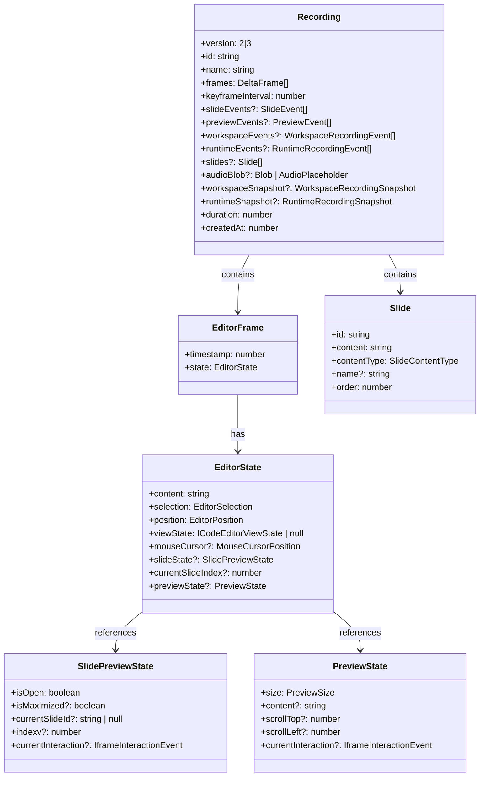
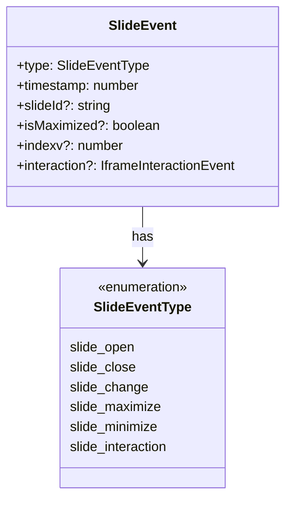
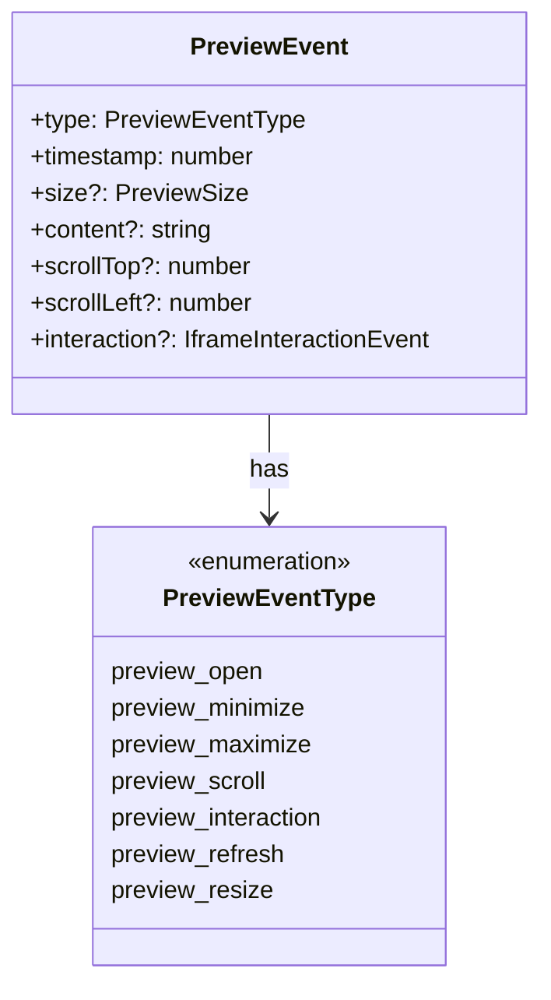
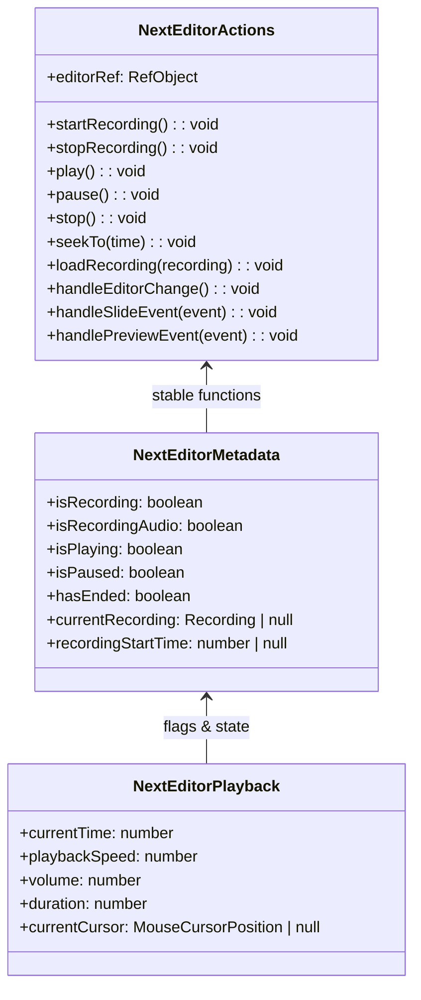
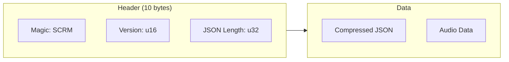

# Data Structures Documentation

This document describes the core data structures used in the Next Editor application.

---

## Overview



---

## Core Types

### Recording

The main data structure for storing a recorded session.

```typescript
interface Recording {
  version: 2 | 3;                      // Format version (v3 supports multi-file)
  id: string;                          // Unique identifier
  name: string;                        // Display name
  frames: DeltaFrame[];                // Delta-compressed frames
  keyframeInterval: number;            // Keyframe interval (default: 120)
  
  // Single-file support (v2 & v3)
  slideEvents?: SlideEvent[];          // Slide-related events
  previewEvents?: PreviewEvent[];      // Preview panel events
  slides?: Slide[];                    // Slide content data
  audioBlob?: Blob | AudioPlaceholder; // Audio recording
  
  // Multi-file support (v3 only)
  workspaceEvents?: WorkspaceRecordingEvent[];     // File/folder changes
  runtimeEvents?: RuntimeRecordingEvent[];         // Runtime/terminal events
  workspaceSnapshot?: WorkspaceRecordingSnapshot;  // Workspace state snapshot
  runtimeSnapshot?: RuntimeRecordingSnapshot;      // Runtime state snapshot
  
  // Metadata
  duration: number;                    // Total duration in ms
  createdAt: number;                   // Creation timestamp
}
```

**Version Differences:**
- **v2**: Single editor file recording; ideal for tutorials and code demonstrations
- **v3**: Multi-file workspace recording; captures file changes, workspace state, and runtime/terminal output for full environment replay

### EditorFrame

Represents the complete editor state at a specific timestamp.

```typescript
interface EditorFrame {
  timestamp: number;
  state: {
    content: string;                   // Editor text content
    selection: EditorSelection;        // Text selection
    position: EditorPosition;          // Cursor position
    viewState: ICodeEditorViewState;   // Monaco view state
    mouseCursor?: MouseCursorPosition; // Mouse position
    slideState?: SlidePreviewState;    // Slide preview state
    currentSlideIndex?: number;        // Active slide index
    previewState?: PreviewState;       // Code preview state
  };
}
```

---

## Event Types

### SlideEvent



### PreviewEvent



---

## Context Types

The application uses three React contexts for state management:



---

## Storage Types

### JsonStorage Binary Format



### AudioPlaceholder

Used for serialization of audio blobs:

```typescript
interface AudioPlaceholder {
  __audio_offset: number;  // Byte offset in binary data
  __audio_size: number;    // Size in bytes
  __audio_type: string;    // MIME type
}
```

---

## Machine Context Types

### EditorMachineContext

The complete state machine context:

```typescript
interface EditorMachineContext {
  timeline: TimelineState;
  session: RecordingSession | null;
  recording: Recording | null;
  currentFrame: EditorFrame | null;
  audio: AudioState;
  editorRefs: EditorRefs;
  enableAudioRecording: boolean;
  pauseOnUserInteraction: boolean;
  animationFrameId: number | null;
  error: string | null;
  lastAppliedFrameIndex: number;
  lastAppliedPreviewEventIndex: number;
  lastAppliedSlideEventIndex: number;
}
```

### TimelineState

```typescript
interface TimelineState {
  currentTime: number;    // Position in ms
  duration: number;       // Total duration in ms
  speed: number;          // Playback multiplier
  volume: number;         // 0.0 - 1.0
  startedAt: number;      // performance.now()
  pausedDuration: number; // Accumulated pause time
  pausedAt: number;       // Pause timestamp
}
```

### RecordingSession

```typescript
interface RecordingSession {
  startedAt: number;                    // Start timestamp
  frames: EditorFrame[];                // Captured frames
  slideEvents: SlideEvent[];            // Slide events
  previewEvents: PreviewEvent[];        // Preview events
  lastMousePosition: MouseCursorPosition;
}
```
