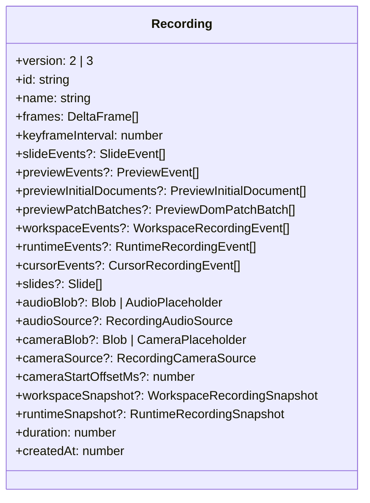
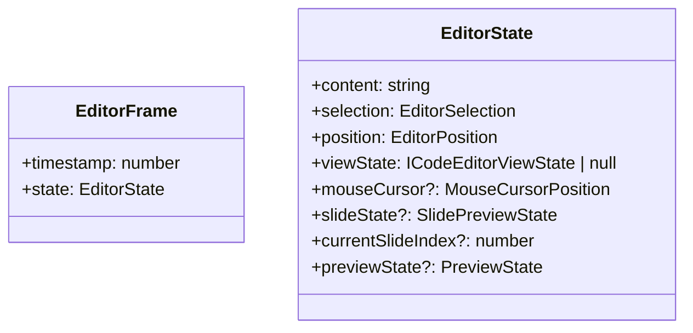

# Data Structures Documentation

This document describes the current recording and playback data structures used by Next Editor.

## Recording Overview



The shipped app creates version `3` recordings and stores them in SCR3. The type still accepts `2 | 3` because some normalization and compatibility code paths remain in the library surface, but current storage and export flows are SCR3-based.

## The `Recording` Shape

```ts
interface Recording {
  version: 2 | 3;
  id: string;
  name: string;
  frames: DeltaFrame[];
  keyframeInterval: number;
  slideEvents?: SlideEvent[];
  previewEvents?: PreviewEvent[];
  previewInitialDocuments?: PreviewInitialDocument[];
  previewPatchBatches?: PreviewDomPatchBatch[];
  workspaceEvents?: WorkspaceRecordingEvent[];
  runtimeEvents?: RuntimeRecordingEvent[];
  cursorEvents?: CursorRecordingEvent[];
  slides?: Slide[];
  audioBlob?: Blob | AudioPlaceholder;
  audioSource?: "microphone" | "external";
  cameraBlob?: Blob | CameraPlaceholder;
  cameraSource?: "camera";
  cameraStartOffsetMs?: number;
  workspaceSnapshot?: WorkspaceRecordingSnapshot;
  runtimeSnapshot?: RuntimeRecordingSnapshot;
  duration: number;
  createdAt: number;
}
```

Notable current fields:

- `previewInitialDocuments` seeds preview replay.
- `previewPatchBatches` replays DOM mutations after that seed.
- `cursorEvents` gives higher-fidelity cursor playback than relying on frame snapshots alone.
- `cameraStartOffsetMs` compensates for `getUserMedia` warmup so camera playback stays aligned.

## Frame Data



`frames` is an array of delta-compressed `DeltaFrame` entries. Playback reconstructs the full `EditorFrame` from the nearest earlier keyframe plus subsequent deltas.

## Cursor Data

Current recordings separate cursor sampling from editor text deltas.

```ts
interface CursorRecordingEvent extends MouseCursorPosition {
  timestamp: number;
}
```

`MouseCursorPosition` also carries richer layout-relative metadata than older viewport-only cursor samples:

- `coordinateSpace?: "viewport" | "root"`
- `target?: CursorTargetSnapshot`
- `tween?: CursorTweenSnapshot`
- optional pressure, angle, hover, and flags metadata

That lets playback remap a recorded cursor onto the current UI layout more reliably.

## Preview Replay Data

Preview playback uses two structures together:

- `PreviewInitialDocument[]` captures a seeded DOM snapshot.
- `PreviewDomPatchBatch[]` captures ordered DOM mutations over time.

This is what allows preview playback to restore recorded DOM updates without requiring a fresh runtime rerun or a manual save point.

## Audio And Camera Data

```ts
type RecordingAudioSource = "microphone" | "external";
type RecordingCameraSource = "camera";
```

- `audioBlob` and `cameraBlob` remain the assembled playback facades that UI surfaces consume.
- `tracks`, `clusters`, and `mediaFragments` describe the stream-oriented container layout: time-clustered segments, per-track metadata, and timeline-aligned media coverage.
- During active capture, the machine session tracks `audioFragments` and `cameraFragments` with `startTimeMs` / `endTimeMs` so the live SCR3 stream and the finalized recording are built from the same timeline-aware media model.

## Provider Context Shapes

The app splits editor access into a few focused surfaces:

- `NextEditorActionsContext`: stable imperative controls and storage helpers.
- `useNextEditorMetadata()`: coarse recording and playback flags.
- `useNextEditorPlayback()`: timeline actor, playback speed, volume, and duration.
- `useLiveTime()` and `useLiveCursor()`: high-frequency selectors for tick-driven UI.

Important action methods now include:

- `loadRecording(recording)`
- `extendRecording(recording)`
- `handlePreviewInitialDocument(document)`
- `handlePreviewPatchBatch(batch)`
- `exportAsFile(recording, filename?)`

## SCR3 Metadata

At the container level, SCR3 metadata includes:

- recording identity and timestamps
- `version`
- duration
- stream-oriented `tracks` and `clusters`
- audio and camera MIME hints
- `audioStartOffsetMs`
- `cameraStartOffsetMs`

Segments then carry append-only, time-clustered payloads for frames, events, audio, and camera data.

## Summary

The important structural shift is that Next Editor now treats recordings as append-only timeline objects with richer preview, cursor, workspace, runtime, audio, and camera channels, rather than as a text-only capture with a few side fields.

    Header --> Segments
    Segments --> Footer[Footer index]

````

### AudioPlaceholder

Used for serialization of audio blobs:

```typescript
interface AudioPlaceholder {
  __audio_offset: number; // Byte offset in binary data
  __audio_size: number; // Size in bytes
  __audio_type: string; // MIME type
}
````

### CameraPlaceholder

Used by storage layers that need to describe camera bytes without eagerly holding a Blob:

```typescript
interface CameraPlaceholder {
  __camera_offset: number; // Byte offset in binary data
  __camera_size: number; // Size in bytes
  __camera_type: string; // MIME type
}
```

---

## Machine Context Types

### EditorMachineContext

The complete state machine context:

```typescript
interface EditorMachineContext {
  timeline: TimelineState;
  session: RecordingSession | null;
  recording: Recording | null;
  currentFrame: EditorFrame | null;
  audio: AudioState;
  camera: CameraState;
  editorRefs: EditorRefs;
  enableAudioRecording: boolean;
  enableCameraRecording: boolean;
  pauseOnUserInteraction: boolean;
  animationFrameId: number | null;
  error: string | null;
  lastAppliedFrameIndex: number;
  lastAppliedPreviewEventIndex: number;
  lastAppliedSlideEventIndex: number;
}
```

### TimelineState

```typescript
interface TimelineState {
  currentTime: number; // Position in ms
  duration: number; // Total duration in ms
  speed: number; // Playback multiplier
  volume: number; // 0.0 - 1.0
  startedAt: number; // performance.now()
  pausedDuration: number; // Accumulated pause time
  pausedAt: number; // Pause timestamp
}
```

### RecordingSession

```typescript
interface RecordingSession {
  startedAt: number; // Start timestamp
  frames: EditorFrame[]; // Captured frames
  slideEvents: SlideEvent[]; // Slide events
  previewEvents: PreviewEvent[]; // Preview events
  audioChunks: Blob[]; // Append-only audio chunks for SCR3/live streaming
  cameraChunks: Blob[]; // Append-only camera chunks for SCR3/live streaming
  lastMousePosition: MouseCursorPosition;
}
```
