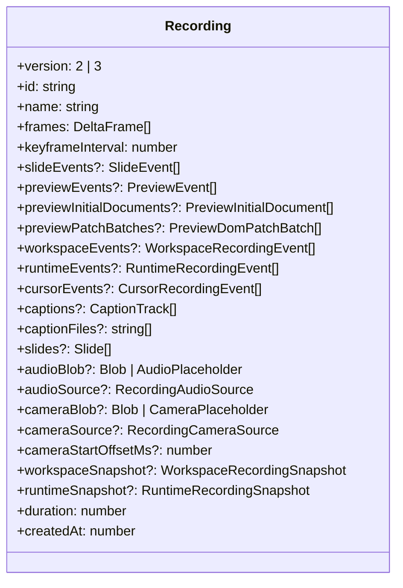
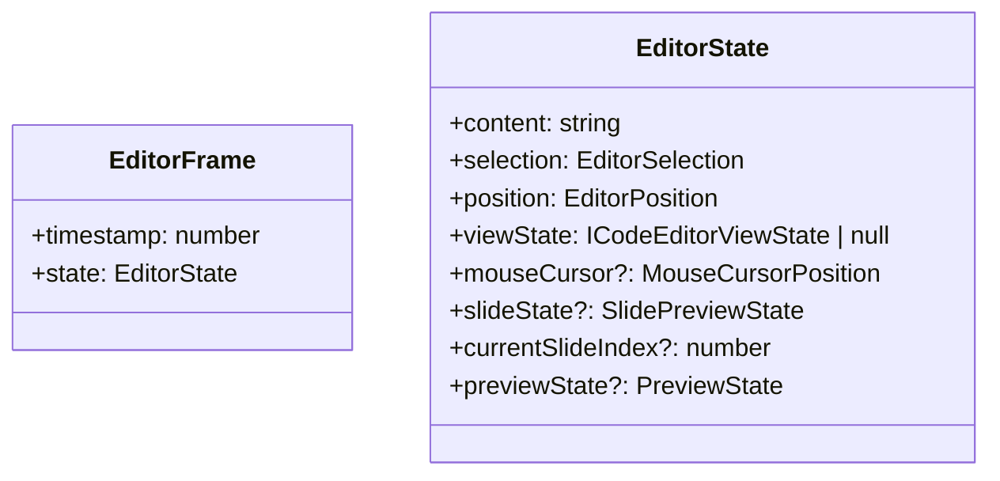

# Data Structures Documentation

This document describes the current recording and playback data structures used by Next Editor.

## Recording Overview



The shipped app creates version `3` recordings and stores them in SCR3. The type still accepts `2 | 3` because some normalization and compatibility code paths remain in the library surface, but current storage and export flows are SCR3-based.

## The `Recording` Shape

```ts
interface Recording {
  version: 2 | 3;
  id: string;
  name: string;
  frames: DeltaFrame[];
  keyframeInterval: number;
  slideEvents?: SlideEvent[];
  previewEvents?: PreviewEvent[];
  previewInitialDocuments?: PreviewInitialDocument[];
  previewPatchBatches?: PreviewDomPatchBatch[];
  workspaceEvents?: WorkspaceRecordingEvent[];
  runtimeEvents?: RuntimeRecordingEvent[];
  cursorEvents?: CursorRecordingEvent[];
  captions?: CaptionTrack[]; // parsed subtitle tracks carried inline
  captionFiles?: string[]; // sibling .vtt/.srt filenames a hosted .ne declares
  slides?: Slide[];
  audioBlob?: Blob | AudioPlaceholder;
  audioSource?: "microphone" | "external";
  cameraBlob?: Blob | CameraPlaceholder;
  cameraSource?: "camera";
  cameraStartOffsetMs?: number;
  cameraFile?: string; // sibling video filename when camera is stored outside the .ne
  cameraUrl?: string; // resolved URL for the external camera video (hosted or imported object URL)
  workspaceSnapshot?: WorkspaceRecordingSnapshot;
  runtimeSnapshot?: RuntimeRecordingSnapshot;
  duration: number;
  createdAt: number;
}
```

Notable current fields:

- `previewInitialDocuments` seeds preview replay with the rrweb Meta + FullSnapshot events.
- `previewPatchBatches` carries the incremental rrweb events that play after that seed.
- `cursorEvents` gives higher-fidelity cursor playback than relying on frame snapshots alone.
- `cameraStartOffsetMs` compensates for `getUserMedia` warmup so camera playback stays aligned.
- `captions` carries parsed subtitle tracks inline; `captionFiles` instead names sibling `.vtt`/`.srt` files that a hosted recording loads at play time.
- API client request/response data is not a top-level recording field — it travels inside `previewEvents` (see [Preview Replay Data](#preview-replay-data) and [API Client Data](#api-client-data)).

## Frame Data



`frames` is an array of delta-compressed `DeltaFrame` entries. Playback reconstructs the full `EditorFrame` from the nearest earlier keyframe plus subsequent deltas.

## Cursor Data

Current recordings separate cursor sampling from editor text deltas.

```ts
interface CursorRecordingEvent extends MouseCursorPosition {
  timestamp: number;
}
```

`MouseCursorPosition` also carries richer layout-relative metadata than older viewport-only cursor samples:

- `coordinateSpace?: "viewport" | "root"`
- `target?: CursorTargetSnapshot`
- `tween?: CursorTweenSnapshot`
- optional pressure, angle, hover, and flags metadata

That lets playback remap a recorded cursor onto the current UI layout more reliably.

## Preview Replay Data

Preview playback is rrweb-based. Both structures carry rrweb events verbatim as
`PreviewRecordedEvent[]`, which is structurally compatible with rrweb's `eventWithTime`;
the recording engine treats them as opaque JSON and only reads the envelope `time` /
`documentId`.

- `PreviewInitialDocument[]` captures the seed: the rrweb Meta + FullSnapshot pair.
- `PreviewDomPatchBatch[]` captures the ordered incremental rrweb events that follow,
  batched per animation frame.

```ts
interface PreviewRecordedEvent {
  type: number; // rrweb EventType
  data: unknown;
  timestamp: number;
  delay?: number;
}
```

At replay time the app reassembles the full ordered event stream from the seed plus all
patch batches and drives an rrweb `Replayer` from the recording timeline (seek-driven, no
autoplay). Because DOM, scroll, input, and pointer all live in that one stream, they stay
coupled — restoring recorded preview state without a fresh runtime rerun or a manual save
point. `PREVIEW_RRWEB_FORMAT_VERSION` is `2` (bumped from the legacy custom-op format `1`,
whose separate DOM-patch path has been removed).

## Caption Data

Subtitles are stored as parsed caption tracks rather than raw subtitle files. The parser
(`src/captions/parseCaptions.ts`) accepts WebVTT and SubRip, strips cue tags, and
normalizes/sorts cues; the language is inferred from the filename suffix
(e.g. `lesson.es.vtt` → `es`).

```ts
interface CaptionWord {
  start: number; // ms
  end: number; // ms
  text: string;
}

interface CaptionCue {
  start: number; // ms, relative to the recording timeline
  end: number; // ms
  text: string;
  words?: CaptionWord[]; // optional word-level timing
}

interface CaptionTrack {
  id: string;
  language: string; // BCP-47-ish tag, e.g. "en" or "pt-BR"
  label?: string;
  cues: CaptionCue[];
  default?: boolean;
}
```

- A recording can carry multiple tracks. `CaptionsOverlay` picks the track matching the
  viewer's preferred language, otherwise the `default` track, otherwise the first.
- The active cue is found by binary search over `cues` against the live timeline time, so
  caption lookup stays cheap on every tick.
- Caption enabled-state and language preference are persisted in `localStorage` by the
  caption store (`src/stores/captionStore.ts`), independent of any single recording.
- On the container, captions are either inlined as `captions` or referenced by
  `captionFiles`; sibling files are fetched relative to the `.ne` URL during URL loading.

## API Client Data

Runtime lessons include an in-preview HTTP API client. Its interactions are recorded as
`PreviewEvent`s (not a separate top-level channel) so they replay on the same preview
timeline as DOM snapshots. The recorded shapes are flat (no live UI state):

```ts
interface ApiClientRecordedRequest {
  method: string;
  path: string;
  headers: Record<string, string>;
  body: string | undefined;
}

type ApiClientRecordedResult =
  | {
      ok: true;
      status: number;
      statusText: string;
      headers: [string, string][];
      body: string;
      durationMs: number;
    }
  | { ok: false; error: string; durationMs: number };
```

The relevant `PreviewEvent.type` values are `api_client_mode` (browser ↔ API toggle),
`api_client_request`, `api_client_response`, `api_client_request_tab` (headers ↔ body tab),
and `api_client_inspect_history`. At replay time these are folded into an
`ApiClientReplayState` (`request`, `result`, `sending`, `history`) on `PreviewState`, which
drives a read-only rendering of the panel. Live capture and replay share the same flat
result shape, so a recorded response is reused verbatim for both the store update and the
recording callback.

## Audio And Camera Data

```ts
type RecordingAudioSource = "microphone" | "external";
type RecordingCameraSource = "camera";
```

- `audioBlob` remains the assembled audio playback facade that UI surfaces consume.
- **Camera video is always external — its bytes never live inside an SCR3 stream** (exported,
  persisted, or live-streamed). The stream carries only a camera reference + metadata
  (`cameraFile`, `cameraUrl`, `cameraType`, `cameraSource`, `cameraStartOffsetMs`). The camera bytes
  live as:
  - an in-memory `cameraBlob` on the `Recording` (just recorded, or paired from an imported file),
  - a separate IndexedDB blob (the `recording-camera` object store) for persisted recordings, and/or
  - a hosted sibling URL resolved to `cameraUrl` for `.ne` files loaded over the network.
    On export, a recording with a camera produces two artifacts — a small `.ne` plus a sibling video.
    On load, `cameraFile` resolves to a `cameraUrl` (hosted URL or imported object URL) and plays
    through a native `<video>` so the browser range-streams it. A missing video is non-fatal and
    silent: the recording plays without the camera overlay.
- `tracks`, `clusters`, and `mediaFragments` describe the stream-oriented container layout for
  **audio** (and editor/event tracks): time-clustered segments, per-track metadata, and
  timeline-aligned media coverage. Camera is not part of this stream layout.
- During active capture, the machine session tracks `audioFragments` with `startTimeMs` / `endTimeMs`
  so the live SCR3 stream and the finalized recording are built from the same timeline-aware audio
  model. Camera is captured as one finalized blob when the camera recorder stops (no per-chunk
  streaming, so camera is not crash-resilient mid-recording).

## Provider Context Shapes

The app splits editor access into a few focused surfaces:

- `NextEditorActionsContext`: stable imperative controls and storage helpers.
- `useNextEditorMetadata()`: coarse recording and playback flags.
- `useNextEditorPlayback()`: timeline actor, playback speed, volume, and duration.
- `useLiveTime()` and `useLiveCursor()`: high-frequency selectors for tick-driven UI.

Important action methods now include:

- `loadRecording(recording)`
- `extendRecording(recording)`
- `handlePreviewInitialDocument(document)`
- `handlePreviewPatchBatch(batch)`
- `exportAsFile(recording, filename?)`

## SCR3 Metadata

At the container level, SCR3 metadata includes:

- recording identity and timestamps
- `version`
- duration
- stream-oriented `tracks` and `clusters`
- audio and camera MIME hints
- `audioStartOffsetMs`
- `cameraStartOffsetMs`
- `cameraFile` / `cameraUrl` when the camera video is stored as a sibling file instead of inline
- `captions` (inline parsed tracks) and/or `captionFiles` (sibling `.vtt`/`.srt` references)

Segments then carry append-only, time-clustered payloads for frames, events, audio, and camera data.

## Summary

The important structural shift is that Next Editor now treats recordings as append-only timeline objects with richer preview, cursor, workspace, runtime, audio, and camera channels, rather than as a text-only capture with a few side fields.

    Header --> Segments
    Segments --> Footer[Footer index]

````

### AudioPlaceholder

Used for serialization of audio blobs:

```typescript
interface AudioPlaceholder {
  __audio_offset: number; // Byte offset in binary data
  __audio_size: number; // Size in bytes
  __audio_type: string; // MIME type
}
````

### CameraPlaceholder

Used by storage layers that need to describe camera bytes without eagerly holding a Blob:

```typescript
interface CameraPlaceholder {
  __camera_offset: number; // Byte offset in binary data
  __camera_size: number; // Size in bytes
  __camera_type: string; // MIME type
}
```

---

## Machine Context Types

### EditorMachineContext

The complete state machine context:

```typescript
interface EditorMachineContext {
  timeline: TimelineState;
  session: RecordingSession | null;
  recording: Recording | null;
  currentFrame: EditorFrame | null;
  audio: AudioState;
  camera: CameraState;
  editorRefs: EditorRefs;
  enableAudioRecording: boolean;
  enableCameraRecording: boolean;
  pauseOnUserInteraction: boolean;
  animationFrameId: number | null;
  error: string | null;
  lastAppliedFrameIndex: number;
  lastAppliedPreviewEventIndex: number;
  lastAppliedSlideEventIndex: number;
}
```

### TimelineState

```typescript
interface TimelineState {
  currentTime: number; // Position in ms
  duration: number; // Total duration in ms
  speed: number; // Playback multiplier
  volume: number; // 0.0 - 1.0
  startedAt: number; // performance.now()
  pausedDuration: number; // Accumulated pause time
  pausedAt: number; // Pause timestamp
}
```

### RecordingSession

```typescript
interface RecordingSession {
  startedAt: number; // Start timestamp
  frames: EditorFrame[]; // Captured frames
  slideEvents: SlideEvent[]; // Slide events
  previewEvents: PreviewEvent[]; // Preview events
  audioChunks: Blob[]; // Append-only audio chunks for SCR3/live streaming
  cameraChunks: Blob[]; // Append-only camera chunks for SCR3/live streaming
  lastMousePosition: MouseCursorPosition;
}
```
