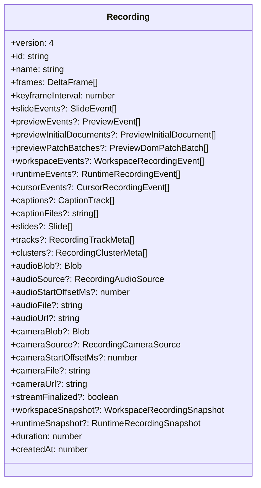
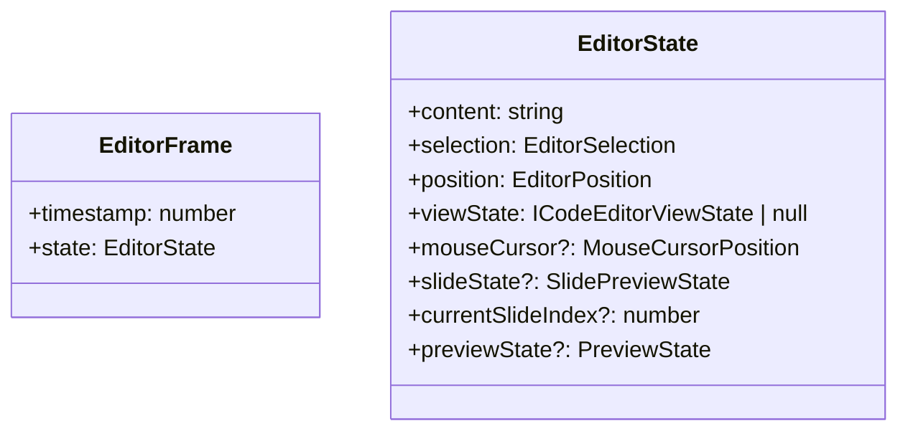

# Data Structures Documentation

This document describes the current recording and playback data structures used by Next Editor.

## Recording Overview


```mermaid
classDiagram
    class Recording {
        +version: 4
        +id: string
        +name: string
        +frames: DeltaFrame[]
        +keyframeInterval: number
        +slideEvents?: SlideEvent[]
        +previewEvents?: PreviewEvent[]
        +previewInitialDocuments?: PreviewInitialDocument[]
        +previewPatchBatches?: PreviewDomPatchBatch[]
        +workspaceEvents?: WorkspaceRecordingEvent[]
        +runtimeEvents?: RuntimeRecordingEvent[]
        +cursorEvents?: CursorRecordingEvent[]
        +captions?: CaptionTrack[]
        +captionFiles?: string[]
        +slides?: Slide[]
        +tracks?: RecordingTrackMeta[]
        +clusters?: RecordingClusterMeta[]
        +audioBlob?: Blob
        +audioSource?: RecordingAudioSource
        +audioStartOffsetMs?: number
        +audioFile?: string
        +audioUrl?: string
        +cameraBlob?: Blob
        +cameraSource?: RecordingCameraSource
        +cameraStartOffsetMs?: number
        +cameraFile?: string
        +cameraUrl?: string
        +streamFinalized?: boolean
        +workspaceSnapshot?: WorkspaceRecordingSnapshot
        +runtimeSnapshot?: RuntimeRecordingSnapshot
        +duration: number
        +createdAt: number
    }
```

The shipped app creates version `4` recordings and stores them in SCR3. There is a single supported schema version — older versions are not decodable, with no legacy compatibility path.

## The `Recording` Shape

Defined in `src/core/src/types.ts`:

```ts
interface Recording {
  version: 4;
  id: string;
  name: string;
  frames: DeltaFrame[];
  keyframeInterval: number;
  slideEvents?: SlideEvent[];
  previewEvents?: PreviewEvent[];
  previewInitialDocuments?: PreviewInitialDocument[];
  previewPatchBatches?: PreviewDomPatchBatch[];
  workspaceEvents?: WorkspaceRecordingEvent[];
  workspaceAssets?: WorkspaceRecordingAsset[]; // transient decode/encode handoff only
  runtimeEvents?: RuntimeRecordingEvent[];
  cursorEvents?: CursorRecordingEvent[];
  captions?: CaptionTrack[]; // parsed subtitle tracks carried inline
  captionFiles?: string[]; // sibling .vtt/.srt filenames a hosted .ne declares
  slides?: Slide[];
  tracks?: RecordingTrackMeta[];
  clusters?: RecordingClusterMeta[];
  audioBlob?: Blob;
  audioSource?: RecordingAudioSource; // "microphone" | "external"
  audioStartOffsetMs?: number;
  audioFile?: string; // sibling audio filename when audio is stored outside the .ne
  audioUrl?: string; // resolved URL for external audio (hosted or imported object URL)
  cameraBlob?: Blob;
  cameraSource?: RecordingCameraSource; // "camera"
  cameraStartOffsetMs?: number;
  cameraFile?: string; // sibling video filename when camera is stored outside the .ne
  cameraUrl?: string; // resolved URL for the external camera video (hosted or imported object URL)
  streamFinalized?: boolean; // true once a decoded SCR3 stream included its footer
  workspaceSnapshot?: WorkspaceRecordingSnapshot;
  runtimeSnapshot?: RuntimeRecordingSnapshot;
  duration: number;
  createdAt: number;
}
```

Notable current fields:

- `previewInitialDocuments` seeds preview replay with the rrweb Meta + FullSnapshot events.
- `previewPatchBatches` carries the incremental rrweb events that play after that seed.
- `cursorEvents` gives higher-fidelity cursor playback than relying on frame snapshots alone.
- `audioFile`/`audioUrl` and `cameraFile`/`cameraUrl` describe audio/camera stored as sibling files rather than inline blobs; `audioStartOffsetMs`/`cameraStartOffsetMs` compensate for recorder warmup so playback stays aligned.
- `captions` carries parsed subtitle tracks inline; `captionFiles` instead names sibling `.vtt`/`.srt` files that a hosted recording loads at play time.
- `streamFinalized` distinguishes a complete decoded stream from a still-growing progressive-download prefix.
- Workspace projects store `{ kind: "asset", assetId, mimeType, size }` descriptors rather than
  base64. `workspaceAssets` exists only while raw SCR3 asset segments are handed to IndexedDB; it
  is stripped before the recording enters playback state.
- API client request/response data is not a top-level recording field — it travels inside `previewEvents` (see [Preview Replay Data](#preview-replay-data) and [API Client Data](#api-client-data)).

## Frame Data


```mermaid
classDiagram
    class EditorFrame {
        +timestamp: number
        +state: EditorState
    }

    class EditorState {
        +content: string
        +selection: EditorSelection
        +position: EditorPosition
        +viewState: ICodeEditorViewState | null
        +mouseCursor?: MouseCursorPosition
        +slideState?: SlidePreviewState
        +currentSlideIndex?: number
        +previewState?: PreviewState
    }
```

`Recording.frames` is an array of delta-compressed `DeltaFrame` entries (`src/core/src/utils/deltaTypes.ts`), not raw `EditorFrame`s. Playback reconstructs the full `EditorFrame` from the nearest earlier keyframe plus subsequent deltas via `reconstructFrameAtIndex` (`src/core/src/utils/frameDelta.ts`). SCR3 format v3 introduced bounded, versioned Monaco edit batches for ordinary local changes, with base/result integrity hashes; format v4 adds raw workspace-asset segments; format v5 stores runtime terminal output as deltas between checkpoints and dedups workspace file content against the header snapshot. Bulk replacement, imported or remote state, preview HTML, and other non-local changes retain the verified DMP delta. Existing SCR3 v2–v4 recordings remain readable.

## Cursor Data

Current recordings separate cursor sampling from editor text deltas.

```ts
interface CursorRecordingEvent extends MouseCursorPosition {
  timestamp: number;
}
```

`MouseCursorPosition` also carries richer layout-relative metadata than older viewport-only cursor samples:

- `coordinateSpace?: "viewport" | "root"`
- `target?: CursorTargetSnapshot`
- `tween?: CursorTweenSnapshot`
- optional `pressure`, `angle`, `hover`, and `flags` metadata

That lets playback (`src/core/src/utils/cursorCoordinates.ts`, `cursorReplay.ts`) remap a recorded cursor onto the current UI layout more reliably.

`cursorEvents` is the pointer's only full-rate record. A frame's `mouseCursor` is a legacy copy: playback derives cursor samples from frames only for older recordings that have no `cursorEvents`. A capture triggered by a pointer move gives the frame encoder the last stored pointer, so it stores a frame only when it also changed something the frame track owns, such as scroll or preview state. The next capture that is not a pointer move stores the pointer's current position.

## Preview Replay Data

Preview playback is rrweb-based. Both structures carry rrweb events verbatim as
`PreviewRecordedEvent[]`, which is structurally compatible with rrweb's `eventWithTime`;
the recording engine treats them as opaque JSON and only reads the envelope `time` /
`documentId`.

- `PreviewInitialDocument[]` captures the seed: the rrweb Meta + FullSnapshot pair.
- `PreviewDomPatchBatch[]` captures the ordered incremental rrweb events that follow,
  batched per animation frame.

```ts
interface PreviewRecordedEvent {
  type: number; // rrweb EventType
  data: unknown;
  timestamp: number;
  delay?: number;
}
```

At replay time the app reassembles the full ordered event stream from the seed plus all
patch batches and drives an rrweb `Replayer` from the recording timeline (seek-driven, no
autoplay) via `applyPreviewPatchReplay` (`PreviewPatchReplayInput` in `src/core/src/types.ts`).
Because DOM, scroll, input, and pointer all live in that one stream, they stay
coupled — restoring recorded preview state without a fresh runtime rerun or a manual save
point. `PREVIEW_RRWEB_FORMAT_VERSION` is `2` (bumped from the legacy custom-op format `1`,
whose separate DOM-patch path has been removed).

## Caption Data

Subtitles are stored as parsed caption tracks rather than raw subtitle files. The parser
(`src/captions/parseCaptions.ts`) accepts WebVTT and SubRip, strips cue tags, and
normalizes/sorts cues; the language is inferred from the filename suffix
(e.g. `lesson.es.vtt` → `es`).

```ts
interface CaptionWord {
  start: number; // ms
  end: number; // ms
  text: string;
}

interface CaptionCue {
  start: number; // ms, relative to the recording timeline
  end: number; // ms
  text: string;
  words?: CaptionWord[]; // optional word-level timing
}

interface CaptionTrack {
  id: string;
  language: string; // BCP-47-ish tag, e.g. "en" or "pt-BR"
  label?: string;
  cues: CaptionCue[];
  default?: boolean;
}
```

- A recording can carry multiple tracks. `CaptionsOverlay` picks the track matching the
  viewer's preferred language, otherwise the `default` track, otherwise the first.
- The active cue is found by binary search over `cues` against the live timeline time, so
  caption lookup stays cheap on every tick.
- Caption enabled-state and language preference are persisted in `localStorage` by the
  caption store (`src/stores/captionStore.ts`), independent of any single recording.
- On the container, captions are either inlined as `captions` or referenced by
  `captionFiles`; sibling files are fetched relative to the `.ne` URL during URL loading.
- The `ADD_CAPTION_TRACK` machine event adds or replaces a track in the loaded recording's
  `captions` directly rather than riding the timeline (see `docs/state-machines.md`).

## API Client Data

Runtime lessons include an in-preview HTTP API client. Its interactions are recorded as
`PreviewEvent`s (not a separate top-level channel) so they replay on the same preview
timeline as DOM snapshots. The recorded shapes are flat (no live UI state):

```ts
interface ApiClientRecordedRequest {
  method: string;
  path: string;
  headers: Record<string, string>;
  body: string | undefined;
}

type ApiClientRecordedResult =
  | {
      ok: true;
      status: number;
      statusText: string;
      headers: [string, string][];
      body: string;
      durationMs: number;
    }
  | { ok: false; error: string; durationMs: number };
```

The relevant `PreviewEvent.type` values are `api_client_mode` (browser ↔ API toggle),
`api_client_request`, `api_client_response`, `api_client_request_tab` (headers ↔ body tab),
and `api_client_inspect_history`. At replay time these are folded into an
`ApiClientReplayState` (`request`, `result`, `sending`, `history`) on `PreviewState`, which
drives a read-only rendering of the panel. Live capture and replay share the same flat
result shape, so a recorded response is reused verbatim for both the store update and the
recording callback.

## Audio And Camera Data

```ts
type RecordingAudioSource = "microphone" | "external";
type RecordingCameraSource = "camera";
```

- `audioBlob` remains the assembled audio playback facade that UI surfaces consume; `audioFile`/`audioUrl` describe audio stored as a sibling file instead.
- **Camera video is always external — its bytes never live inside an SCR3 stream** (exported or
  persisted). The stream carries only a camera reference + metadata
  (`cameraFile`, `cameraUrl`, `cameraSource`, `cameraStartOffsetMs`). The camera bytes
  live as:
  - an in-memory `cameraBlob` on the `Recording` (just recorded, or paired from an imported file),
  - a separate IndexedDB blob (the `recording-camera` object store) for persisted recordings, and/or
  - a hosted sibling URL resolved to `cameraUrl` for `.ne` files loaded over the network.
    On export, a recording with a camera produces two artifacts — a small `.ne` plus a sibling video.
    On load, `cameraFile` resolves to a `cameraUrl` (hosted URL or imported object URL) and plays
    through a native `<video>` so the browser range-streams it. A missing video is non-fatal and
    silent: the recording plays without the camera overlay.
- `tracks` and `clusters` describe the recording's timeline: per-track metadata (editor and
  event tracks, plus audio and camera references) and the keyframe-led clusters that SCR3
  segments are grouped by. Both are written into the SCR3 metadata.
- During capture the take's audio is the recorder's finalized blob, stored and exported as a
  sibling file; the SCR3 stream never carries audio bytes. Camera is captured as one finalized
  blob when the camera recorder stops (no per-chunk streaming, so camera is not crash-resilient
  mid-recording).

## Provider Context Shapes

The app splits editor access into a few focused surfaces:

- `NextEditorActionsContext` (`useNextEditorActions`): stable imperative controls and storage helpers.
- `useNextEditorMetadata()`: coarse recording and playback flags.
- `useNextEditorPlayback()`: editor actor, playback speed, volume, and duration.
- `useLiveTime()`: the high-frequency playhead selector for tick-driven UI.

Important action methods include:

- `loadRecording(recording)`
- `extendRecording(recording)`
- `handlePreviewInitialDocument(document)`
- `handlePreviewPatchBatch(batch)`
- `addCaptionTrack(recordingId, track)`
- `exportAsFile(recording, filename?)`

## SCR3 Metadata

At the container level, SCR3 metadata includes:

- recording identity and timestamps
- `version`
- duration
- stream-oriented `tracks` and `clusters`
- audio and camera MIME hints
- `audioStartOffsetMs`
- `cameraStartOffsetMs`
- `audioFile` / `audioUrl` and `cameraFile` / `cameraUrl` when audio/camera is stored as a sibling file instead of inline
- `captions` (inline parsed tracks) and/or `captionFiles` (sibling `.vtt`/`.srt` references)

Segments carry raw content-addressed workspace assets once plus append-only, time-clustered frame
and event payloads. Audio and camera bytes remain sibling media files:

```
┌─────────────────────────────────────────┐
│ Magic Number: "SCR3" (4 bytes)           │
├─────────────────────────────────────────┤
│ Format version + flags                   │
├─────────────────────────────────────────┤
│ Deflated msgpack metadata                 │
├─────────────────────────────────────────┤
│ Raw workspace asset segments (optional)   │
├─────────────────────────────────────────┤
│ Frame and event segments                  │
├─────────────────────────────────────────┤
│ Footer segment index                      │
└─────────────────────────────────────────┘
```

`src/storage/recordingCodec.ts` implements encode/decode; `src/storage/recordingCodec.worker.ts` runs it off the main thread (via `recordingCodecClient.ts`); `src/storage/streamingRecordingCodec/` implements the incremental prefix reader/writer used for progressive playback (see `docs/streaming-playback.md`).

## Machine Context Types

Defined in `src/core/src/machine/types.ts`.

### EditorMachineContext

The complete state machine context:

```typescript
interface EditorMachineContext {
  timeline: TimelineState;
  session: RecordingSession | null;
  sessionRevision: number; // bumped on every in-place session mutation
  recording: Recording | null;
  currentFrame: EditorFrame | null;
  audio: AudioState;
  camera: CameraState;
  editorRefs: EditorRefs;
  getEditorInstance: () => monaco.editor.IStandaloneCodeEditor | null;
  enableAudioRecording: boolean;
  enableCameraRecording: boolean;
  pauseOnUserInteraction: boolean;
  error: string | null;

  // Replay cursors — one per append-only event stream
  lastAppliedFrameIndex: number;
  lastAppliedPreviewEventIndex: number;
  lastAppliedSlideEventIndex: number;
  lastAppliedWorkspaceEventIndex: number;
  lastAppliedRuntimeEventIndex: number;
  lastAppliedPreviewState?: PreviewState;

  // Playback bookkeeping
  lastSyncTime?: number;
  hasManualWorkspaceOverride: boolean;
  pendingPlaybackEditorSync: boolean;
  playbackAudioSpawned: boolean;

  // Snapshot/state getters and appliers (slides, preview, workspace, runtime)
  applySlideState?: (slideState: SlidePreviewState, currentSlideIndex: number) => void;
  applySlides?: (slides: Slide[]) => void;
  applyPreviewState?: (previewState: PreviewState) => void;
  applyPreviewPatchReplay?: (input: PreviewPatchReplayInput) => void;
  getSlideState?: () => { previewState: SlidePreviewState; currentSlideIndex: number } | null;
  getSlides?: () => Slide[];
  getPreviewState?: () => PreviewState | null;
  getWorkspaceSnapshot?: () => WorkspaceRecordingSnapshot | null;
  applyWorkspaceSnapshot?: (snapshot: WorkspaceRecordingSnapshot) => void;
  getRuntimeSnapshot?: () => RuntimeRecordingSnapshot | null;
  applyRuntimeSnapshot?: (snapshot: RuntimeRecordingSnapshot) => void;

  // Lifecycle callbacks
  onRecordingStart?: () => void;
  onRecordingStop?: (recording: Recording) => void;
  onSeek?: (time: number) => void;
  onError?: (error: Error) => void;
}
```

### TimelineState

```typescript
interface TimelineState {
  currentTime: number; // Position in ms
  duration: number; // Total duration in ms
  speed: number; // Playback multiplier
  volume: number; // 0.0 - 1.0
}
```

### RecordingSession

`RecordingSession` is a mutable, append-only capture buffer: its object identity — and the identity of every array field — stays stable for the whole recording so appenders can push in place (O(1) per sample) instead of spreading into new arrays. `EditorMachineContext.sessionRevision` is bumped on every mutation so reference-equality selectors can still detect a change.

```typescript
interface RecordingSession {
  startedAt: number; // Date.now() wall-clock, metadata only
  startedAtPerf: number; // performance.now(), monotonic origin for in-session timestamps
  frames: DeltaFrame[]; // Already-compressed frames, built incrementally
  encoder: FrameStreamEncoderState; // Incremental keyframe/delta encoder state
  slideEvents: SlideEvent[];
  previewEvents: PreviewEvent[];
  previewInitialDocuments: PreviewInitialDocument[];
  previewPatchBatches: PreviewDomPatchBatch[];
  workspaceEvents: WorkspaceRecordingEvent[];
  runtimeEvents: RuntimeRecordingEvent[]; // Full-snapshot checkpoints + terminal-output deltas
  lastRuntimeSnapshot?: RuntimeRecordingSnapshot; // Resolved state of the last runtime event (diff base)
  runtimeCheckpointProgress?: RuntimeCheckpointProgress; // Places the next checkpoint
  cursorEvents: CursorRecordingEvent[]; // High-cadence fake cursor samples
  lastMousePosition: MouseCursorPosition;
  lastCapturedViewStateRef?: CapturedViewStateRef; // Perf: reuse saveViewState() result and, by its versionId + modelUri, the content string when unchanged
}
```

Note: the session holds no audio or camera media — each is captured as a single finalized blob when its recorder stops, not streamed per-chunk.

## Summary

The important structural shift is that Next Editor now treats recordings as append-only timeline objects with richer preview, cursor, workspace, runtime, audio, and camera channels, rather than as a text-only capture with a few side fields.
