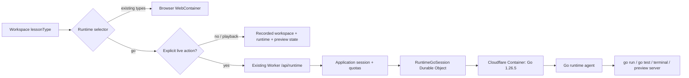

# Selective Go Lessons — Implementation Plan

> Status: **proposed**. Last reviewed 2026-07-18.
>
> This plan narrows the existing [remote runtime design](./remote-runtime-design.md) and
> [implementation plan](./remote-runtime-implementation-plan.md) to one product outcome:
> support Go lessons without replacing WebContainer for any existing lesson type.

## 1. Decision summary

Next Editor will use two runtime implementations selected per workspace:

| Workspace lesson type                           | Runtime                                  | Provisioning behavior                                        |
| ----------------------------------------------- | ---------------------------------------- | ------------------------------------------------------------ |
| Existing HTML, JavaScript, and TypeScript types | Browser WebContainer                     | Unchanged                                                    |
| `go`                                            | Cloudflare remote Go runtime             | Created only after an explicit Run, Test, or Terminal action |
| Recorded lesson playback                        | Recorded workspace/runtime/preview state | No live runtime unless the viewer explicitly starts one      |

The `RemoteContainer` compatibility surface is an internal reuse mechanism. It does **not**
change the product default and does not route existing lessons away from WebContainer.

### Locked v1 choices

1. Add exactly one new workspace lesson type: `go`.
2. Keep WebContainer as the permanent default for every existing lesson type.
3. Use the existing `remote-runtime/` implementation for live Go execution.
4. Pin the first remote image to `go1.26.5`.
5. Require an authenticated application user to start an interactive Go runtime.
6. Allow public playback of a recorded Go lesson without starting a container.
7. Start a container only from an explicit user action; opening a lesson never incurs runtime cost.
8. Use `go mod download` as the default initialization command and `go run .` as the default runner.
9. Keep runtime previews on an isolated preview origin and never expose editor cookies or secrets to
   user code.
10. Do not add a D1 lesson-catalog column for v1. The `.ne` recording already carries the workspace
    project and its `lessonType`. Catalog badges/filtering can add explicit metadata later.

## 2. Goals

- Authors can create, run, test, preview, record, upload, and publish a Go lesson.
- Viewers can play a published Go lesson without provisioning live compute.
- An authenticated viewer can opt into an interactive Go sandbox and run the recorded workspace.
- Go CLI programs show output in the existing runner and terminal surfaces.
- Go HTTP servers open through the existing preview panel when the agent reports a listening port.
- Workspace edits synchronize bidirectionally between the editor and the selected runtime.
- Switching between Go and an existing lesson tears down the old runtime and never boots both.
- Existing lessons retain their current boot behavior, performance, offline capability, and cost.

## 3. Non-goals

- Replacing WebContainer for JavaScript or TypeScript projects.
- Running a native Go toolchain inside WebContainer or directly in the browser.
- Supporting Python, Rust, Java, or arbitrary custom images in this release.
- Persisting a remote container between browser sessions.
- Starting paid compute during passive playback.
- Anonymous live execution in the initial rollout.
- Moving collaboration, Yjs, voice, lesson CRUD, QStash cleanup, or React SSR to Go.
- Implementing a full Go language server in v1. Syntax highlighting and execution are required;
  `gopls` integration is a follow-up.

## 4. Current-state gaps

| Area              | Current state                                                         | Required change                                             |
| ----------------- | --------------------------------------------------------------------- | ----------------------------------------------------------- |
| Workspace model   | `WorkspaceLessonType` contains only browser/WebContainer types        | Add `go` and a separate runtime selector                    |
| Runtime predicate | `lessonRunsInWebContainer()` also gates terminal and preview UI       | Separate runtime selection from runtime-capability checks   |
| Runtime hooks     | Session and workspace-sync hooks are typed directly as `WebContainer` | Depend on the shared structural runtime surface             |
| Runtime boot      | One shared WebContainer singleton                                     | Preserve it and add a distinct lazy remote-Go boot path     |
| Runner defaults   | `pnpm install` / `pnpm dev`                                           | Select defaults by runtime kind                             |
| Monaco            | `.go` falls back to plaintext                                         | Register Monaco's Go grammar and infer the `go` language id |
| Starters          | No Go starter                                                         | Add `go.mod`, `main.go`, and `main_test.go` starter files   |
| ZIP import        | Framework detection begins from `package.json`                        | Detect `go.mod` or Go source before JavaScript fallback     |
| Collaboration     | Lesson-type validation enumerates existing types                      | Accept and project `go` without changing the Yjs protocol   |
| Remote client     | Implemented in isolated `remote-runtime/` package                     | Add it as a lazy application dependency                     |
| Go agent/image    | Implemented and unit/in-process tested                                | Complete Docker, Wrangler, and staging validation           |
| Runtime Worker    | Implemented as a standalone control plane with temporary HMAC auth    | Integrate with the existing Worker auth and deployment      |

## 5. User experience

### 5.1 Authoring a Go lesson

1. The author selects **Go** from the workspace type menu.
2. Next Editor loads a starter project without starting a container.
3. The first Run, Test, or Terminal action checks authentication and runtime availability.
4. The app provisions a `go1.26.5` session and mounts the current workspace.
5. The runner executes `go mod download` once, then `go run .`.
6. CLI output appears in the runner. A listening HTTP port appears in Preview.
7. Recording captures workspace changes, runtime state, terminal output, and preview snapshots using
   the existing recording model.
8. Publishing follows the existing `.ne` and media upload flow.

### 5.2 Watching a Go lesson

1. The lesson loads its recorded workspace and timeline normally.
2. Playback restores recorded preview/runtime state; it does not contact the runtime API.
3. The viewer can inspect and edit `.go` files locally.
4. If the viewer clicks Run, Test, or Terminal, the app provisions a fresh sandbox from the current
   workspace after authentication and quota checks.

### 5.3 Failure behavior

- Authentication required: show a sign-in action without discarding workspace edits.
- Runtime disabled or unavailable: playback and editing remain available; live controls show an
  actionable unavailable state.
- Quota exhausted: preserve the workspace and show the server-provided quota message.
- Provisioning failure: tear down any partial reservation and allow retry.
- Lost WebSocket: use the implemented resume path; surface a terminal error if recovery expires.
- Lesson-type switch or project replacement: destroy the remote session before activating the next
  runtime.

## 6. Runtime selection model

Do not expand `lessonRunsInWebContainer()` to include Go. Introduce explicit concepts instead:

```ts
export type WorkspaceRuntimeKind = "webcontainer" | "remote-go";

export function runtimeKindForLessonType(lessonType: WorkspaceLessonType): WorkspaceRuntimeKind {
  return lessonType === "go" ? "remote-go" : "webcontainer";
}

export function lessonHasExecutableRuntime(lessonType: WorkspaceLessonType): boolean {
  return lessonType === "go" || lessonRunsInWebContainer(lessonType);
}
```

`lessonHasExecutableRuntime()` should gate Terminal, runner settings, and runtime-managed Preview.
`runtimeKindForLessonType()` should be the only selector used to choose a boot implementation.

For v1 the mapping is derived from `lessonType`, which is already serialized in workspace snapshots,
recordings, persistence, and collaboration metadata. Do not introduce a second persisted runtime
field until more than one remote language or image choice exists.

## 7. Target architecture



### 7.1 Browser boundary

Add a small generic runtime facade used by the editor hooks:

- filesystem (`fs`, `mount`, and `export`);
- process spawn/input/output/exit/kill/resize;
- runtime events (`server-ready`, `port`, `error`, and `preview-message`);
- preview-script injection;
- teardown.

Both WebContainer and the implemented `RemoteContainer` satisfy this surface. Keep their lifecycle
state separate:

- the existing shared WebContainer singleton remains untouched;
- the remote Go instance is scoped to the active project/session;
- changing runtime kind always tears down the previous instance;
- only the selected implementation is dynamically imported.

### 7.2 Worker and container boundary

Promote the reviewed standalone control-plane implementation into the existing `infra/` deployment,
as the original remote-runtime design intended:

- mount authenticated control routes at `/api/runtime`;
- reuse the existing application session instead of the standalone external HMAC identity token;
- return a short-lived session-scoped token for the runtime WebSocket;
- add runtime quota tables through a normal D1 migration;
- export `RuntimeGoSessionDurableObject` from the main Worker;
- add the container, Durable Object, and quota bindings to `infra/wrangler.toml`;
- preserve the current agent, protocol, client, and conformance packages rather than rewriting them.

The production preview hostname must be isolated from `nexteditor.dev`. Preview ingress must strip
cookies and authorization, validate the session/port target, preserve HTTP and WebSocket upgrades,
inject only the approved preview recorder script, and set the documented CORP/COEP headers.

## 8. Implementation phases

### Phase 0 — Validate the existing remote-runtime foundation

This is a release prerequisite because package-level implementation exists but environment-dependent
checks are still pending.

Tasks:

1. Build `remote-runtime/images/Dockerfile.base` for `linux/amd64`.
2. Build `remote-runtime/Dockerfile.go1.26.5`.
3. Run the agent health, WebSocket attach, `go version`, PTY, filesystem, port, and preview smoke tests
   through Docker.
4. Run the checked-in conformance suite in direct-agent mode.
5. Run the standalone Worker under `wrangler dev` with local D1 and Docker.
6. Run the conformance suite in full boot mode through the Worker.
7. Record actual image size, cold-start time, memory use, and teardown behavior.

Acceptance:

- Dockerized agent and full Worker boot conformance pass.
- `go run .` opens a detected port and renders through the preview proxy.
- A failed provision and an idle session both release their quota reservations.
- No editor or production-infra change proceeds if these checks reveal a platform blocker.

### Phase 1 — Add Go as an editable workspace type

Primary files:

- `src/types/workspace.ts`
- `src/stores/workspaceProjectSupport.ts`
- `src/collaboration/projectDocument.ts`
- `src/utils/workspaceZipImport.ts`
- `src/starters/go.ts`
- `src/starters/index.ts`
- `src/components/EditorHeader.tsx`
- `src/monaco/runtime.ts`

Tasks:

1. Add `"go"` to `WorkspaceLessonType` and all canonical validation sets.
2. Keep `"go"` out of `WEB_CONTAINER_LESSON_TYPES`.
3. Add `runtimeKindForLessonType()` and `lessonHasExecutableRuntime()`.
4. Map `.go` to Monaco's `go` language id and import the Go basic-language contribution.
5. Add a lazily loaded Go starter with:
   - a pinned `go.mod`;
   - `main.go` containing a small HTTP server listening on `:8080`;
   - `main_test.go` with one passing test.
6. Add Go to the workspace-type selector.
7. Detect `go.mod` or at least one `.go` source file during ZIP import before falling back to
   HTML/JavaScript detection.
8. Add/update file icons and labels where Go would otherwise display as generic plaintext.

Acceptance:

- A fresh Go workspace opens with Go syntax highlighting.
- Go projects round-trip through workspace persistence, ZIP import/export, recording snapshots, and
  collaboration projection without falling back to `html-css`.
- Selecting Go does not boot WebContainer or a remote session.
- Existing workspace fixtures and lesson-type behavior remain unchanged.

### Phase 2 — Introduce the selective runtime facade

Primary files:

- `src/contexts/WebContainerRuntimeContext.ts` (split/rename toward generic runtime contracts)
- `src/contexts/webContainerRuntimeSupport.ts`
- `src/contexts/useWebContainerRuntimeSession.ts`
- `src/contexts/useWebContainerWorkspaceSync.ts`
- `src/contexts/WebContainerRuntimeProviderImpl.tsx`
- `src/hooks/useWebContainerRuntime.ts`
- `src/components/CodeEditor.tsx`
- `src/components/preview/usePreviewController.ts`

Tasks:

1. Define the structural `RuntimeContainer` and `RuntimeProcess` types at an application boundary.
2. Generalize session and workspace-sync hooks from concrete `WebContainer` types to that boundary.
3. Preserve `getOrBootSharedWebContainer()` as the only WebContainer boot path.
4. Add a distinct `getOrBootRemoteGoContainer()` that dynamically imports
   `@next-editor/remote-runtime`.
5. Add a `RuntimeProvider` selector that activates one implementation from `lessonType`.
6. Rename runtime contexts/hooks to generic names, using temporary compatibility re-exports only if
   required to keep the refactor reviewable.
7. Replace UI gates based on `lessonRunsInWebContainer()` with the correct capability or runtime-kind
   predicate.
8. Ensure reset, project replacement, route change, and unmount call the selected implementation's
   teardown exactly once.

Acceptance:

- Existing lesson types still import and boot the real `@webcontainer/api` implementation.
- Go uses no WebContainer code path.
- The remote-runtime client is absent from normal JS lesson chunks until a Go live action occurs.
- Terminal, filesystem synchronization, process output, port events, and Preview work through a
  mocked remote implementation in focused hook tests.

### Phase 3 — Integrate the runtime control plane with current infrastructure

Primary files:

- `infra/wrangler.toml`
- `infra/worker/index.ts`
- `infra/worker/env.d.ts`
- `infra/worker/routes/runtime.ts` (new)
- `infra/worker/runtime/sessionDurableObject.ts` (new/promoted)
- `infra/worker/runtime/preview.ts` (new/promoted)
- `infra/db/migrations/0010_remote_runtime_quotas.sql` (new)
- `package.json` and `bun.lock`

Tasks:

1. Add the reviewed `@cloudflare/containers` dependency and container configuration.
2. Promote the standalone session Durable Object and preview helpers without changing the RCP
   protocol.
3. Authenticate session creation through `getCurrentUser()` and the existing first-party session.
4. Keep the returned WebSocket/preview token scoped to one user and one session.
5. Add atomic concurrent-session and daily-minute quota admission to the existing D1 database.
6. Finalize usage exactly once on explicit teardown, idle stop, failed boot, or container error.
7. Add the production preview hostname route only after its DNS/TLS choice is explicitly approved.
8. Keep local preview paths for `wrangler dev` and automated tests.
9. Add a server-side `GO_RUNTIME_ENABLED` kill switch that fails closed.

Acceptance:

- Anonymous session creation returns `401`.
- A signed-in user can create, use, and destroy only their own session.
- Concurrent and daily quotas reject atomically with structured `429` responses.
- Main app responses retain their cross-origin-isolation headers.
- Preview responses contain no editor cookie/auth data and preserve HMR WebSockets.
- Disabling the feature flag prevents new sessions without disrupting lesson playback.

### Phase 4 — Connect live Go execution

Tasks:

1. Add per-runtime runner defaults:
   - WebContainer: keep the existing `pnpm install` / `pnpm dev` behavior;
   - remote Go: `go mod download` / `go run .`.
2. Do not provision from component mount, workspace load, recording load, or playback start.
3. Provision on the first explicit Run, Test, or Terminal action.
4. Mount the current workspace, not merely the original lesson snapshot.
5. Run initialization once per remote session and retry safely after a failed initialization.
6. Reuse the existing runner output and terminal UI.
7. Route detected ports into the existing Preview controller.
8. Add a **Run tests** action executing `go test ./...`; it may initially reuse the runner output
   panel rather than introducing a new test-results UI.
9. Preserve unsaved local edits when auth, quota, or provisioning fails.

Acceptance:

- `go run .`, `go test ./...`, an interactive shell, process kill, and PTY resize work from the
  editor.
- Editing `main.go` synchronizes into the container; container-created files synchronize back.
- The starter HTTP server renders in Preview and reloads after restart.
- Opening or replaying the same Go lesson creates zero runtime sessions.
- Switching from Go to React destroys the Go session and boots WebContainer only if existing React
  behavior calls for it.

### Phase 5 — Recording, publishing, and playback verification

Tasks:

1. Verify `lessonType: "go"` survives every SCR3 snapshot/event encoding and decoding path.
2. Verify runtime and terminal snapshots remain implementation-neutral during recording/replay.
3. Confirm recorded preview state renders without a live Go session.
4. Record a complete Go lesson, upload it through the current lesson flow, publish it, and replay it
   from a clean browser profile.
5. Verify an authenticated viewer can branch from the replayed/current workspace into a fresh live
   Go session.
6. Keep public `Lesson` and D1 row shapes unchanged for v1 unless product UI requires a catalog Go
   badge before opening the recording.

Acceptance:

- Public playback is runtime-free and pixel/functionally equivalent to the author's captured lesson.
- Live execution starts only after explicit viewer intent.
- Existing JS/TS recordings decode and replay with no migration.

### Phase 6 — Hardening and rollout

Tasks:

1. Run the existing reconnect, protocol fuzz, archive traversal, process-limit, and 30-minute soak
   checks against the integrated deployment.
2. Add telemetry for requested/created/failed/stopped sessions, boot latency, active minutes, quota
   hits, reconnects, Go commands, and preview readiness. Never log source, terminal contents, or
   environment-variable values.
3. Roll out behind both server and UI flags:
   - internal authors;
   - selected published Go lessons;
   - authenticated viewers;
   - general Go lesson creation.
4. Monitor container concurrency, vCPU, memory, disk, egress, cold-start latency, and orphan cleanup.
5. Document operational rollback: disable new sessions, allow active sessions to expire, and leave
   playback/editor access available.

Acceptance:

- No unresolved high-severity conformance or sandbox-escape findings.
- Quota and cost dashboards have alert thresholds before general rollout.
- The server kill switch has been exercised in staging.
- WebContainer metrics for existing lessons show no regression.

## 9. File-impact checklist

| Concern                           | Expected files                                                                    |
| --------------------------------- | --------------------------------------------------------------------------------- |
| Lesson type and runtime selection | `src/types/workspace.ts`                                                          |
| Canonical project validation      | `src/stores/workspaceProjectSupport.ts`                                           |
| Collaboration projection          | `src/collaboration/projectDocument.ts`                                            |
| Starter                           | `src/starters/go.ts`, `src/starters/index.ts`                                     |
| ZIP detection                     | `src/utils/workspaceZipImport.ts`                                                 |
| Monaco                            | `src/monaco/runtime.ts`                                                           |
| Workspace picker                  | `src/components/EditorHeader.tsx`                                                 |
| Runtime UI gates                  | `src/components/CodeEditor.tsx`, `src/components/preview/usePreviewController.ts` |
| Runtime facade/hooks              | `src/contexts/*Runtime*`, `src/hooks/use*Runtime*`                                |
| Remote client                     | `remote-runtime/src/`, root dependency wiring                                     |
| Go data plane                     | `remote-runtime/agent/`, `remote-runtime/Dockerfile.go1.26.5`                     |
| Cloudflare control plane          | promoted `remote-runtime/worker/src/*` under `infra/worker/runtime/`              |
| Auth/API                          | `infra/worker/routes/runtime.ts`, `infra/worker/index.ts`                         |
| Quotas                            | new D1 migration and typed queries                                                |
| Deployment                        | `infra/wrangler.toml`, deploy/runbook docs                                        |

## 10. Test matrix

| Layer                 | Required coverage                                                               |
| --------------------- | ------------------------------------------------------------------------------- |
| Workspace model       | `go` validation, persistence, equality, import/export, collaboration projection |
| Monaco                | `.go` maps to `go`; existing mappings unchanged                                 |
| Runtime selection     | Every existing type selects WebContainer; only `go` selects remote Go           |
| Lazy behavior         | Load/playback produces no session request; explicit live action produces one    |
| Shared runtime facade | Filesystem, mount, spawn, streams, PTY, ports, preview events, teardown         |
| Go agent              | Existing unit/integration/fuzz tests plus Docker conformance                    |
| Worker routes         | auth, ownership, tokens, validation, quotas, cleanup, feature flag              |
| Preview               | HTTP, headers, cookie stripping, HTML injection, WebSocket/HMR passthrough      |
| Editor integration    | runner, tests, terminal, file sync, reverse sync, project switch, error UX      |
| Recording             | Go capture/replay without live runtime; legacy JS/TS regression fixtures        |
| Staging               | cold boot, warm boot, reconnect, idle stop, quota stop, 30-minute soak          |

## 11. Security and cost requirements

- Treat all container code and preview output as untrusted.
- Never pass Worker secrets, Google credentials, session cookies, QStash credentials, D1 bindings,
  or R2 credentials into the container.
- Preserve the agent's workspace jail, archive traversal defenses, process/file/byte limits, and
  protocol flow control.
- Scope every control and WebSocket operation to the authenticated owner and session.
- Use a separate preview origin; strip cookies and authorization before proxying.
- Document and monitor the v1 outbound-internet policy (`enableInternet` is currently enabled).
- Use Cloudflare's `basic` instance type initially, as already selected for Go compilation.
- Keep the current configurable concurrent-session and daily-minute limits; choose production values
  from staging measurements rather than hard-coding assumptions in the client.
- Destroy on explicit teardown and use idle cleanup as a backstop.
- Never provision containers for crawlers, gallery cards, lesson detail fetches, or passive playback.

## 12. Risks and mitigations

| Risk                                                  | Impact                                      | Mitigation                                                                      |
| ----------------------------------------------------- | ------------------------------------------- | ------------------------------------------------------------------------------- |
| Existing UI treats “not WebContainer” as “no runtime” | Terminal/preview hidden for Go              | Split capability and implementation predicates before adding Go UI              |
| Runtime hook semantics drift                          | Broken terminal, sync, or Preview           | Reuse structural contract and run conformance against both implementations      |
| Passive lesson views create containers                | Unbounded cost                              | Explicit-action provisioning invariant with request-count regression tests      |
| Untrusted preview shares editor origin                | Account/session compromise                  | Dedicated preview origin, cookie stripping, origin validation, security headers |
| Failed boots leak reservations                        | Users become quota-locked                   | Atomic admission and idempotent finalization on every terminal path             |
| Go image is too slow or large                         | Poor author/viewer experience               | Complete Phase 0 measurements before editor integration; slim/pin image         |
| Global runner defaults remain Node-specific           | Go commands fail immediately                | Select runner profile by runtime kind                                           |
| `go` is omitted from a duplicated validator           | Recording/collaboration silently falls back | Centralize known lesson types where practical and add round-trip tests          |
| Remote outage blocks lesson viewing                   | Published content unavailable               | Playback must consume recordings without live compute                           |
| Existing lessons accidentally route remote            | Cost and behavior regression                | Exhaustive selector tests over every `WorkspaceLessonType`                      |

## 13. Definition of done

Selective Go lesson support is complete only when all of the following are true:

- A Go starter can be selected, edited, persisted, exported, collaborated on, recorded, uploaded,
  published, and replayed.
- Existing lesson types still use WebContainer with no runtime-selection or bundle regression.
- A public Go lesson opens and replays without creating a Cloudflare Container.
- An authenticated user can explicitly start a Go runtime and use `go run`, `go test`, Terminal, and
  HTTP Preview.
- Runtime auth, ownership, quota, teardown, and preview-isolation tests pass.
- Docker, `wrangler dev`, full conformance, staging, reconnect, and soak checks pass.
- Production preview DNS/TLS and the remote D1 migration have been applied through separately
  authorized operational steps.
- Cost/usage telemetry and the server kill switch are live and documented.
- Rollback disables new live execution without breaking lesson editing or recorded playback.
