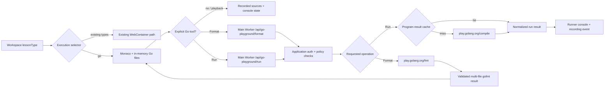

# Selective Go Lessons — Go Playground API Integration Plan

> Status: **implemented (Phases 1–3; Phase 4 rollout pending)**. Last reviewed 2026-07-18.
> Live Go tool requests are guarded by `GO_PLAYGROUND_ENABLED` in `infra/wrangler.toml`; keep the
> flag disabled until the Phase 0 upstream-contact checklist below is complete.
>
> This plan adds pure Go lessons to Next Editor by calling the official Go Playground compile and
> formatting APIs.
> It does not use Cloudflare Containers and does not integrate, modify, copy, replace, or depend on
> the standalone `remote-runtime/` package.

## 1. Decision summary

Next Editor will select an execution backend from the workspace lesson type:

| Workspace lesson type                           | Execution backend                  | Behavior                                         |
| ----------------------------------------------- | ---------------------------------- | ------------------------------------------------ |
| Existing HTML, JavaScript, and TypeScript types | Browser WebContainer               | Unchanged                                        |
| `go`                                            | Official Go Playground APIs        | Format or run only after an explicit user action |
| Recorded Go lesson playback                     | Recorded sources and console state | Never calls the Playground API automatically     |

The Go lesson feature is intentionally narrower than a Go development environment. It supports
small, self-contained teaching programs similar to the runnable snippets in
[`learn-go`](https://github.com/channyeintun/learn-go), not arbitrary Go repositories.

### Locked v1 choices

1. Add exactly one new workspace lesson type: `go`.
2. Keep WebContainer as the permanent execution backend for every existing lesson type.
3. Execute and format Go through the official `https://play.golang.org/compile` and
   `https://play.golang.org/fmt` APIs.
4. Route production requests through the existing Next Editor Worker rather than calling the
   upstream API directly from the browser.
5. Use the compile request shape proven in `learn-go`: `body`, `version=2`, and `withVet=true`;
   send only `body` for canonical gofmt so formatting does not add or remove imports.
6. Support up to 20 top-level `.go` files compiled together as one `package main` program.
7. Limit v1 lessons to pure, standard-library-focused programs that communicate through stdout and
   stderr.
8. Require an authenticated Next Editor user to execute or format code in v1; public playback
   remains available without live Playground calls.
9. Never call the API from lesson load, gallery views, recording load, or passive playback.
10. Do not add Containers, Durable Objects, runtime D1 tables, runtime WebSockets, agents, images, or
    preview infrastructure for Go lessons.
11. Do not pin a Go patch version. The official Playground follows the latest stable Go release.
12. Keep `remote-runtime/` preserved for a separate future plug-and-play project that may support
    full Go repositories.

## 2. Why the Worker proxies the API

The browser could post directly to `play.golang.org/compile`, as `learn-go` currently does, because
the service permits cross-origin requests. Production Next Editor should still use its existing
Worker as a thin proxy:

- the Go project asks third-party sites to contact the team before use and identify traffic with a
  unique user agent;
- browser JavaScript cannot reliably set the required `User-Agent` header;
- one application endpoint gives Next Editor authentication, request-size checks, rate limiting,
  caching, timeouts, telemetry, and an upstream kill switch;
- the browser depends on a stable first-party response contract rather than the upstream response
  shape;
- the upstream URL can change without requiring a client release.

This adds ordinary Worker requests but no per-user container allocation, idle compute, container
storage, or session lifecycle cost.

## 3. Supported lesson contract

### 3.1 Supported in v1

- one to 20 editable top-level `.go` files serialized to the Playground's txtar format;
- one `package main` program with a `main()` function across those files;
- language fundamentals, functions, methods, interfaces, generics, collections, errors, algorithms,
  and bounded concurrency examples;
- imports from the Go standard library when compatible with the Playground sandbox;
- explicit multi-file gofmt through the Playground's `/fmt` endpoint;
- compiler errors, vet diagnostics, stdout, stderr, panic output, and exit status;
- deterministic examples that finish within the Playground limits;
- recording and replay of source changes and console results.

### 3.2 Explicitly unsupported in v1

- arbitrary Go repositories or ZIP-imported Go projects;
- multiple packages, nested package trees, modules, or workspaces;
- third-party module dependencies, even if the current upstream implementation can download some
  modules;
- an interactive shell or Terminal;
- stdin prompts such as `fmt.Scan`;
- HTTP servers, listening ports, or Preview;
- outbound network access;
- persistent or user-controlled filesystem access;
- CGO, OS-specific binaries, subprocess management, or environment variables;
- benchmarks, long-running services, background processes, and programs that depend on real wall
  clock time;
- selecting or pinning a specific Go patch release;
- hidden exercise tests or grading.

Unsupported controls should be absent for Go lessons, not shown in a permanently disabled state.

### 3.3 Future extensions that do not change v1

The Playground also supports tests/examples and richer txtar layouts. A later product phase may add
visible tests, nested standard-library-only packages, or module metadata after usage proves the
need. Full project execution, external services, terminals, and servers remain a separate future
runtime-adapter project.

## 4. Protected `remote-runtime/` boundary

`remote-runtime/` is outside the implementation scope:

- do not edit files under `remote-runtime/`;
- do not import it from `src/` or `infra/`;
- do not add it as an application or Worker dependency;
- do not move or promote its client, Worker, protocol, agent, image, tests, or migrations;
- do not build or deploy it as part of Go lesson delivery;
- keep it available for later evaluation as an optional plug-and-play runtime.

The Go Playground integration must build, test, deploy, and operate independently of that package.

## 5. User experience

### 5.1 Authoring

1. The author selects **Go** from the workspace type menu.
2. Next Editor loads a small multi-file Go starter locally without booting WebContainer or making an
   API call.
3. Monaco provides Go syntax highlighting and a Playground-backed **Format Document** action.
4. The author records editing and explanation as usual.
5. Clicking **Format** or invoking Monaco's Format Document action sends all current top-level `.go`
   files to the first-party Worker and applies the returned gofmt result only if those files have not
   changed while the request was in flight.
6. Clicking **Run** sends the current top-level `.go` files to the first-party Worker endpoint.
7. The runner panel displays formatting or compiling/running state followed by output or diagnostics.
8. The recording captures source changes, explicit tool actions, and normalized console results.
9. Publishing continues through the existing `.ne` and media upload flow.

### 5.2 Playback

1. A viewer can load and play the recorded Go lesson without authentication and without calling the
   Playground API.
2. Recorded sources and console results replay from the lesson timeline.
3. Editing remains local until the viewer explicitly clicks **Format** or **Run**.
4. If the viewer is not authenticated, the Go tools open the existing sign-in flow without
   discarding edits.
5. An authenticated Format or Run uses the current files as a new request; it does not reuse the
   author's original files.

### 5.3 Failure behavior

- compile failure: show the upstream compiler diagnostics as a normal run result;
- vet diagnostics: display separately from runtime output and mark the result as needing attention;
- panic or non-zero exit: show stderr/output and an error state;
- upstream timeout: show a bounded “program timed out” result;
- upstream unavailable or rate-limited: preserve the sources and show a retryable service message;
- gofmt syntax failure: show the file/line diagnostic and leave every source unchanged;
- files edited while gofmt is in flight: discard the stale response rather than overwriting newer
  edits;
- application kill switch disabled: keep editing and playback available while hiding or disabling
  only live Format and Run;
- route change or a newer Format/Run: abort the obsolete browser request and ignore stale responses.

## 6. Execution selection model

Do not expand `lessonRunsInWebContainer()` to include Go and do not generalize the entire
WebContainer runtime for this feature. Add a small execution selector:

```ts
export type WorkspaceExecutionKind = "webcontainer" | "go-playground";

export function executionKindForLessonType(
  lessonType: WorkspaceLessonType,
): WorkspaceExecutionKind {
  return lessonType === "go" ? "go-playground" : "webcontainer";
}

export function lessonSupportsTerminal(lessonType: WorkspaceLessonType): boolean {
  return lessonRunsInWebContainer(lessonType);
}

export function lessonSupportsCodeRun(lessonType: WorkspaceLessonType): boolean {
  return lessonType === "go" || lessonRunsInWebContainer(lessonType);
}
```

Use the execution kind to choose the Run implementation. Keep capability predicates separate so a
Go lesson can expose Run and console output without exposing Terminal or Preview.

The mapping is derived from `lessonType`, which already travels with workspace snapshots,
recordings, persistence, and collaboration metadata. Do not persist a second execution-backend field
in v1.

## 7. Target architecture



### 7.1 Browser boundary

Add an app-specific client rather than a container compatibility layer:

```ts
type GoPlaygroundFile = {
  path: string;
  content: string;
};

type GoPlaygroundRunRequest = {
  files: readonly GoPlaygroundFile[];
};

type GoPlaygroundFormatRequest = GoPlaygroundRunRequest;

type GoPlaygroundFormatResult = {
  files: GoPlaygroundFile[];
};

type GoPlaygroundRunResult = {
  status: "success" | "compile-error" | "vet-error" | "runtime-error";
  output: string;
  compileErrors?: string;
  vetErrors?: string;
  exitCode?: number;
};
```

`GoPlaygroundClient` performs at most one abortable Run or Format request and has no filesystem,
mount, process, PTY, port, preview, or teardown API. The current Go files remain in the existing
workspace store.

### 7.2 Worker boundary

Add `POST /api/go-playground/run` to the main Worker. The route should:

1. check `GO_PLAYGROUND_ENABLED` and fail closed;
2. require the current application user;
3. accept JSON containing only a structured `files` array;
4. require one to 20 unique, top-level `.go` files with safe names;
5. require `package main`, standard-library-only imports, and no CGO or test files;
6. serialize the validated files deterministically into txtar;
7. enforce a 64 KiB UTF-8 limit on the final txtar program before proxying;
8. hash the serialized program plus request flags for cache lookup;
9. post URL-encoded `body`, `version=2`, and `withVet=true` upstream;
10. send a unique Next Editor user agent and a 20-second upstream timeout;
11. validate and normalize the upstream JSON response;
12. cache deterministic successful and compiler-error responses for at most one hour;
13. return structured `429`, `502`, and `504` errors for policy, upstream, and timeout failures;
14. record aggregate latency/status telemetry without logging sources or output.

Add `POST /api/go-playground/format` beside it. The route reuses the same auth, file-policy, txtar,
size, timeout, user-agent, and privacy boundaries; applies a separate per-user rate limit; posts
`body` to the upstream `/fmt` endpoint without the `imports` option; and accepts a response only when
it contains exactly the submitted file set in canonical txtar form. Syntax failures return a
structured `422`. Formatted sources are not cached because that would store user code in KV.

Before public production rollout, contact the Go team as requested by the Playground documentation
and confirm the user-agent string and expected request volume.

### 7.3 Upstream response mapping

The upstream response fields used by `learn-go` are sufficient:

| Upstream field           | Next Editor behavior                                         |
| ------------------------ | ------------------------------------------------------------ |
| `Errors`                 | `compile-error`; show before all other output                |
| `VetErrors`              | `vet-error`; render separately from program output           |
| `Events[].Message`       | concatenate in upstream order for console output             |
| `Status`                 | zero is success; non-zero is `runtime-error`                 |
| `IsTest` / `TestsFailed` | preserve in normalized types for future visible-test support |

Unknown fields should be ignored. Invalid JSON or an invalid field type is an upstream error, not a
successful empty run.

## 8. Implementation phases

### Phase 0 — Confirm upstream use and freeze the lesson contract

Tasks:

1. Contact the Go Playground maintainers using the channel linked from the official Playground page.
2. Confirm Next Editor's unique user agent and intended educational usage.
3. Verify the compile endpoint from a Worker spike using the `learn-go` request fields.
4. Record observed CORS, redirect, timeout, response, and error behavior without depending on
   undocumented fields.
5. Approve the v1 pure-lesson restrictions and author-facing disclosure that sources are sent to the
   Go Playground service.
6. Confirm there are no changes under or dependencies on `remote-runtime/`.

Acceptance:

- Maintainer-contact and user-agent requirements are resolved for rollout.
- A Worker request compiles, vets, runs, and normalizes a small Go program.
- Compiler errors, panics, upstream failure, and timeout behavior are recorded.
- The product contract explicitly excludes terminals, previews, servers, and full repositories.

### Phase 1 — Add Go as a local workspace lesson type

Primary files:

- `src/types/workspace.ts`
- `src/stores/workspaceProjectSupport.ts`
- `src/collaboration/projectDocument.ts`
- `src/starters/go.ts` (new)
- `src/starters/index.ts`
- `src/components/EditorHeader.tsx`
- `src/monaco/runtime.ts`

Tasks:

1. Add `"go"` to `WorkspaceLessonType` and canonical validation sets.
2. Keep `"go"` out of `WEB_CONTAINER_LESSON_TYPES`.
3. Add `WorkspaceExecutionKind` and execution/capability predicates.
4. Register Monaco's Go language contribution and map `.go` to the `go` language id.
5. Add a lazily loaded starter containing `main.go` plus a helper `.go` file with a bounded stdout
   example.
6. Add Go to the workspace-type selector.
7. Hide Terminal, runner command settings, Preview, and WebContainer boot status for Go.
8. Keep arbitrary Go ZIP import disabled in v1.

Acceptance:

- A fresh Go lesson opens and edits multiple `.go` files with Go syntax highlighting.
- Selecting Go boots neither WebContainer nor any server-side execution resource.
- Go projects round-trip through workspace persistence, recording snapshots, and collaboration
  projection without falling back to another lesson type.
- Every existing lesson type retains its current behavior.

### Phase 2 — Add the Worker proxy and app client

Primary files:

- `infra/worker/routes/goPlayground.ts` (new)
- `infra/worker/routes/goPlayground.test.ts` (new)
- `infra/worker/index.ts`
- `infra/worker/env.d.ts`
- `src/runtime/goPlayground/types.ts` (new)
- `src/runtime/goPlayground/client.ts` (new)
- `src/runtime/goPlayground/client.test.ts` (new)

Tasks:

1. Implement the authenticated Worker route and `GO_PLAYGROUND_ENABLED` kill switch.
2. Add file-count, serialized-size, timeout, response-shape, and upstream-status handling.
3. Set the approved unique user agent and upstream form fields.
4. Add short-lived content-hash caching and bounded authenticated-user rate limiting.
5. Normalize compiler, vet, event, status, and future test fields.
6. Proxy `/fmt` without import fixing, validate its txtar file set, and normalize the result into a
   structured multi-file response.
7. Implement an abortable browser client against both first-party routes.
8. Ensure sources, formatted sources, output, and diagnostics never enter application logs,
   telemetry, or the result cache.
9. Add a dependency-boundary test preventing imports from `remote-runtime/`.

Acceptance:

- Valid files return normalized output.
- Compiler-invalid files return normalized compiler diagnostics, not an HTTP failure.
- Unauthenticated, oversized, rate-limited, timed-out, malformed, and disabled requests return the
  documented errors.
- Identical cached requests avoid an upstream call within the TTL.
- Multi-file format requests return exactly the submitted files in canonical gofmt form; malformed
  archives and syntax errors never partially update the workspace.
- No Container, Durable Object, D1 migration, agent, image, or runtime WebSocket is introduced.

### Phase 3 — Connect Go tools, recording, and playback

Primary files:

- `src/hooks/useGoPlaygroundRunner.ts` (new)
- `src/components/CodeEditor.tsx`
- `src/components/GoPlaygroundRunnerPanel.tsx` (new focused console; not a Terminal)
- recording runtime/console event types and tests

Tasks:

1. Add an explicit **Run** action for Go lessons.
2. Add **Format** and Monaco Format Document actions backed by gofmt for all lesson `.go` files.
3. Read all current top-level `.go` files at click/command time.
4. Show formatting, compiling/running, success, compile-error, vet-error, runtime-error, and
   service-error states.
5. Abort or supersede an older request when a newer Go tool action starts.
6. Reject stale format responses and apply sibling-file replacements plus the active Monaco edit as
   one explicit user operation.
7. Feed normalized output into the existing runner-console visual language without creating a shell.
8. Record tool actions, source changes, and normalized results as implementation-neutral state.
9. Replay recorded state without calling the Worker or upstream API.
10. Preserve unsaved sources when authentication, rate limit, timeout, or upstream failure occurs.

Acceptance:

- Editing and running a pure multi-file `package main` program works from the lesson editor.
- Format applies canonical gofmt to all current Go files and never overwrites an edit made during the
  request.
- Compile errors and panics are readable and associated with the correct Run action.
- Opening, recording-load, and playback paths create zero Playground requests.
- Terminal and Preview never appear for Go.
- Switching between Go and an existing lesson cannot start both execution paths.

### Phase 4 — Hardening and rollout

Tasks:

1. Add telemetry for requests, cache hits, upstream latency, result category, timeout, rate limit, and
   availability without source/output contents.
2. Add client and Worker feature flags so live execution can be disabled independently of editing and
   playback.
3. Add an authoring checklist that rejects unsupported lesson designs before publication.
4. Roll out to internal authors, selected Go lessons, authenticated viewers, then general Go lesson
   creation.
5. Monitor upstream errors and volume against the usage expectations agreed with the Go team.
6. Document rollback and a future migration boundary for a self-hosted or plug-and-play runtime.

Acceptance:

- The upstream kill switch has been exercised without breaking editing or playback.
- Volume, latency, cache, and error dashboards have alert thresholds.
- Unsupported lesson categories are documented in authoring UI/help.
- Existing WebContainer lessons show no functional or bundle regression.

## 9. File-impact checklist

| Concern                             | Expected files                                                                 |
| ----------------------------------- | ------------------------------------------------------------------------------ |
| Lesson type and execution selection | `src/types/workspace.ts`                                                       |
| Canonical project validation        | `src/stores/workspaceProjectSupport.ts`                                        |
| Collaboration projection            | `src/collaboration/projectDocument.ts`                                         |
| Go starter                          | `src/starters/go.ts`, `src/starters/index.ts`                                  |
| Monaco                              | `src/monaco/runtime.ts`                                                        |
| Workspace picker                    | `src/components/EditorHeader.tsx`                                              |
| Go API client                       | `src/runtime/goPlayground/*`                                                   |
| Go tool orchestration               | `src/hooks/useGoPlaygroundRunner.ts`                                           |
| Runner console and UI gates         | `src/components/CodeEditor.tsx`, `src/components/GoPlaygroundRunnerPanel.tsx`  |
| Worker proxy                        | `infra/worker/routes/goPlayground.ts`, `infra/worker/index.ts`                 |
| Worker types/config                 | `infra/worker/env.d.ts`, `infra/wrangler.toml` if the flag is configured there |
| Recording/playback                  | existing console/runtime event modules and focused tests                       |
| Preserved standalone runtime        | no changes under `remote-runtime/`                                             |

## 10. Test matrix

| Layer               | Required coverage                                                           |
| ------------------- | --------------------------------------------------------------------------- |
| Workspace model     | `go` validation, persistence, equality, collaboration, recording round-trip |
| Monaco              | `.go` maps to `go`; Format Document invokes multi-file gofmt                |
| Execution selection | existing types select WebContainer; only `go` selects Playground            |
| Capability UI       | Go has Run/console but no Terminal, Preview, or command settings            |
| Client              | Run/Format request, abort, supersede, normalized result/error parsing       |
| Worker auth/policy  | auth, kill switch, file/size limits, txtar, rate limits, cache, timeout     |
| Upstream mapping    | `Errors`, `VetErrors`, `Events`, `Status`, test fields, malformed JSON      |
| Formatting          | exact multi-file set, syntax error, malformed archive, stale-edit rejection |
| Lazy behavior       | load/playback produce no request; explicit Format/Run produces one          |
| Recording           | Run and result replay without live execution                                |
| Regression          | all existing lesson types keep WebContainer behavior                        |
| Package boundary    | no `remote-runtime/` changes, imports, dependencies, builds, or deployment  |

## 11. Security, privacy, reliability, and cost

- Treat file paths and sources as user content and validate them before proxying.
- Tell users that Format and Run send the current Go sources to the Go Playground service.
- Never send application secrets, cookies, tokens, workspace metadata, lesson metadata, or user
  identity upstream.
- Never log sources, filenames, output, compiler diagnostics, or panic text.
- Require authentication for Format and Run in v1 and apply separate per-user abuse controls.
- Use a unique user agent approved through the Go project's requested contact process.
- Keep an upstream timeout shorter than the application request ceiling.
- Cache only content-addressed deterministic results for a short TTL.
- Do not cache formatted-source responses because they contain user code.
- Do not promise a specific Go patch version or upstream service-level agreement.
- Keep editing and playback functional through an upstream outage.
- Container cost is zero for this feature. Remaining costs are ordinary main-Worker requests,
  caching, logging metrics, and network egress where applicable.

## 12. Risks and mitigations

| Risk                                            | Impact                                   | Mitigation                                                                                |
| ----------------------------------------------- | ---------------------------------------- | ----------------------------------------------------------------------------------------- |
| Official service changes or becomes unavailable | Live Run stops                           | First-party proxy, strict response validation, kill switch, playback independence         |
| Usage exceeds upstream expectations             | Traffic may be limited                   | Contact maintainers, unique user agent, auth, rate limits, cache, monitoring              |
| Users expect a full Go IDE                      | Product confusion                        | Name and document “pure Go lessons”; hide unsupported controls                            |
| Latest Go release changes behavior              | Recorded and live output may differ      | Replay recorded output; disclose latest-stable execution; avoid version-sensitive lessons |
| Unsupported API fields leak into app contracts  | Fragile client                           | Normalize at the Worker boundary and ignore unknown fields                                |
| Sources are accidentally logged                 | Privacy exposure                         | Structured metrics only and tests that assert redaction                                   |
| Run is called during playback                   | Unnecessary traffic and nondeterminism   | Explicit-intent invariant with request-count regression tests                             |
| Stale gofmt response overwrites a newer edit    | Lost work                                | Compare the submitted file snapshot before applying any returned source                   |
| Existing lessons route to Playground            | Functional regression                    | Exhaustive selector tests over every `WorkspaceLessonType`                                |
| Container concepts remain in the implementation | Needless cost and complexity             | Definition-of-done checks prohibit runtime infrastructure                                 |
| `remote-runtime/` becomes coupled accidentally  | Future plug-and-play independence breaks | Protected path and dependency-boundary checks                                             |

## 13. Definition of done

Selective Go lesson support is complete only when all of the following are true:

- A pure Go lesson can be selected, edited, persisted, collaborated on, recorded, uploaded,
  published, and replayed.
- An authenticated user can explicitly Run the current Go files together and see compiler, vet,
  stdout, stderr, panic, and exit results.
- An authenticated user can explicitly gofmt all current Go files from the runner or Monaco Format
  Document without stale or partial source replacement.
- Public playback replays recorded sources and console state without a live API call.
- Existing lesson types still use WebContainer with no runtime-selection or bundle regression.
- Go lessons never boot WebContainer and never expose Terminal or Preview.
- Production requests use the main Worker proxy, approved unique user agent, auth, size limits, rate
  limits, cache, timeout, telemetry, and kill switch.
- The Go project contact requirement is satisfied before public production rollout.
- No Cloudflare Container, runtime Durable Object, agent, image, runtime WebSocket, preview proxy, or
  runtime D1 migration is added for Go lessons.
- The main app builds and deploys Go lesson support without building or importing `remote-runtime/`.
- `remote-runtime/` has no changes and remains available for a separate future adapter project.
- Rollback disables new live execution without breaking Go editing or recorded playback.
