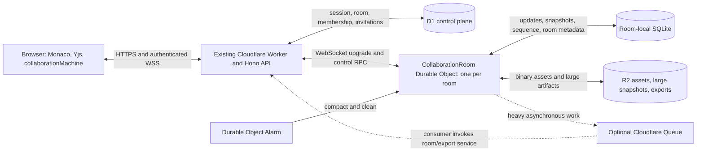

# Live Collaboration — Cloudflare-native Deployment

Status: room-local SQLite persistence and mandatory binary Yjs sync/awareness implemented

Companion documents:

- [Live Collaboration Feature Plan](./live-collaboration.md) defines the CRDT, editor, recording,
  and protocol contracts.

This document maps the abstract room service and persistence layer in the feature plan onto the
Cloudflare services already used by the application. The option evaluated here uses one
SQLite-backed Durable Object per collaboration room.

Pricing and product behavior in this document were checked on 2026-07-16. Cloudflare pricing and
limits must be verified again before production rollout.

## Implemented Cloudflare stack

The collaboration data plane has one deployment path:

| Cloudflare service    | Current platform responsibility                                                                                               |
| --------------------- | ----------------------------------------------------------------------------------------------------------------------------- |
| Workers + Hono        | Same-origin room and membership APIs, WebSocket authentication, assets, exports, and signed maintenance endpoints             |
| Workers Static Assets | Serve the editor on the same origin so its first-party session authenticates HTTP and WebSocket requests safely               |
| D1                    | Rooms, members, invitations, roles, asset metadata, retention state, and audit events                                         |
| R2                    | Private SHA-256-addressed binary project assets; never live SCR3 recordings                                                   |
| Workers KV            | Disposable public lesson/playlist cache; separate from collaboration state and credentials                                    |
| Workers Logs          | Structured update and maintenance telemetry for dashboards and alerts                                                         |
| Durable Objects       | Hibernating WebSocket coordination, room-local SQLite durability, alarm compaction, and ephemeral fan-out                     |

Durable Object SQLite and Alarms own room history and compaction. QStash schedules delayed purge
of closed room data and assets. Cloudflare Queues are still not used. The browser-local recording
decision is unchanged: the host keeps SCR3 locally and uses the existing post-recording upload
modal only after live ends.

The design below also records later Cloudflare-native extensions. Room-local snapshot/update
storage, alarm compaction, state-vector sync, raw Yjs updates, and authenticated standard awareness
frames are implemented. Optional Queues and moving large snapshots/exports to R2 remain separate
follow-up work.

## Decision within this option

If a Cloudflare-native WebSocket room service is selected, use a SQLite-backed
`CollaborationRoom` Durable Object as both the live room coordinator and the owner of the room's
recoverable CRDT state. Durable Objects are not an inherent collaboration requirement and have no
role in SCR3 recording; in this application they provide the stateful room coordinator for every
live collaboration room.

- The existing Hono Worker remains the same-origin HTTP API and WebSocket gateway.
- D1 remains the globally queryable control plane for rooms, memberships, invitations, and roles.
- One Durable Object identified by `roomId` owns the room's WebSockets, update log, snapshots,
  awareness roster, effective host, and protocol state.
- The Durable Object's private SQLite database stores document updates and compacted snapshots.
- R2 stores binary project assets, large snapshots, and optional project exports.
- Durable Object Alarms perform room-local compaction and cleanup.
- Cloudflare Queues are optional for work that should run outside the room object.

This is a self-hosted room service in the sense used by the feature plan: Cloudflare manages the
runtime and storage, but the application owns the collaboration protocol and implementation. The
Cloudflare Workers KV `CACHE` binding continues serving unrelated public lesson and playlist reads.

## Production topology



After the initial WebSocket upgrade, document, awareness, and control frames flow directly
between the browser and the room Durable Object. The gateway is not called once per keystroke.

## Cloudflare service map

| Service                       | Collaboration responsibility                                                       | Status in this option                 |
| ----------------------------- | ---------------------------------------------------------------------------------- | ------------------------------------- |
| Workers Static Assets         | Serve the existing SPA under the same cross-origin-isolated origin                 | Existing                              |
| Hono Worker                   | Room CRUD, session authentication, invitations, tokens, WebSocket upgrade          | Existing                              |
| D1                            | Rooms, members, roles, invite records, retention state, searchable audit metadata  | Existing                              |
| Durable Objects               | WebSocket hub and single coordination point for each room                          | Implemented                           |
| Durable Object SQLite storage | CRDT updates, snapshots, protocol version, stream sequence, durable room state     | Implemented                           |
| Durable Object WebSocket API  | Mandatory binary Yjs document/awareness frames plus JSON control and acknowledgements | Implemented                        |
| Durable Object Alarms         | Snapshot compaction and update/deduplication cleanup                               | Implemented                           |
| R2                            | Content-addressed assets, oversized snapshots, and project exports                 | Existing                              |
| Cloudflare Queues             | Heavy export, asset reconciliation, or cross-room maintenance                      | Optional                              |
| Workers Logs and tracing      | Connection and operational metadata, excluding editor content                      | Existing                              |

The collaboration data plane does not use the Workers KV `CACHE` binding, Pub/Sub, Containers,
Workflows, or Calls:

- KV's consistency and access pattern are unnecessary when a room already has strongly ordered,
  private Durable Object storage.
- Pub/Sub would duplicate the Durable Object's connected-client fan-out.
- Containers belong to the separate remote-runtime feature; each collaboration client continues
  to run its own local WebContainer.
- Workflows are unnecessary for room-local compaction that an Alarm can perform.
- Audio and video remain outside the feature and continue to use an external calling provider.

## Recording boundary

Only the room host may record. For the MVP, the room owner remains host throughout a recorded
session. That host browser records SCR3 through the existing `editorMachine` and local IndexedDB
persistence. No recording bytes pass through the room Durable Object, its SQLite database, the
collaboration R2 namespace, or a Queue while the session is live.

After the host ends the live session, the application presents the same post-recording modal used
today: `renderPostRecordingModal` composes `UploadLessonModal` around the finished local recording.
An explicit action in that modal may upload the files, create a lesson draft, and later publish it
to `/learn`. This is not a collaboration-specific `/learn` upload path. The existing lesson flow
may store uploaded files in R2 and lesson metadata in D1, but those objects belong to the lesson
namespace and lifecycle—not to the collaboration room or its Durable Object. See the existing
[upload and publish sequence](./cloudflare-architecture.md#upload--publish-sequence).

## Why one Durable Object per room in this option

Durable Objects are designed as a single coordination point for multiple clients. Each named room
object is single-threaded, owns private durable storage, accepts WebSockets, and scales
horizontally independently of every other room.

That matches the feature plan's requirements:

- One authority validates room protocol and effective roles.
- Live clients receive low-overhead binary WebSocket frames.
- Document updates are persisted before acknowledgement and broadcast.
- Awareness can be broadcast without becoming project history.
- Role downgrade can affect existing socket sessions immediately.
- Initial sync can use a server-maintained Yjs document and state vector rather than a full log.
- Reconnect can safely combine the durable server state with the client's offline Yjs changes.

These are live synchronization duties only. Recording is intentionally absent from the list.

The Durable Object is a coordination boundary, not the merge algorithm. Yjs remains necessary for
offline edits, concurrent edits created before the room observed them, deterministic convergence,
and relative cursor positions.

Use `idFromName(roomId)` or an equivalent deterministic ID so every request for one room reaches
the same object. Do not place all rooms in one Durable Object; doing so would create a global
bottleneck and failure domain.

## Connection and authorization flow

### Room creation

1. An authenticated user calls `POST /api/collaboration/rooms`.
2. The Worker creates the D1 room and owner membership transactionally.
3. The Worker invokes the room Durable Object to initialize its protocol version, document schema,
   initial project snapshot, and retention settings.
4. The object returns its initialized generation and schema version.
5. The Worker marks the D1 room ready. A failed initialization leaves a recoverable provisioning
   state rather than an apparently joinable empty room.

Only the room service seeds an empty shared document. Multiple browsers must never import the
same path-based project independently.

### Joining

1. The browser requests a short-lived room token using its first-party session cookie.
2. The Worker reads D1 membership and signs canonical claims: room ID, user ID, tab/session ID,
   effective role, protocol version, document schema version, and expiry.
3. The browser opens the same-origin WebSocket.
4. The Worker validates the upgrade and forwards canonical claims to the room object. It must
   replace, not trust, any equivalent browser-provided headers.
5. The object accepts the socket through the WebSocket Hibernation API and serializes only the
   small session metadata needed after hibernation.
6. The object performs the protocol handshake and Yjs state-vector synchronization.
7. Awareness becomes visible only after document sync succeeds.

The room object stores the authoritative effective role in the WebSocket attachment. A D1 role
mutation is not complete until the Worker also calls the room object to update or disconnect that
member's live sessions. Every document frame is checked against the attachment; a viewer cannot
write by modifying the browser.

### Leaving and reconnecting

- A clean close removes awareness immediately.
- A broken network connection is removed by WebSocket close/error handling and awareness TTL
  rules.
- Reconnect receives a new attempt ID and room token.
- Offline Yjs updates remain client-side until the server's state vector has been applied.
- Late events from an earlier provider attempt are ignored by `collaborationMachine`.

## WebSocket protocol mapping

The original three message classes remain unchanged:

| Class     | Durable Object behavior                                                                  |
| --------- | ---------------------------------------------------------------------------------------- |
| Document  | Validate role and size, persist binary Yjs update, acknowledge, broadcast                |
| Awareness | Validate/rate-limit, update in-memory session state, broadcast, do not add to update log |
| Control   | Validate protocol transition; persist only durable room-level decisions                  |

Persist before broadcasting a document update. If persistence fails, send a recoverable error
and move the connection into a non-writing/reconnecting state. Never broadcast an update and then
silently fail to store it.

Binary envelope version 2 carries Yjs v13-compatible sync, raw update, and standard awareness
messages. The client requests it explicitly during the WebSocket upgrade; a missing or mismatched
version is rejected. There is no HTTP bootstrap, JSON document/awareness, or protocol downgrade.

Writable collaborative Monaco models bind directly to their active `Y.Text` through `y-monaco`.
The binding is enabled by default and can be disabled at build time with
`VITE_COLLABORATION_Y_MONACO=false`. A role downgrade destroys the direct binding
before the model can accept another local edit. Read-only clients still resolve standard awareness
selections for display without attaching a mutating binding. Only the `MonacoBinding` constructor
and the explicit local-editor origin enter collaborative undo history; remote provider,
projection, playback, and model-replacement transactions remain excluded.

The editor listener is installed before the binding listener, so it queues the exact versioned
Monaco edit for the following Yjs transaction. That one event drives recording and the workspace
projection while `y-monaco` remains the only writer to `Y.Text`. The projection acknowledges the
stored content back to Monaco, avoiding a reconciliation `getValue()` read. Path-to-node and
text-type-to-node indexes are built with topology projection and reused by controller, awareness,
cursor, and remote-text paths until a tree transaction replaces them.

Batch small logical messages into one WebSocket frame, especially cursor movement and rapid Yjs
transactions. Cloudflare recommends time- or count-based batching for high-frequency Durable
Object WebSockets. The client currently starts at one animation frame for a healthy WebSocket,
backs off to 75 ms under congestion, caps each merge by count and raw byte
budget, and merges each selected batch once. Blur, save, recording stop, explicit room leave,
recovery export, room close, and membership control mutations await the active durable flush. A
provider removed indirectly by navigation makes one best-effort flush before closing its socket.

Protocol frames should include:

```text
protocolVersion
documentSchemaVersion
roomId
sessionId
attemptId
messageClass
messageType
clientMessageId
payloadLength
payload
```

Use compact binary encoding for document frames. Awareness and control may use JSON or MessagePack,
but must retain explicit size and schema validation.

## Room-local persistence

An illustrative Durable Object schema is:

```sql
CREATE TABLE room_state (
  singleton            INTEGER PRIMARY KEY CHECK (singleton = 1),
  protocol_version     INTEGER NOT NULL,
  schema_version       INTEGER NOT NULL,
  snapshot_generation  INTEGER NOT NULL,
  snapshot_sequence    INTEGER NOT NULL,
  initialized_at       INTEGER NOT NULL,
  updated_at           INTEGER NOT NULL
);

CREATE TABLE updates (
  sequence       INTEGER PRIMARY KEY AUTOINCREMENT,
  session_id     TEXT NOT NULL,
  client_msg_id  TEXT NOT NULL,
  update_blob    BLOB NOT NULL,
  created_at     INTEGER NOT NULL,
  UNIQUE (session_id, client_msg_id)
);

CREATE TABLE snapshot_chunks (
  generation   INTEGER NOT NULL,
  chunk_index  INTEGER NOT NULL,
  snapshot     BLOB NOT NULL,
  PRIMARY KEY (generation, chunk_index)
);
```

The exact schema is implementation work, but it must preserve these invariants:

- An accepted update has a durable room-local sequence.
- Repeated client message IDs are idempotent.
- A snapshot records the greatest included update sequence.
- Compaction never deletes an update newer than its immutable cutoff.
- A room can restore from a snapshot plus the remaining update tail.
- Protocol and document schema versions survive object hibernation and restart.

SQLite-backed Durable Objects currently limit one string, BLOB, or row to 2 MB. Split large Yjs
snapshots into deterministic chunks or store an immutable snapshot object in R2 with its hash,
size, generation, and update cutoff in SQLite. Individual client updates should be capped far
below the platform limit.

Each paid-plan SQLite Durable Object can store up to 10 GB. The application should impose a much
smaller project/document quota and compact well before approaching that platform ceiling.

## Hibernation and in-memory state

Use the Durable Object WebSocket Hibernation API, not the ordinary `accept()` API.

While active, the object may keep:

- The materialized Yjs document.
- Connected participant and awareness maps.
- The current host/follow state.
- A pending broadcast batch.
- Compaction counters.

Hibernation clears ordinary in-memory state while keeping sockets connected. On wake:

1. The constructor restores protocol and snapshot metadata from SQLite.
2. It reconstructs the Yjs document from the latest snapshot plus update tail when needed.
3. WebSocket attachments restore canonical identity, session, and role metadata.
4. Awareness is rebuilt from valid connected socket attachments and subsequently published
   awareness messages.

Do not use `setInterval`, long `setTimeout`, or an active outbound socket in the room object. Those
can prevent hibernation and turn connected wall-clock time into billable duration. Protocol ping
frames that can use Cloudflare's automatic WebSocket response facility should do so.

## Snapshot compaction and cleanup

Schedule a Durable Object Alarm when an update-count, byte, or elapsed-time threshold is reached.
Only one alarm runs at a time for a given object, but alarm delivery is at least once, so the
handler remains idempotent.

The alarm should:

1. Read snapshot generation `G` and choose cutoff sequence `C`.
2. Materialize the document through `C`.
3. Write all chunks or the R2 object for generation `G + 1`.
4. Atomically update `room_state` to generation `G + 1` and cutoff `C`.
5. Delete only update rows through `C`.
6. Remove older snapshot generations after the new generation is readable and hashed correctly.
7. Reschedule itself when more work remains.

Deletes count as SQLite row writes, so client-side update batching materially affects both
storage volume and cost. Compaction thresholds should be based on bytes as well as row count.

Cloudflare Queues are optional when work should not execute inside the room object's CPU budget,
for example:

- Producing a large downloadable export.
- Reconciling orphaned R2 assets across many rooms.
- Aggregating operational metrics.
- Sending external webhook or notification deliveries.

A Queue consumer cannot directly query another object's private SQLite database. It should invoke
an authenticated Worker service or Durable Object RPC and remain idempotent.

## D1 control-plane model

D1 should add globally queryable tables similar to:

```text
collaboration_rooms
  id, owner_id, status, schema_version, retention_policy, created_at, updated_at

collaboration_members
  room_id, user_id, role, role_version, created_at, updated_at

collaboration_invites
  id, room_id, token_hash, invited_role, expires_at, redeemed_by, redeemed_at

collaboration_audit
  id, room_id, actor_id, action, target_id, metadata, created_at
```

D1 owns discovery and authorization metadata, not live document content. Avoid a D1 query for
every WebSocket frame. Membership is checked when issuing/joining a session and pushed to the room
object when it changes.

Audit metadata may record membership, role, export, deletion, and room lifecycle events. It must
not contain source text, Yjs updates, selections, or cursor payloads.

## R2 object model

Reuse the existing private R2 binding with namespaced, non-guessable keys:

```text
collaboration/rooms/{roomId}/assets/{sha256}
collaboration/rooms/{roomId}/snapshots/{generation}.yjs
collaboration/rooms/{roomId}/exports/{exportId}.zip
```

The CRDT stores asset IDs and metadata, never arbitrary asset bytes. Upload completes before the
CRDT reference is published. Downloads continue through authenticated/same-origin Worker routes
where room privacy requires it.

Do not create a collaboration-room recording key. A recording reaches R2 only after live ends and
the host confirms upload in the post-recording modal; it uses the lesson subsystem's namespace.

Use R2 Standard storage for active room assets and snapshots. Infrequent Access introduces
retrieval charges and a minimum storage duration and is unlikely to help small, frequently opened
rooms.

## Placement, latency, and scaling

A Durable Object is normally created near the request that first instantiates it and does not
currently relocate. This produces an important room-level tradeoff:

- Participants near the room object get low latency.
- Participants on another continent pay the round-trip time to the room's fixed location.
- Yjs preserves convergence but cannot remove network latency from cursor and edit delivery.

Do not pre-create the object from a deployment or administrative region that is unrelated to its
participants. Let the owner's first production connection create it, or use a best-effort
location hint based on the expected participant region. Use a jurisdiction-specific namespace if
room data must stay in the EU or US.

An individual Durable Object is single-threaded and has a documented soft limit of approximately
1,000 requests per second. Enforce participant, message-frequency, update-size, and document-size
quotas far below that ceiling. Overall capacity scales horizontally because separate room IDs map
to separate objects.

## Failure and recovery behavior

| Failure                                  | Required behavior                                                                          |
| ---------------------------------------- | ------------------------------------------------------------------------------------------ |
| Browser loses network                    | Keep offline Yjs edits; clear remote awareness; reconnect with backoff                     |
| Room object hibernates                   | Preserve sockets; reconstruct document and session state on wake                           |
| Room object restarts                     | Reconstruct from SQLite snapshot and update tail; clients reconnect if needed              |
| SQLite write fails                       | Do not acknowledge/broadcast the update; surface reconnecting or failed state              |
| D1 unavailable during a new join         | Reject/defer the join; existing authenticated room sockets may continue                    |
| R2 asset missing                         | Show a recoverable placeholder; do not block unrelated text edits                          |
| Compaction alarm retries                 | Resume idempotently from generation and cutoff metadata                                    |
| Host recorder disconnects                | Browser-local recording recovery applies; the room object never receives or finalizes SCR3 |
| Host transfer requested during recording | Reject it until the current host stops and finalizes the browser-local recording           |

SQLite-backed Durable Objects include point-in-time recovery for approximately the prior 30 days,
but that platform capability is not a substitute for owner exports, retention policies, or tested
snapshot recovery.

## Security and privacy

- Authenticate the WebSocket before the room object accepts it.
- Use short-lived, room-scoped tokens and canonical server-derived identity.
- Enforce owner/editor/viewer on every durable document message.
- Immediately update or disconnect live sessions after a role downgrade.
- Cap WebSocket frame, decoded update, room document, participant, and asset sizes.
- Rate-limit awareness independently from document updates.
- Treat display names, active files, selections, and follow-state values as untrusted.
- Never log source payloads, snapshots, cursor positions, room tokens, or WebSocket attachments.
- Define D1, Durable Object SQLite, R2, and audit retention separately; lesson recording retention
  belongs to the lesson subsystem.
- Provide room deletion that removes D1 metadata, calls `deleteAll()` on the room object, and
  deletes the room's R2 objects.
- Add budget and quota alerts before enabling public room creation.

## Pricing

All prices below are in USD and reflect published Cloudflare pricing checked on 2026-07-16.

### Workers

Workers Paid has a $5 per-account monthly minimum and includes:

- 10 million Worker requests per month, then $0.30 per additional million.
- 30 million Worker CPU milliseconds per month, then $0.02 per additional million.
- No Worker bandwidth/egress charge.

A WebSocket connection through a Worker counts as the initial upgrade request; messages routed
over that connection do not count as additional ordinary Worker requests. Static asset requests
are free, though Worker code executed because of `run_worker_first` can still consume CPU.

If the separate Cloudflare Containers remote runtime is enabled, the account already needs
Workers Paid. In that case collaboration does not add another $5 base subscription.

### Durable Object compute

Workers Paid includes:

| Metric                  | Included                     | Overage                      |
| ----------------------- | ---------------------------- | ---------------------------- |
| Durable Object requests | 1 million per month          | $0.15 per additional million |
| Duration                | 400,000 GB-seconds per month | $12.50 per million GB-s      |

The initial Durable Object request, RPC calls, alarm invocations, and incoming WebSocket messages
contribute to request billing. Incoming WebSocket messages receive a 20:1 billing ratio: 100
incoming messages are billed as five requests. Outgoing WebSocket messages and protocol pings are
not charged as requests.

Duration is based on the 128 MB allocation while the object is active and not hibernating,
regardless of actual memory used. One continuously active room-hour therefore uses:

```text
3,600 seconds * 0.125 GB = 450 GB-seconds
```

The included 400,000 GB-s covers about 889 fully active, non-hibernating room-hours. Real coverage
can be much greater when connected but idle rooms hibernate.

### Durable Object SQLite storage

Workers Paid includes:

| Metric       | Included             | Overage                 |
| ------------ | -------------------- | ----------------------- |
| Rows read    | 25 billion per month | $0.001 per million rows |
| Rows written | 50 million per month | $1.00 per million rows  |
| Stored data  | 5 GB-month           | $0.20 per GB-month      |

Inserts, updates, and deletes count as rows written. An append-only update that is later removed
during compaction normally produces at least two row writes. Index maintenance can add writes.

### D1

Workers Paid includes 25 billion rows read, 50 million rows written, and 5 GB of D1 storage per
month. Overage is $0.001 per million rows read, $1.00 per million rows written, and $0.75 per
GB-month. Room and membership operations should remain far below these allowances because D1 is
not in the per-keystroke path.

### R2 Standard

R2's monthly free tier includes 10 GB-month, 1 million Class A operations, and 10 million Class B
operations. Beyond that:

- Storage: $0.015 per GB-month.
- Class A writes/list mutations: $4.50 per million.
- Class B reads/metadata operations: $0.36 per million.
- Internet egress: free.

Avoid writing each CRDT update as a separate R2 object. In this option, collaboration R2 usage is
for compacted snapshots, assets, and project exports rather than tiny high-frequency events.

### Optional Queues

Workers Paid includes 1 million Queue operations per month; overage is $0.40 per million. A normal
successful message generally consumes three operations: write, read, and delete. Retries add read
operations. Room-local Alarms avoid this cost and indirection for ordinary snapshot compaction.

## Example cost model

Cloudflare bills behavior, not users, so active room-hours and message rates are more useful than
monthly active-user counts.

The following deliberately conservative model assumes:

- Five incoming WebSocket frames per second per active room, including document and awareness.
- Two durable document batches per second.
- Each durable batch is inserted and later deleted, producing two rows written.
- The room stays active for its entire room-hour and receives no hibernation reduction.
- Worker API traffic, D1, R2 operations, and stored bytes stay inside their included amounts.
- The account is on Workers Paid and has no other usage consuming the inclusions.

| Active room-hours/month | Billed DO request units |      DO duration | SQLite rows written | Estimated total |
| ----------------------: | ----------------------: | ---------------: | ------------------: | --------------: |
|                     100 |                  90,000 |      45,000 GB-s |        1.44 million |     About $5.00 |
|                   1,000 |                 900,000 |     450,000 GB-s |        14.4 million |     About $5.63 |
|                  10,000 |               9 million | 4.5 million GB-s |         144 million |   About $151.45 |

At 10,000 room-hours the illustrative breakdown is:

```text
Workers Paid minimum                       $  5.00
DO request overage                         $  1.20
DO duration overage                        $ 51.25
DO SQLite row-write overage                $ 94.00
                                             ------
Estimated collaboration subtotal           $151.45/month
```

This is not a quote. Actual cost should be lower when editing is bursty, updates are batched, and
rooms hibernate during pauses. It can be higher when existing application or remote-runtime usage
has already consumed the account inclusions, documents require substantial Yjs CPU, snapshots or
assets exceed included storage, or high-cardinality logs are retained.

The largest controllable cost levers are:

1. Use WebSocket hibernation correctly.
2. Merge small Yjs updates before persistence and transmission.
3. Throttle/coalesce awareness messages.
4. Compact by both update count and bytes.
5. Do not log individual edit frames or payloads.
6. Enforce room participant, document, update, asset, and active-hour quotas.

## Free plan suitability

SQLite-backed Durable Objects are available on Workers Free. Relevant daily free limits include:

- 100,000 Worker requests.
- 100,000 Durable Object request units.
- 13,000 Durable Object GB-seconds.
- 5 million SQLite rows read and 100,000 rows written.

Free-tier usage that exceeds a daily limit fails rather than becoming a paid overage. The Worker
CPU limit is also 10 ms per invocation, which may be insufficient for reconstructing and
compacting larger Yjs documents. Free is appropriate for development and a tightly controlled
prototype; Workers Paid is the safer production baseline.

## Implementation touchpoints

Selecting this option would require:

- A new `CollaborationRoom` Durable Object class exported by a Worker deployment.
- A SQLite Durable Object binding and `new_sqlite_classes` migration in Wrangler configuration.
- D1 migrations and typed queries for rooms, memberships, invitations, roles, and audit metadata.
- Same-origin Hono routes for room CRUD, token issuance, membership changes, WebSocket upgrades,
  asset access, export, and deletion.
- A room service responsible for socket attachments, protocol parsing, Yjs materialization,
  update persistence, awareness, host state, and alarms.
- R2 key namespaces and authorization for collaborative assets and large snapshots.
- Focused Worker/Durable Object tests plus two-browser convergence and reconnect tests.
- Cost metrics for active room-hours, incoming frames, update rows/bytes, compactions, hibernation,
  D1 operations, and R2 storage.

The provider-specific code belongs under the infrastructure boundary. Monaco bindings, shared
document commands, workspace projection, playback isolation, and SCR3 recording should depend on
a collaboration provider interface and must not import Cloudflare APIs.

An illustrative Wrangler addition is:

```toml
[[durable_objects.bindings]]
name = "COLLAB_ROOMS"
class_name = "CollaborationRoom"

[[migrations]]
tag = "collaboration-room-v1"
new_sqlite_classes = ["CollaborationRoom"]
```

The final migration tag must be coordinated with every existing class migration in the chosen
Worker deployment rather than copied blindly.

## References

- [Cloudflare Durable Objects overview](https://developers.cloudflare.com/durable-objects/)
- [What are Durable Objects?](https://developers.cloudflare.com/durable-objects/concepts/what-are-durable-objects/)
- [Durable Objects WebSockets and hibernation](https://developers.cloudflare.com/durable-objects/best-practices/websockets/)
- [WebSocket hibernation example](https://developers.cloudflare.com/durable-objects/examples/websocket-hibernation-server/)
- [Durable Object SQLite storage](https://developers.cloudflare.com/durable-objects/api/sqlite-storage-api/)
- [Durable Object Alarms](https://developers.cloudflare.com/durable-objects/api/alarms/)
- [Durable Object data location](https://developers.cloudflare.com/durable-objects/reference/data-location/)
- [Durable Object limits](https://developers.cloudflare.com/durable-objects/platform/limits/)
- [Durable Object pricing](https://developers.cloudflare.com/durable-objects/platform/pricing/)
- [Workers pricing](https://developers.cloudflare.com/workers/platform/pricing/)
- [D1 pricing](https://developers.cloudflare.com/d1/platform/pricing/)
- [R2 pricing](https://developers.cloudflare.com/r2/pricing/)
- [Cloudflare Queues pricing](https://developers.cloudflare.com/queues/platform/pricing/)
