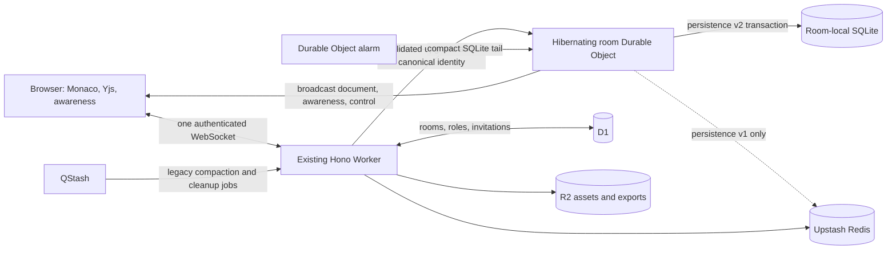

# Live Collaboration — Cloudflare WebSocket + Upstash Hybrid

Status: implemented; deployment and multi-browser load validation pending

Companion documents:

- [Live Collaboration Feature Plan](./live-collaboration.md) defines the provider-neutral product,
  Yjs document, editor, recording, and protocol contracts.
- [Upstash Deployment Evaluation](./live-collaboration-upstash.md) documents the implemented
  Redis, Realtime, and QStash provider.
- [Cloudflare-native Deployment](./live-collaboration-cloudflare.md) evaluates a provider that
  stores both live and durable room state in a Durable Object.

This document describes the versioned hybrid. Cloudflare terminates one bidirectional WebSocket
per browser and uses one hibernating Durable Object per room for live coordination. New WebSocket
rooms also use that object's private SQLite database as the durable Yjs authority, with alarms for
compaction. Upstash Redis remains available for persistence-version-1 and Realtime fallback rooms;
QStash runs delayed cleanup and legacy compaction. D1 remains the authoritative room/membership
control plane and records each room's immutable transport and persistence version.

Pricing and product behavior were checked on 2026-07-16. They must be verified again before a
production capacity decision.

## Decision

Implement the hybrid as versioned room behavior rather than replacing the existing Upstash
Realtime provider or migrating active history in place:

- New rooms use `cloudflare-websocket` when the binding is available.
- Existing or explicitly configured rooms may continue using `upstash-realtime`.
- New WebSocket rooms default to persistence version 2 (Durable Object SQLite); existing and
  explicitly rolled-back rooms retain version 1 (Redis).
- Every participant in one room uses the room's selected transport.
- A client never opens both live transports for the same room.
- The provider-neutral Yjs document, workspace projection, undo policy, role model, assets,
  host-only recording, and post-session lesson upload flow remain unchanged.

The Durable Object is the live coordinator and the durable document authority for version-2 rooms.
It does not store SCR3 recordings. Redis remains authoritative only for version-1 rooms.

## Free-capacity comparison

The products meter different units, so the allowances are not directly interchangeable.

| Product                    | Current free allowance                               | Relevant behavior                                                                                                                                                                    |
| -------------------------- | ---------------------------------------------------- | ------------------------------------------------------------------------------------------------------------------------------------------------------------------------------------ |
| Cloudflare Workers         | 100,000 requests/day                                 | The initial WebSocket upgrade is one request. Frames routed through the Worker do not count as requests. There is no duration charge, and Free has a 10 ms CPU limit per invocation. |
| Cloudflare Durable Objects | 100,000 request units/day and 13,000 GB-s/day        | A connection consumes a request. Incoming WebSocket messages use a 20:1 billing ratio; outgoing messages and protocol pings are free. Hibernation avoids idle duration.              |
| Upstash Realtime           | No separate message allowance                        | Every operation becomes one or more Upstash Redis commands.                                                                                                                          |
| Upstash Redis              | 500,000 commands/month, 10 GB bandwidth, 256 MB data | Commands used by Realtime and application persistence share this allowance.                                                                                                          |

Cloudflare documents that a Worker WebSocket connection is billed as its initial Upgrade request
and subsequent frames do not count as Worker requests:

- <https://developers.cloudflare.com/workers/platform/pricing/>
- <https://developers.cloudflare.com/network/websockets/>

Upstash documents the following one-channel Realtime command baseline:

| Operation                      | Redis commands |
| ------------------------------ | -------------: |
| Initial connection             |              2 |
| Reconnection every 300 seconds |              3 |
| Keepalive every 60 seconds     |              1 |
| Emit event                     |              2 |
| Emit event with expiry         |              3 |

That is approximately 96 commands per connected client-hour after the initial connection, before
application events. The 500,000-command free database therefore represents approximately 5,200
single-channel connected client-hours per month only in the optimistic case where no editing,
awareness, bootstrap, rate-limit, or maintenance commands occur.

Sources:

- <https://upstash.com/docs/realtime/overall/pricing>
- <https://upstash.com/pricing/redis>

Persistence-version-1 rooms use document, awareness, and control channels and perform additional
commands for durable IDs, quotas, rate limits, presence TTLs, stream retention, and recovery.
Pipelining reduces HTTP round trips but does not turn several Redis commands into one command.
Consequently, the official one-channel estimate is a lower bound for legacy rooms; version-2 rooms
do not consume this Redis command path.

### Illustrative connection cost

Five participants connected for two hours use approximately 970 Redis commands merely for the
documented Realtime connection lifecycle:

```text
5 clients × (2 initial + 24 reconnect cycles × 3 + 120 keepalives) = 970 commands
```

Every live event is additional. In the current awareness implementation, a normal state event
also performs rate limiting, updates a presence key and roster, appends a short-lived stream
entry, refreshes expiry, and publishes the event. Moving awareness to the room WebSocket removes
this high-frequency work from Redis.

### Durable Object free-tier shape

Durable Objects on Workers Free currently include 100,000 request units/day. Incoming WebSocket
messages use a 20:1 billing ratio, so the theoretical upper bound is close to two million incoming
messages/day when no connections, HTTP/RPC calls, or alarms consume the allowance. Outgoing
WebSocket messages are not charged as requests.

The 13,000 GB-s/day duration allowance is only economical for live rooms when the WebSocket
Hibernation API is used. Calling the ordinary `accept()` API keeps the object active for the
connection duration. The hybrid must use `DurableObjectState.acceptWebSocket()`, serialized socket
attachments, and an automatic application ping/pong response.

Sources:

- <https://developers.cloudflare.com/durable-objects/platform/pricing/>
- <https://developers.cloudflare.com/durable-objects/best-practices/websockets/>

## Why a plain Worker WebSocket is insufficient

The standard Workers WebSocket example is appropriate for a single connection or a proxy, but a
room must coordinate several connections. Cloudflare explicitly recommends a single coordination
point, normally a Durable Object, for chat-room-like workloads:

- <https://developers.cloudflare.com/workers/runtime-apis/websockets/>
- <https://developers.cloudflare.com/workers/best-practices/workers-best-practices/>

A global `Map` inside a plain Worker isolate is not a room directory:

- clients in the same room may land in different isolates;
- isolate eviction loses the connection-local room state;
- deployments and network restarts can terminate connections;
- an Upstash subscription per browser would retain Redis Pub/Sub costs;
- Workers Free limits external subrequests to 50 per invocation, which is a poor fit for one
  indefinitely open invocation that calls Upstash on every frame.

Source: <https://developers.cloudflare.com/workers/platform/limits/>

Using a plain Worker plus one Redis subscription per socket would recreate much of Upstash
Realtime with less recovery behavior. It would save some keepalive/history commands but would not
deliver the intended cost reduction.

## Hybrid topology



### Existing Hono Worker

The Worker remains responsible for:

- first-party session authentication;
- D1 room and membership lookup;
- room creation, invitations, member changes, closure, assets, and exports;
- validating a WebSocket upgrade and forwarding only canonical server-derived identity to the
  room object;
- notifying the room object immediately after role changes, removals, invitation claims, and room
  closure;
- the existing Realtime SSE and HTTP provider for rooms assigned to that transport.

### One hibernating Durable Object per room

The room object is responsible for:

- accepting WebSockets with the Hibernation API;
- storing a small authenticated session attachment on every socket;
- validating protocol versions, room IDs, message schemas, payload sizes, and effective roles;
- enforcing the canonical role/version attachment on every write and periodically revalidating D1
  membership while immediate control notifications update connected roles;
- applying per-session and per-room live-message rate limits;
- inserting version-2 updates, sequence/quota metadata, and update-ID deduplication in one local
  SQLite transaction before acknowledgement and broadcast through the output gate;
- retaining the Redis-before-visible path for persistence-version-1 rooms;
- broadcasting accepted document events directly to the other connected clients;
- broadcasting ephemeral awareness without Redis Streams, TTL keys, or Pub/Sub;
- updating socket roles immediately when the Worker sends a control notification;
- closing removed members and every socket when the room closes;
- handling ping/pong without waking the object when possible.

The object must reconstruct its connected participant roster from WebSocket attachments after
hibernation. Cursor state is ephemeral; clients periodically resend it and reconnect recovery does
not depend on retaining a cursor.

### Durable Object SQLite and alarms

Persistence-version-2 rooms store the compacted Yjs snapshot, append-only update tail, monotonic
sequence, accepted-byte/update counts, and update-ID deduplication in the room object's private
SQLite database. The WebSocket handler performs the write transaction synchronously, then sends
the acknowledgement and fan-out without awaiting any external service. The Durable Object output
gate prevents those messages from becoming visible if the storage write fails.

At 200 tail updates the object schedules its alarm. The alarm folds the current tail into a new
Yjs snapshot, advances the cutoff/generation transactionally, deletes incorporated tail rows, and
prunes expired deduplication entries. New updates after that cutoff remain the reconnect tail.

The room is first initialized synchronously by its creator's edge request. That first access is
the deliberate placement request; Durable Object placement remains fixed, so production tests must
compare nearby and intercontinental participants for creators in each primary geography.

### Upstash Redis (persistence version 1)

Redis remains responsible for version-1 rooms:

- the compacted Yjs snapshot;
- the durable update stream after that snapshot;
- update idempotency and accepted-byte quotas;
- update counts and compaction cutoffs;
- recovery bootstrap and owner export;
- seven-day closed-room retention.

For persistence-version-1 `cloudflare-websocket` rooms, document appends remain durable without
Redis `PUBLISH`; the Durable Object is the only live broadcaster. Realtime rooms retain the
existing append-and-publish behavior. Version-2 rooms perform no Redis operation on update,
bootstrap, export, connection admission, or compaction.

Awareness is not durable document data. WebSocket rooms do not create awareness presence keys,
rosters, streams, expiries, or Pub/Sub messages in Redis.

### D1

D1 stores immutable room transport and persistence fields:

```text
upstash-realtime | cloudflare-websocket
persistence version 1 (Redis) | persistence version 2 (Durable Object SQLite)
```

Both fields are returned in the room descriptor and selected at room creation. Existing rooms
default to persistence version 1; new WebSocket rooms default to version 2. Changing either field
while a room is active is prohibited because it could split participants or point them at an empty
history.

### QStash

QStash remains background-only:

- persistence-version-1 snapshot compaction;
- delayed room cleanup.

QStash is not involved in WebSocket connection setup, awareness, cursor movement, live Yjs
fan-out, or version-2 compaction.

## Protocol

The WebSocket uses versioned JSON envelopes initially so it can reuse the existing validation and
test fixtures. A later binary envelope can optimize document frames without changing semantics.

Client-to-server messages:

```text
document.update  durable Yjs update input
awareness.state  ephemeral cursor/presence input
ping             application heartbeat
```

Server-to-client messages:

```text
session.ready    canonical room session and current participants
document.update  durable event plus persistence-specific monotonic stream ID
document.ack     accepted client update ID plus monotonic stream ID
awareness.state  canonical participant event
control.room     role/membership/closure event
pong             heartbeat response
error            retryable or fatal protocol error
```

Bootstrap remains snapshot-plus-tail over the existing authenticated HTTP endpoint. While the
browser bootstraps, the provider buffers WebSocket document messages, applies the snapshot and
tail, then drains the buffered live messages. This preserves the existing snapshot/live-event race
protection.

## Authorization and immediate role changes

1. The browser opens the same-origin room WebSocket with its `HttpOnly` session cookie.
2. The Worker resolves the user and current D1 membership.
3. The Worker rejects inactive rooms and rooms assigned to another transport.
4. The Worker forwards the upgrade to the named room object with canonical user, role, profile,
   protocol, role version, and persistence version. Browser-provided equivalents are discarded.
5. The room object serializes the canonical identity in the WebSocket attachment.
6. Every document update checks the attachment's current role/version; version-2 sessions cache a
   successful D1 revalidation for five seconds so D1 is not on every-edit latency, while control
   notifications update attachments immediately.
7. A role mutation updates D1 and then notifies the room object. The room object updates all target
   sockets before broadcasting the control event.
8. Removed members are sent a fatal control message and disconnected.

D1 remains authoritative. A notification event accelerates enforcement; it does not grant a role
that D1 did not persist.

## Recording and product boundary

Only the room host may record. SCR3 remains in the host browser during the live session. No SCR3
bytes pass through the WebSocket, Durable Object, Redis, QStash, collaboration R2 objects, or D1.

After the host ends live collaboration, the existing post-recording upload modal may upload the
finished local recording and create a lesson through the existing lesson workflow. This is not a
collaboration-specific `/learn` upload path.

Live synchronization continues to cover Monaco and shared workspace state. It does not synchronize
browser preview execution, slide preview state, terminals, audio, or video.

## Implemented additive rollout

1. Add the D1 transport column with existing rows defaulted to `upstash-realtime`.
2. Bind and migrate the SQLite-backed room Durable Object.
3. Add the authenticated WebSocket route and room object.
4. Add a browser WebSocket provider behind the room descriptor's transport field.
5. Create new rooms as `cloudflare-websocket` when the Durable Object binding exists; retain an
   explicit environment override for Realtime-only rollback.
6. Keep Realtime code and endpoints operational for existing rooms.
7. Roll out by room, never by individual participant.
8. Compare Redis commands, Worker upgrades, Durable Object request units/duration, reconnects,
   update acknowledgement latency, and bootstrap latency before making it the only default.
9. Add D1 persistence version 2 for new WebSocket rooms, initialize their SQLite log before
   activation, and retain version 1 for every existing room.
10. Compare same-region and intercontinental remote-apply p50/p95/p99, Durable Object CPU/storage
    operations, reconnect bytes, and duplicate rate before retiring either rollback path.

Free-tier exhaustion must fail closed for document writes. The client retains unsent Yjs updates
and reconnects; it must never report an update as accepted before the selected SQLite or Redis
transaction succeeds.

## Expected savings

For WebSocket rooms, the hybrid removes:

- Realtime `SUBSCRIBE`, periodic reconnect, history catch-up, and keepalive commands;
- Redis `PUBLISH` for document fan-out;
- Redis document append, quota, deduplication, bootstrap, export, and compaction commands for
  persistence-version-2 rooms;
- Redis awareness rate-limit, presence, roster, stream, expiry, and publication commands;
- browser HTTP requests for every document and awareness update;
- duplicated event delivery through simultaneous SSE and WebSocket transports.

Redis commands remain only for persistence-version-1 and Realtime rooms. QStash remains necessary
for delayed cleanup and legacy compaction; version-2 compaction is room-local and alarm-driven.
