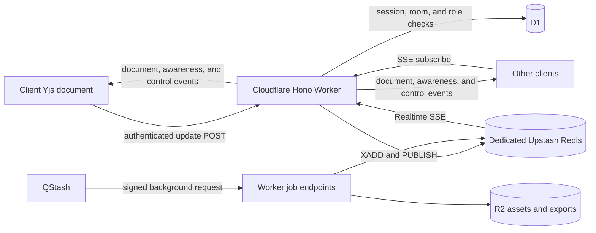
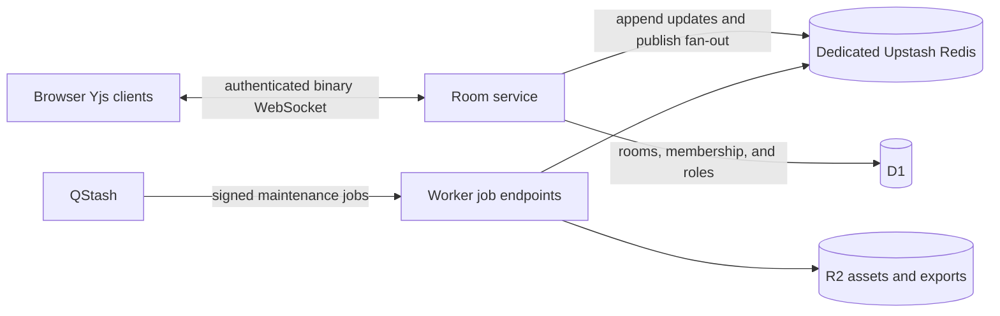

# Live Collaboration — Upstash Deployment Evaluation

Status: persistence-version-1 legacy and rollback provider; Realtime remains a per-room fallback

Companion documents:

- [Live Collaboration Feature Plan](./live-collaboration.md) defines the provider-neutral product,
  CRDT, editor, recording, and protocol contracts.
- [Cloudflare-native Deployment](./live-collaboration-cloudflare.md) evaluates a room service built
  with Cloudflare Durable Objects.
- [Cloudflare WebSocket + Upstash Hybrid](./live-collaboration-hybrid-cloudflare-upstash.md)
  documents the selected live transport and cost boundary.

This document evaluates Upstash Redis, Realtime, and QStash for the live-collaboration data plane.
Upstash is reserved for that purpose; unrelated lesson and playlist caching uses Cloudflare
Workers KV. This does not change the core decisions in the feature plan: Yjs remains the merge
engine, awareness remains logically ephemeral, and SCR3 remains a single-writer recording and
replay format owned by the room host's browser.

Pricing and product behavior in this document were checked on 2026-07-16. They must be verified
again before production capacity is purchased.

## Recommendation

Upstash can support a small-room collaboration MVP, but the three services have different roles:

| Service          | Appropriate collaboration role                                                | Recommendation                       |
| ---------------- | ----------------------------------------------------------------------------- | ------------------------------------ |
| Upstash Redis    | Version-1 CRDT streams/snapshots, presence TTLs, idempotency, and rate limits | Retained legacy and rollback store   |
| Upstash Realtime | Redis Streams and Pub/Sub exposed to browsers through Server-Sent Events      | Retained per-room fallback transport |
| QStash           | Version-1 snapshot compaction and delayed room cleanup                        | Background work only                 |

Realtime remains useful for existing rooms and explicit rollback, but its SSE downstream and HTTP
upstream lifecycle consumes Redis commands even when a participant is idle. New rooms therefore
default to the Cloudflare WebSocket coordinator with persistence version 2 in room-local SQLite.
Upstash Redis continues as the durable persistence layer only for version-1 rooms.

Both providers remain deployed, but they are isolated by immutable D1 room transport and
persistence-version fields. One room never opens Realtime and WebSocket connections together or
switches its durable authority in place, avoiding split ordering and duplicate fan-out.

Option A does not require Durable Objects: Realtime and Redis supply the live transport and room
history, while the Worker enforces authorization. Browser-local recording does not affect that
choice and is not a reason to add a Durable Object.

## Implementation status

The Realtime fallback and shared Upstash foundation are implemented:

- [`0008_collaboration_transport.sql`](../infra/db/migrations/0008_collaboration_transport.sql)
  keeps existing rooms on `upstash-realtime` and records the immutable transport for every room.
- [`0009_collaboration_persistence_version.sql`](../infra/db/migrations/0009_collaboration_persistence_version.sql)
  keeps every existing room on Redis-backed persistence version 1 while new WebSocket rooms may
  select Durable Object SQLite version 2.
- [`roomDurableObject.ts`](../infra/worker/collaboration/roomDurableObject.ts) implements the
  hibernating WebSocket coordinator and retains this Redis document path for version-1 rooms
  without Pub/Sub.

- [`protocol.ts`](../src/collaboration/protocol.ts) defines versioned, size-bounded Yjs update
  envelopes, exact room-channel parsing, and owner/editor/viewer write policy.
- [`0004_collaboration_rooms.sql`](../infra/db/migrations/0004_collaboration_rooms.sql) adds the D1
  room and membership control plane.
- [`collaboration.ts`](../infra/worker/routes/collaboration.ts) adds authenticated room creation,
  room lookup, owner/editor update publication, viewer write rejection, and membership-checked
  Realtime SSE subscriptions.
- [`realtime.ts`](../infra/worker/collaboration/realtime.ts) creates the official Cloudflare Redis
  client with fail-closed HTTPS credentials, explicit read-your-writes and JSON decoding, and a
  typed Realtime schema with bounded SSE rotation.
- [`realtime.test.ts`](../infra/worker/collaboration/realtime.test.ts) locks down the Redis client
  options, invalid-configuration behavior, Realtime history, duration, and event schema.
- [`CollaborationRealtimeProvider.tsx`](../infra/client/collaboration/CollaborationRealtimeProvider.tsx)
  exposes the official React client wrapper for compatible UI consumers. The active room provider
  uses a direct same-origin `EventSource` so it can control per-channel acknowledgement cursors and
  the snapshot/live-event race without exposing Redis credentials.
- [`projectDocument.ts`](../src/collaboration/projectDocument.ts) defines the versioned Yjs project
  tree, stable file IDs, deterministic sibling collision names, orphan/cycle recovery, and a
  path-based workspace projection.
- [`0005_collaboration_access.sql`](../infra/db/migrations/0005_collaboration_access.sql) and the
  collaboration routes add expiring, revocable invitation tokens, idempotent claims, room limits,
  member listing, role changes, removal, and owner-controlled room closure.
- [`documentStore.ts`](../infra/worker/collaboration/documentStore.ts) persists an initial snapshot,
  deduplicates durable updates, serves paginated snapshot-plus-tail bootstrap data, and compacts an
  immutable stream cutoff without dropping concurrently appended updates.
- [`upstashRoomProvider.ts`](../src/collaboration/upstashRoomProvider.ts) selects the descriptor's
  transport and owns either the same-origin WebSocket or Realtime SSE/HTTP lifecycle, while sharing
  snapshot/live-event race protection, paginated bootstrap, adaptive 16–75 ms Yjs batching, capped
  reconnects, offline edits, stale-attempt rejection, and complete teardown.
- [`collaborationMachine.ts`](../src/collaboration/collaborationMachine.ts) is the serializable room
  lifecycle/control plane; Yjs content and high-frequency editor updates remain in the provider.
- [`CollaborationContext.tsx`](../src/contexts/CollaborationContext.tsx) activates rooms from invite
  URLs, projects text transactions incrementally into the workspace/WebContainer, routes tree and
  text commands through Yjs, keeps path/text reverse indexes in the topology projection, reuses
  exact local Monaco edits without serializing `Y.Text`, pauses projection during playback, and
  makes viewer Monaco models read-only.
- [`awarenessStore.ts`](../infra/worker/collaboration/awarenessStore.ts), the provider, and editor UI
  implement TTL presence, separate awareness/control streams, participant state, relative remote
  cursors/selections, active-file presence, and follow-host behavior.
- [`qstash.ts`](../infra/worker/collaboration/qstash.ts) uses the official `@upstash/qstash` SDK to
  publish JSON compaction and delayed-cleanup jobs and to verify the unmodified request body, exact
  destination URL, and both current and next signing keys with `Receiver`. Local development falls
  back to in-request compaction when QStash is absent.
- [`0006_collaboration_hardening.sql`](../infra/db/migrations/0006_collaboration_hardening.sql),
  rate limits, document budgets, audit events, seven-day retention, and owner export provide the
  initial hardening and recovery boundary.
- [`0007_collaboration_assets.sql`](../infra/db/migrations/0007_collaboration_assets.sql) and the
  private R2 asset routes implement SHA-256-addressed uploads, membership-checked downloads,
  5 MB per-asset and 25 MB per-room limits, retryable hydration, and cleanup with room expiry.
- Host-only recording controls keep SCR3 in the owner browser and expose the existing lesson
  upload modal only after the live provider has ended. Local-origin Yjs undo excludes remote and
  playback transactions.

The MVP implementation is complete. The deployed transport spike should now compare both room
types; it is a production-validation gate, not an additional editor implementation phase.

## The Workers KV cache is not collaboration infrastructure

The integration in [`infra/worker/cache.ts`](../infra/worker/cache.ts) is a fail-open Cloudflare
Workers KV cache in front of selected D1 reads:

- A missing binding disables the cache.
- KV errors fall back to D1.
- Cached keys are disposable and expire.
- Cache availability must never affect application correctness.

Collaboration persistence has the opposite contract. Once a room accepts a durable CRDT update,
the service must retain it or surface a connection failure. It cannot silently bypass storage.

Use a Redis database reserved for collaboration and configure it through dedicated Worker secrets:

```text
COLLAB_REDIS_REST_URL
COLLAB_REDIS_REST_TOKEN
QSTASH_TOKEN
QSTASH_CURRENT_SIGNING_KEY
QSTASH_NEXT_SIGNING_KEY
```

This single-purpose Redis database provides collaboration-specific retention, budgets, throughput,
incident handling, and metrics. Gallery traffic never consumes its command allowance because that
cache is a Workers KV binding. Redis and QStash credentials are server-only and must never be
included in the browser bundle, invitation URLs, or any future room token.

## Redis and Realtime SDK alignment

The Worker uses the connectionless `@upstash/redis/cloudflare` SDK with the REST URL and token from
Worker secrets. The client explicitly keeps read-your-writes enabled because accepting an update
performs dependent commands, keeps automatic deserialization enabled because Realtime envelopes
are structured objects, and disables anonymous SDK telemetry. Blank credentials and non-HTTPS
Redis URLs fail closed before a room can accept data.

`createCollaborationRealtime` follows the official Realtime server pattern: it constructs a typed
`Realtime` instance over that Redis client, rotates SSE connections after 300 seconds, retains
history for reconnect catch-up, and passes the instance to `handle`. The handler middleware parses
every requested channel, checks exact D1 room membership, limits channels per connection, and
rejects inactive rooms before subscribing.

Document, awareness, and control writes deliberately use the Redis SDK's `XADD` and `PUBLISH`
commands instead of the convenience `Realtime.emit` method. They preserve Realtime's documented
event envelope while adding collaboration requirements that the convenience call does not own:
durable update IDs before acknowledgement, HTTP retry deduplication, byte quotas, compaction
cutoffs, and separate awareness/control trim and expiry policies. Realtime remains the typed SSE
delivery layer; Redis remains the system of record.

## Option A: Upstash-centric room provider

In this option, Realtime replaces the feature plan's single bidirectional WebSocket with an SSE
subscription downstream and authenticated HTTP writes upstream.



Upstash Realtime is implemented with Redis Streams, Pub/Sub, and SSE. Its browser API subscribes
to typed channel events; event emission is a server-side API. Consequently, every browser write
needs an application endpoint that authenticates the user, verifies the room role, validates the
payload, persists the event, and then emits it.

The room provider actor owned by `collaborationMachine` must hide this transport shape from the
rest of the editor. Monaco bindings and Yjs should interact with a provider interface rather than
React-specific Realtime hooks.

## Option B: Redis-backed WebSocket room service

If the Realtime spike does not meet the required update rate or latency, Upstash Redis can remain
useful behind the original WebSocket architecture:



The room service owns connected sockets, document/awareness/control multiplexing, role changes,
and disconnect cleanup. Redis supplies the update stream, snapshots, cross-instance fan-out when
needed, TTL state, and recovery data. Browser clients never connect to Redis directly.

This option preserves native binary messages and one duplex connection but requires operating a
stateful room service. The [Cloudflare-native deployment](./live-collaboration-cloudflare.md)
implements that room boundary with Durable Objects and their private SQLite storage instead of
Upstash Redis. A conventional Worker or server deployment could use Upstash Redis as the shared
persistence and fan-out layer.

Choose either Option A or Option B for live traffic. QStash background jobs and R2 assets are
compatible with both.

## Service and data ownership

| Data                                       | System of record                        | Notes                                                   |
| ------------------------------------------ | --------------------------------------- | ------------------------------------------------------- |
| Room identity, owner, members, and roles   | D1                                      | Globally queryable control plane                        |
| Current CRDT snapshot                      | Dedicated Redis, optionally copied R2   | Binary value or encoded snapshot                        |
| CRDT updates after the snapshot            | Redis Stream                            | Durable and replayable                                  |
| Participant awareness                      | Client state plus short-lived Redis TTL | Realtime events alone do not provide presence semantics |
| Host/follow and role-change control events | Realtime channel plus authoritative D1  | Events notify; D1 decides                               |
| Binary project assets                      | R2                                      | CRDT stores only an asset reference                     |
| Optional project export                    | R2                                      | Separate from the host's SCR3 recording                 |
| SCR3 recording                             | Room host's browser                     | Local until the post-session upload modal is confirmed  |
| Compaction and cleanup jobs                | QStash delivery state                   | Destination handlers remain idempotent                  |

## Recording boundary

Only the room host may record. For the MVP, the owner remains host throughout a recorded session.
That host's `editorMachine` records the converged workspace locally and persists recovery state in
the browser. Redis, Realtime, and QStash carry no SCR3 bytes and do not finalize a recording.

Only after live ends does the application present the existing post-recording upload-modal
experience. If the host confirms that modal, the lesson files are uploaded and may later appear
under `/learn`; `/learn` is not an Upstash or collaboration upload path. Any R2 object created by
the existing [upload and publish sequence](./cloudflare-architecture.md#upload--publish-sequence)
belongs to lesson storage, not the collaboration namespace.

Suggested Redis key families:

```text
collab:{roomId}:document                 Redis Stream of durable document events
collab:{roomId}:snapshot                 Latest compacted Yjs snapshot
collab:{roomId}:snapshot-meta            Schema version, generation, and stream cutoff
collab:{roomId}:presence:{actorId}:{sessionId}  Short-lived presence key
collab:{roomId}:presence-sessions        Expiring participant roster
collab:{roomId}:accepted-bytes           Document quota counter
collab:{roomId}:update:{updateId}        Expiring idempotency key
collab:{roomId}:compaction-lock          Expiring single-compactor lock
```

Use opaque room IDs in channel and key names. Authorization must compare exact parsed room IDs;
prefix checks such as `channel.startsWith(userId)` are insufficient for room ACLs.

## Connection and synchronization protocol

Realtime history is useful for reconnect catch-up, but it is not a replacement for Yjs state
vector synchronization or periodic snapshots. A new client must not replay the entire lifetime of
a busy room.

An Upstash-centric provider should use this sequence:

1. The browser uses its first-party `HttpOnly` session cookie on same-origin SSE and HTTP requests.
   The Worker resolves the canonical user and current D1 room membership; no bearer token is put
   in the EventSource URL.
2. The provider opens the room's SSE subscription and buffers live document events.
3. The provider fetches an authenticated bootstrap response containing the latest snapshot,
   snapshot stream cutoff, and updates after that cutoff.
4. It applies the snapshot and update tail, then applies buffered live events. Duplicate Yjs
   updates are safe and must be tolerated.
5. It sends any offline client diff through the authenticated update endpoint.
6. Only after synchronization succeeds does it publish awareness and enable editing.

This ordering closes the race between fetching a snapshot and subscribing to new events. The
provider must keep its own attempt/session ID so events from an obsolete SSE request cannot mutate
a replacement room session.

## Document messages

Yjs updates are binary, whereas Realtime serializes event envelopes as JSON. Encode document
updates as base64 or another explicitly defined textual representation and accept the resulting
size overhead. The server should reject updates above a configured decoded-byte limit before
emitting them.

Batch or merge small Yjs updates before transmission. The batch envelope should include at least:

```text
protocolVersion
documentSchemaVersion
roomId
sessionId
clientUpdateId
baseSnapshotGeneration
updateBase64
```

The server must:

- Verify the first-party session, current D1 membership, room state, and effective role.
- Reject viewer writes.
- Rate-limit by room, user, and session.
- Validate encoded and decoded size limits.
- Deduplicate `clientUpdateId` where an upstream HTTP retry is possible.
- Persist before acknowledging the browser.
- Treat repeated or reordered Yjs updates as normal rather than exceptional.

The implemented update and subscription endpoints consult the authoritative D1 membership on
every request. A control event disables honest clients immediately; the next server request also
rejects a modified client after a downgrade or removal. If a future provider introduces signed
room tokens, it must still check an authoritative role version or short-lived membership cache.

## Awareness and presence

Realtime writes every emitted event to a Redis Stream. Awareness is therefore only logically
ephemeral unless a separate retention policy is applied.

Use a separate awareness channel/Realtime instance with:

- A small maximum stream length.
- A short expiry.
- Throttled and coalesced cursor/selection updates.
- A timestamp and monotonically increasing session-local revision.
- Client-side expiry of remote state.
- A per-session Redis key with a TTL refreshed by a heartbeat.
- A best-effort explicit leave message, without depending on it for cleanup.

Realtime does not supply a native authoritative participant roster or a disconnect callback that
implements the feature plan's TTL semantics. The roster must be derived from valid heartbeat keys
and locally observed events. Never replay stale awareness as if a participant were still online.

Keep durable document and awareness channels separate. A maximum-length policy suitable for
cursors could destroy required CRDT history if it were accidentally applied to the document
stream.

## QStash responsibilities

QStash is appropriate after an update has already been accepted and made live. It must not sit in
the keystroke acknowledgement path.

Recommended jobs:

- Compact a room after an update-count or byte threshold.
- Sweep rooms whose threshold trigger was missed.
- Delete expired room data and orphaned R2 assets.
- Produce room exports or backups.
- Reconcile abandoned collaboration asset uploads.
- Send invitation email or external webhooks.

Do not use QStash for:

- CRDT update fan-out.
- Cursor or selection messages.
- Participant heartbeats.
- Immediate role changes.
- Uploading or finalizing SCR3 recordings.
- Ordering every edit through a FIFO queue.

A compaction request should contain `roomId` and `expectedGeneration`, use a stable deduplication
ID for publication retries, and be verified with the QStash signing keys. A closed-room cleanup
uses a seven-day delay, which matches room retention and QStash Free's maximum supported delay.
The handler should:

1. Acquire an expiring per-room Redis lock.
2. Load snapshot generation `G` and choose an immutable stream cutoff `C`.
3. Apply only updates through `C`.
4. Conditionally write generation `G + 1` and its state vector/cutoff.
5. Trim only updates included through `C`, never concurrently appended updates.
6. Release the lock.

The handler remains idempotent in addition to using QStash publication deduplication. A delivery
may still be retried after the endpoint performed work but its response was lost.

## Cost and throughput considerations

### Development cost: currently $0 within the free-tier limits

The proposed Upstash path can currently be developed and prototyped at no service cost while its
combined traffic stays within these published free-tier allowances:

| Service       | Plan | Price | Published allowance                                                  |
| ------------- | ---- | ----- | -------------------------------------------------------------------- |
| Upstash Redis | Free | $0    | 256 MB data, 10 GB monthly bandwidth, and 500,000 commands per month |
| QStash        | Free | $0    | 1,000 messages per day                                               |

Upstash positions both free plans for prototypes and hobby projects, which matches the expected
development phase of this feature.

Realtime does not add a separate collaboration quota: its connections, keepalives, history reads,
and event emissions consume Redis commands. Therefore, the Redis allowance must cover the complete
Realtime and collaboration persistence workload. The $0 estimate is appropriate for development
and prototypes, not an assumption about production cost; usage limits and pricing should be
checked again before launch.

### What consumes the Redis allowance

Realtime is billed through the Redis commands it performs:

- Initial client connection: `SUBSCRIBE` and `XRANGE`.
- Periodic reconnect: `UNSUBSCRIBE`, `XRANGE`, and `SUBSCRIBE`.
- Keepalive: `PUBLISH`.
- Event emission: `XADD` and `PUBLISH`.
- Event emission with stream expiration: `XADD`, `PUBLISH`, and `EXPIRE`.

At ten emitted events per second, document/control traffic alone produces about 36,000 events and
at least 72,000 Redis commands per hour. Running that load for one hour every day produces about
2.16 million commands per month before connection, heartbeat, snapshot, role-check, and awareness
operations. This is why the Redis database and its allowance are reserved for collaboration rather
than unrelated application workloads.

Upstash's published Realtime guidance says the HTTP/SSE design is not a one-for-one socket
replacement and recommends a socket provider for extremely high-frequency traffic above roughly
15–20 updates per second. A collaborative editor can reach that rate with only a few participants
unless updates and awareness are deliberately batched.

QStash pricing counts each delivery attempt, including retries. A normal background job volume is
small relative to edit traffic, but publishing every edit would be both architecturally incorrect
and needlessly expensive.

## Required transport spike

Before choosing Realtime, exercise the real provider and Yjs payloads at:

- 2, 5, and 10 simultaneous editors.
- Same-file and different-file edits.
- 50–100 ms document batching and throttled awareness.
- One-minute offline edits followed by reconnect.
- Reordered and duplicated delivery.
- Role downgrade while a modified client keeps sending.
- Large initial snapshots and long update tails.

Record:

- P50/P95/P99 accepted-update-to-remote-apply latency.
- SSE reconnect and bootstrap time.
- Redis commands and bandwidth per active room-hour.
- Snapshot size, update bytes, and compaction time.
- CPU and D1/Redis calls made by the upstream update endpoint.
- Divergence, missed updates, duplicates, and stale awareness.

The exact thresholds should follow the intended room size and UX target. A failed spike means the
WebSocket protocol in the main plan remains the correct data plane; it does not invalidate Yjs,
Redis persistence, QStash background work, or any editor integration decision.

## Operational and security requirements

- Keep Redis and QStash credentials in Worker secrets.
- Use a dedicated collaboration database with an explicit budget and alerts.
- Never accept a browser-provided user ID, role, display name, or channel authorization as
  authoritative.
- Do not log source updates, snapshots, cursor positions, or QStash request bodies.
- Define document, update-log, snapshot, awareness, and asset retention separately.
- Rate-limit both HTTP writes and SSE subscriptions.
- Verify QStash signatures with the official SDK `Receiver`, using the raw request body, exact
  destination URL, and both current and next signing keys.
- Treat Redis unavailability as a room connection failure, not as a cache miss.
- Provide an owner export/recovery path independent of the current compacted snapshot.

## Implemented deployment components

The selected option adds:

- A dedicated collaboration Redis factory with strict failure semantics.
- Realtime event schemas and a same-origin SSE route in the Hono Worker.
- Authenticated bootstrap and document-update routes.
- D1 migrations for rooms, memberships, invitations, and role versions.
- A browser provider actor that coordinates SSE, bootstrap, POST writes, offline updates, and
  `collaborationMachine` lifecycle.
- QStash compaction and seven-day cleanup publication through the official SDK `Client`, plus
  signed delivery verification through its `Receiver`.
- Separate document, awareness, and control limits plus structured Worker log events. Dashboard
  and alert setup is described in
  [Collaboration Deployment Operations](./deployment-operations-collaboration.md).

These are deployment-specific adapter concerns. The shared document schema, Monaco bindings,
workspace projection, playback isolation, and SCR3 recording code should not import Upstash SDKs.

## References

- [Upstash Redis getting started](https://upstash.com/docs/redis/overall/getstarted)
- [Connect with the Upstash Redis SDK](https://upstash.com/docs/redis/howto/connect-with-upstash-redis)
- [Upstash Redis pricing](https://upstash.com/pricing/redis)
- [Upstash Realtime quickstart](https://upstash.com/docs/realtime/overall/quickstart)
- [Realtime client-side usage](https://upstash.com/docs/realtime/features/client-side)
- [Realtime server-side usage](https://upstash.com/docs/realtime/features/server-side)
- [Realtime channels and authorization](https://upstash.com/docs/realtime/features/channels)
- [Realtime authentication middleware](https://upstash.com/docs/realtime/features/middleware)
- [Realtime history](https://upstash.com/docs/realtime/features/history)
- [Realtime deployment and reconnect behavior](https://upstash.com/docs/realtime/features/serverless)
- [Realtime Redis command pricing](https://upstash.com/docs/realtime/overall/pricing)
- [Upstash Realtime design guidance](https://upstash.com/blog/about-upstash-realtime)
- [QStash getting started](https://upstash.com/docs/qstash/overall/getstarted)
- [QStash TypeScript SDK](https://upstash.com/docs/qstash/sdks/ts/gettingstarted)
- [QStash JSON publishing](https://upstash.com/docs/qstash/sdks/ts/examples/publish)
- [QStash delay limits](https://upstash.com/docs/qstash/features/delay)
- [QStash retry behavior](https://upstash.com/docs/qstash/features/retry)
- [QStash deduplication](https://upstash.com/docs/qstash/features/deduplication)
- [QStash receiver signature verification](https://upstash.com/docs/qstash/sdks/ts/examples/receiver)
- [QStash pricing](https://upstash.com/pricing/qstash)
