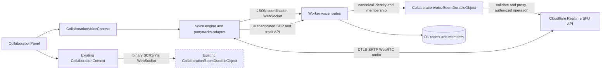
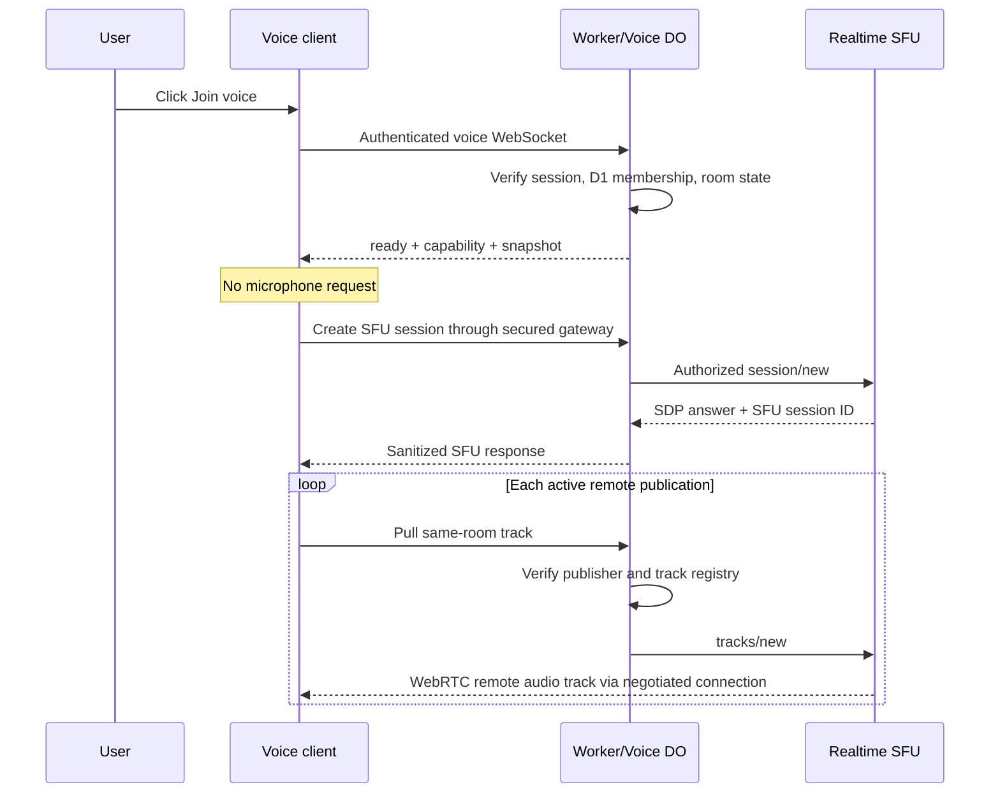
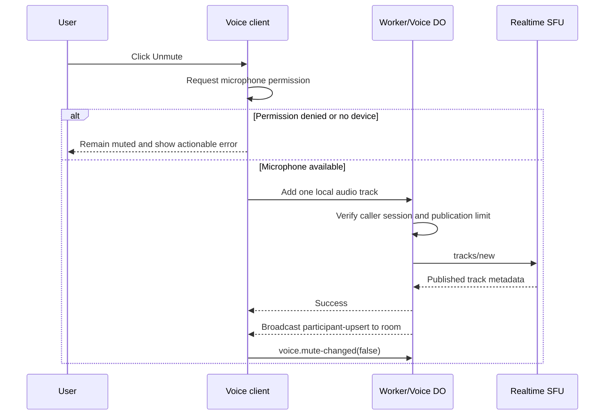

# Voice Chat for Live Collaboration with Cloudflare Realtime SFU

Status: implemented 2026-07-18 (feature flag off; staging verification and rollout pending — see section 21)

Prepared: 2026-07-18

Implementation handoff: Claude Code Fable 5 Max

Review handoff: Codex after implementation

## 1. Decision summary

Add opt-in, audio-only voice chat to an active live-collaboration room by using the direct [Cloudflare Realtime SFU](https://developers.cloudflare.com/realtime/sfu/) product.

This design deliberately does **not** use RealtimeKit. RealtimeKit is a separate, managed product with minute-based pricing and no free tier. Direct Realtime SFU is billed by outbound media bandwidth: the first 1,000 GB of combined SFU and TURN egress per Cloudflare account each month is free, and additional egress is currently $0.05/GB. Client-to-Cloudflare ingress is free. Verify these figures immediately before production rollout because Cloudflare can change pricing and limits.

The implementation must preserve these architectural boundaries:

- Cloudflare Realtime SFU carries WebRTC audio only.
- The application remains responsible for room membership, presence, permissions, and the distribution of authorized SFU track identifiers.
- A new `CollaborationVoiceRoomDurableObject` owns ephemeral voice-room coordination.
- The existing `CollaborationRoomDurableObject`, Yjs document, awareness state, and binary `SCR3` collaboration protocol remain unchanged.
- All SFU API calls pass through an authenticated, room-scoped backend gateway. The SFU application ID and secret never reach the browser.
- Voice is joined explicitly. Entering a collaboration room or opening its participant panel must not request microphone permission.
- Remote participants' voice is not recorded by the existing recording feature.

The recommended client foundation is the Cloudflare-maintained [`partytracks`](https://github.com/cloudflare/partykit/tree/main/packages/partytracks) package, isolated behind an application-owned adapter. At the time this plan was prepared, its version was `0.0.56`. Phase 0 must verify the package and then pin an exact compatible version; do not use a floating range.

## 2. Why this fits the existing application

The repository already has a hybrid Cloudflare collaboration control plane:

- D1 stores rooms, membership, roles, and invitations.
- A Worker authenticates collaboration API and WebSocket requests.
- One `CollaborationRoomDurableObject` per room coordinates Yjs updates and awareness.
- `CollaborationContext` exposes the active room, connection state, and participant identities.
- `CollaborationPanel` provides the natural place for voice controls and participant voice state.

Cloudflare Realtime SFU is intentionally roomless. Its model consists of an application, PeerConnection-backed sessions, and globally addressable tracks. Therefore the existing application—not the SFU—must decide who is in a room and which tracks each person may subscribe to.

Voice coordination must be separate from the current collaboration Durable Object because its WebSocket protocol is strict binary data. Adding JSON voice signaling to that connection would require a protocol revision and unnecessarily couple media failures to document synchronization.

This plan supersedes only the statements in these documents that classify audio chat as permanently external or out of scope:

- [`docs/live-collaboration.md`](./live-collaboration.md)
- [`docs/live-collaboration-cloudflare.md`](./live-collaboration-cloudflare.md)

The implementation must update those statements once voice chat ships. The document and awareness architecture otherwise remains authoritative.

## 3. Product scope

### 3.1 MVP goals

- A member of an active collaboration room can explicitly join and leave its voice session.
- Joining starts in a listening/muted state and does not acquire the microphone.
- The first Unmute action requests microphone permission and publishes one Opus audio track.
- Every joined member can hear every other currently publishing member, subject to a room limit.
- Owner, editor, and viewer roles may all listen and speak in the MVP. Document write permission and voice permission are independent.
- Participant rows show whether someone is in voice, muted, or currently speaking.
- Local mute/unmute never grants another participant permission to unmute the user remotely.
- Media and signaling recover from ordinary network changes without disturbing the Yjs document connection.
- Leaving collaboration, being removed from the room, room closure, sign-out, or navigation to another room tears down voice promptly.
- Failures degrade to text/document collaboration; a voice outage must not make editing unavailable.

### 3.2 Explicit non-goals

- RealtimeKit, its SDKs, or its prebuilt UI
- Video, screen sharing through the SFU, or spatial audio
- Recording, replaying, transcribing, or summarizing remote voice
- Persistent voice history or participant-level voice analytics
- Server-side mixing, PSTN/phone integration, or media bots
- Host mute-all, remote unmute, hand raising, stage/audience roles, or moderation queues
- End-to-end media encryption through WebRTC insertable streams
- SFU DataChannels for collaboration data
- Cloudflare's WebSocket-to-media adapter
- Replacing the existing Yjs/awareness transport
- Mobile-native clients

### 3.3 Room capacity

Use the collaboration room's existing `max_members` as the upper bound. The current default is 10, which is appropriate for an all-to-all audio subscription model. Reject or defer voice joins once the room has reached its configured membership/voice cap rather than allowing unbounded fan-out.

## 4. Cloudflare product facts and constraints

The implementation must be based on the direct SFU API and revalidate the linked documentation during Phase 0.

| Topic                 | Current behavior relevant to this design                                                                                              |
| --------------------- | ------------------------------------------------------------------------------------------------------------------------------------- |
| Product               | Direct Cloudflare Realtime SFU; not RealtimeKit                                                                                       |
| Media model           | One client session maps to one WebRTC `RTCPeerConnection`; published tracks are globally addressable by SFU session ID and track name |
| Rooms/presence        | Not supplied by the SFU; the application must provide them                                                                            |
| Supported audio       | Opus and G.711 A-law/u-law; use Opus                                                                                                  |
| Pricing               | First 1,000 GB/month of combined SFU and TURN egress per account is free; then $0.05/GB                                               |
| Billing direction     | Cloudflare-to-client SFU egress is billed; client-to-Cloudflare ingress is free                                                       |
| TURN billing          | TURN and SFU traffic share the allowance; SFU traffic relayed through Cloudflare TURN is not double-charged                           |
| Per-session API limit | 50 API calls/second                                                                                                                   |
| Batch size            | At most 64 tracks in an API operation; this application must enforce its much smaller room cap                                        |
| Disconnected tracks   | Tracks with no media packets are garbage-collected after approximately 30 seconds                                                     |
| Reconnection          | A session and its tracks can generally be reused during a roughly 30-second recovery window; use library-supported reconnect behavior |
| API readiness         | Track operations require a connected PeerConnection and may wait up to about five seconds                                             |
| Current maturity      | Cloudflare documentation describes Realtime SFU as open beta; re-check status and changelog before production                         |

Primary references:

- [Realtime overview and product pricing comparison](https://developers.cloudflare.com/realtime/)
- [SFU introduction](https://developers.cloudflare.com/realtime/sfu/introduction/)
- [Sessions and tracks](https://developers.cloudflare.com/realtime/sfu/sessions-tracks/)
- [HTTPS API](https://developers.cloudflare.com/realtime/sfu/https-api/)
- [Limits](https://developers.cloudflare.com/realtime/sfu/limits/)
- [Pricing](https://developers.cloudflare.com/realtime/sfu/pricing/)
- [Example architecture](https://developers.cloudflare.com/realtime/sfu/example-architecture/)
- [SFU changelog](https://developers.cloudflare.com/realtime/sfu/changelog/)
- [Cloudflare Meet reference application](https://github.com/cloudflare/meet)

## 5. Target architecture



### 5.1 Responsibility boundaries

| Component                   | Owns                                                                                                                    | Must not own                                             |
| --------------------------- | ----------------------------------------------------------------------------------------------------------------------- | -------------------------------------------------------- |
| `CollaborationContext`      | Document room, awareness identities, edit roles, existing participant list                                              | Microphone, WebRTC, SFU sessions                         |
| `CollaborationVoiceContext` | React-facing voice state and commands tied to the active collaboration room                                             | Yjs updates or room persistence                          |
| Voice engine                | PartyTracks lifecycle, local microphone track, remote audio sinks, speaking detection, reconnect state                  | Authorization decisions                                  |
| Worker voice routes         | Same-origin session auth, D1 membership checks, feature flag, forwarding canonical identity                             | Raw media or durable voice history                       |
| Voice Durable Object        | Ephemeral joined roster, per-connection capabilities, SFU session/track ownership, same-room subscription authorization | Document state or recording data                         |
| Realtime SFU                | WebRTC negotiation, forwarding published media tracks to subscribers                                                    | Application rooms, membership, identity, roles, presence |

### 5.2 Why a separate voice Durable Object

Create one `CollaborationVoiceRoomDurableObject` instance per collaboration room. It gives the backend a serialized authority for:

- the currently joined voice roster;
- mapping authenticated application identities to SFU session IDs;
- mapping published SFU tracks to the room member who owns them;
- authorizing track subscriptions and closes;
- broadcasting roster and mute-state changes;
- expiring duplicate or abandoned connections;
- rejecting cross-room track access.

Keep this state ephemeral. Store enough state in WebSocket hibernation attachments to reconstruct the roster after a Durable Object wake-up. Do not add a D1 migration merely to retain voice presence.

## 6. Trust model and security requirements

The SFU application ID and token are high-value backend credentials. A generic authenticated proxy is still unsafe: an authenticated member could otherwise subscribe to, renegotiate, or close arbitrary globally addressable tracks from another room.

### 6.1 Authentication chain

1. The browser joins voice through a same-origin Worker endpoint while its collaboration room is active.
2. The Worker authenticates the normal application session.
3. The Worker loads the room and membership from D1 and rejects closed rooms, removed members, and over-capacity voice joins.
4. The Worker sends only canonical `roomId`, `userId`, display identity, role, collaboration session ID, and request origin to the room's Voice Durable Object.
5. The Voice Durable Object creates a random per-connection capability and stores only its digest in the socket attachment/state.
6. Subsequent PartyTracks HTTP requests carry the capability in an application-specific header and the voice connection ID as an extra parameter.
7. The Worker re-authenticates the application session; the Voice Durable Object verifies the capability, current socket, room membership generation, path, body, and resource ownership before proxying to Cloudflare.

Capabilities live only in JavaScript memory. Rotate them on a new voice WebSocket generation. Never put them in URLs, persistent browser storage, telemetry, or error messages.

### 6.2 Required authorization matrix for the SFU gateway

Do not mount `routePartyTracksRequest` directly on a public route. Wrap it with the checks below, or implement a small equivalent gateway. The wrapper may use Cloudflare's helper only after the request has been authorized.

| SFU operation           | Required authorization and state update                                                                                                                                                                                    |
| ----------------------- | -------------------------------------------------------------------------------------------------------------------------------------------------------------------------------------------------------------------------- |
| Create session          | Caller has a live room-scoped voice socket and valid capability. Allow only the expected current/recovery generation. Register the returned SFU session ID as owned by that voice connection.                              |
| Generate ICE servers    | Caller has a live voice socket. Return STUN-only configuration in the initial rollout; return only short-lived TURN credentials if TURN is later enabled.                                                                  |
| Add local track         | Path session belongs to caller. Allow audio only, one live published microphone track per connection, bounded SDP/body size, and a bounded track batch. Register the returned track name and owner before broadcasting it. |
| Pull remote track       | Path session belongs to caller. Every requested remote `{sessionId, trackName}` exactly matches an active published track in the same Voice Durable Object. Register returned receiving mids as caller-owned.              |
| Renegotiate             | Path session belongs to caller and the SDP/body is bounded and structurally valid.                                                                                                                                         |
| Close tracks            | Path session belongs to caller. Every mid is a publishing or receiving mid registered to caller. A member cannot close another member's track by supplying its identifiers.                                                |
| Read session state      | Block in the MVP unless PartyTracks requires it; if enabled, permit only the caller's own session.                                                                                                                         |
| Unsupported/update APIs | Fail closed until an explicit use case and ownership rule are added.                                                                                                                                                       |

After any successful proxy response, validate its shape before recording identifiers or returning it to the browser. Use `Cache-Control: no-store` for every signaling/API response.

### 6.3 Additional defenses

- Validate all JSON and query input with strict, shared Zod schemas.
- Enforce HTTPS/WSS and the application's allowed `Origin` values.
- Bound SDP/API request bodies, for example to 256 KiB, and reject unknown content types.
- Enforce the room member limit and at most one microphone publication per voice connection.
- Rate-limit coordination messages and remain safely below Cloudflare's 50 API calls/second/session limit.
- Use monotonic revisions for client mute changes so reordered frames cannot restore stale state.
- Derive identity and role from the server session and D1. Never trust a client-supplied name, role, or user ID.
- Treat SFU session and track identifiers as sensitive access-controlled identifiers even though they are not credentials.
- Never log SDP, ICE candidates, capabilities, raw SFU secrets, microphone device labels, track IDs, or audio data.
- Redact upstream error bodies before returning safe, typed application errors.
- On room closure or member removal, close the voice socket immediately and best-effort close its tracks. Cloudflare's inactive-track garbage collection is only a backstop.
- Do not advertise end-to-end encryption. WebRTC transport is encrypted, but true participant E2EE through an SFU requires an additional insertable-stream design that is outside this MVP.

## 7. Voice coordination protocol

Use a separate versioned JSON WebSocket protocol, independent from `SCR3`.

Suggested route:

```text
GET /api/collaboration/rooms/:roomId/voice/websocket?collaborationSessionId=<uuid>
```

Suggested SFU gateway prefix used by PartyTracks:

```text
/api/collaboration/rooms/:roomId/voice/sfu/*
```

The exact prefix may change during Phase 0 to fit `PartyTracksConfig.prefix`, but it must remain room-scoped and same-origin.

### 7.1 Server-owned participant shape

```ts
type VoiceParticipant = {
  voiceConnectionId: string;
  collaborationSessionId: string;
  userId: string;
  displayName: string;
  role: "owner" | "editor" | "viewer";
  muted: boolean;
  publishedTrack: null | {
    sessionId: string;
    trackName: string;
    location: "remote";
  };
  revision: number;
};
```

The server derives all fields except the client's mute intent. Track metadata comes from successful SFU gateway responses, not from a client claim.

### 7.2 Client-to-server messages

| Type                 | Payload                           | Notes                                                                              |
| -------------------- | --------------------------------- | ---------------------------------------------------------------------------------- |
| `voice.mute-changed` | `{ version: 1, revision, muted }` | Informational roster state. Publishing state is still derived from SFU operations. |
| `voice.leave`        | `{ version: 1 }`                  | Requests orderly track and socket cleanup.                                         |
| `voice.ping`         | `{ version: 1, nonce }`           | Optional bounded liveness message if platform WebSocket behavior requires it.      |

### 7.3 Server-to-client messages

| Type                       | Payload                                                 | Notes                                                           |
| -------------------------- | ------------------------------------------------------- | --------------------------------------------------------------- |
| `voice.ready`              | `{ version: 1, voiceConnectionId, capability, limits }` | Sent only to the joining client; capability is never broadcast. |
| `voice.snapshot`           | `{ version: 1, revision, participants[] }`              | Complete room state used on join/reconnect.                     |
| `voice.participant-upsert` | `{ version: 1, revision, participant }`                 | Identity, mute, or published-track change.                      |
| `voice.participant-left`   | `{ version: 1, revision, voiceConnectionId }`           | Remove audio sink and UI state.                                 |
| `voice.room-closed`        | `{ version: 1, reason }`                                | Terminal cleanup.                                               |
| `voice.error`              | `{ version: 1, code, recoverable, message }`            | Typed, sanitized failure.                                       |
| `voice.pong`               | `{ version: 1, nonce }`                                 | Optional response.                                              |

### 7.4 Connection rules

- A voice WebSocket is created only after an explicit Join voice action.
- A second socket for the same `(userId, collaborationSessionId)` is a reconnect generation and supersedes the older socket after the new one is ready.
- The voice connection ID is independent of the SFU session ID.
- Correlate the voice participant to an awareness participant using canonical `userId` plus `collaborationSessionId`; do not match by display name.
- Restore state from hibernating socket attachments on wake-up.
- If the voice socket is lost, the client enters reconnecting state and lets PartyTracks attempt media recovery within its supported window. After a bounded timeout, perform a clean new join rather than looping indefinitely.

## 8. Media lifecycle

### 8.1 Join and subscribe



Joining must create or resume the browser audio context from the user's click. If browser autoplay policy still blocks playback, show a clear Enable audio control that calls `play()`/resumes audio from another user gesture.

### 8.2 First unmute and publication



Use these initial microphone constraints, subject to the Phase 0 browser spike:

```ts
{
  audio: {
    channelCount: { ideal: 1 },
    echoCancellation: { ideal: true },
    noiseSuppression: { ideal: true },
    autoGainControl: { ideal: true },
  },
  video: false,
}
```

Do not force a 16 kHz input sample rate for SFU voice. Let the browser and Opus negotiate an appropriate rate.

### 8.3 Mute privacy

The desired muted state must release or disable the physical microphone source, not merely set the outgoing RTP sender to silence while retaining an unnecessary capture. Configure PartyTracks with `broadcasting: false`, `activateSource: false`, and `retainIdleTrack: false` where supported.

Phase 0 must verify the exact behavior of the pinned PartyTracks version:

- whether muting stops the underlying `MediaStreamTrack`;
- whether unmuting transparently reacquires permission/device access;
- whether a new published track identifier is produced after reacquisition;
- whether the fallback empty track keeps negotiation stable;
- how browser device removal changes the Observable state.

The protocol and client engine must tolerate track metadata changing after mute/reacquisition. Never provide remote unmute.

### 8.4 Remote audio sinks

- Create one managed audio sink per remote publication, using `createAudioSink` or an application wrapper around an `<audio>` element.
- Never create a sink for the local published track.
- Replace the sink when its metadata revision changes.
- Stop its tracks, unsubscribe Observables, disconnect analysers, and remove its DOM element when the participant leaves or the local user leaves voice.
- Route all sink failures to typed UI state without taking down the document session.
- Output-device selection is a follow-up because `setSinkId` support is browser-dependent. The MVP uses the browser's default output.

### 8.5 Speaking indicators

Compute speaking state locally from the currently active local or remote track with a Web Audio analyser. Use a threshold plus attack/release hysteresis to avoid flicker. Do not send continuous audio levels through the WebSocket, store them, or log them.

When muted and the microphone source has been released, do not attempt a local “speaking while muted” detector because that would defeat the privacy behavior.

## 9. Client state model

Place the media implementation outside the existing large collaboration context. A dedicated context may read `roomId`, room lifecycle, current identity, and awareness session ID from `CollaborationContext`, but it owns its own state machine.

Recommended connection states:

| State          | Meaning                                                  | Allowed user actions            |
| -------------- | -------------------------------------------------------- | ------------------------------- |
| `unavailable`  | Unsupported browser, disabled feature, or no active room | None; show reason when relevant |
| `idle`         | Active collaboration room, not in voice                  | Join                            |
| `joining`      | Authenticating voice socket and establishing SFU session | Cancel/leave                    |
| `listening`    | Joined, connected, microphone not acquired/published     | Unmute, leave                   |
| `unmuting`     | Requesting device and publishing                         | Cancel/mute, leave              |
| `live`         | Joined with a published microphone track                 | Mute, leave                     |
| `reconnecting` | Coordination or media transport recovering               | Mute intent, leave              |
| `failed`       | Voice failed but document collaboration remains active   | Retry, leave                    |
| `leaving`      | Closing sinks, tracks, sessions, and socket              | None                            |

Use an XState machine consistent with the repository's pinned XState version, or an equally explicit reducer if Phase 0 finds the Observable bridge simpler. In either case, keep effects in the voice engine and make transitions deterministic and testable.

Required lifecycle invariants:

- There is at most one voice engine instance for the active room/tab.
- There is at most one local microphone publication.
- `idle` has no microphone track, remote sinks, SFU session, coordination socket, or retry timer.
- A change of room ID always performs full cleanup before joining the next room.
- Yjs reconnect by itself does not tear down healthy voice; room departure/auth loss does.
- Leaving voice does not leave document collaboration.
- Leaving document collaboration always leaves voice first.
- Cleanup is safe to call more than once and must stop every owned media track.

## 10. UI and accessibility

Extend `CollaborationPanel` rather than introducing a second unrelated panel.

### 10.1 Controls

- Show Join voice when an eligible member is not connected.
- After join, show Leave voice and a prominent Mute/Unmute control.
- Use distinct text and icons; do not communicate mute state by color alone.
- Show a compact voice connection status: Connecting, Listening, Live, Reconnecting, or Failed.
- Keep the user in listening/muted state after joining until they explicitly unmute.
- Display permission failures such as “Microphone access was denied” with a retry action and browser-settings hint.
- Display autoplay failures as Enable audio rather than silently remaining inaudible.
- Keep voice errors scoped to the voice UI. The existing Live collaboration status remains accurate for document editing.

### 10.2 Participant rows

For each participant, display only states justified by the voice roster:

- In voice and muted
- In voice and publishing/speaking
- Not in voice

Use `aria-label`/screen-reader text for mic state and live status. Speaking animation must respect `prefers-reduced-motion`.

### 10.3 Browser capability handling

Before enabling Join voice, check the required WebRTC and media APIs. Do not use capability checks as the security boundary. Show an unavailable explanation for unsupported browsers while leaving all document collaboration controls usable.

## 11. Interaction with the existing recorder

This section is a release blocker because remote voice can otherwise be captured unintentionally.

The current application separately acquires a microphone in `src/core/src/machine/audioActor.ts`. It can also capture display/tab audio during screen recording. When voice is playing in the tab, tab-audio capture could include remote participants.

Required MVP policy:

- Remote voice is never intentionally included in SCR3 recordings.
- Voice audio elements are playback-only and are never wired into the recorder's mix graph.
- While joined to voice, the recording path must discard/disable display or tab audio before mixing, even if the browser supplies a display-audio track. The host's microphone narration may still be recorded.
- The recording UI must explain that tab audio is disabled while voice chat is active to protect collaborators.
- Do not silently auto-consent remote participants or add a consent workflow in this MVP.
- Voice and recorder microphone captures remain separate initially because PartyTracks owns its device lifecycle and the recorder has different constraints. Test simultaneous capture on supported browsers.
- If a browser/device cannot provide the microphone to both consumers, surface an actionable recording error: mute/leave voice and retry. Do not silently stop voice or the recording.
- Muting voice must not stop the recorder's microphone track, and stopping a recording must not unmute, stop, or republish voice.

A shared microphone lease/broker can be evaluated later, but it should not be introduced until its interactions with PartyTracks source activation, cloned tracks, constraints, and independent cleanup are proven.

## 12. Proposed repository changes

Names are recommendations; adjust only when repository conventions require it and keep the boundaries intact.

```text
src/
  components/
    CollaborationPanel.tsx                 # voice controls and participant badges
  contexts/
    CollaborationVoiceContext.tsx          # React integration and public voice API
  voice/
    client.ts                              # room-scoped coordination client
    engine.ts                              # lifecycle and media orchestration
    machine.ts                             # deterministic state model
    partyTracksAdapter.ts                  # only direct partytracks dependency
    remoteAudioSink.ts                     # sink/autoplay/cleanup wrapper
    speakingDetector.ts                    # local Web Audio analysis
    types.ts                               # UI-facing types

infra/
  client/
    collaboration/
      collaborationVoiceApi.ts             # URL/auth construction, if needed
  worker/
    collaboration/
      voiceDurableObject.ts                 # ephemeral roster and ownership registry
      voiceProtocol.ts                      # shared/server protocol schemas
      realtimeSfuGateway.ts                 # secured PartyTracks/SFU proxy wrapper
    routes/
      collaboration.ts                     # room-scoped voice routes
    env.d.ts                               # binding and secret declarations
  wrangler.toml                            # voice DO binding/migration and environment config

tests or colocated test directories/
  voice protocol, machine, engine, route, DO, and UI tests

docs/
  live-collaboration-voice-cloudflare-realtime-sfu.md
  live-collaboration.md                     # update non-goal after shipment
  live-collaboration-cloudflare.md          # update architecture after shipment
  deployment-operations-collaboration.md   # add voice deployment/runbook section
```

If client and Worker code cannot safely import one schema module under the current bundling setup, define a dependency-free shared protocol module in an existing shared package. Do not copy protocol literals into multiple files.

## 13. Configuration and infrastructure

### 13.1 Worker bindings and secrets

Add environment-specific configuration with names similar to:

```text
COLLABORATION_VOICE_ROOMS        Durable Object binding
REALTIME_SFU_APP_ID              Worker-only application identifier
REALTIME_SFU_APP_SECRET          Worker secret/API token
VOICE_CHAT_ENABLED               Server-side feature flag, default false
REALTIME_TURN_KEY_ID             Optional, later rollout only
REALTIME_TURN_API_TOKEN          Optional, later rollout only
```

The exact Cloudflare credential names must match the current API/helper version. Store credentials with `wrangler secret put`; never use a `VITE_` variable and never commit a credential. Use separate Realtime applications for local/development, staging, and production so usage, credentials, and track namespaces remain isolated.

Add the new Voice Durable Object binding, exported class, and the appropriate Wrangler migration. It does not need SQLite storage. Confirm the migration syntax against the repository's current Workers compatibility date before editing production configuration.

`VOICE_CHAT_ENABLED` must fail closed. When false or when required secrets are absent, voice routes return a sanitized unavailable response while existing collaboration endpoints continue normally.

### 13.2 Dependency policy

- Complete a small PartyTracks compatibility/security spike first.
- Pin the chosen `partytracks` version exactly.
- Confirm whether its current package requires a direct `rxjs` or `webrtc-adapter` dependency in this bundler; add and pin only what is actually required.
- Check Worker bundling for CommonJS/ESM alias issues before broad implementation.
- Keep all imports of PartyTracks inside `partyTracksAdapter.ts` and the backend gateway so replacing the pre-1.0 dependency is tractable.
- Commit the lockfile with dependency changes.

### 13.3 ICE/TURN rollout

Start with Cloudflare's public STUN service, currently `stun:stun.cloudflare.com:3478`. SFU servers are publicly routable, so TURN is often unnecessary, but restrictive enterprise networks must be tested.

Add Cloudflare TURN only after staging data demonstrates a connection gap. If enabled:

- generate short-lived credentials from the backend;
- never embed TURN API credentials in the browser bundle;
- include TURN egress in the same cost dashboard and allowance;
- retain STUN-first behavior and document the fallback;
- regression-test that media is not billed twice for SFU plus Cloudflare TURN, per the current pricing documentation.

## 14. Implementation phases

Claude Code should implement one phase at a time, keep commits reviewable, and stop if a phase invalidates a security or privacy invariant.

### Phase 0 — Prove the SFU and PartyTracks integration

Tasks:

- Re-read the current official SFU API, limits, pricing, changelog, and PartyTracks source.
- Create separate development/staging Realtime applications outside source control.
- Pin a candidate PartyTracks version in a small adapter.
- Verify browser-to-Worker-to-SFU negotiation for one publisher and one subscriber.
- Verify the helper's exact HTTP paths, request/response shapes, `prefix`, `headers`, `apiExtraParams`, reconnect behavior, and ICE configuration.
- Verify the mute/source-release behavior listed in section 8.3.
- Confirm Worker bundling under the repository's existing compatibility flags without a full production build on the constrained VPS.
- Write down any API differences in this plan before proceeding.

Acceptance criteria:

- The spike uses direct Realtime SFU, not RealtimeKit.
- The SFU secret exists only in the Worker environment.
- PartyTracks is hidden behind an application adapter and exact-pinned.
- A browser can publish and pull Opus audio through a temporary authenticated route.
- The temporary route is removed or converted into the secured, room-scoped gateway before merge; no raw open SFU proxy remains.
- The chosen reconnect and mute behavior is covered by focused adapter tests or documented manual evidence.

Suggested commit: `chore(voice): validate Cloudflare SFU integration`

#### Phase 0 findings (2026-07-18, constrained-VPS verification)

Facts verified against the npm registry and the exact installed package source:

- `partytracks@0.0.56` is still the latest published version and is now pinned
  exactly in `package.json` (runtime deps it brings: `rxjs ^7.8.2`, `jose`,
  `cookie`, `tiny-invariant`; exports `./client`, `./react`, `./server`).
- Client HTTP contract of the pinned build (all relative to
  `PartyTracksConfig.prefix`, with `apiExtraParams` appended as query string):
  `POST {prefix}/sessions/new`, `GET {prefix}/generate-ice-servers` (called
  only when `iceServers` is absent from the config), `POST
{prefix}/sessions/{sessionId}/tracks/new` (push and pull), `PUT
{prefix}/sessions/{sessionId}/renegotiate`, `PUT
{prefix}/sessions/{sessionId}/tracks/update` (simulcast only — the gateway
  fails it closed), `PUT {prefix}/sessions/{sessionId}/tracks/close`. Custom
  `headers` from the config are appended to every request.
- Upstream base URL used by Cloudflare's own server helper:
  `https://rtc.live.cloudflare.com/v1/apps/{appId}/…` with
  `Authorization: Bearer {token}`.
- Mute/source-release behavior (section 8.3) verified in the pinned source:
  `getMic` defaults to `retainIdleTrack: true` and `activateSource: true`, so
  the adapter must pass both as `false` explicitly. `disableSource()` also
  stops broadcasting and unsubscribes the underlying resilient
  `getUserMedia` track, whose teardown calls `track.stop()` — the physical
  microphone is released. `broadcastTrack$` then falls back to a shared
  inaudible Web-Audio track, so the published SFU track remains negotiated
  while carrying silence. `startBroadcasting()` re-enables the source and
  reacquires the device; `push()` may re-emit `TrackMetadata`, so the
  protocol tolerates published-track metadata replacement.
- `TrackMetadata` shape: `{ location?, trackName?, sessionId?, mid?,
simulcast? }`.
- `createAudioSink({ audioElement })` returns `{ attach(track$):
Subscription, setSinkId, devices$, cleanup, isSinkIdSupported }`.

Recorded deviations:

- The live one-publisher/one-subscriber browser spike and the temporary
  authenticated route cannot run on this constrained VPS (no browser
  automation, no dev server). They are deferred to staging and tracked in the
  section 15.2 manual matrix; the client/gateway contract above was instead
  verified directly from the pinned package source.
- The server gateway is implemented as the "small equivalent gateway"
  permitted by section 6.2 inside the Voice Durable Object rather than by
  wrapping `routePartyTracksRequest`, because session/track/mid ownership must
  be registered atomically with each upstream response inside the room's
  serialized authority. `partytracks/server` is not imported by the Worker.
- The client always receives its ICE configuration from the server-owned
  `voice.ready` limits payload wired into `PartyTracksConfig.iceServers`
  (STUN-only initially), so `generate-ice-servers` is answered with the same
  STUN-only configuration and never proxied upstream.
- Cloudflare Realtime application credentials for development/staging must be
  created outside source control by the operator; no credential or
  application ID is committed.

### Phase 1 — Define shared protocol and state model

Tasks:

- Add strict coordination message, participant, capability, and safe error schemas.
- Add a voice state machine/reducer with deterministic cleanup transitions.
- Define typed public context commands: `join`, `leave`, `mute`, `unmute`, `retry`, and `enableAudio`.
- Add pure tests for invalid messages, stale revisions, reconnect generations, and lifecycle invariants.

Acceptance criteria:

- Unknown fields/message types fail closed.
- Tests prove that idle state owns no media resources.
- A room ID change and collaboration leave both cause terminal cleanup.
- Voice failure never transitions document collaboration state.

Suggested commit: `feat(voice): define collaboration voice protocol and state`

### Phase 2 — Add the secured Worker and Voice Durable Object control plane

Tasks:

- Add the Voice Durable Object binding, class export, environment types, migration, and feature flag.
- Add authenticated voice WebSocket and SFU gateway routes.
- Reuse existing session, origin, room, and membership authorization helpers where possible.
- Implement hibernating WebSocket attachments and roster reconstruction.
- Implement capability rotation and digest comparison.
- Implement the full SFU authorization matrix from section 6.2.
- Register SFU session, track, and mid ownership from validated upstream responses.
- Forward room-close, member-removal, and relevant role-control events to both collaboration Durable Objects.
- Add bounded rate limits, message/body limits, no-store headers, and sanitized errors.

Acceptance criteria:

- Anonymous, non-member, removed-member, closed-room, wrong-origin, and disabled-feature requests are rejected.
- A member cannot pull a track from another room, use another member's SFU session, or close another member's mid.
- A member cannot publish more than one microphone track or exceed the room cap.
- Wake-up reconstructs the joined roster and ownership needed for authorization.
- Duplicate connection generations replace the old generation without leaving a ghost participant.
- Room closure/member removal closes voice even if the document socket is independently reconnecting.
- No credential, capability, SDP, ICE candidate, or track identifier appears in logs.

Suggested commit: `feat(voice): add secured SFU room control plane`

### Phase 3 — Implement the browser voice engine

Tasks:

- Implement the PartyTracks adapter and room-scoped coordination client.
- Join in listening mode with no `getUserMedia` call.
- Create the SFU session and subscribe/unsubscribe based on authoritative roster track metadata.
- Acquire and publish the microphone only on Unmute.
- Release/disable microphone source on Mute according to the proven Phase 0 behavior.
- Implement remote audio sink lifecycle and autoplay recovery.
- Implement local speaking detectors with complete cleanup.
- Reconcile coordination reconnect and PartyTracks media reconnect without duplicate tracks/sinks.
- Map internal failures to stable, sanitized UI error codes.

Acceptance criteria:

- Clicking Join does not show a microphone permission prompt.
- First Unmute requests permission once and publishes at most one live audio track.
- Denying permission leaves the member listening and able to retry.
- Mute releases/disables capture and never affects recorder-owned tracks.
- Joining/leaving/reconnecting repeatedly produces no orphan tracks, audio elements, subscriptions, timers, or sockets.
- Removing a remote publication stops audio promptly.
- A failed voice transport leaves Yjs collaboration usable.

Suggested commit: `feat(voice): implement SFU audio client lifecycle`

### Phase 4 — Integrate React UI and collaboration identity

Tasks:

- Mount `CollaborationVoiceContext` within the active collaboration provider boundary.
- Correlate roster members to awareness participants using canonical user/session identifiers.
- Add Join, Leave, Mute, Unmute, Enable audio, retry, and connection-state UI to `CollaborationPanel`.
- Add participant muted/in-voice/speaking indicators.
- Add accessible names, keyboard focus behavior, reduced-motion support, and non-color state cues.
- Keep voice rendering isolated enough that analyser updates do not rerender the editor tree at audio-frame frequency.

Acceptance criteria:

- Voice controls appear only for an active, eligible room and enabled server capability.
- Opening the panel does not join voice or request devices.
- Every control is usable by keyboard and has an accurate accessible name/state.
- Speaking updates are throttled and scoped to participant indicators.
- Multiple tabs for one user remain distinct through collaboration session IDs.

Suggested commit: `feat(voice): add live collaboration voice controls`

### Phase 5 — Enforce recorder privacy and lifecycle integration

Tasks:

- Audit `audioActor`, screen capture, tab-audio mixing, pause/resume, and cleanup paths.
- While voice is joined, ensure display/tab audio tracks are excluded from the SCR3 recording mix.
- Preserve host microphone narration and independent voice microphone state.
- Add UI copy explaining the tab-audio restriction.
- Detect and report device-busy failures when voice and recording both need the microphone.
- Test stop order in both directions: recording then voice, and voice then recording.

Acceptance criteria:

- A staging recording made while remote voice is audible contains no remote voice audio.
- Host narration remains present when microphone permission/device behavior supports simultaneous capture.
- Starting/stopping/muting either feature never silently changes the other feature's state.
- Device contention produces an actionable error without data loss.

Suggested commit: `fix(recording): exclude collaboration voice from captures`

### Phase 6 — Operations, documentation, and guarded rollout

Tasks:

- Add focused tests and complete the manual compatibility matrix.
- Add aggregate metrics, safe structured logs, alerts, and a rollback switch.
- Add deployment steps and incident procedures to `deployment-operations-collaboration.md`.
- Update the two collaboration architecture documents to describe direct SFU voice.
- Document Realtime application/secret creation per environment without including values.
- Roll out to internal rooms, then a small percentage/cohort, then all eligible rooms.
- Decide whether TURN is needed from measured connection failures.

Acceptance criteria:

- The server feature flag can disable new joins without affecting document collaboration.
- Existing connected clients handle disable/maintenance with a safe typed error and cleanup.
- Cost and connection dashboards are visible before public rollout.
- Runbook covers credential rotation, upstream outage, cost spike, room cleanup, and rollback.
- Documentation says direct Realtime SFU and does not imply RealtimeKit usage.

Suggested commit: `docs(voice): add SFU operations and rollout guidance`

## 15. Verification plan

Follow the repository's VPS safety constraints: one bounded foreground command at a time, no subagents, no watch mode, no background processes, and no full-repository build/test/typecheck/lint. Use the smallest targeted test or file-level check with one worker/thread. Perform multi-browser and multi-client checks on staging or another adequately resourced environment, not this constrained VPS.

### 15.1 Focused automated tests

Protocol/state:

- Reject unknown message types, fields, invalid UUIDs, oversized input, and stale revisions.
- State transitions are idempotent and cleanup always reaches resource-free `idle`.
- Room switch, auth loss, member removal, and room closure are terminal for voice.

Worker/authorization:

- Anonymous, non-member, wrong origin, disabled flag, closed room, and capacity exceeded.
- Capability absent, expired, wrong socket generation, and wrong room.
- Create a second active SFU session when one is not allowed.
- Publish non-audio/multiple tracks.
- Pull an unpublished, removed, cross-room, or guessed track.
- Renegotiate another connection's SFU session.
- Close another connection's publishing or receiving mid.
- Malformed/oversized SDP and an upstream error containing sensitive details.
- Rate limiting remains below the Cloudflare per-session API limit.

Voice Durable Object:

- Hibernation attachment restoration.
- Duplicate tab/reconnect generation replacement.
- Track republish after mute/device change.
- Participant removal broadcasts and removes registered tracks.
- Room closure/member removal cleanup.
- Best-effort upstream close failure still removes local authorization state.

Client engine:

- Join performs no microphone acquisition.
- Permission granted, denied, dismissed, and device missing.
- Mute, unmute, source release, track metadata replacement, and device removal.
- Remote sink add, replace, remove, autoplay rejection, and retry.
- WebSocket-only failure, media-only failure, simultaneous recovery, and bounded fallback to new join.
- Repeated leave/cleanup and React unmount.

UI:

- Controls and participant state for idle/joining/listening/live/reconnecting/failed.
- Keyboard activation, focus retention, accessible labels, and reduced motion.
- Voice state update does not break existing invite, follow, role, leave, or end-room controls.

Recorder:

- Remote sink audio is excluded from recordings.
- Display/tab audio is dropped while voice is joined.
- Host microphone behavior under simultaneous capture and device contention.
- Independent cleanup/mute behavior.

### 15.2 Manual staging matrix

Use at least three authenticated browser profiles representing owner, editor, and viewer.

| Scenario                                             | Expected result                                           |
| ---------------------------------------------------- | --------------------------------------------------------- |
| Chrome/Chromium, Firefox, and Safari where supported | Join, listen, unmute, mute, leave, and cleanup work       |
| Two physical devices/networks                        | Low-latency bidirectional audio and correct roster        |
| Three or more clients                                | All-to-all subscriptions, no self-audio, cap enforced     |
| Permission denied then enabled                       | Remains listening, retry succeeds                         |
| Microphone unplug/replug or default-device switch    | Typed state and recovery without duplicate publication    |
| Wi-Fi/mobile network transition                      | Reconnecting state, bounded recovery, no Yjs interruption |
| Tab background/foreground                            | Audio/state recover according to browser policy           |
| Page refresh and duplicate tab                       | Old generation expires; no ghost roster or track          |
| Member removed/room ended                            | Voice stops promptly and cannot reauthorize               |
| Restrictive corporate network                        | Record STUN failure evidence and evaluate TURN            |
| Voice plus SCR3 recording                            | Remote voice absent from captured output                  |
| Cloudflare SFU unavailable                           | Voice reports failure; document collaboration continues   |

## 16. Observability, cost, and operations

### 16.1 Safe metrics

Track aggregate counters and distributions, not media or participant activity histories:

- voice join attempts, successes, failures by safe error code;
- time to voice-ready and time to first remote audio;
- active voice connections and published tracks per room count bucket;
- reconnect attempts, recovery success, and terminal failures;
- permission denied, autoplay blocked, and device unavailable counts;
- SFU gateway operations/status groups and latency;
- rejected authorization attempts by category;
- estimated or Cloudflare-reported SFU/TURN egress;
- recording attempts where tab audio was suppressed due to active voice.

Do not log display names, raw user IDs when avoidable, room content, SDP, ICE candidates, device labels, SFU identifiers, capabilities, or audio levels. Use request correlation IDs and safe room/user hashes only if operationally necessary under the application's privacy policy.

### 16.2 Cost model

For an all-to-all voice room with `N` active speakers/listeners at encoded bitrate `B`, the lower-bound SFU egress estimate is:

```text
egress bytes ≈ N × (N - 1) × B × seconds ÷ 8
```

Example: 10 participants all continuously sending 32 kbit/s audio produces approximately 1.296 GB/hour before RTP, transport, retransmission, silence behavior, and TURN overhead. At that deliberately conservative activity level, 1,000 GB is roughly 770 ten-person room-hours. Real usage depends heavily on Opus DTX/silence and actual concurrency; use Cloudflare usage data for billing decisions rather than this estimate.

Create alerts at approximately 70%, 85%, and 95% of the monthly free allowance. Because SFU and TURN share the allowance at the account level, the dashboard must include both and any other applications using the same Cloudflare Realtime account.

### 16.3 Operational switches and incident response

- `VOICE_CHAT_ENABLED=false` blocks new joins and is the primary rollback.
- Prefer gracefully notifying already joined users before terminating voice during planned maintenance.
- An SFU or Voice Durable Object incident must not disable the existing room API or Yjs Durable Object.
- Rotate a compromised SFU token in Cloudflare and Worker secrets, then invalidate active voice capabilities/sessions.
- A cost spike response may disable new joins, lower room capacity, or temporarily disable TURN; document who is authorized to take each action.
- Monitor Cloudflare's Realtime status/changelog during an incident and before deployments.

## 17. Risk register

| Risk                                             | Impact                                    | Mitigation/release gate                                                                             |
| ------------------------------------------------ | ----------------------------------------- | --------------------------------------------------------------------------------------------------- |
| Realtime SFU remains beta or changes API         | Breakage or changed behavior              | Exact dependency pin, adapter boundary, Phase 0 API verification, staged rollout                    |
| Public proxy becomes an authorization bypass     | Cross-room listening or track disruption  | Room-scoped capability, per-session/track/mid registry, negative BOLA tests, fail-closed operations |
| SFU identifiers leak through logs/errors         | Unauthorized probing and privacy exposure | Redaction, sanitized error schema, logging tests                                                    |
| Muted user remains physically captured           | Privacy violation                         | Prove source release behavior before rollout; no speaking-while-muted detector                      |
| Tab recording captures remote participants       | Privacy violation                         | Drop display/tab audio whenever voice is joined; staging recording release gate                     |
| Browser autoplay blocks remote audio             | User hears silence                        | Join gesture primes audio; explicit Enable audio recovery                                           |
| Corporate firewall blocks WebRTC                 | Failed calls                              | Measure STUN-only failures; add short-lived Cloudflare TURN if justified                            |
| Reconnect creates duplicate tracks/sinks         | Echo, cost, ghost roster                  | Connection generations, ownership registry, idempotent cleanup, bounded retry tests                 |
| PartyTracks pre-1.0 behavior changes             | Regression                                | Exact pin, small adapter, lockfile review, no direct imports elsewhere                              |
| Audio fan-out exceeds free tier                  | Unexpected charges                        | Room cap, cost dashboard, allowance alerts, server kill switch                                      |
| Voice state rerenders editor frequently          | Editing performance regression            | Isolated context/selectors and throttled speaking state                                             |
| Voice cleanup is coupled to Yjs outage           | Leaked media or inability to speak        | Separate transport and lifecycle; shared room/auth terminal events only                             |
| Simultaneous voice and recording contend for mic | One feature fails                         | Browser matrix, independent ownership, actionable retry path                                        |

## 18. Definition of done

The feature is complete only when all of the following are true:

- Production code uses direct Cloudflare Realtime SFU and contains no RealtimeKit package, endpoint, configuration, or UI.
- SFU credentials are Worker-only and environment-specific.
- Every SFU operation is authenticated, room-scoped, and checked against server-owned session/track/mid state.
- A member cannot subscribe to or disrupt a different room in negative tests.
- Join is explicit and microphone capture begins only on Unmute.
- Mute disables/releases physical capture according to the verified browser/library behavior.
- Owner, editor, and viewer can join/listen/speak within the configured cap.
- Participant voice/mute/speaking state is accurate, accessible, and robust across reconnects.
- All media tracks, sinks, Observables, sockets, timers, and analysers are removed on leave/unmount/room change/auth loss.
- Document collaboration continues during voice failures.
- Remote voice is absent from SCR3 recordings, including when tab/display audio was offered by the browser.
- Targeted automated tests and the manual staging matrix pass.
- The feature flag, aggregate metrics, cost alerts, secrets procedure, rollback, and incident runbook exist before full rollout.
- Collaboration architecture and operations documentation is updated.
- No full-repo or memory-heavy verification was run on the constrained VPS; any skipped broader check is explicitly recorded for CI/staging.

## 19. Claude Code implementation handoff checklist

Before changing code:

1. Read this entire plan plus the three linked collaboration/operations documents.
2. Inspect the current implementation; file names and APIs may have changed after this plan's date.
3. Revalidate Cloudflare SFU documentation, pricing, limits, beta status, and PartyTracks source.
4. Confirm the repository's `AGENTS.md` constraints and use only bounded, targeted foreground verification on this VPS.
5. Record any material deviation from this plan before implementing it, especially changes to the trust model, recorder policy, or Durable Object boundary.

During implementation:

1. Work phase by phase and keep each commit narrowly scoped.
2. Preserve the existing binary collaboration protocol and Yjs Durable Object.
3. Add authorization and negative tests with the gateway, not after UI completion.
4. Do not merge a temporary raw SFU proxy.
5. Do not request microphone access on room entry, provider mount, panel open, or Join voice.
6. Do not add remote voice recording or claim end-to-end encryption.
7. Keep PartyTracks behind the adapter and pin dependencies exactly.
8. Run only the smallest relevant test file/type check with a single worker; leave full-suite verification to adequately resourced CI/staging.
9. Update this document when implementation evidence changes an assumption.

For the review handoff back to Codex, include:

- commit list and a file-by-file summary;
- the pinned package versions and Cloudflare API assumptions;
- exact focused checks run and their results;
- manual browser/device/network evidence;
- a short threat-model summary with the cross-room/track-close negative tests;
- proof that Join does not request microphone access;
- proof that voice/tab audio is absent from a recording;
- configuration, Durable Object migration, secret, and rollout instructions;
- known gaps, deferred items, and whether TURN was enabled;
- current `git status` without exposing any credential.

## 20. Review focus after implementation

Codex's follow-up review should prioritize, in order:

1. Cross-room and cross-user authorization around every proxied SFU operation.
2. Microphone privacy, mute semantics, and remote-voice recording exclusion.
3. Resource cleanup and duplicate track/session behavior during reconnects.
4. Isolation from the Yjs/SCR3 collaboration path.
5. Worker secrets, Durable Object migration safety, feature flag, and rollback.
6. Accessibility, browser failure states, performance, observability, and cost controls.

Treat a failure in the first three areas as release-blocking.

## 21. Implementation record (2026-07-18, for the Codex review handoff)

### Commits

- `chore(voice): validate Cloudflare SFU integration` — exact-pin `partytracks@0.0.56`
  (+ `rxjs@7.8.2` as a direct pinned dependency), Phase 0 findings in section 14.
- `feat(voice): define collaboration voice protocol and state` —
  `src/collaboration/voiceProtocol.ts` (strict Zod schemas, shared client/Worker),
  `src/voice/machine.ts` (XState lifecycle), `src/voice/types.ts`, pure tests.
- `feat(voice): add secured SFU room control plane` —
  `infra/worker/collaboration/voiceDurableObject.ts` (hibernating roster + capability digests +
  session/track/mid ownership registry + gateway proxy),
  `infra/worker/collaboration/realtimeSfuGateway.ts` (pure §6.2 authorization matrix, request and
  response schemas, response sanitization), room-scoped routes in
  `infra/worker/routes/collaboration.ts`, control-event fan-out to the voice room,
  `COLLABORATION_VOICE_ROOMS` binding + `collaboration-voice-v1` migration, env types, flag.
- `feat(voice): implement SFU audio client lifecycle` — `src/voice/partyTracksAdapter.ts`
  (the only partytracks import), `client.ts`, `engine.ts`, `remoteAudioSink.ts`,
  `speakingDetector.ts`, mocked-dependency engine tests.
- `feat(voice): add live collaboration voice controls` —
  `src/contexts/CollaborationVoiceContext.tsx`, `CollaborationPanel` voice section and
  participant badges, availability endpoint + client API, provider mounted in `Editor.tsx`.
- `fix(recording): exclude collaboration voice from captures` — `src/voice/recorderBridge.ts`,
  tab-audio exclusion at `getDisplayMedia` time and mid-recording, `MediaControls` copy.
- `docs(voice): add SFU operations and rollout guidance` — this record plus updates to the two
  collaboration architecture documents and `deployment-operations-collaboration.md`.

### Pinned versions and API assumptions

`partytracks@0.0.56` exact; `rxjs@7.8.2` exact. Client/gateway HTTP contract and mute semantics
as verified in the Phase 0 findings (section 14). Upstream base
`https://rtc.live.cloudflare.com/v1/apps/{appId}` with bearer auth. `tracks/update` and session
reads fail closed.

### Focused checks run on the constrained VPS (single worker, one at a time)

- `vp test run src/collaboration/voiceProtocol.test.ts` — 14 passed.
- `vp test run src/voice/machine.test.ts` — 21 passed.
- `vitest run --config infra/worker/vitest.config.ts infra/worker/collaboration/realtimeSfuGateway.test.ts` — 16 passed.
- `vp test run src/voice/engine.test.ts` — 17 passed.
- `vp test run src/contexts/CollaborationVoiceContext.test.tsx` — 6 passed.
- `vp test run src/components/CollaborationPanel.voice.test.tsx` — 12 passed.
- `vp test run src/components/CollaborationPanel.test.tsx` — 3 passed (existing suite).
- `vp test run src/voice/recorderBridge.test.ts` — 6 passed.
- `tsc --noEmit -p infra/worker/tsconfig.json` — clean.
- Scoped `tsc --noEmit` over `src/voice/**` + `src/collaboration/voiceProtocol*` — clean.

### Checks deliberately skipped on this VPS (record for CI/staging)

- Full-repository `tsc -b tsconfig.json`, full `vp test`, full build, and `wrangler deploy`
  dry-run: prohibited memory-heavy operations here; run in CI before merge/deploy.
- Voice Durable Object runtime tests (hibernation attachment restoration, duplicate-generation
  replacement, socket lifecycle): the DO imports `cloudflare:workers` and needs a workerd-based
  test pool that this repository does not currently include. The pure authorization matrix is
  covered by `realtimeSfuGateway.test.ts`; the DO behaviors must be exercised by the staging
  smoke test in `deployment-operations-collaboration.md` (and a `@cloudflare/vitest-pool-workers`
  suite is a good CI follow-up).
- The entire section 15.2 manual browser/device/network matrix, including the
  recording-contains-no-remote-voice release gate and mute source-release verification on real
  devices.

### Threat-model summary

Every SFU operation requires: same-origin authenticated session (Worker), D1 membership on an
active room (Worker, on the same request), a valid per-connection capability whose SHA-256 digest
matches the caller's live hibernating socket (voice DO), and the §6.2 ownership matrix
(`realtimeSfuGateway.ts`): one session per connection, one audio publication, pulls only of
tracks currently published by _other_ live connections in the same room object, closes only of
the caller's own registered mids. Negative tests cover cross-session use, guessed/cross-room
track pulls, pulling one's own track, closing another member's mid, multi-track and non-audio
publishes, malformed/oversized SDP, and upstream response sanitization (unknown fields and error
descriptions never reach the browser). Capabilities exist only in client memory and as digests;
no SDP/ICE/track identifiers/capabilities are logged.

### Behavioral proofs in automated tests

- Join requests no microphone: engine test asserts zero `publishMicrophone` calls and no
  detector creation through join/ready/snapshot; provider test asserts mounting never joins.
- Mute releases physical capture: adapter passes `retainIdleTrack:false`/`activateSource:false`
  and calls `disableSource()` (verified against pinned source); engine test asserts release on
  mute, on unmute-failure, and on device loss while live.
- Recorder privacy: recorder-bridge tests prove tab audio is stripped at acquisition when voice
  is joined and stopped mid-recording when voice joins later.

### Known gaps and deferred items

- TURN not enabled (STUN-only, per §13.3).
- Output-device selection (`setSinkId`) deferred (§8.4).
- Voice DO workerd test suite deferred to CI (above).
- Aggregate voice metrics beyond structured logs (§16.1 counters/dashboards) and the cost-alert
  wiring are operational follow-ups before public rollout; the kill switch, sanitized logging,
  and runbook exist now.
- `voice.ping`/`voice.pong` exists in the protocol but the client does not send pings; Cloudflare
  hibernation auto-response handles keepalive.

### Rollout state

Shipped dark: `VOICE_CHAT_ENABLED="false"` in `infra/wrangler.toml`, no Realtime application or
secrets configured yet. Follow `deployment-operations-collaboration.md` → “Voice chat” for
environment setup, staged enablement, smoke test, and rollback.
