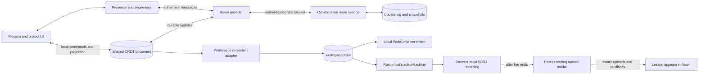
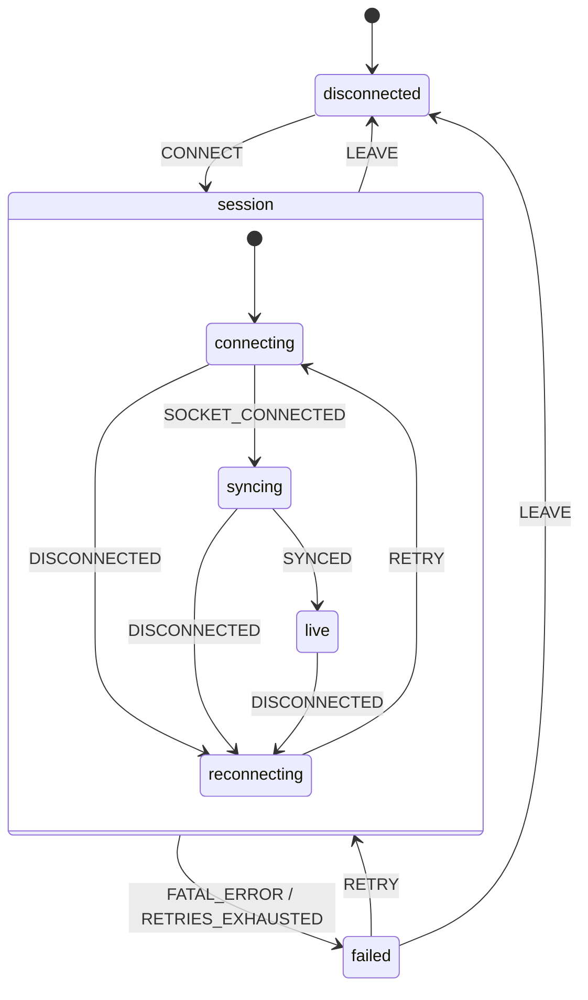

# Live Collaboration Feature Plan

Status: proposed

Deployment evaluations:

- [Cloudflare-native Deployment](./live-collaboration-cloudflare.md)
- [Upstash Deployment Evaluation](./live-collaboration-upstash.md)

## Decision

Real-time collaboration is feasible with the current editor, state machines, and streaming
recording model, but the collaboration protocol must be a separate data plane.

- Use a CRDT document as the source of truth for a connected room. Yjs is the recommended
  initial implementation.
- Use an ephemeral awareness channel for participants, cursors, selections, and follow-host
  state.
- Keep `workspaceStore` as the local UI projection of the shared document while connected.
- Keep `editorMachine` responsible for browser-local recording and playback orchestration.
- Keep SCR3 as a single-writer recording and replay format. Only the room host may record. For the
  MVP, the room owner remains host throughout a recorded session, and that browser converts the
  converged room state into one ordered SCR3 stream and retains it locally until live ends.
- Continue using an external service for audio and video calls. Call state is outside this
  feature except for an optional room link.

SCR3 must not be used as the multi-writer synchronization protocol. Its ordered deltas and
prefix-decodable segments are useful after collaboration changes have converged, not for
resolving concurrent edits.

## Goals

- Let multiple authenticated users edit the same project concurrently.
- Converge text and file-tree changes after concurrent edits, disconnects, and reconnects.
- Show participant identity, connection status, active file, cursor, and selection in real time.
- Support owner, editor, and viewer permissions.
- Allow participants to follow a designated host's active file and preview state.
- Preserve the existing standalone editor when no collaboration room is configured.
- Record the resulting collaborative session in the room host's browser through the existing
  recording pipeline.

## Non-goals

- Audio or video transport, recording, or conferencing.
- Using SCR3 segments to merge concurrent editor operations.
- Running one shared WebContainer process across browsers.
- Real-time collaborative editing of arbitrary binary assets in the first release.
- Author-attributed replay, shared undo, comments, and annotations in the first release.
- Making playback and live authoring write to the same workspace simultaneously.
- Handing an in-progress recording from one room host to another.

## Why the current model needs a collaboration plane

The existing architecture deliberately has one writer for workspace-shaped state. During
authoring, `workspaceStore` owns the project; during playback, `editorMachine` projects recorded
state into the store. See [State Machines Documentation](./state-machines.md).

The streaming codec is also deliberately ordered:

- [Streaming Playback Guide](./streaming-playback.md) defines SCR3 as one producer to many
  viewers, not collaborative editing.
- [frameDelta.ts](../src/core/src/utils/frameDelta.ts) reconstructs deltas against an exact prior
  frame. Concurrent producers would not agree on that prior frame.
- [workspaceEventDedup.ts](../src/storage/streamingRecordingCodec/workspaceEventDedup.ts) strips
  and restores workspace content using the same strict stream order.
- [format.ts](../src/storage/streamingRecordingCodec/format.ts) describes time-ordered segment
  tracks; segments do not contain the client, operation, or causal identifiers needed for
  conflict resolution.
- [recordingStreamSink.ts](../src/storage/recordingStreamSink.ts) batches recording data for
  append-only streaming rather than low-latency editing acknowledgements.

Changing those invariants would make recording recovery and progressive playback substantially
more complex. A CRDT can resolve concurrent changes first, after which the existing recorder can
capture the converged result in its expected order.

## Proposed architecture



Each client owns a CRDT document and receives the same durable room updates. The room service
persists updates and enforces access. Awareness messages use the same connection but are not
stored as project history. Every client keeps its own UI and WebContainer; only project data and
explicit host-follow signals are shared.

## State ownership

| Data                                             | Source of truth while connected                     | Persistence            |
| ------------------------------------------------ | --------------------------------------------------- | ---------------------- |
| File text                                        | CRDT text value keyed by stable file ID             | Room document          |
| File/folder names, parents, and order            | CRDT project tree                                   | Room document          |
| Project-level collaborative settings             | CRDT project metadata                               | Room document          |
| Active file, panels, collapsed folders           | Local client                                        | Existing local state   |
| Participant name, cursor, selection, active file | Awareness state                                     | Ephemeral with a TTL   |
| Room membership and role                         | Collaboration service                               | Server ACL/session     |
| Preview/runtime output                           | Each client; host is authoritative for follow mode  | Not durable by default |
| Recording timeline and capture state             | Room host's `editorMachine`                         | Browser-local SCR3     |
| Playback workspace                               | `editorMachine` projection while playback is active | Loaded SCR3            |

Outside a room, the current ownership rules remain unchanged. Inside a room, the CRDT document
becomes authoritative for collaborative project fields and `workspaceStore` becomes their local
rendering adapter. Local-only workspace fields remain client-owned.

The existing standalone project snapshot must not silently become authoritative for a room.
Any client-side room cache must be namespaced by room and schema version and treated only as a
startup optimization; server synchronization decides the shared state.

## Shared document model

Use stable IDs rather than paths as collaborative identity. A rename or move changes node
metadata without replacing the text object or losing cursor anchors.

```text
project
  schemaVersion
  metadata
  nodes: nodeId -> { kind, name, parentId, orderKey, deleted }
  texts: fileNodeId -> collaborative text
```

The adapter derives the path-based `Project` shape expected by the current store. Tree operations
must be transactions over stable node IDs. Concurrent sibling-name collisions need one
deterministic policy, applied identically by all clients; the recommended default is to retain
both nodes, choose the unsuffixed winner by stable node ID, and derive every conflict suffix from
the losing node's ID.

The schema must also define deterministic repair for invalid parents, cycles, edits below a
deleted folder, and concurrent delete/move operations. A safe default is to tombstone deletes,
move orphaned live nodes to a recovery folder, and break a parent cycle at the node with the
greatest stable ID. These rules require convergence tests before the schema is persisted in
production rooms.

Binary assets should remain content-addressed blobs outside the CRDT. The shared document stores
only the asset ID, MIME type, size, and logical file node. Upload must complete before publishing
the reference, and missing assets must render as recoverable placeholders.

Large initial projects should be seeded once by the room service or room creator. Clients must
not independently import the same path-based project into an empty room, because that would
create duplicate stable IDs.

## Transport and room protocol

Use one authenticated secure WebSocket per room with three logical message classes:

1. **Document:** binary CRDT sync and update messages. These are durable and replayable.
2. **Awareness:** participant, cursor, selection, active-file, and follow-host messages. These are
   ephemeral, replaceable, rate-limited, and expire after disconnect.
3. **Control:** protocol/schema versions, effective role, host assignment, room closure, and
   recoverable errors.

The initial handshake must include `protocolVersion`, `documentSchemaVersion`, room ID, and a
short-lived room token. Initial sync should use document state vectors/diffs rather than sending
the full update log. The service should periodically compact the update log into a snapshot.

Reconnect uses capped exponential backoff with jitter. Local CRDT updates may continue while
offline and merge after reconnection. Awareness is cleared on disconnect and republished only
after document sync succeeds.

The server is authoritative for membership and roles. A viewer connection must not be allowed to
publish durable document updates even if a modified client claims editor permissions.

## `collaborationMachine`

Add a dedicated machine beside `editorMachine`; do not expand the recording machine into a
network and room-lifecycle coordinator.



The machine owns connection lifecycle, room identity, effective role, host identity, retry
metadata, and user-facing connection errors. The `session` parent invokes one callback/provider
actor for the entire connection lifetime. That actor owns the socket and CRDT provider, survives
transitions between the connection substates, and is automatically disposed when `session` exits.

Do not send every keystroke through XState or store document content in machine context. Monaco
bindings and file commands transact directly against the CRDT document; observers update the
workspace projection. This keeps the machine serializable and avoids turning high-frequency text
updates into orchestration events.

Required lifecycle behavior:

- `CONNECT` creates one provider actor for the requested room.
- `SYNCED` enables document projection and publishes awareness.
- Disconnect retains unsent local document changes but clears remote awareness.
- Role downgrade immediately disables all local collaborative write commands.
- `LEAVE`, unmount, and room changes destroy observers, awareness, sockets, and retry timers.
- Fatal authentication, schema, and permission errors do not retry automatically.
- Provider events carry a session/attempt ID so late events from an older socket cannot mutate a
  replacement session.

## Editor integration

### Monaco and workspace projection

Bind each open Monaco model to the corresponding collaborative text object. Tag transaction
origins such as `local-editor`, `local-tree-command`, `remote-provider`, `workspace-projection`,
and `playback` so adapters can prevent feedback loops and scope undo to a user's own changes.

File create, rename, move, and delete actions must become CRDT commands in collaboration mode.
The projection adapter updates `workspaceStore` from the resulting document transaction. Existing
store commands remain the write path in standalone mode.

Projection should be incremental and batched per CRDT transaction. Rebuilding the complete
path-based project on every inserted character would create unnecessary store notifications,
WebContainer writes, and recording events.

Remote changes to inactive files must update the store and WebContainer mirror. They must also be
visible to the room host's recorder; relying only on Monaco's active model would omit those edits
from the recording.

### Runtime and follow-host behavior

Every participant runs the project in a separate local WebContainer. For the first release:

- The host's active file, preview route, and run/restart intent may be published as awareness or
  control state.
- A participant opts into follow mode; follow signals never overwrite that participant's local
  project data.
- Runtime logs, terminal input, and process state are not merged.
- The designated host is authoritative for runtime events captured into the recording.
- Only the effective host sees enabled recording controls. For a recorded MVP session, the owner
  remains host until recording has stopped and the local SCR3 has been finalized.

Remote collaborators can change code that another client's preview executes. Joining an editable
room is therefore a code-execution trust decision. Auto-run should remain paused during initial
sync, and the UI should make the room owner and effective role clear before enabling preview.

### Playback isolation

Current playback writes recorded workspace snapshots into `workspaceStore`. Those writes must
never be published to the shared document.

The first implementation should make live room projection and playback mutually exclusive in a
single editor instance. Entering playback pauses the collaboration projection and tags every
playback store update as non-publishable. Unloading playback reprojects the current shared
document before editing is enabled again. A later implementation may use separate live and replay
workspace instances.

## Recording and SCR3

The room host's browser is the sole recorder for the MVP. Its `workspaceStore` projection gives
the existing `editorMachine` a converged project snapshot and ordered workspace events. The host
also captures preview/runtime events so the recording has one coherent timeline. Intermediate
replay state reflects the order in which that browser observed concurrent updates; the final
project still converges with the room.

The application must allow only the current host to start or continue recording. In the MVP, the
room owner remains the host for the duration of a recorded session, which makes the recorder and
the eventual uploader the same browser. A host transfer requires stopping and finalizing the
current recording first; recording state and SCR3 bytes are never handed to the next host.

Recording is not part of the collaboration data plane. SCR3 bytes stay in the host's browser and
use the existing local recording persistence, including IndexedDB recovery. The room provider,
Redis, Durable Object storage, and collaboration R2 namespaces must never receive or finalize the
recording while the session is live.

After the host ends the live session, the browser finalizes the local recording and presents the
same post-recording upload-modal experience used by standalone recording. The implementation
should reuse or adapt the current `renderPostRecordingModal` → `UploadLessonModal` composition;
it is not a collaboration-specific `/learn` transport. Only an explicit action in that modal
uploads the lesson files and creates a draft, and the lesson appears under `/learn` after publish.
Until upload succeeds, the server has no copy of the recording. See
[CodeRoute.tsx](../src/components/CodeRoute.tsx),
[UploadLessonModal.tsx](../infra/client/upload/UploadLessonModal.tsx), and the existing
[upload and publish sequence](./cloudflare-architecture.md#upload--publish-sequence).

For the first release:

- Do not change the SCR3 container or decoder.
- Record the resulting workspace state, not raw CRDT updates.
- Do not promise per-author attribution in replay.
- Do not stream SCR3 through the collaboration provider or upload it before the live session ends.
- Do not hand recording between clients. If the host disconnects, local recovery or finalization
  remains that host browser's responsibility.

A future optional collaboration track could store participant attribution or normalized CRDT
transactions. It must be backward-compatible and is not required for shared editing.

## User experience

The collaboration UI should provide:

- Share/invite control with the current room role.
- Recording controls enabled only for the current room host.
- Connection states for connecting, syncing, reconnecting, offline changes, and failure.
- Participant list with stable colors and host/role indicators.
- Remote cursor and selection decorations only for the file currently visible locally.
- Active-file indicators and an explicit follow-host toggle.
- Conflict and missing-asset indicators that do not block unrelated editing.
- A clear read-only state that disables commands rather than allowing edits that will be rejected.

Cursor and selection messages should be throttled and use relative CRDT positions so they survive
concurrent text edits. Participant colors should be derived from stable session identity and meet
contrast requirements.

## Delivery phases

### Phase 1: room foundation

- Define the document schema, protocol versions, and ownership contract.
- Add the authenticated room service, persistence, compaction, and roles.
- Add `collaborationMachine`, provider lifecycle, reconnect behavior, and connection UI.
- Prove two clients converge through disconnect/reconnect and reordered delivery.

### Phase 2: text and presence

- Bind Monaco models to collaborative text.
- Project remote edits into `workspaceStore` and the local WebContainer.
- Add participants, cursors, selections, active-file presence, and local-origin undo.

### Phase 3: project tree and assets

- Move file/folder commands to stable-ID CRDT transactions.
- Add deterministic collision handling and tombstone cleanup.
- Add content-addressed asset upload/download and missing-asset recovery.

### Phase 4: host and recording integration

- Add host assignment and follow-host behavior.
- Capture remote and inactive-file changes through the room host's recorder.
- Guard recording controls by effective host and prohibit host transfer while recording is active.
- Keep SCR3 browser-local and present the existing post-recording upload modal after live ends.
- Enforce playback isolation and validate existing SCR3 progressive playback unchanged.

### Phase 5: hardening

- Add rate limits, quotas, audit events, operational dashboards, and load tests.
- Test long-lived rooms, large projects, reconnect storms, role changes, and recorder loss.
- Decide whether author-attributed replay or a collaboration-specific SCR3 track is valuable.

## MVP acceptance criteria

- Two editors can concurrently edit the same and different text files and converge byte-for-byte.
- File create, rename, move, and delete operations converge under concurrent changes.
- A disconnected editor can make text changes, reconnect, and converge without losing either
  participant's accepted changes.
- Viewers receive document and presence updates but cannot publish durable changes.
- Remote cursors, selections, participant departure, and active-file presence update without
  persisting stale awareness.
- Remote changes update the local workspace and WebContainer without store/CRDT feedback loops.
- Only the room host can record local edits, remote edits, and inactive-file changes; the resulting
  browser-local SCR3 file decodes and replays with the existing reader.
- No SCR3 bytes enter the collaboration provider, and lesson upload is available only after the
  live session ends through an explicit action in the post-recording modal.
- Playback-origin workspace writes are never transmitted into the live room.
- Leaving or switching rooms releases the provider, observers, timers, and awareness state.
- Standalone editing, recording, saved-file playback, and one-producer live streaming continue to
  work when collaboration is not configured.

## Testing strategy

- Unit-test document schema adapters, path derivation, collision resolution, transaction-origin
  filtering, permission guards, and idempotent projection.
- Model-test `collaborationMachine` transitions, retries, cleanup, role changes, and stale actor
  events.
- Run deterministic multi-document tests with concurrent, duplicated, reordered, and delayed
  updates.
- Run focused two-browser tests for text, tree operations, awareness, offline recovery, host
  following, playback isolation, and teardown.
- Add recorder integration tests proving remote inactive-file changes become workspace events and
  that the existing streaming decoder accepts the result.
- Verify collaboration transports receive no SCR3 payload and the post-session recording can be
  resumed from IndexedDB and passed to the existing `UploadLessonModal` flow.
- Test that non-host recording controls are disabled and host transfer is rejected while recording.
- Keep codec regression fixtures for finalized, partial-prefix, and live SCR3 streams. CRDT
  transport changes must not alter their decoded output.

## Security, privacy, and operations

- Issue short-lived, room-scoped tokens; authorize every connection and durable update server-side.
- Apply room size, update size, awareness frequency, document size, and asset quotas.
- Validate protocol/schema versions and reject unsupported clients before accepting updates.
- Treat awareness fields as untrusted input, cap their size, and render names as plain text.
- Encrypt transport, define document and asset retention, and avoid logging source content or
  cursor payloads.
- Record operational metadata for sync latency, update bytes, reconnect count, compaction time,
  active peers, rejected writes, and provider errors.
- Snapshot and compact update logs without preventing an export/recovery path for room owners.

## Initial decisions and open questions

| Topic              | Initial direction                                        | Still to decide                                   |
| ------------------ | -------------------------------------------------------- | ------------------------------------------------- |
| Merge engine       | Yjs-compatible CRDT                                      | Managed provider or self-hosted room service      |
| Identity           | Application user ID plus per-tab session ID              | Guest invite policy and display-name source       |
| Permissions        | Owner/editor/viewer, enforced by server                  | Granular file-level permissions, if ever needed   |
| Tree conflicts     | Stable node IDs with deterministic display-name suffixes | Exact suffix UX and tombstone retention           |
| Undo               | Per-user, origin-scoped text undo                        | Whether tree undo is included in MVP              |
| Assets             | Content-addressed external blobs                         | Storage provider, quotas, and offline behavior    |
| Runtime            | Local per client; explicit host for follow mode           | Host selection outside recorded sessions          |
| Recording          | Host browser; owner remains host while recording          | Local crash and recovery UX                       |
| Playback           | Mutually exclusive with live projection                  | Whether to add a second workspace instance        |
| Replay attribution | Not included in initial SCR3 output                      | Optional collaboration track and privacy controls |

Implementation should not begin until the shared tree schema, playback isolation rule, role
enforcement boundary, and browser-local recording/upload boundary are captured as contract tests.
Those four choices affect every adapter and are expensive to change after rooms contain
persistent documents.

## References

- [Cloudflare-native collaboration deployment](./live-collaboration-cloudflare.md)
- [Upstash collaboration deployment evaluation](./live-collaboration-upstash.md)
- [Yjs documentation](https://docs.yjs.dev/)
- [Yjs awareness and presence](https://docs.yjs.dev/getting-started/adding-awareness)
- [State Machines Documentation](./state-machines.md)
- [Streaming Playback Guide](./streaming-playback.md)
- [SCR3 format definitions](../src/storage/streamingRecordingCodec/format.ts)
