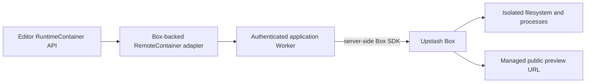

# Remote Runtime Provider Alternatives

Status: provider evaluation; Cloudflare remains selected and Upstash Box is not integrated

This document records alternatives to the Cloudflare Workers + Durable Objects + Containers
backend defined in [Remote Runtime Design](./remote-runtime-design.md). It does not change the
WebContainer-compatible editor contract or the standalone implementation under
[`remote-runtime/`](../remote-runtime/README.md). For a market-wide pricing survey of these and
other sandbox providers, see
[Remote Runtime Provider Cost Comparison](./remote-runtime-cost-comparison.md).

Product behavior and pricing were checked on 2026-07-16 and must be verified again before a
provider decision or production purchase.

## Decision summary

| Provider              | Role                                                                                         | Current decision                                                                   |
| --------------------- | -------------------------------------------------------------------------------------------- | ---------------------------------------------------------------------------------- |
| Browser WebContainer  | Default Node.js runtime with no server compute                                               | Keep as the default for compatible projects                                        |
| Cloudflare Containers | Custom multi-language remote runtime behind the existing RCP and `RemoteContainer` client    | Selected; standalone implementation exists, environment validation remains pending |
| Upstash Box           | Managed isolated cloud runtime with filesystem, shell, lifecycle, snapshots, and public URLs | Documented alternative; requires a conformance spike before any integration        |

Upstash Box is an alternative to the remote-runtime compute backend. It is not a Redis, Realtime,
QStash, or live-collaboration component. Adding it would not move SCR3 recording out of the host's
browser or make collaboration clients share one runtime.

## Upstash Box assessment

The Upstash Box quickstart uses the server-side `@upstash/box` SDK and an
`UPSTASH_BOX_API_KEY` to create an isolated runtime. Boxes provide a Linux filesystem and shell,
support Node.js, Python, Go, and other runtimes, can auto-pause while retaining state, and expose
snapshot and public-URL lifecycle APIs. Upstash currently labels Box as developer preview, so its
API and pricing may change.

These capabilities overlap with the remote-runtime goal, but they do not by themselves establish
compatibility with the editor's required WebContainer surface:

| Editor requirement              | Box capability                                                | Required validation or adapter work                                                                                                       |
| ------------------------------- | ------------------------------------------------------------- | ----------------------------------------------------------------------------------------------------------------------------------------- |
| Boot and reconnect              | Create, list, get, pause, resume, snapshot, and delete boxes  | Persist the Box ID against an authenticated editor session and define deterministic teardown                                              |
| Mount and filesystem operations | Upload, write, read, list, and download files                 | Prove path, binary encoding, recursive mutation, atomic mount, watch, and quota semantics against the conformance suite                   |
| Spawn and terminal              | Run and cancel shell commands; retrieve status and logs       | Prove interactive PTY input, incremental ordered output, resize, signals, and reconnect behavior                                          |
| Preview and dev servers         | SSH port forwarding and optional public URLs                  | Prove programmatic port discovery, HMR WebSockets, URL lifecycle, cookie stripping, CORP/COEP compatibility, and preview-script injection |
| Durable workspace               | Auto-pause and snapshots                                      | Decide whether editor sessions resume the same box or rebuild from the browser workspace                                                  |
| Isolation and egress            | Isolated containers, secrets, and configurable network policy | Keep application authentication, per-user quotas, audit logs, and API-key custody in our control plane                                    |

The largest unknown is the interactive process contract. The current `RemoteContainer` depends on
streamed PTY output, stdin, resize, process-exit events, filesystem watching, port-open/close
events, and resumable sequencing. The documented Box command API is a promising foundation but is
not evidence that those behaviors match WebContainer.

## Possible architecture

If a Box spike passes conformance, the browser must still call a same-origin authenticated
application endpoint; it must never receive `UPSTASH_BOX_API_KEY`.

The adapter could replace the Cloudflare-specific provisioning backend, but it should not force a
provider abstraction into the current implementation prematurely. First run a narrow provider
spike and compare its results with the existing Cloudflare conformance evidence.

## Adoption gate

Do not add `@upstash/box`, an API-key secret, or production Box provisioning until a spike proves:

1. Every Tier-1 `RuntimeContainer` filesystem and process behavior.
2. Interactive terminal streaming, resize, cancellation, and reconnect without lost or duplicated
   output.
3. Vite HMR plus preview security headers and recorder-script injection.
4. Authenticated session ownership, quota enforcement, teardown, and orphan recovery.
5. Acceptable P95 boot/resume latency and cost for representative Node, Go, and Python projects.
6. A migration or rollback story that leaves browser WebContainer projects unaffected.

The currently published Box Free plan lists 10 concurrent boxes and 5 CPU hours per month. The
pay-as-you-go listing starts at $0.10 per active CPU hour for a small 2-vCPU, 4-GB box and includes
5 GB of storage; its comparison table lists additional storage at $0.10 per GB per month. Treat
those figures as evaluation inputs only because Box is in developer preview.

## References

- [Upstash Box quickstart](https://upstash.com/docs/box/overall/quickstart)
- [Box basics and lifecycle](https://upstash.com/docs/box/overall/how-it-works)
- [Box shell API](https://upstash.com/docs/box/overall/shell)
- [Box filesystem API](https://upstash.com/docs/box/overall/files)
- [Box remote development](https://upstash.com/docs/box/guides/remote-development)
- [Box pricing](https://upstash.com/pricing/box)
