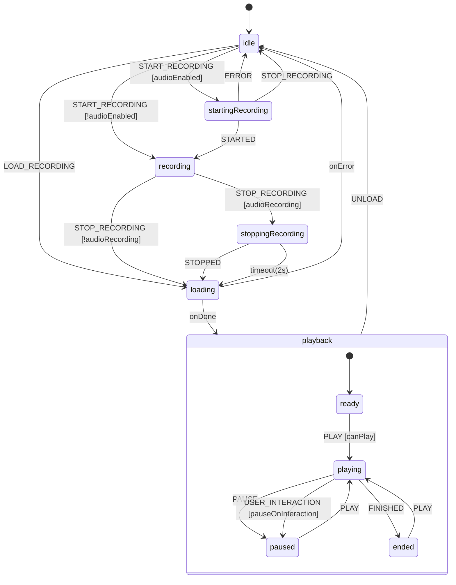
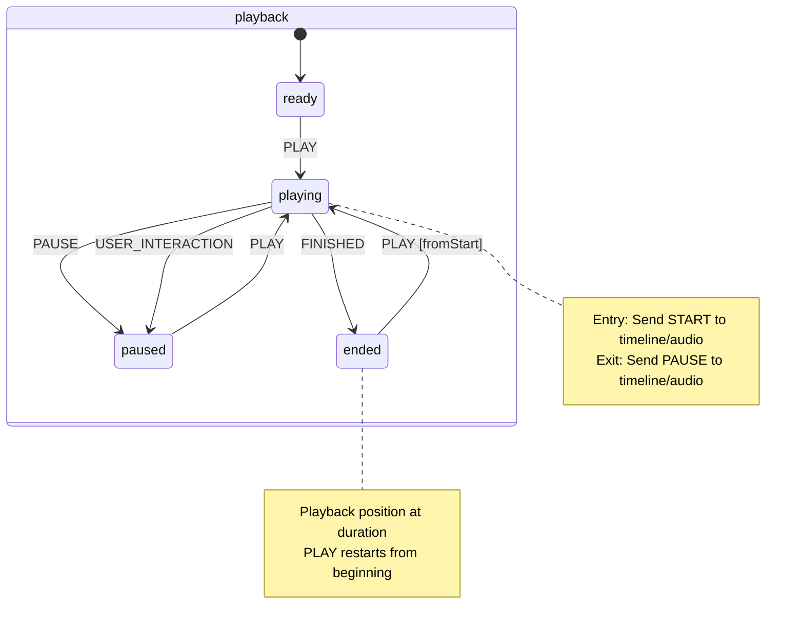
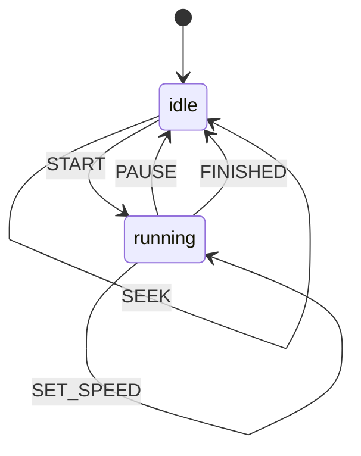
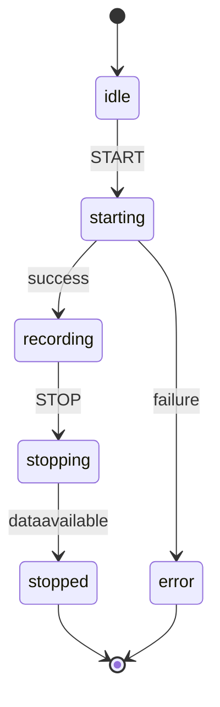
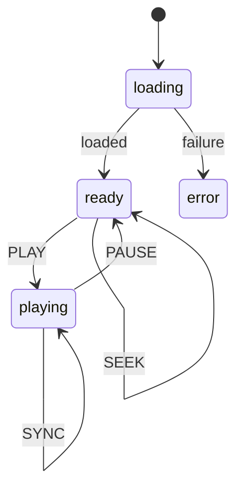
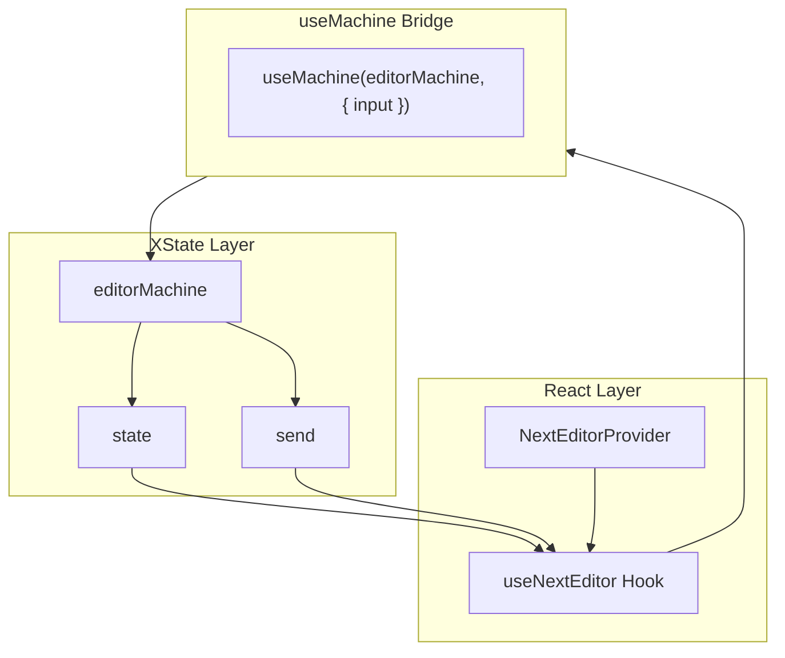

# State Machines Documentation

This document describes the XState v5 state machine architecture used in Next Editor.

---

## Editor Machine Overview



---

## State Descriptions

### idle

Initial state. No recording or playback active.

**Transitions:**

- `START_RECORDING` → `startingRecording` (if audio enabled)
- `START_RECORDING` → `recording` (if audio disabled)
- `LOAD_RECORDING` → `loading`

### startingRecording

Waiting for audio recording to initialize.

**Entry Actions:**

- Spawn `audioRecording` actor
- Send `START` to audio actor

**Transitions:**

- `STARTED` → `recording`
- `ERROR` → `idle`

### recording

Actively capturing editor frames and ancillary state.

**Entry Actions:**

- Spawn `mouseTracking` actor for cursor position
- Capture initial preview state (v3)

**Events Handled:**

- `CAPTURE_FRAME` - Captures current editor state
- `SLIDE_EVENT` - Records slide interaction
- `PREVIEW_EVENT` - Records preview panel interaction and state
- `WORKSPACE_EVENT` - Records file/folder changes (v3)
- `RUNTIME_EVENT` - Records runtime/terminal output (v3)
- `STOP_RECORDING` → `stoppingRecording` or `loading`

### stoppingRecording

Waiting for audio recording to finalize.

**Entry Actions:**

- Stop `mouseTracker` actor
- Send `STOP` to `audioRecorder` actor

**Transitions:**

- `STOPPED` → `loading` (with audio blob)
- Timeout (2s) → `loading` (fallback)

### loading

Processing and loading a recording for playback.

**Invokes:** `loadRecording` promise actor

- Calculates exact audio duration from blob
- Normalizes recording data
- Validates recording format (v2 or v3)

**Transitions:**

- `onDone` → `playback.ready`
- `onError` → `idle`

### playback (compound state)

Playback mode with nested states for playing, paused, and ended.

**Entry Actions:**

- Spawn `timeline` actor
- Spawn `audioPlayback` actor (if audio exists)
- Restore initial preview state and workspace/runtime snapshots (v3)

**Exit Actions:**

- Stop all child actors
- Clear cursor decorations

---

## Playback Substates



---

## Child Actors

### Timeline Actor



**Purpose:** Manages playback timing using `requestAnimationFrame`

**Events Sent to Parent:**

- `TICK { timestamp, currentTime }` - Every animation frame
- `FINISHED` - When currentTime >= duration

### Audio Recording Actor



**Purpose:** Manages MediaRecorder for audio capture

**Events Sent to Parent:**

- `STARTED { mediaRecorder, mimeType }`
- `STOPPED { blob }`
- `ERROR { error }`

### Audio Playback Actor



**Purpose:** Manages HTMLAudioElement for synchronized audio playback

### Mouse Tracking Actor

**Purpose:** Captures mouse cursor position across document and iframes

**Behavior:**

- Listens to `mousemove` on document
- Observes DOM for new iframes
- Attaches listeners to iframe contentDocuments
- Sends `CAPTURE_FRAME` with position to parent

---

## Event Types

### Machine Events

```typescript
type EditorMachineEvent =
  // Recording
  | { type: "START_RECORDING" }
  | { type: "STOP_RECORDING" }
  | { type: "CAPTURE_FRAME"; mousePosition?: Position }

  // Loading
  | { type: "LOAD_RECORDING"; recording: Recording }
  | { type: "RECORDING_LOADED"; recording: Recording; duration: number }
  | { type: "LOAD_FAILED"; error: string }
  | { type: "UNLOAD" }

  // Playback
  | { type: "PLAY" }
  | { type: "PAUSE" }
  | { type: "STOP" }
  | { type: "SEEK"; time: number }
  | { type: "SET_SPEED"; speed: number }
  | { type: "SET_VOLUME"; volume: number }
  | { type: "TICK"; timestamp: number; currentTime: number }
  | { type: "FINISHED" }
  | { type: "USER_INTERACTION" }

  // Content
  | { type: "SLIDE_EVENT"; event: SlideEvent }
  | { type: "PREVIEW_EVENT"; event: PreviewEvent }
  | { type: "WORKSPACE_EVENT"; event: WorkspaceRecordingEvent } // v3
  | { type: "RUNTIME_EVENT"; event: RuntimeRecordingEvent } // v3

  // Audio
  | { type: "STARTED"; mediaRecorder: MediaRecorder; mimeType: string }
  | { type: "STOPPED"; blob: Blob }

  // Editor
  | { type: "SET_EDITOR_REF"; editor: IStandaloneCodeEditor };
```

---

## Guards

```typescript
const guards = {
  // Can play if recording exists with frames
  canPlay: ({ context }) => context.recording !== null && context.recording.frames?.length > 0,

  // Has recording loaded
  hasRecording: ({ context }) => context.recording !== null,

  // Audio blob exists
  hasAudio: ({ context }) => context.recording?.audioBlob !== undefined,

  // Should pause on user typing
  shouldPauseOnInteraction: ({ context }) => context.pauseOnUserInteraction,

  // Seek time is valid
  isValidSeekTime: ({ context, event }) =>
    event.time >= 0 && event.time <= context.timeline.duration,
};
```

---

## Actions Summary

### Recording Actions

| Action                 | Description                                        |
| ---------------------- | -------------------------------------------------- |
| `initRecordingSession` | Initialize session with timestamp and empty arrays |
| `captureInitialFrame`  | Capture first frame at t=0                         |
| `captureFrame`         | Capture current editor state with timestamp        |
| `finalizeRecording`    | Compress frames and create Recording object        |

### Playback Actions

| Action                     | Description                             |
| -------------------------- | --------------------------------------- |
| `applyFrameAtTime`         | Apply frame state to editor             |
| `applyPreviewEventsAtTime` | Apply preview events up to current time |
| `applySlideEventsAtTime`   | Apply slide events up to current time   |
| `updateTimelineFromTick`   | Update context.timeline.currentTime     |
| `seekToTime`               | Set current time and reset frame index  |
| `resetPlayback`            | Reset timeline to t=0                   |

### Audio Actions

| Action           | Description                           |
| ---------------- | ------------------------------------- |
| `storeAudioBlob` | Store audio blob from recording actor |
| `setVolume`      | Update timeline.volume                |

---

## Integration with React



The `useNextEditor` hook:

1. Initializes the machine with `useMachine`
2. Maps machine state to boolean flags (`isRecording`, `isPlaying`, etc.)
3. Wraps `send` in memoized callbacks (`startRecording`, `play`, etc.)
4. Manages editor ref synchronization
5. Handles keyboard shortcuts for playback control
