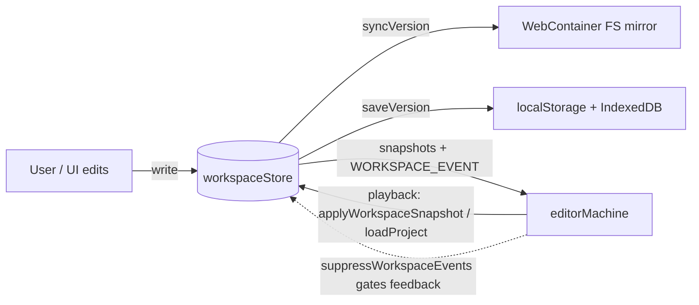
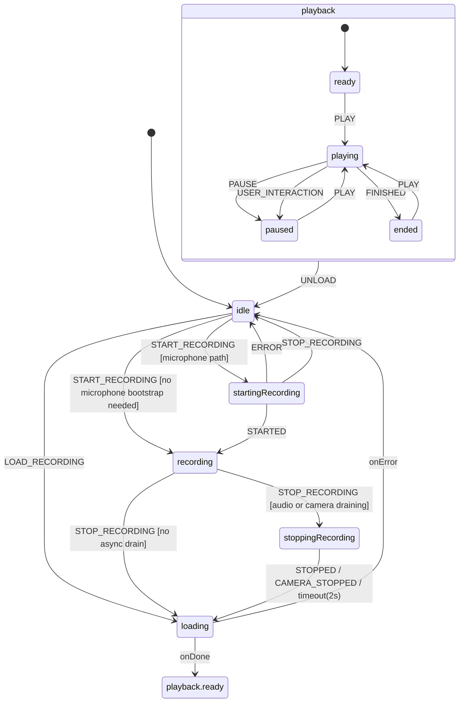
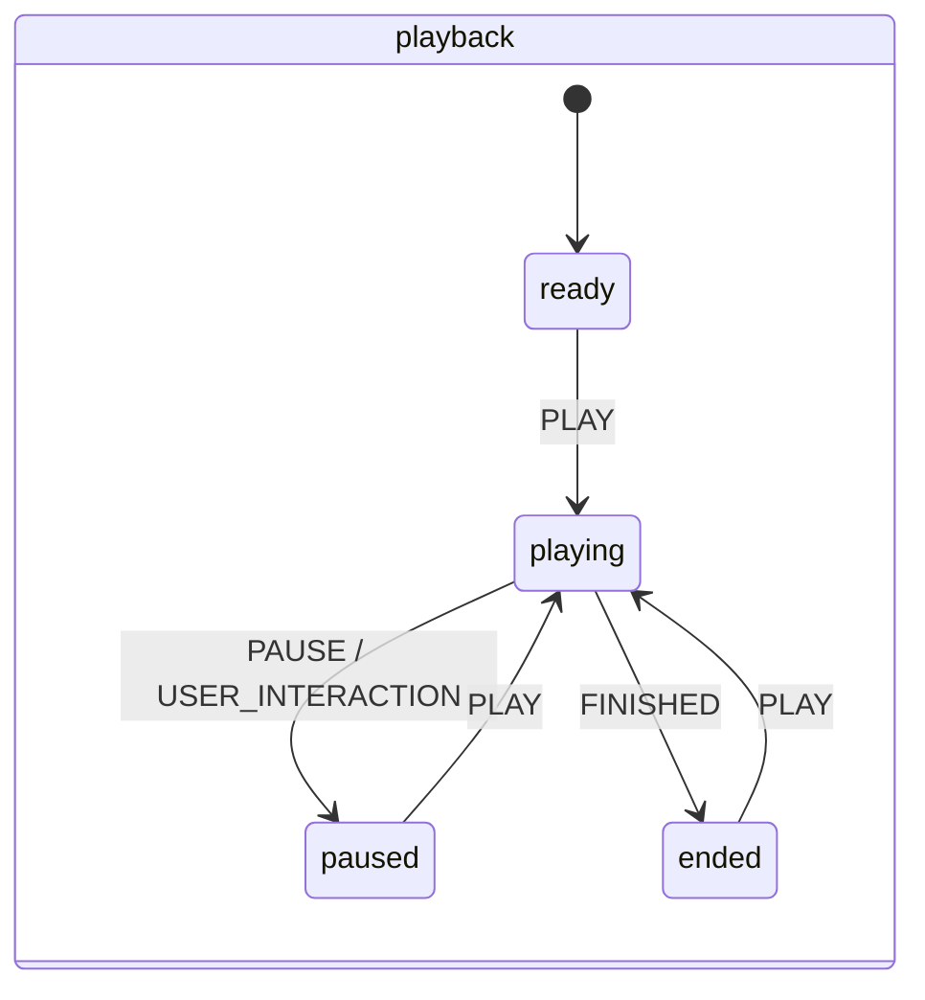
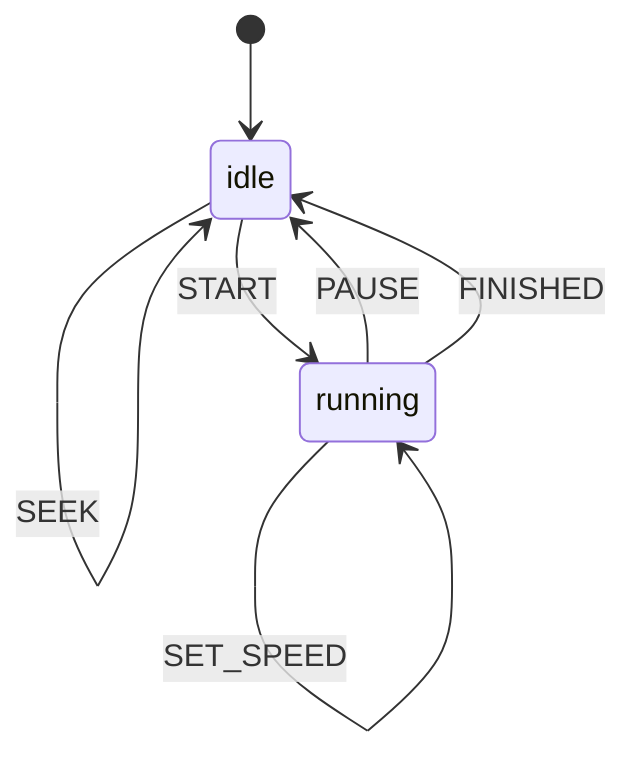
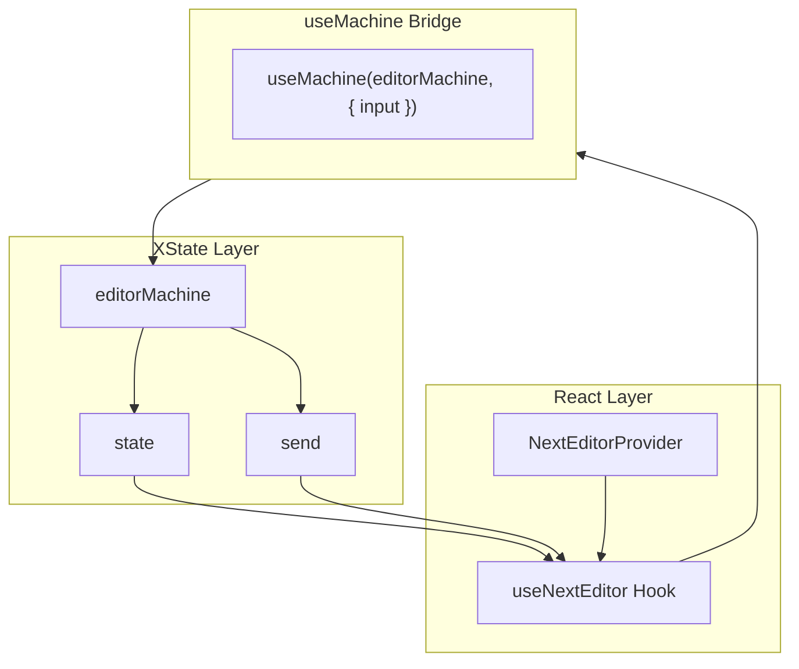

# State Machines Documentation

This document describes the current XState v5 architecture used by Next Editor.

## State Ownership Boundaries

Next Editor runs three distinct state systems. They are not interchangeable, and
each owns a different slice of the app. Knowing which one is the source of truth
for a given field is the difference between a one-line change and an infinite
update loop.

| System                             | Kind                | Owns (source of truth)                                                                                                              |
| ---------------------------------- | ------------------- | ----------------------------------------------------------------------------------------------------------------------------------- |
| `workspaceStore` (`@xstate/store`) | Synchronous CRUD    | Live workspace: `project` (files/folders), `activeFilePath`, `collapsedFolders`, sidebar layout, `lessonType`, dirty/saved snapshot |
| `editorMachine` (XState machine)   | Async orchestration | The timeline: recording/playback state, frames, cursor/preview/slide/workspace/runtime event streams, replay cursors, audio/camera  |
| React contexts                     | Wiring/transport    | No durable state — split Actions/Metadata/Playback contexts (render perf), domain adapters, and panel-local UI only                 |

### Who owns `project` / `activeFilePath`

This is the field pair most likely to look "shared." It is not — ownership moves
with the mode:

- **Authoring / idle / runtime:** `workspaceStore` is the sole owner. The
  WebContainer filesystem is a one-way _mirror_, synced store → container by
  `useWebContainerWorkspaceSync` (driven by the store's `syncVersion`). The
  container FS is never read back as truth.
- **Recording:** the machine only _reads_ the workspace — it pulls immutable
  snapshots and timed `WORKSPACE_EVENT`s from the store (via
  `getWorkspaceSnapshot` / `handleWorkspaceEvent` in `NextEditorProvider`). The
  store stays the owner; the recording accumulates a history.
- **Playback:** the machine _drives_ the store. `applyWorkspaceSnapshot` calls
  `loadProject(...)`, so the store becomes a _render target_ reflecting the
  recording at the current timeline position.

### The invariant

Workspace-shaped state has exactly **one writer at a time**: the user/UI when not
playing back, the machine during playback. The hand-off is enforced by
`suppressWorkspaceEventsRef` in `NextEditorProvider` — while the machine writes a
recorded snapshot into the store, store → machine `WORKSPACE_EVENT` emission is
gated for that tick so playback writes are not recaptured as new edits.

Two corollaries that should stay true as the code evolves:

- The machine never persists workspace state. Persistence (localStorage snapshot +
  IndexedDB assets) is the store's concern, triggered by its `saveVersion` /
  `previewVersion` counters.
- The store never advances the timeline. Clock progression belongs to the
  `timelineMachine` child actor.



## Editor Machine Overview



## Core States

### `idle`

No recording or playback is active.

- Accepts `START_RECORDING`
- Accepts `LOAD_RECORDING`
- Holds the current editor reference and default playback settings

### `startingRecording`

Used when microphone recording needs to bootstrap before the main recording session can begin.

- Starts the audio recording actor
- Waits for `STARTED`
- Can abort back to `idle` on error or immediate stop

### `recording`

The main capture state.

What happens here:

- a `RecordingSession` is initialized
- the first frame is captured
- cursor sampling is tracked
- preview events, preview seed documents, and preview patch batches are collected
- workspace and runtime events are appended
- audio chunks and camera chunks are forwarded into the session for live SCR3 streaming

### `stoppingRecording`

This is a drain state, not a second recording mode.

- microphone capture may still emit a final post-stop chunk
- camera capture may stop before or after audio
- the machine finalizes once the required blobs arrive or the safety timeout fires

This ordering matters because the live stream sink must preserve append-only SCR3 ordering even while the media recorders are draining.

### `loading`

The machine normalizes a recording and prepares playback.

Current work done here includes:

- restoring workspace/runtime snapshots
- calculating effective playback duration
- preparing preview replay inputs
- preparing audio and camera playback metadata

### `playback`

Playback is a compound state with `ready`, `playing`, `paused`, and `ended` substates.

The parent `playback` state also handles `EXTEND_RECORDING`, which is what makes progressive streaming possible without a full reload.

## Playback Substates



Important current behavior:

- `SET_SPEED` is meaningful even while playback is paused or stopped.
- `STOP` resets playback position without unloading the recording.
- `PLAY` from `ended` restarts from the beginning.

## Child Actors

### Timeline actor

The timeline actor owns clock progression and emits `TICK` updates.



### Audio recording actor

- Starts microphone capture
- Emits `STARTED`, `STOPPED`, and `ERROR`
- Produces timesliced chunks during recording so the live SCR3 bridge can stream them before finalization

### Camera recording actor

- Starts optional video-only capture
- Emits `CAMERA_CHUNK` while recording and `CAMERA_STOPPED` on finalize
- Tracks a warmup delay so the parent machine can persist `cameraStartOffsetMs`

### Audio playback actor

- Manages synchronized `HTMLAudioElement` playback in blob or stream mode
- Accepts progressive audio updates by reattaching a growing blob snapshot when later prefixes extend the audio track
- Is spawned lazily in progressive-load scenarios when audio first becomes usable for the current prefix

## Replay Cursors In Context

The machine keeps replay progress in context so it can apply large recordings efficiently:

- `lastAppliedFrameIndex`
- `lastAppliedPreviewEventIndex`
- `lastAppliedPreviewPatchBatchIndex`
- `lastAppliedSlideEventIndex`
- corresponding indices for workspace, runtime, and cursor event streams

These indices are preserved across `EXTEND_RECORDING`, which is the critical detail for streaming playback.

`PREVIEW_EVENT` is the single channel for runtime-preview state, including the API client:
its `api_client_mode`, `api_client_request`, `api_client_response`, `api_client_request_tab`,
and `api_client_inspect_history` variants are applied through the same preview replay cursor
as DOM snapshots. Caption tracks are managed out of band — `ADD_CAPTION_TRACK` /
`REMOVE_CAPTION_TRACK` mutate the loaded recording's `captions` directly (e.g. from a
`.vtt`/`.srt` import or sibling-file load) rather than riding the timeline.

## Key Events

Representative machine events:

```ts
type EditorMachineEvent =
  | { type: "START_RECORDING"; enableCamera?: boolean }
  | { type: "STOP_RECORDING" }
  | { type: "LOAD_RECORDING"; recording: Recording }
  | { type: "EXTEND_RECORDING"; recording: Recording }
  | { type: "PLAY" }
  | { type: "PAUSE" }
  | { type: "STOP" }
  | { type: "SEEK"; time: number }
  | { type: "SET_SPEED"; speed: number }
  | { type: "SET_VOLUME"; volume: number }
  | { type: "SLIDE_EVENT"; event: SlideEvent }
  | { type: "PREVIEW_EVENT"; event: PreviewEvent }
  | { type: "WORKSPACE_EVENT"; event: WorkspaceRecordingEvent }
  | { type: "RUNTIME_EVENT"; event: RuntimeRecordingEvent }
  | { type: "ADD_CAPTION_TRACK"; track: CaptionTrack }
  | { type: "REMOVE_CAPTION_TRACK"; trackId: string }
  | { type: "STARTED"; mediaRecorder: MediaRecorder; mimeType: string }
  | { type: "STOPPED"; blob: Blob }
  | { type: "CAMERA_CHUNK"; chunk: Blob }
  | { type: "CAMERA_STOPPED"; blob: Blob };
```

## Practical Summary

The machine is optimized around three constraints:

- capture must be able to write an append-only SCR3 stream while recording
- playback must be able to restore editor, preview, workspace, runtime, audio, and camera state from one timeline
- streamed playback must be able to swap in larger recording prefixes without resetting progress

````

---

## Guards

```typescript
const guards = {
  // Can play if recording exists with frames
  canPlay: ({ context }) => context.recording !== null && context.recording.frames?.length > 0,

  // Has recording loaded
  hasRecording: ({ context }) => context.recording !== null,

  // Audio blob exists
  hasAudio: ({ context }) => context.recording?.audioBlob !== undefined,

  // Should pause on user typing
  shouldPauseOnInteraction: ({ context }) => context.pauseOnUserInteraction,

  // Seek time is valid
  isValidSeekTime: ({ context, event }) =>
    event.time >= 0 && event.time <= context.timeline.duration,
};
````

---

## Actions Summary

### Recording Actions

| Action                 | Description                                        |
| ---------------------- | -------------------------------------------------- |
| `initRecordingSession` | Initialize session with timestamp and empty arrays |
| `captureInitialFrame`  | Capture first frame at t=0                         |
| `captureFrame`         | Capture current editor state with timestamp        |
| `finalizeRecording`    | Compress frames and create Recording object        |

### Playback Actions

| Action                     | Description                             |
| -------------------------- | --------------------------------------- |
| `applyFrameAtTime`         | Apply frame state to editor             |
| `applyPreviewEventsAtTime` | Apply preview events up to current time |
| `applySlideEventsAtTime`   | Apply slide events up to current time   |
| `updateTimelineFromTick`   | Update context.timeline.currentTime     |
| `seekToTime`               | Set current time and reset frame index  |
| `resetPlayback`            | Reset timeline to t=0                   |

### Audio Actions

| Action           | Description                           |
| ---------------- | ------------------------------------- |
| `storeAudioBlob` | Store audio blob from recording actor |
| `setVolume`      | Update timeline.volume                |

---

## Integration with React



The `useNextEditor` hook:

1. Initializes the machine with `useMachine`
2. Maps machine state to boolean flags (`isRecording`, `isPlaying`, etc.)
3. Wraps `send` in memoized callbacks (`startRecording`, `play`, etc.)
4. Manages editor ref synchronization
5. Handles keyboard shortcuts for playback control
