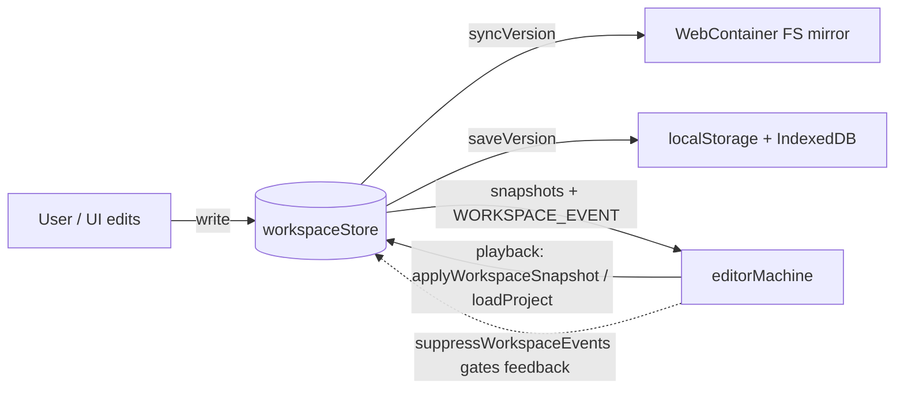
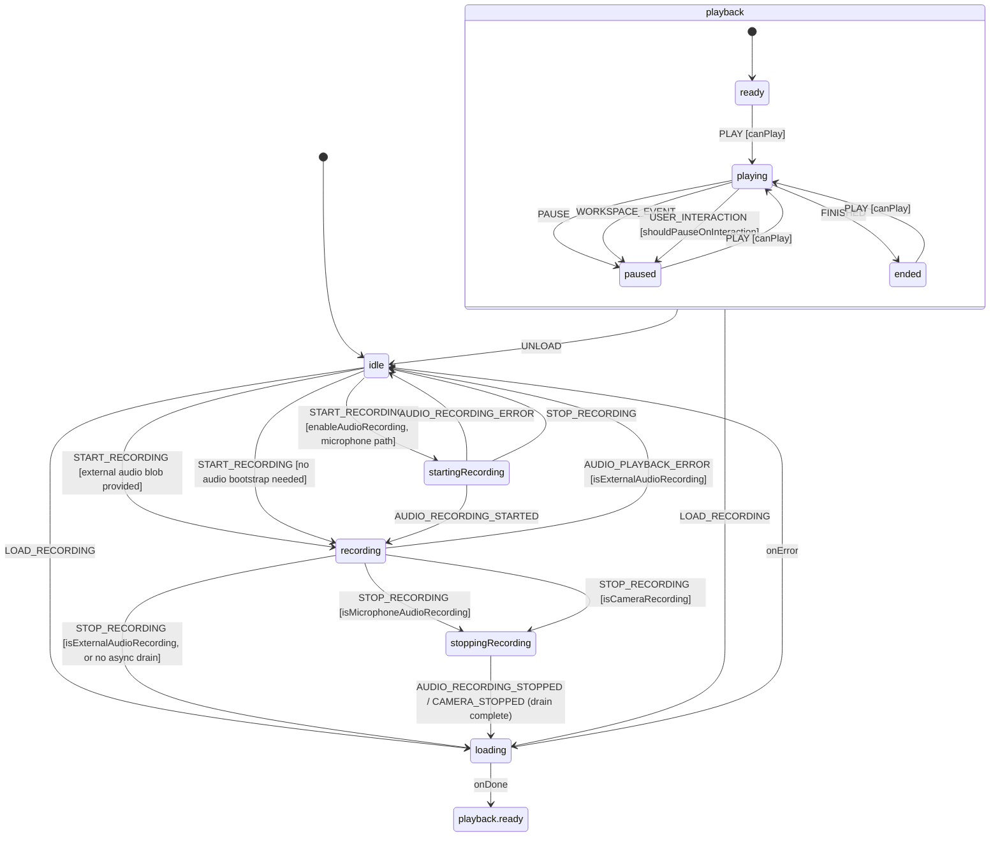
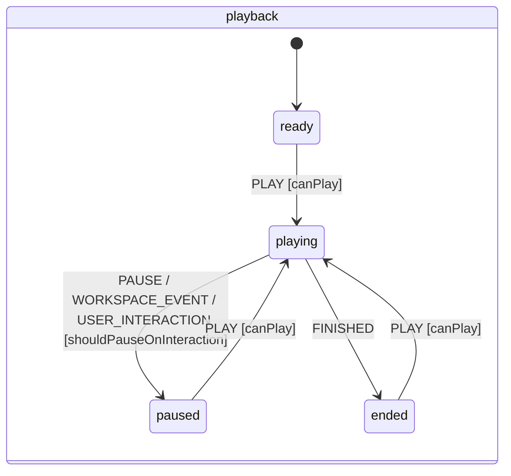
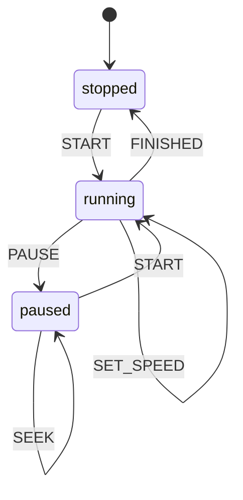
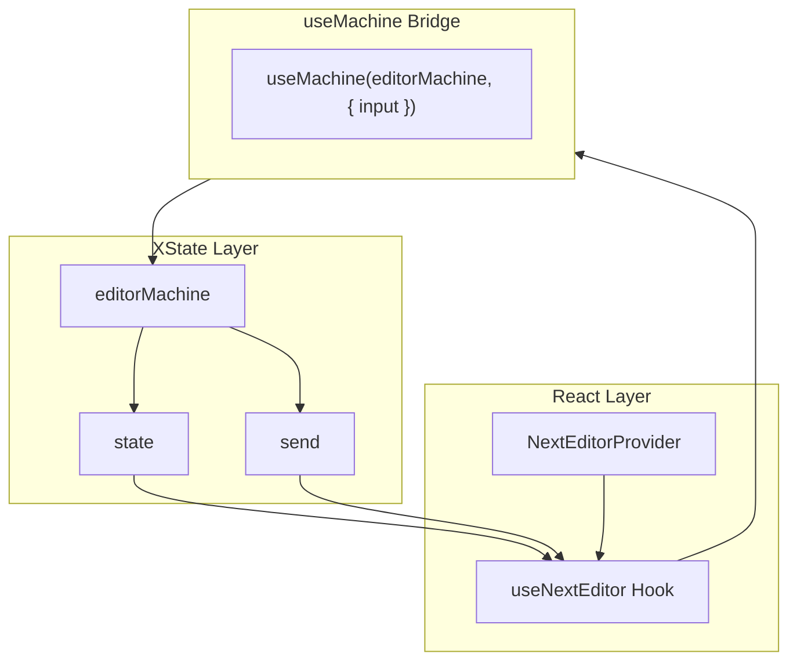

# State Machines Documentation

This document describes the current XState v5 architecture used by Next Editor.

## State Ownership Boundaries

Next Editor runs three distinct state systems. They are not interchangeable, and
each owns a different slice of the app. Knowing which one is the source of truth
for a given field is the difference between a one-line change and an infinite
update loop.

| System                             | Kind                | Owns (source of truth)                                                                                                              |
| ---------------------------------- | ------------------- | ----------------------------------------------------------------------------------------------------------------------------------- |
| `workspaceStore` (`@xstate/store`) | Synchronous CRUD    | Live workspace: `project` (files/folders), `activeFilePath`, `collapsedFolders`, sidebar layout, `lessonType`, dirty/saved snapshot |
| `editorMachine` (XState machine)   | Async orchestration | The timeline: recording/playback state, frames, cursor/preview/slide/workspace/runtime event streams, replay cursors, audio/camera  |
| React contexts                     | Wiring/transport    | No durable state — split Actions/Metadata/Playback contexts (render perf), domain adapters, and panel-local UI only                 |

A fourth, self-contained machine exists outside this table: the collaboration
voice machine (`src/voice/machine.ts`), an XState machine owned by the
`VoiceEngine` (not by React) that models the voice-chat lifecycle
(`idle → joining → listening → unmuting → live`, plus reconnect/failed/leaving
paths). All media side effects live in the engine; `CollaborationVoiceContext`
only subscribes to its snapshots. See
`docs/live-collaboration-voice-cloudflare-realtime-sfu.md` §9 for the full
state model and its cleanup invariants.

### Who owns `project` / `activeFilePath`

This is the field pair most likely to look "shared." It is not — ownership moves
with the mode:

- **Authoring / idle / runtime:** `workspaceStore` is the sole owner. The
  WebContainer filesystem is a one-way _mirror_, synced store → container by
  `useWebContainerWorkspaceSync` (driven by the store's `syncVersion`). The
  container FS is never read back as truth.
- **Recording:** the machine only _reads_ the workspace — it pulls immutable
  snapshots and timed `WORKSPACE_EVENT`s from the store (via
  `getWorkspaceSnapshot` / `handleWorkspaceEvent` in `NextEditorProvider`). The
  store stays the owner; the recording accumulates a history.
- **Playback:** the machine _drives_ the store. `applyWorkspaceSnapshot` calls
  `loadProject(...)`, so the store becomes a _render target_ reflecting the
  recording at the current timeline position.

### The invariant

Workspace-shaped state has exactly **one writer at a time**: the user/UI when not
playing back, the machine during playback. The hand-off is enforced by
`suppressWorkspaceEventsRef` in `NextEditorProvider` — while the machine writes a
recorded snapshot into the store, store → machine `WORKSPACE_EVENT` emission is
gated for that tick so playback writes are not recaptured as new edits.

Two corollaries that should stay true as the code evolves:

- The machine never persists workspace state. Persistence (localStorage snapshot +
  IndexedDB assets) is the store's concern, triggered by its `saveVersion` /
  `previewVersion` counters.
- The store never advances the timeline. Clock progression belongs to the
  `timelineMachine` child actor.


```mermaid
flowchart LR
    User[User / UI edits] -->|write| Store[(workspaceStore)]
    Store -->|syncVersion| Container[WebContainer FS mirror]
    Store -->|saveVersion| Persist[localStorage + IndexedDB]
    Store -->|snapshots + WORKSPACE_EVENT| Machine[editorMachine]
    Machine -->|playback: applyWorkspaceSnapshot / loadProject| Store
    Machine -.suppressWorkspaceEvents gates feedback.-> Store
```

## Editor Machine Overview

Defined in `src/core/src/machine/editorMachine.ts`.


```mermaid
stateDiagram-v2
    [*] --> idle

    idle --> recording : START_RECORDING [external audio blob provided]
    idle --> startingRecording : START_RECORDING [enableAudioRecording, microphone path]
    idle --> recording : START_RECORDING [no audio bootstrap needed]
    idle --> loading : LOAD_RECORDING

    startingRecording --> recording : AUDIO_RECORDING_STARTED
    startingRecording --> idle : AUDIO_RECORDING_ERROR
    startingRecording --> idle : STOP_RECORDING

    recording --> stoppingRecording : STOP_RECORDING [isMicrophoneAudioRecording]
    recording --> stoppingRecording : STOP_RECORDING [isCameraRecording]
    recording --> loading : STOP_RECORDING [isExternalAudioRecording, or no async drain]
    recording --> idle : AUDIO_PLAYBACK_ERROR [isExternalAudioRecording]

    stoppingRecording --> loading : AUDIO_RECORDING_STOPPED / CAMERA_STOPPED (drain complete)

    loading --> playback.ready : onDone
    loading --> idle : onError

    state playback {
        [*] --> ready
        ready --> playing : PLAY [canPlay]
        playing --> paused : PAUSE
        playing --> paused : WORKSPACE_EVENT
        playing --> paused : USER_INTERACTION [shouldPauseOnInteraction]
        playing --> ended : FINISHED
        paused --> playing : PLAY [canPlay]
        ended --> playing : PLAY [canPlay]
    }

    playback --> idle : UNLOAD
    playback --> loading : LOAD_RECORDING
```

## Core States

### `idle`

No recording or playback is active.

- Accepts `START_RECORDING` and `LOAD_RECORDING`.
- Holds the current editor reference and default playback settings.

### `startingRecording`

Used only when `enableAudioRecording` is set and no external audio blob was supplied —
i.e. the microphone bootstrap path.

- Spawns `audioRecording` and sends it `START`.
- Waits for `AUDIO_RECORDING_STARTED` to move to `recording`.
- `STOP_RECORDING` aborts straight back to `idle`.

### `recording`

The main capture state.

What happens here:

- a `RecordingSession` is initialized (`initRecordingSession`) and the first frame is captured (`captureInitialFrame`)
- an invoked `mouseTracking` actor drives `CAPTURE_FRAME` for cursor movement
- camera capture spawns conditionally on entry if `enableCameraRecording`
- `CAPTURE_FRAME`, `SLIDE_EVENT`, `PREVIEW_EVENT`, `PREVIEW_INITIAL_DOCUMENT`, `PREVIEW_PATCH_BATCH`, `WORKSPACE_EVENT`, and `RUNTIME_EVENT` are all captured into the session
- audio chunks (`AUDIO_RECORDING_CHUNK`) and camera lifecycle events are folded into session/audio/camera state for live SCR3 streaming
- the live stream bridge sends ordered frame/event batches to one worker-owned SCR3 writer; its
  single in-flight queue provides backpressure, and recording finalization awaits the worker's
  final metadata/footer flush before closing the sink
- `STOP_RECORDING` branches on `isMicrophoneAudioRecording` / `isCameraRecording` / `isExternalAudioRecording` to decide whether a drain (`stoppingRecording`) is needed before finalizing

### `stoppingRecording`

This is a drain state, not a second recording mode.

- microphone capture may still emit a final post-stop chunk
- camera capture may stop before or after audio
- the machine finalizes once the required blobs arrive (`AUDIO_RECORDING_STOPPED` / `CAMERA_STOPPED`), with a two-second timeout as a defensive fallback

This ordering matters because the live stream sink must preserve append-only SCR3 ordering even while the media recorders are draining.

### `loading`

An invoked `loadRecording` actor (a promise actor, not a spawned child) normalizes the recording:

- computes exact duration from the audio blob via `calculateDurationFromFileReader` when finalized non-external audio is present (avoids trailing silence from wall-clock overhead)
- `onDone` calls `setRecording` and transitions to `playback.ready`
- `onError` records the error and returns to `idle`

### `playback`

Playback is a compound state with `ready`, `playing`, `paused`, and `ended` substates. It invokes the `timeline` child actor (`timelineActor`) for the whole compound state's lifetime.

The parent `playback` state also handles `APPEND_RECORDING_DELTA`, `EXTEND_RECORDING`, `TICK`, `SEEK`, `SET_SPEED`, `SET_VOLUME`, `STOP`, `UNLOAD`, and `LOAD_RECORDING` (re-entering `loading` for an unrelated file import while a recording is open) — which is what makes copy-bounded progressive streaming and mid-session recording swaps possible.

## Playback Substates


```mermaid
stateDiagram-v2
    state playback {
        [*] --> ready
        ready --> playing : PLAY [canPlay]
        playing --> paused : PAUSE / WORKSPACE_EVENT / USER_INTERACTION [shouldPauseOnInteraction]
        playing --> ended : FINISHED
        paused --> playing : PLAY [canPlay]
        ended --> playing : PLAY [canPlay]
    }
```

Important current behavior:

- `SET_SPEED` and `SET_VOLUME` are meaningful in any playback substate; they forward to `timelineActor` and, if spawned, `audioPlayer`.
- `STOP` resets to `.ready` and seeks the timeline/audio back to `0` without unloading the recording.
- `PLAY` from `ended` restarts from the beginning (guarded by the same `canPlay`).
- A `WORKSPACE_EVENT` arriving while `playing` means the user manually edited the workspace — it force-pauses and calls `detachPlaybackWorkspace` so the recorded workspace snapshot stops overwriting the user's edit.

## Child Actors

### Timeline actor (`timelineMachine`)

Owns clock progression and emits `TICK` updates.


```mermaid
stateDiagram-v2
    [*] --> stopped
    stopped --> running : START
    running --> paused : PAUSE
    paused --> paused : SEEK
    running --> running : SEEK
    running --> running : SET_SPEED
    paused --> running : START
    running --> stopped : FINISHED
```

### Audio recording actor (`audioRecordingActor`)

- Starts microphone capture and emits `AUDIO_RECORDING_STARTED`, `AUDIO_RECORDING_CHUNK`, `AUDIO_RECORDING_STOPPED`, and `AUDIO_RECORDING_ERROR`.
- Produces timesliced chunks during recording so the live SCR3 bridge can stream them before finalization.

### Camera recording actor (`cameraRecordingActor`)

- Starts optional video-only capture.
- Emits `CAMERA_STARTED`, `CAMERA_STOPPED` on finalize, and `CAMERA_ERROR` on setup or runtime failure.
- Tracks a warmup delay so the parent machine can persist `cameraStartOffsetMs`.

### Audio playback actor (`audioPlaybackActor`)

- Manages synchronized `HTMLAudioElement` playback in blob or stream mode.
- Emits role-specific `AUDIO_PLAYBACK_READY`, `AUDIO_PLAYBACK_FINISHED`, and `AUDIO_PLAYBACK_ERROR` events so media completion cannot be mistaken for timeline completion.
- Accepts progressive audio updates by reattaching a growing blob snapshot when later prefixes extend the audio track (`syncPlaybackAudio` helper, `appendPolicy: "playing-or-finalized" | "always"`).
- Is spawned lazily (`playbackAudioSpawned` context flag) in progressive-load scenarios when audio first becomes usable for the current prefix, not just on `LOAD_RECORDING`.

### Screen recording actor (`screenRecordingActor`)

- Records a pre-acquired display stream and optionally mixes tab audio with a cloned microphone track.
- Uses a unique child id per capture; every `SCREEN_*` event carries that id so late WebM-repair completions cannot stop or clear a newer capture.
- Releases display tracks and the audio graph before asynchronous WebM duration repair, then delivers the blob through `onScreenRecordingReady` without storing it in the lesson recording.

### Mouse tracking actor (`mouseTrackingActor`)

- Invoked only while `recording`; forwards live mouse positions into `CAPTURE_FRAME` events for cursor sampling.

## Replay Cursors In Context

The machine keeps replay progress in context so it can apply large recordings efficiently:

- `lastAppliedFrameIndex`
- `lastAppliedPreviewEventIndex`
- `lastAppliedPreviewPatchBatchIndex`
- `lastAppliedSlideEventIndex`
- `lastAppliedWorkspaceEventIndex`
- `lastAppliedRuntimeEventIndex`
- `lastAppliedPreviewState` (avoids redundant preview-state pushes)

These indices are preserved across `EXTEND_RECORDING`, which is the critical detail for streaming playback.

`PREVIEW_EVENT` is the single channel for runtime-preview state, including the API client:
its `api_client_mode`, `api_client_request`, `api_client_response`, `api_client_request_tab`,
and `api_client_inspect_history` variants are applied through the same preview replay cursor
as DOM snapshots. Caption tracks are managed out of band — `ADD_CAPTION_TRACK` /
`REMOVE_CAPTION_TRACK` mutate the loaded recording's `captions` directly (e.g. from a
`.vtt`/`.srt` import or sibling-file load) rather than riding the timeline.

## Key Events

Representative machine events (`src/core/src/machine/types.ts`):

```ts
type EditorMachineEvent =
  | { type: "START_RECORDING"; audioBlob?: Blob; enableCamera?: boolean }
  | { type: "STOP_RECORDING" }
  | { type: "CAPTURE_FRAME"; isMouseMovement?: boolean; mousePosition?: MouseCursorPosition }
  | { type: "LOAD_RECORDING"; recording: Recording }
  | { type: "EXTEND_RECORDING"; recording: Recording }
  | { type: "UNLOAD" }
  | { type: "PLAY" }
  | { type: "PAUSE" }
  | { type: "STOP" }
  | { type: "SEEK"; time: number }
  | { type: "SET_SPEED"; speed: number }
  | { type: "SET_VOLUME"; volume: number }
  | { type: "TICK"; timestamp: number; currentTime: number }
  | { type: "FINISHED" }
  | { type: "USER_INTERACTION" }
  | { type: "SET_EDITOR_REF"; editor: monaco.editor.IStandaloneCodeEditor | null }
  | { type: "SLIDE_EVENT"; event: SlideEvent }
  | { type: "PREVIEW_EVENT"; event: PreviewEvent }
  | { type: "PREVIEW_INITIAL_DOCUMENT"; document: PreviewInitialDocument }
  | { type: "PREVIEW_PATCH_BATCH"; batch: PreviewDomPatchBatch }
  | { type: "WORKSPACE_EVENT"; sidebarWidthDelta?: number; previewDockWidthDelta?: number }
  | { type: "RUNTIME_EVENT" }
  | { type: "ADD_CAPTION_TRACK"; track: CaptionTrack }
  | { type: "REMOVE_CAPTION_TRACK"; trackId: string }
  | {
      type: "AUDIO_RECORDING_STARTED";
      mediaRecorder: MediaRecorder;
      mimeType: string;
      startedAtMs: number;
      startedAtPerf: number;
    }
  | { type: "AUDIO_RECORDING_STOPPED"; blob: Blob }
  | {
      type: "AUDIO_RECORDING_CHUNK";
      chunk: Blob;
      startTimeMs: number;
      endTimeMs: number;
    }
  | { type: "AUDIO_RECORDING_ERROR"; error: string }
  | { type: "AUDIO_PLAYBACK_READY"; duration: number }
  | { type: "AUDIO_PLAYBACK_FINISHED" }
  | { type: "AUDIO_PLAYBACK_ERROR"; error: string }
  | { type: "CAMERA_STARTED"; mimeType: string; startedAtMs: number; startedAtPerf: number }
  | { type: "CAMERA_STOPPED"; blob: Blob }
  | { type: "CAMERA_ERROR"; error: string }
  | {
      type: "SCREEN_STARTED";
      actorId: string;
      mimeType: string;
      startedAtMs: number;
      startedAtPerf: number;
    }
  | {
      type: "SCREEN_STOPPED";
      actorId: string;
      blob: Blob;
      mimeType: string;
      startOffsetMs: number;
    }
  | { type: "SCREEN_ERROR"; actorId: string; error: string };
```

## Guards

Defined in the machine's `setup({ guards: { ... } })` block:

```typescript
const guards = {
  // Play is allowed once a recording with at least one frame is loaded
  canPlay: ({ context }) =>
    context.recording !== null && (context.recording.frames?.length ?? 0) > 0,

  // START_RECORDING carried a pre-recorded/selected audio Blob (external audio path)
  hasExternalAudioBlob: ({ event }) =>
    event.type === "START_RECORDING" && event.audioBlob instanceof Blob,

  // Currently capturing microphone audio
  isMicrophoneAudioRecording: ({ context }) =>
    context.enableAudioRecording &&
    context.audio.isRecording &&
    context.audio.source === "microphone",

  // Currently "recording" a selected/external audio file (playback used as the audio track)
  isExternalAudioRecording: ({ context }) =>
    context.audio.isRecording && context.audio.source === "external",

  // Camera capture is active for this recording session
  isCameraRecording: ({ context }) => shouldRecordCamera(context),

  // Should USER_INTERACTION force a pause during playback
  shouldPauseOnInteraction: ({ context }) => context.pauseOnUserInteraction,

  // SET_EDITOR_REF should immediately re-apply playback state to the newly attached editor
  shouldSyncPlaybackEditorRef: ({ context, event }) =>
    event.type === "SET_EDITOR_REF" &&
    event.editor !== null &&
    !context.hasManualWorkspaceOverride &&
    (context.pendingPlaybackEditorSync ||
      context.currentFrame !== null ||
      context.lastAppliedFrameIndex >= 0),
};
```

## Actions Summary

Action bodies are split by concern: capture-side actions live in `captureActions.ts`, replay-side actions in `replayActions.ts`, and both are wrapped as `assign(...)` inside `editorMachine.ts`'s `setup()` so the machine can infer exact context/event/actor types.

### Recording (capture-side) actions

| Action                          | Description                                                                                  |
| ------------------------------- | -------------------------------------------------------------------------------------------- |
| `initRecordingSession`          | Initialize `RecordingSession` with timestamps and empty arrays                               |
| `captureInitialFrame`           | Capture the first frame at t=0                                                               |
| `captureFrame`                  | Capture current editor state with timestamp (incrementally delta-encoded)                    |
| `capturePreviewRefreshFrame`    | Re-capture a frame alongside a preview event so preview state stays paired with editor state |
| `captureSlideEvent`             | Append a `SlideEvent` to the session                                                         |
| `capturePreviewEvent`           | Append a `PreviewEvent` to the session                                                       |
| `capturePreviewInitialDocument` | Append a `PreviewInitialDocument` (rrweb seed) to the session                                |
| `capturePreviewPatchBatch`      | Append a `PreviewDomPatchBatch` (rrweb incremental events) to the session                    |
| `captureWorkspaceEvent`         | Append a timed workspace event                                                               |
| `captureRuntimeEvent`           | Append a timed runtime event                                                                 |
| `captureAudioChunk`             | Fold an `AUDIO_RECORDING_CHUNK` into the session's `audioFragments`                          |
| `setCameraRecordingEnabled`     | Set `enableCameraRecording` from the `START_RECORDING` event                                 |
| `prepareExternalAudioRecording` | Set up audio state for the external-audio-blob recording path                                |
| `startExternalAudioPlayback`    | Start driving the external audio blob as the recording's audio track                         |
| `storeExternalAudioDuration`    | Store known duration once external audio metadata is ready                                   |
| `stopExternalAudioRecording`    | Stop external audio playback when recording ends                                             |
| `storeAudioStarted`             | Store the started `MediaRecorder`/mimeType/timestamps                                        |
| `storeAudioBlob`                | Store the finalized audio blob                                                               |
| `storeCameraStarted`            | Store camera warmup timestamps into `cameraStartOffsetMs`                                    |
| `storeCameraBlob`               | Store the finalized camera blob                                                              |
| `handleCameraError`             | Record a camera recording error                                                              |
| `resetAudioAfterRecorderStop`   | Reset audio state once the recorder actor is stopped                                         |
| `finalizeRecording`             | Compress/assemble the session into a `Recording` object                                      |

### Playback (replay-side) actions

| Action                                                                                                                      | Description                                                                                    |
| --------------------------------------------------------------------------------------------------------------------------- | ---------------------------------------------------------------------------------------------- |
| `setRecording`                                                                                                              | Install a freshly loaded `Recording` and reset replay cursors                                  |
| `extendRecording`                                                                                                           | Replace `context.recording` with a longer append-only prefix                                   |
| `applyFrameAtTime`                                                                                                          | Apply the frame at current time to the editor                                                  |
| `applyPreviewEventsAtTime`                                                                                                  | Apply preview events up to current time (advances its cursor)                                  |
| `applyPreviewPatchBatchesAtTime`                                                                                            | Feed rrweb patch batches up to current time into `applyPreviewPatchReplay`                     |
| `applySlideEventsAtTime`                                                                                                    | Apply slide events up to current time                                                          |
| `applyWorkspaceEventsAtTime`                                                                                                | Apply workspace events up to current time                                                      |
| `applyRuntimeEventsAtTime`                                                                                                  | Apply runtime events up to current time                                                        |
| `seekToTime`                                                                                                                | Set current time and invalidate replay cursors so the next apply re-derives state              |
| `setPlaybackSpeed` / `setVolume`                                                                                            | Update `timeline.speed` / `timeline.volume`                                                    |
| `resetPlayback`                                                                                                             | Reset timeline to t=0                                                                          |
| `clearCursorDecorations`                                                                                                    | Remove fake-cursor Monaco decorations                                                          |
| `storeRecordedFrameAtPause` / `restoreRecordedFrameFromPause`                                                               | Preserve/restore the frame shown across a pause                                                |
| `detachPlaybackWorkspace` / `reattachPlaybackWorkspace` / `adoptPlaybackWorkspaceAtPause`                                   | Manage the hand-off between recorded workspace snapshots and manual user edits during playback |
| `invalidateAppliedPlaybackState` / `invalidateRenderedPlaybackState`                                                        | Force replay actions to re-apply on next tick (e.g. after a seek or resume)                    |
| `clearPendingPlaybackEditorSync`                                                                                            | Clear the flag once `SET_EDITOR_REF` has resynced playback state                               |
| `addCaptionTrack` / `removeCaptionTrack`                                                                                    | Mutate `recording.captions` directly, outside the timeline                                     |
| `clearRecording`                                                                                                            | Unload the current recording and reset machine context                                         |
| `setEditorRef`                                                                                                              | Store the live Monaco editor reference                                                         |
| `notifyPlaybackStart` / `notifyPlaybackPause` / `notifyPlaybackEnd` / `notifySeek` / `notifyPlaybackUpdate` / `notifyFrame` | Fire the corresponding `UseNextEditorConfig` lifecycle callback                                |

Timeline clock progression itself is not a named machine action — the `TICK` handler in the `playback` state directly `assign`s `timeline.currentTime` from the event, then runs the `applyXAtTime` actions above.

## Integration with React


```mermaid
flowchart TB
    subgraph React["React Layer"]
        Provider[NextEditorProvider]
        Hook[useNextEditor Hook]
    end

    subgraph XState["XState Layer"]
        Machine[editorMachine]
        State[state]
        Send[send]
    end

    subgraph Bridge["useMachine Bridge"]
        HM["useMachine(editorMachine, { input })"]
    end

    Provider --> Hook
    Hook --> Bridge
    Bridge --> Machine
    Machine --> State
    Machine --> Send

    State --> Hook
    Send --> Hook
```

The `useNextEditor` hook:

1. Initializes the machine with `useMachine`.
2. Maps machine state to boolean flags (`isRecording`, `isPlaying`, etc.).
3. Wraps `send` in stable-shaped callbacks (`startRecording`, `play`, etc.) — no `useCallback` is needed since the React Compiler handles memoization.
4. Manages editor ref synchronization (`SET_EDITOR_REF`, including the `shouldSyncPlaybackEditorRef` re-attach path).
5. Handles keyboard shortcuts for playback control.

## Practical Summary

The machine is optimized around three constraints:

- capture must be able to write an append-only SCR3 stream while recording
- playback must be able to restore editor, preview, workspace, runtime, audio, and camera state from one timeline
- streamed playback must be able to swap in larger recording prefixes without resetting progress
