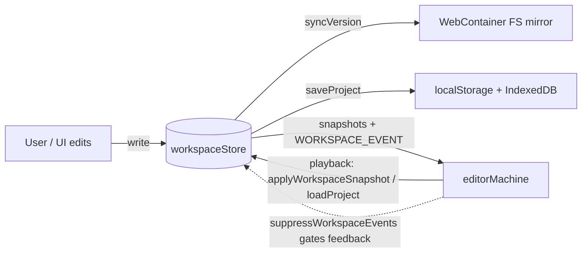
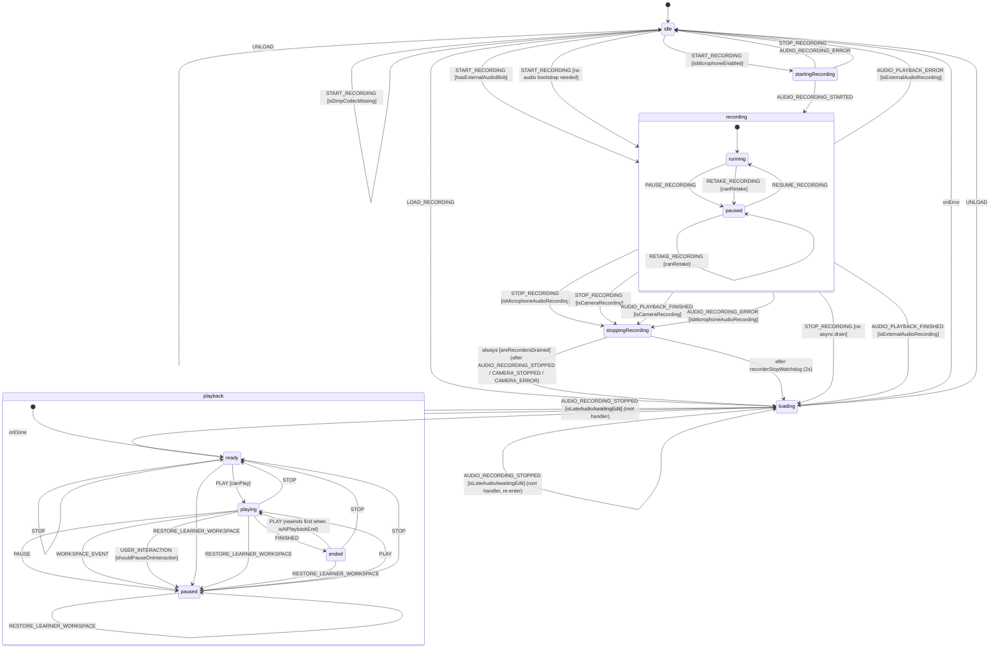
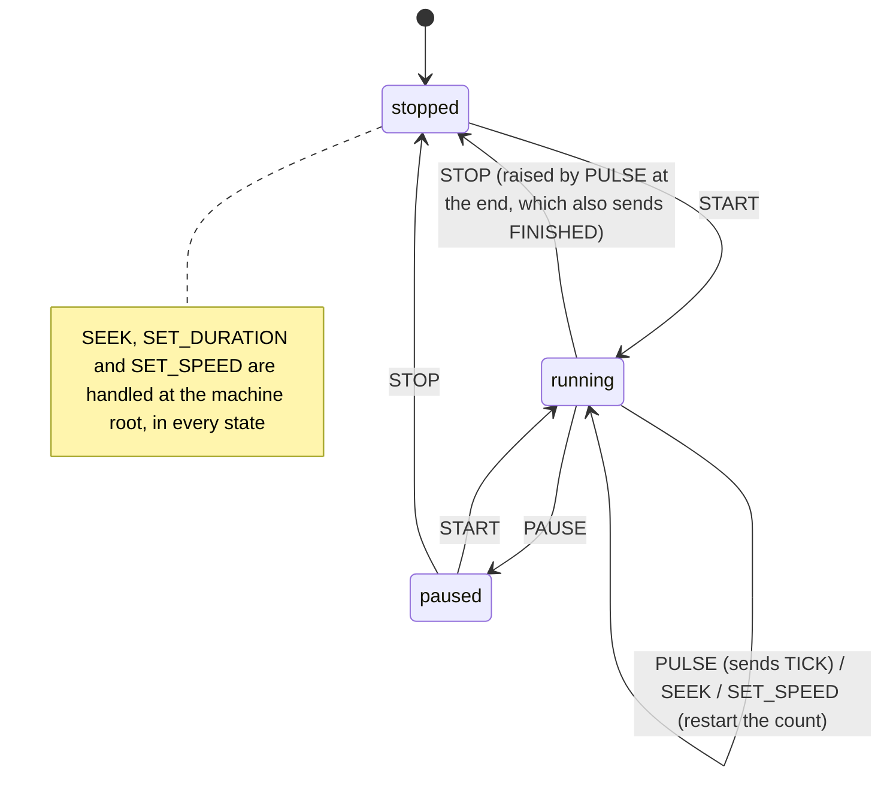
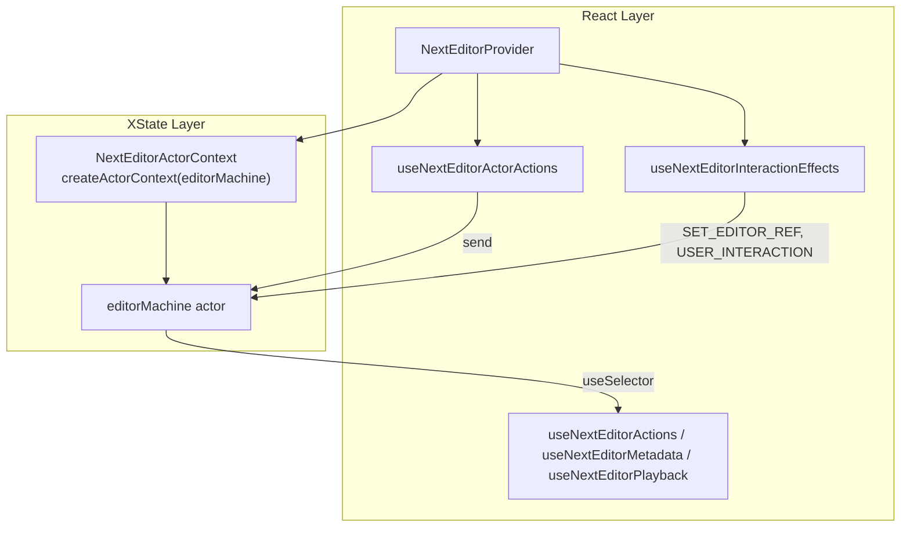

# State Machines Documentation

This document describes the current XState v5 architecture used by Next Editor.

## State Ownership Boundaries

Next Editor runs three distinct state systems. They are not interchangeable, and
each owns a different slice of the app. Knowing which one is the source of truth
for a given field is the difference between a one-line change and an infinite
update loop.

| System                             | Kind                | Owns (source of truth)                                                                                                              |
| ---------------------------------- | ------------------- | ----------------------------------------------------------------------------------------------------------------------------------- |
| `workspaceStore` (`@xstate/store`) | Synchronous CRUD    | Live workspace: `project` (files/folders), `activeFilePath`, `collapsedFolders`, sidebar layout, `lessonType`, dirty/saved snapshot |
| `editorMachine` (XState machine)   | Async orchestration | The timeline: recording/playback state, frames, cursor/preview/slide/workspace/runtime event streams, replay cursors, audio/camera  |
| React contexts                     | Wiring/transport    | No durable state — an Actions context plus Metadata/Playback selector hooks (render perf), domain adapters, and panel-local UI only |

A fourth, self-contained machine exists outside this table: the collaboration
voice machine (`src/voice/machine.ts`), an XState machine owned by the
`VoiceEngine` (not by React) that models the voice-chat lifecycle
(`idle → joining → listening → unmuting → live`, plus reconnect/failed/leaving
paths). All media side effects live in the engine; `CollaborationVoiceContext`
only subscribes to its snapshots. See
`docs/live-collaboration-voice-cloudflare-realtime-sfu.md` §9 for the full
state model and its cleanup invariants.

### Who owns `project` / `activeFilePath`

This is the field pair most likely to look "shared." It is not — ownership moves
with the mode:

- **Authoring / idle / runtime:** `workspaceStore` is the sole owner. The
  WebContainer filesystem is a _mirror_, synced store → container by
  `useWebContainerWorkspaceSync` (driven by the store's `syncVersion`). Files a
  container process writes (a lockfile, generated code) come back through the
  runtime provider's reverse sync, which reads the container tree and hands it
  to the store's `reconcileExternalProject`; the store stays the owner and the
  read becomes the forward sync's new baseline, so it is not written back.
- **Recording:** the machine only _reads_ the workspace — it pulls immutable
  snapshots and timed `WORKSPACE_EVENT`s from the store (via
  `getWorkspaceSnapshot` in `src/hooks/useWorkspaceRecordingAdapter.ts` and
  `handleWorkspaceEvent` in `NextEditorProvider`). The
  store stays the owner; the recording accumulates a history.
- **Playback:** the machine _drives_ the store. `applyWorkspaceSnapshot` calls
  `loadProject(...)`, so the store becomes a _render target_ reflecting the
  recording at the current timeline position. When the viewer's WebContainer
  runtime has been started, each applied snapshot is also saved to it (sync, plus
  a run-on-save rerun of a finished runner) so the live console follows the
  replay; playback never starts a runtime that has not been started.

### The invariant

Workspace-shaped state has exactly **one writer at a time**: the user/UI when not
playing back, the machine during playback. The hand-off is enforced by
`suppressWorkspaceEventsRef` from `useWorkspaceRecordingAdapter`
(`src/hooks/useWorkspaceRecordingAdapter.ts`), which `NextEditorProvider`'s
`handleWorkspaceEvent` checks — while the machine writes a recorded snapshot
into the store, store → machine `WORKSPACE_EVENT` emission is gated for that tick
so playback writes are not recaptured as new edits.

Two corollaries that should stay true as the code evolves:

- The machine never persists workspace state. Persistence (localStorage snapshot +
  IndexedDB assets) is the store's concern: `saveProject`, which the UI calls
  explicitly (Ctrl+S, the sidebar, a runner's save-before-run), writes it, and
  the store's `saveVersion` counts completed saves.
- The store never advances the timeline. Clock progression belongs to the
  `timelineMachine` child actor.

```mermaid
flowchart LR
    User[User / UI edits] -->|write| Store[(workspaceStore)]
    Store -->|syncVersion| Container[WebContainer FS mirror]
    Store -->|saveProject| Persist[localStorage + IndexedDB]
    Store -->|snapshots + WORKSPACE_EVENT| Machine[editorMachine]
    Machine -->|playback: applyWorkspaceSnapshot / loadProject| Store
    Machine -.suppressWorkspaceEvents gates feedback.-> Store
```

## Editor Machine Overview

Defined in `src/core/src/machine/editorMachine.ts`.

The diagram draws every transition that has a target, plus the codec refusal that stays in
`idle`. A transition on a compound state that targets one of its own substates
(`recording`'s `RETAKE_RECORDING`, `playback`'s `STOP` and `RESTORE_LEARNER_WORKSPACE`) is
drawn from each substate it can leave; the others are drawn once, from the compound state's
edge. The root late-blob handler is drawn from `loading` and `playback`, the states a
finalized take's late microphone blob can reach. Handlers without a target (the captures,
`TICK`, `SEEK`, `SET_SPEED` and the like) are mostly described in the sections below, and
all are listed in the action and event tables. The substates have their own ids in the
diagram (`recordingPaused`, `playbackPaused`, ...) because mermaid state ids are global.

```mermaid
stateDiagram-v2
    [*] --> idle

    idle --> idle : START_RECORDING [isDmpCodecMissing]
    idle --> recording : START_RECORDING [hasExternalAudioBlob]
    idle --> startingRecording : START_RECORDING [isMicrophoneEnabled]
    idle --> recording : START_RECORDING [no audio bootstrap needed]
    idle --> loading : LOAD_RECORDING

    startingRecording --> recording : AUDIO_RECORDING_STARTED
    startingRecording --> idle : AUDIO_RECORDING_ERROR
    startingRecording --> idle : STOP_RECORDING

    state recording {
        state "running" as recordingRunning
        state "paused" as recordingPaused
        [*] --> recordingRunning
        recordingRunning --> recordingPaused : PAUSE_RECORDING
        recordingPaused --> recordingRunning : RESUME_RECORDING
        recordingRunning --> recordingPaused : RETAKE_RECORDING [canRetake]
        recordingPaused --> recordingPaused : RETAKE_RECORDING [canRetake]
    }

    recording --> stoppingRecording : STOP_RECORDING [isMicrophoneAudioRecording]
    recording --> stoppingRecording : STOP_RECORDING [isCameraRecording]
    recording --> loading : STOP_RECORDING [no async drain]
    recording --> stoppingRecording : AUDIO_PLAYBACK_FINISHED [isCameraRecording]
    recording --> loading : AUDIO_PLAYBACK_FINISHED [isExternalAudioRecording]
    recording --> stoppingRecording : AUDIO_RECORDING_ERROR [isMicrophoneAudioRecording]
    recording --> idle : AUDIO_PLAYBACK_ERROR [isExternalAudioRecording]

    stoppingRecording --> loading : always [areRecordersDrained] (after AUDIO_RECORDING_STOPPED / CAMERA_STOPPED / CAMERA_ERROR)
    stoppingRecording --> loading : after recorderStopWatchdog (2s)

    loading --> playbackReady : onDone
    loading --> idle : onError
    loading --> idle : UNLOAD
    loading --> loading : LOAD_RECORDING (re-enter)
    loading --> loading : AUDIO_RECORDING_STOPPED [isLateAudioAwaitingEdit] (root handler, re-enter)

    state playback {
        state "ready" as playbackReady
        state "playing" as playbackPlaying
        state "paused" as playbackPaused
        state "ended" as playbackEnded
        [*] --> playbackReady
        playbackReady --> playbackPlaying : PLAY [canPlay]
        playbackPlaying --> playbackPaused : PAUSE
        playbackPlaying --> playbackPaused : WORKSPACE_EVENT
        playbackPlaying --> playbackPaused : USER_INTERACTION [shouldPauseOnInteraction]
        playbackPlaying --> playbackEnded : FINISHED
        playbackPaused --> playbackPlaying : PLAY
        playbackEnded --> playbackPlaying : PLAY (rewinds first when isAtPlaybackEnd)
        playbackReady --> playbackReady : STOP
        playbackPlaying --> playbackReady : STOP
        playbackPaused --> playbackReady : STOP
        playbackEnded --> playbackReady : STOP
        playbackReady --> playbackPaused : RESTORE_LEARNER_WORKSPACE
        playbackPlaying --> playbackPaused : RESTORE_LEARNER_WORKSPACE
        playbackPaused --> playbackPaused : RESTORE_LEARNER_WORKSPACE
        playbackEnded --> playbackPaused : RESTORE_LEARNER_WORKSPACE
    }

    playback --> idle : UNLOAD
    playback --> loading : LOAD_RECORDING
    playback --> loading : AUDIO_RECORDING_STOPPED [isLateAudioAwaitingEdit] (root handler)
```

These events are handled at the machine root, so they apply in every state that has no
handler of its own for them:

- `SET_EDITOR_REF` stores the live editor, and re-applies the replay when `shouldSyncPlaybackEditorRef`.
- `AUDIO_RECORDING_STOPPED` splices a microphone blob that arrived after its take was
  finalized (`attachLateAudioBlob`). When that take still has a retake's cut to apply
  (`isLateAudioAwaitingEdit`), it goes back through `loading`, re-entering it if it is
  already there. `recording` and `stoppingRecording` have their own handlers.
- `START_RECORDING` releases the display stream of a start that no state accepted (only
  `idle` accepts one).
- `ADD_CAPTION_TRACK` and `SET_CHAPTERS` change the loaded recording (`isForLoadedRecording`).
- `SCREEN_STOPPED` and `SCREEN_ERROR` follow the screen recorder, which is independent of the
  take's finalize join.

## Core States

### `idle`

No recording or playback is active.

- Accepts `START_RECORDING` and `LOAD_RECORDING`.
- Holds the current editor reference and default playback settings.

### `startingRecording`

Used only when `enableAudioRecording` is set and no external audio blob was supplied —
i.e. the microphone bootstrap path.

- Spawns `audioRecording` and sends it `START`, on the microphone the `START_RECORDING`
  named (`microphoneDeviceId`, stored per take by `setMicrophoneDevice`). A named microphone
  that is gone (`OverconstrainedError`/`NotFoundError`) falls back to the default one rather
  than failing the take; a refused permission still fails it.
- Waits for `AUDIO_RECORDING_STARTED` to move to `recording`.
- `STOP_RECORDING` aborts straight back to `idle`.

### `recording`

The main capture state.

What happens here:

- a `RecordingSession` is initialized (`initRecordingSession`) and the first frame is captured (`captureInitialFrame`)
- an invoked `mouseTracking` actor drives `CAPTURE_FRAME` for cursor movement
- camera capture spawns conditionally on entry if `enableCameraRecording`
- `CAPTURE_FRAME`, `SLIDE_EVENT`, `PREVIEW_EVENT`, `PREVIEW_INITIAL_DOCUMENT`, `PREVIEW_PATCH_BATCH`, `WORKSPACE_EVENT`, `RUNTIME_EVENT`, `WHITEBOARD_EVENT`, and `CHAT_EVENT` are all captured into the session
- `recording` has two substates, `running` (where every take starts) and `paused`. `PAUSE_RECORDING` (handled only in `running`) and `RESUME_RECORDING` (handled only in `paused`) move between them, so a second pause or a resume while running is dropped. The substate and the clock's `pausedAt` change in the same transitions, and the UI's `isRecordingPaused` reads the substate (`state.matches({ recording: "paused" })`). Every capture handler sits on `recording` itself, so it runs in both. Pausing never leaves `recording`: the session clock (`recordingClock.ts`) stands still, and the microphone, camera and screen recorders (or a selected narration file) pause with it. Everything captured while paused is stamped at the pause, so edits made then replay as one jump; pointer samples are dropped until the resume records where the pointer ended up. Preview rrweb stamps have the pauses taken out on the wall clock, so replay's single preview offset stays valid
- `RETAKE_RECORDING` rewinds the take to its last safe point (its start, or the last resume; `retake.ts`) and holds it paused there: from either substate it moves to `paused`, and `rewindRecordingClock` leaves the clock paused. Only the tail is discarded: every track is cut back to the entries at or before that point (new arrays), the frame encoder is re-based on the last kept frame, and the clock is rewound. The recorders keep their files, so the stretch they recorded since is added to `session.mediaCuts` (microphone narration is cut when the take loads, via `pendingAudioEdit`; the camera is mapped around `cameraCuts`), while a selected narration file is sought back instead. The live workspace, whiteboard, slides and preview panel are put back through their appliers; the live terminal and agent chat, which cannot be rewound, are recorded whole at the safe point; and the preview's rrweb stream drops patches until a fresh full snapshot re-bases it
- `ADD_CHAPTER_MARKER` marks a chapter at the take's current moment (one per moment); it is also a safe point a retake can rewind to, anchored at the pause when marked while paused. A retake drops the chapters it discards, and finalize hands the rest to the recording
- camera lifecycle events are folded into camera state
- `STOP_RECORDING` branches on `isMicrophoneAudioRecording` / `isCameraRecording` to decide whether a drain (`stoppingRecording`) is needed before finalizing
- a selected narration file ends the take by itself: its `AUDIO_PLAYBACK_FINISHED` goes to `stoppingRecording` when the camera is on (after `stopExternalAudioRecording` marks the narration done), and otherwise finalizes straight to `loading`. If the file fails to play (`AUDIO_PLAYBACK_ERROR`), the take is dropped and the machine returns to `idle` with the error
- a microphone that fails mid-take (`AUDIO_RECORDING_ERROR` with `isMicrophoneAudioRecording`) reports the error and drains through `stoppingRecording` like a stop. A microphone that ends by itself (`AUDIO_RECORDING_STOPPED`) only has its file stored; the take goes on

### `stoppingRecording`

This is a drain state, not a second recording mode.

- camera capture may stop before or after audio
- entering it (`stopRecordingMedia`) asks the running microphone and camera recorders for their files (`getRunningRecorders`)
- `AUDIO_RECORDING_STOPPED`, `CAMERA_STOPPED` and `CAMERA_ERROR` each only store what that recorder sent and stop it; storing clears the recorder's `isRecording` flag
- the machine finalizes through one eventless join, `always` with `areRecordersDrained`: once no narration and no camera is still recording. xstate checks it after every event the state takes, and every way in has the microphone or the camera still recording, so it never passes on entry. Otherwise the two-second `recorderStopWatchdog` delay finalizes without the missing files. A microphone blob that lands after that is still spliced into the finalized take by the root `AUDIO_RECORDING_STOPPED` handler (`attachLateAudioBlob`); when the take still has a retake's cut to apply (`isLateAudioAwaitingEdit`), that handler sends it back through `loading`
- a microphone that fails while stopping (`AUDIO_RECORDING_ERROR`) keeps its `isRecording` flag, so the join waits and the watchdog ends the take unless the recorder still sends its file

### `loading`

An invoked `loadRecording` actor (`loadRecordingActor.ts`; a promise actor, not a spawned child) normalizes the recording:

- computes exact duration from the audio blob via `measureAudioDurationSeconds` (an offline decode) when finalized non-external audio is present (avoids trailing silence from wall-clock overhead); when it has just applied a `pendingAudioEdit`, `editRecordedAudio` returns the edited samples' length and the file it encoded is not decoded again. The encoder behind an edit (`utils/audioEdit.ts`, with the Ogg/Opus muxer and the WAV encoder) is imported dynamically, only for a take that has an edit to apply; the edit's shape and `hasAudioEdit` live in `utils/audioEditSpec.ts`
- `onDone` passes the actor's typed output to `setRecording` and transitions to `playback.ready`
- `onError` records the error and returns to `idle`
- `LOAD_RECORDING` re-enters `loading`, restarting the invoke with the newer recording; the
  replaced promise actor is stopped and never delivers its result
- `UNLOAD` clears the recording and returns to `idle`

The decode above can take seconds for a long microphone take, which is why a discard or a newer
import sent in that window is handled here instead of being dropped. Both also stop a microphone
recorder the finalize watchdog overtook, as `playback`'s `UNLOAD` and `LOAD_RECORDING` do.

### `playback`

Playback is a compound state with `ready`, `playing`, `paused`, and `ended` substates. It invokes the `timeline` child actor (`timelineActor`) for the whole compound state's lifetime.

The parent `playback` state also handles `APPEND_RECORDING_DELTA`, `EXTEND_RECORDING`, `TICK`, `SEEK`, `SET_SPEED`, `SET_VOLUME`, `WORKSPACE_EVENT`, `STOP`, `UNLOAD`, `PRESERVE_LEARNER_WORKSPACE`, `RESTORE_LEARNER_WORKSPACE`, and `LOAD_RECORDING` (re-entering `loading` for an unrelated file import while a recording is open) — which is what makes copy-bounded progressive streaming and mid-session recording swaps possible. `playing`, `paused` and `ended` override some of these (`WORKSPACE_EVENT` pauses `playing`; `paused` has its own `TICK`; `paused` and `ended` have their own `SEEK`).

## Playback Substates

The overview diagram above draws the `playback` substates and every transition between them.

Important current behavior:

- `SET_SPEED` and `SET_VOLUME` are meaningful in any playback substate; they forward to `timelineActor` and, if spawned, `audioPlayer`.
- `STOP` resets to `.ready` and seeks the timeline/audio back to `0` without unloading the recording.
- `PLAY` from `ended` restarts from the beginning when the playhead is at the end (`isAtPlaybackEnd`), and otherwise plays on from where a seek left it. Only `ready`'s `PLAY` is guarded by `canPlay`.
- `paused` and `ended` hand the workspace to the viewer (`SYNC_PAUSED_WORKSPACE_ACTIONS`: adopt the recorded state, detach, remember it as `learnerWorkspaceBaseline`). Before the recording takes it back — `PLAY`, a paused or ended `SEEK` (`SEEK_WHILE_HANDED_OVER_ACTIONS`, which then hands it over again), `STOP`, `UNLOAD`, `LOAD_RECORDING`, or `PRESERVE_LEARNER_WORKSPACE` when the page is hidden — `preserveLearnerWorkspace` passes any edits (file tree or contents differing from the baseline) to `onLearnerWorkspaceSaved`, which keeps them in IndexedDB (`src/storage/learnerWorkspaceVersions.ts`). `RESTORE_LEARNER_WORKSPACE` pauses, seeks to where a saved version was made, and applies it. The adopt, baseline, preserve and apply bodies and the three learner-workspace events live in `learnerWorkspace.ts`; `detachPlaybackWorkspace` and `reattachPlaybackWorkspace` stay in `replayActions.ts`, since they reset the replay cursors, and the two action lists stay in `editorMachine.ts`.
- A `WORKSPACE_EVENT` arriving while `playing` means the user manually edited the workspace — it force-pauses and calls `detachPlaybackWorkspace` so the recorded workspace snapshot stops overwriting the user's edit.

## Child Actors

### Timeline actor (`timelineMachine`)

Owns clock progression and emits `TICK` updates.

```mermaid
stateDiagram-v2
    [*] --> stopped
    stopped --> running : START
    running --> paused : PAUSE
    paused --> running : START
    running --> running : PULSE (sends TICK) / SEEK / SET_SPEED (restart the count)
    running --> stopped : STOP (raised by PULSE at the end, which also sends FINISHED)
    paused --> stopped : STOP
    note right of stopped : SEEK, SET_DURATION and SET_SPEED are handled at the machine root, in every state
```

- `running` invokes a `requestAnimationFrame` ticker that sends `PULSE`. Each pulse moves the playhead and sends the editor `TICK`; once the playhead reaches the end, it raises `STOP` and sends `FINISHED`.
- `SEEK`, `SET_DURATION` and `SET_SPEED` are handled at the machine root, so they work in every state. `running` has its own `SEEK` and `SET_SPEED`, which also restart the count, so the next pulse measures from there.
- Leaving `running` freezes the count at the playhead, so `START` from `paused` or `stopped` resumes there.
- The editor only sends `START`, `PAUSE`, `SEEK`, `SET_SPEED` and `SET_DURATION`. `STOP` is only raised by the timeline itself, from `running`, so nothing sends `paused` its `STOP` today.

### Recorder actors

The microphone, camera and screen recorders all take `RecorderControlEvent` (`START`, `STOP`, `PAUSE`, `RESUME`; `recorderControl.ts`). A paused MediaRecorder writes nothing, so each file skips the take's pauses (`syncRecorderPause`), including a pause that arrives before the recorder has started.

### Audio recording actor (`audioRecordingActor`)

- Starts microphone capture and emits `AUDIO_RECORDING_STARTED`, `AUDIO_RECORDING_STOPPED`, and `AUDIO_RECORDING_ERROR`.

### Camera recording actor (`cameraRecordingActor`)

- Starts optional video-only capture.
- Emits `CAMERA_STARTED`, `CAMERA_STOPPED` on finalize, and `CAMERA_ERROR` on setup or runtime failure.
- Tracks a warmup delay so the parent machine can persist `cameraStartOffsetMs`.

### Audio playback actor (`audioPlaybackActor`)

- Plays the narration through an `HTMLAudioElement`, from the recording's published `audioUrl` or else its audio blob, following the timeline through `SEEK` and a periodic `SYNC` (at most every `PLAYBACK_AUDIO_SYNC_INTERVAL_MS` while playing).
- Emits role-specific `AUDIO_PLAYBACK_READY`, `AUDIO_PLAYBACK_FINISHED`, and `AUDIO_PLAYBACK_ERROR` events so media completion cannot be mistaken for timeline completion.
- Is spawned once per loaded recording through `syncPlaybackAudio` in `playbackActors.ts` (`playbackAudioSpawned` context flag): on entering playback (`spawnPlaybackAudio`) when the recording already has audio, or lazily when streamed audio first arrives (`syncStreamedRecordingGrowth`, `startPlaybackActors`).

### Screen recording actor (`screenRecordingActor`)

- Records a pre-acquired display stream and optionally mixes tab audio with a cloned microphone track.
- Uses a unique child id per capture; every `SCREEN_*` event carries that id so late WebM-repair completions cannot stop or clear a newer capture.
- Releases display tracks and the audio graph before asynchronous WebM duration repair, then delivers the blob through `onScreenRecordingReady` without storing it in the lesson recording.

### Mouse tracking actor (`mouseTrackingActor`)

- Invoked only while `recording`; forwards live mouse positions into `CAPTURE_FRAME` events for cursor sampling.
- Tracks preview iframes through `startIframeCursorTracking` (`iframeCursorTracking.ts`): same-origin frames by listeners on their documents, cross-origin frames by the injected script's postMessage. It reports each point in page coordinates, and the actor maps it to the recording root.

## Replay Cursors In Context

The machine keeps replay progress in context so it can apply large recordings efficiently:

- `lastAppliedFrameIndex`
- `lastAppliedPreviewEventIndex`
- `lastAppliedSlideEventIndex`
- `lastAppliedWorkspaceEventIndex`
- `lastAppliedRuntimeEventIndex`
- `lastAppliedWhiteboardEventIndex`
- `lastAppliedChatEventIndex`
- `lastAppliedPreviewState` (avoids redundant preview-state pushes)

These indices are preserved across `EXTEND_RECORDING`, which is the critical detail for streaming playback. A seek, rewind, resume or workspace detach resets every cursor but the workspace one (`REPLAY_CURSORS_RESET` in `replayActions.ts`): panel widths replay as relative deltas, so that cursor resets only when a recording is loaded or cleared.

`PREVIEW_EVENT` is the single channel for runtime-preview state, including the API client:
its `api_client_mode`, `api_client_request`, `api_client_response`, `api_client_request_tab`,
and `api_client_inspect_history` variants are applied through the same preview replay cursor
as DOM snapshots. Caption tracks are managed out of band — `ADD_CAPTION_TRACK` adds or
replaces a track in the loaded recording's `captions` directly (e.g. from a `.vtt`/`.srt`
import or sibling-file load) rather than riding the timeline. The event names the recording
the track belongs to and is dropped when another one is loaded (`isForLoadedRecording`), so a
late sibling `.vtt` cannot land on the next lesson. Once a recording has captions,
`EXTEND_RECORDING` keeps its list instead of taking the extended recording's, so a late audio
or stream extend does not drop tracks added after load. Chapters are edited the same way:
`SET_CHAPTERS` replaces the loaded recording's `chapters` (normalized) outside the timeline,
and `EXTEND_RECORDING` always keeps the loaded list, so an edit (or a cleared list) made during
the download survives the extend.

## Key Events

`EditorMachineEvent` (`src/core/src/machine/types.ts`) is built from these groups:

| Group                | Events                                                                                                                                                                                                                                                      |
| -------------------- | ----------------------------------------------------------------------------------------------------------------------------------------------------------------------------------------------------------------------------------------------------------- |
| Recording controls   | `START_RECORDING` (an optional narration file `audioBlob`, `enableCamera`, `screenStream`, `microphoneDeviceId`), `STOP_RECORDING`, `PAUSE_RECORDING`, `RESUME_RECORDING`, `RETAKE_RECORDING`, `ADD_CHAPTER_MARKER`                                         |
| Capture              | `CAPTURE_FRAME` (pointer moves, exact text edits, a collaborator's selection), `SLIDE_EVENT`, `PREVIEW_EVENT`, `PREVIEW_INITIAL_DOCUMENT`, `PREVIEW_PATCH_BATCH`, `WORKSPACE_EVENT` (panel width deltas), `RUNTIME_EVENT`, `WHITEBOARD_EVENT`, `CHAT_EVENT` |
| The loaded recording | `LOAD_RECORDING`, `EXTEND_RECORDING`, `APPEND_RECORDING_DELTA`, `ADD_CAPTION_TRACK`, `SET_CHAPTERS`, `UNLOAD`                                                                                                                                               |
| Playback             | `PLAY`, `PAUSE`, `STOP`, `SEEK`, `SET_SPEED`, `SET_VOLUME`, `USER_INTERACTION`, and the timeline actor's `TICK` and `FINISHED`                                                                                                                              |
| Learner workspace    | `PRESERVE_LEARNER_WORKSPACE`, `RESTORE_LEARNER_WORKSPACE`, `APPLY_LEARNER_WORKSPACE` (raised by `RESTORE_LEARNER_WORKSPACE`)                                                                                                                                |
| Editor               | `SET_EDITOR_REF`                                                                                                                                                                                                                                            |
| Child actors         | `AUDIO_RECORDING_*`, `AUDIO_PLAYBACK_*`, `CAMERA_*`, `SCREEN_*`                                                                                                                                                                                             |

The `AUDIO_*`, `CAMERA_*` and `SCREEN_*` members are not declared in `types.ts`. `EditorMachineEvent`
includes each actor's own union (`AudioRecordingEmit`, `AudioPlaybackEmit`, `CameraRecordingEmit`,
`ScreenRecordingEmit`), and the actors are built with `fromTypedCallback`, which checks every
`sendBack` call against that union. xstate's own `fromCallback` leaves `sendBack` untyped.

## Guards

Defined in the machine's `setup({ guards: { ... } })` block. The state config uses them by name only.

| Guard                              | Used by                                                            | True when                                                                                              |
| ---------------------------------- | ------------------------------------------------------------------ | ------------------------------------------------------------------------------------------------------ |
| `isDmpCodecMissing`                | `idle` `START_RECORDING`                                           | The diff-match-patch WASM codec has not loaded, so no take starts                                      |
| `hasExternalAudioBlob`             | `idle` `START_RECORDING`                                           | The event carries a non-empty narration file (`getExternalAudioBlob`)                                  |
| `isMicrophoneEnabled`              | `idle` `START_RECORDING`                                           | `enableAudioRecording` is set, so the take starts in `startingRecording`                               |
| `isMicrophoneAudioRecording`       | `recording` `STOP_RECORDING`, `AUDIO_RECORDING_ERROR`              | `enableAudioRecording` is set and the microphone recorder is running                                   |
| `isExternalAudioRecording`         | `recording` `AUDIO_PLAYBACK_FINISHED`, `AUDIO_PLAYBACK_ERROR`      | A narration file is playing along with the take                                                        |
| `isCameraRecording`                | `recording` `STOP_RECORDING`, `AUDIO_PLAYBACK_FINISHED`            | The camera recorder is running                                                                         |
| `areRecordersDrained`              | `stoppingRecording` `always` (the finalize join)                   | No narration and no camera is still recording, so the take has every file it waits for                 |
| `canRetake`                        | `recording` `RETAKE_RECORDING`                                     | There is a safe point before now                                                                       |
| `isLateAudioAwaitingEdit`          | root `AUDIO_RECORDING_STOPPED`                                     | The late microphone blob's take still has a retake's cut to apply, so it goes back through `loading`   |
| `canPlay`                          | `ready` `PLAY`                                                     | A recording with at least one frame is loaded                                                          |
| `shouldPauseOnInteraction`         | `playing` `USER_INTERACTION`                                       | `pauseOnUserInteraction` is set                                                                        |
| `shouldSyncPlaybackEditorRef`      | root `SET_EDITOR_REF`                                              | A new editor arrived while the replay owns the workspace and has a frame to re-apply, or waits for one |
| `isCurrentScreenRecorderEvent`     | root `SCREEN_*`                                                    | The event came from the current screen recorder, not an earlier capture's                              |
| `isForLoadedRecording`             | root `ADD_CAPTION_TRACK`, `SET_CHAPTERS`; `playback` stream growth | The event names the loaded recording                                                                   |
| `isGrowthWhileViewerOwnsWorkspace` | `playback` stream growth                                           | The event grows the loaded recording, and the viewer has taken the workspace over                      |
| `isAtPlaybackEnd`                  | `ended` `PLAY`                                                     | The playhead is within 100 ms of the end, so `PLAY` rewinds first                                      |

Which recorders are running is answered once, by `getRunningRecorders(context)` in `runningRecorders.ts`; the recorder guards and the actions that pause, resume and stop the recorders all read it. Those actions, and a retake's hold, message the recorders through one fan-out there, `sendToRunningRecorders`, which sends in the fixed order microphone, narration file, camera, screen. The stop watchdog is the named delay `recorderStopWatchdog`.

## Actions Summary

Action bodies are split by concern: capture-side bodies live in `captureActions.ts` (the recording-state tracks, the session lifecycle and finalize), with each recorder's slice (its state type, idle factory, start and handlers) in the recorder's own module: the microphone and narration file in `audioCaptureActions.ts`, the camera in `cameraCaptureActions.ts` and the local screen recorder in `screenCaptureActions.ts`; the editor frame and cursor capture live in `frameCapture.ts`; replay-side ones live in `replayActions.ts`, with the editor frame replay (folding frames and applying them to Monaco) in `frameReplay.ts` and keeping the viewer's own edits across the workspace hand-over in `learnerWorkspace.ts`, all typed with `EditorActionArgs` / `EditorContextUpdate`, and `editorMachine.ts`'s `setup()` wraps them as `assign(...)` so the machine can infer exact context/event/actor types. The capture bodies that only append to the session in place return void and are registered as plain actions, so a captured event does not copy the context. Actions that spawn, message or stop child actors are named `enqueueActions` / `stopChild` actions in `setup()`. Only `syncStreamedRecordingGrowth` keeps its body there; the playback timeline and narration sends (`seekPlaybackActors`, `spawnPlaybackAudio`, `syncPlaybackAudioToTimeline`, `syncPlaybackActorsSpeed`, `syncPlaybackAudioVolume`, `startPlaybackActors`, `pausePlaybackActors`) keep theirs in `playbackActors.ts`, typed with a structural `enqueue` (`PlaybackActorsEnqueue`) as the recorder starts are in their owners (`startMicrophoneRecorder` and `startExternalAudioPlayback` in `audioCaptureActions.ts`, `startCameraRecorder` in `cameraCaptureActions.ts`, `startScreenRecorder` in `screenCaptureActions.ts`), and so do the recorder pause, resume and stop sends (`pauseRecordingMedia`, `resumeRecordingMedia`, `stopRecordingMedia`, `stopScreenRecording`) in `runningRecorders.ts` (`RecorderSendEnqueue`), the whole retake, `retakeRecording`, in `retake.ts` (`RetakeEnqueue`) beside the pure rewind it drives, and `preserveLearnerWorkspace` in `learnerWorkspace.ts`; `setup()` wraps each as `enqueueActions(...)` under the same name. The state config lists action names only; the exceptions are `loading`'s `onDone`/`onError` assigns (typed by the invoke) and `RESTORE_LEARNER_WORKSPACE`'s two raises.

### Recording (capture-side) actions

| Action                                                                                                  | Description                                                                                  |
| ------------------------------------------------------------------------------------------------------- | -------------------------------------------------------------------------------------------- |
| `initRecordingSession`                                                                                  | Initialize `RecordingSession` with timestamps and empty arrays                               |
| `captureInitialFrame`                                                                                   | Capture the first frame at t=0                                                               |
| `captureFrame`                                                                                          | Capture current editor state with timestamp (incrementally delta-encoded)                    |
| `capturePreviewRefreshFrame`                                                                            | Re-capture a frame alongside a preview event so preview state stays paired with editor state |
| `captureSlideEvent`                                                                                     | Append a `SlideEvent` to the session                                                         |
| `capturePreviewEvent`                                                                                   | Append a `PreviewEvent` to the session                                                       |
| `capturePreviewInitialDocument`                                                                         | Append a `PreviewInitialDocument` (rrweb seed) to the session                                |
| `capturePreviewPatchBatch`                                                                              | Append a `PreviewDomPatchBatch` (rrweb incremental events) to the session                    |
| `captureWorkspaceEvent`                                                                                 | Append a timed workspace event                                                               |
| `captureRuntimeEvent`                                                                                   | Append a timed runtime event                                                                 |
| `captureWhiteboardEvent` / `captureChatEvent`                                                           | Append a whiteboard change / an agent-chat delta or checkpoint                               |
| `pauseRecordingSession` / `resumeRecordingSession`                                                      | Stop / run the take's clock (a resume is a safe point)                                       |
| `pauseRecordingMedia` / `resumeRecordingMedia`                                                          | Pause / resume every running recorder                                                        |
| `retakeRecording`                                                                                       | Rewind the take to its last safe point, hold its recorders there, and put the editor back    |
| `addChapterMarker`                                                                                      | Mark a chapter at the take's current moment (also a safe point)                              |
| `startMicrophoneRecorder`                                                                               | Spawn and start the microphone recorder (entering `startingRecording`)                       |
| `startCameraRecorder` / `startScreenRecorder`                                                           | Spawn and start the camera / screen recorder (entering `recording`)                          |
| `stopRecordingMedia` / `stopScreenRecording`                                                            | Ask the recorders for their files (entering `stoppingRecording` / leaving `recording`)       |
| `stopAudioRecorder` / `stopCameraRecorder` / `stopRecordingAudioPlayer` / `stopScreenRecorderFromEvent` | Stop a recorder or the narration-file player (the child actor)                               |
| `setCameraRecordingEnabled`                                                                             | Set `enableCameraRecording` from the `START_RECORDING` event                                 |
| `setMicrophoneDevice`                                                                                   | Set the take's `microphoneDeviceId` from the `START_RECORDING` event (null: default)         |
| `prepareExternalAudioRecording`                                                                         | Set up audio state for the external-audio-blob recording path                                |
| `startExternalAudioPlayback`                                                                            | Start driving the external audio blob as the recording's audio track                         |
| `storeExternalAudioDuration`                                                                            | Store known duration once external audio metadata is ready                                   |
| `stopExternalAudioRecording`                                                                            | Mark a narration-file take's audio as done (its player stops on leaving `recording`)         |
| `storeAudioStarted`                                                                                     | Store the started `MediaRecorder`/mimeType/timestamps                                        |
| `storeAudioBlob`                                                                                        | Store the finalized audio blob                                                               |
| `storeCameraStarted`                                                                                    | Store camera warmup timestamps into `cameraStartOffsetMs`                                    |
| `storeCameraBlob`                                                                                       | Store the finalized camera blob                                                              |
| `handleCameraError`                                                                                     | Record a camera recording error                                                              |
| `handleAudioRecordingError` / `handleExternalAudioError`                                                | Record a microphone failure / end a take whose narration file failed to play                 |
| `attachLateAudioBlob`                                                                                   | Splice a microphone blob that lands after finalize into the finalized take                   |
| `resetAudioAfterRecorderStop`                                                                           | Reset audio state once the recorder actor is stopped                                         |
| `finalizeRecording`                                                                                     | Compress/assemble the session into a `Recording` object                                      |

### Playback (replay-side) actions

| Action                                                                                    | Description                                                                                                                                          |
| ----------------------------------------------------------------------------------------- | ---------------------------------------------------------------------------------------------------------------------------------------------------- |
| `setRecording`                                                                            | Install the `loadRecording` output and reset replay cursors (an inline `assign` in `onDone`)                                                         |
| `extendRecording`                                                                         | Replace `context.recording` with a longer append-only prefix                                                                                         |
| `applyReplayStateAtTime`                                                                  | Bring every track to the current time in one `assign`: workspace, runtime, editor frame, rrweb patches, preview, slides, whiteboard, chat            |
| `applyReplayStateAtTick`                                                                  | On a playing `TICK`: move the playhead to the tick (clamped, `storeTickTime`), then run the `applyReplayStateAtTime` steps                           |
| `moveToPlaybackEnd`                                                                       | Rest the playhead on the recording's end at `FINISHED`                                                                                               |
| `spawnPlaybackAudio`                                                                      | Spawn the narration player on entering `playback`                                                                                                    |
| `startPlaybackActors` / `pausePlaybackActors`                                             | Seek and start / pause the timeline and narration (entering / leaving `playing`)                                                                     |
| `syncPlaybackAudioToTimeline`                                                             | Send the narration `SYNC`, at most every `PLAYBACK_AUDIO_SYNC_INTERVAL_MS`                                                                           |
| `syncPlaybackActorsSpeed` / `syncPlaybackAudioVolume`                                     | Hand the stored speed / volume to the timeline and narration                                                                                         |
| `syncStreamedRecordingGrowth`                                                             | Give the timeline a streamed recording's new length, spawning or syncing the narration                                                               |
| `stopAudioPlayer` / `clearPlaybackAudioSpawned`                                           | Stop the narration player on leaving `playback`                                                                                                      |
| `setChapters`                                                                             | Replace the loaded recording's chapters (normalized), outside the timeline                                                                           |
| `seekToTime`                                                                              | Set current time and invalidate replay cursors so the next apply re-derives state                                                                    |
| `seekPlaybackActors`                                                                      | Send the stored playhead to the timeline actor and, once spawned, the narration player                                                               |
| `setPlaybackSpeed` / `setVolume`                                                          | Update `timeline.speed` / `timeline.volume`                                                                                                          |
| `resetPlayback`                                                                           | Reset timeline to t=0 and give the workspace back to the recording                                                                                   |
| `clearCursorDecorations`                                                                  | Remove fake-cursor Monaco decorations                                                                                                                |
| `detachPlaybackWorkspace` / `reattachPlaybackWorkspace` / `adoptPlaybackWorkspaceAtPause` | Manage the hand-off between recorded workspace snapshots and manual user edits during playback                                                       |
| `captureLearnerWorkspaceBaseline` / `preserveLearnerWorkspace` / `applyLearnerWorkspace`  | Remember the workspace handed to the viewer, save their edits before the recording replaces them, and lay a restored version back over the recording |
| `invalidateAppliedPlaybackState` / `invalidateRenderedPlaybackState`                      | Force replay actions to re-apply on next tick (e.g. after a seek or resume)                                                                          |
| `clearPendingPlaybackEditorSync`                                                          | Clear the flag once `SET_EDITOR_REF` has resynced playback state                                                                                     |
| `clearPendingEditorSyncForPausedSeek`                                                     | Clear it on a paused or ended seek (no model swap follows) while the viewer is on the recorded file                                                  |
| `addCaptionTrack`                                                                         | Add or replace a track in `recording.captions`, outside the timeline                                                                                 |
| `clearRecording`                                                                          | Unload the current recording and reset machine context                                                                                               |
| `setEditorRef`                                                                            | Store the live Monaco editor reference                                                                                                               |
| `notifySeek`                                                                              | Fire the `EditorMachineInput` `onSeek` callback                                                                                                      |

Clock progression belongs to the timeline actor: on each `TICK`, `applyReplayStateAtTick` moves the playhead to its time (`storeTickTime`) and runs the per-track `applyXAtTime` steps to bring every track there, all in one `assign`, and `syncPlaybackAudioToTimeline` keeps the narration in step. The steps are one action because xstate copies the whole context on every `assign`, and the context is wide enough that V8 makes each copy slow.

## Integration with React

```mermaid
flowchart TB
    subgraph React["React Layer"]
        Provider[NextEditorProvider]
        Actions[useNextEditorActorActions]
        Effects[useNextEditorInteractionEffects]
        Hooks["useNextEditorActions / useNextEditorMetadata / useNextEditorPlayback"]
    end

    subgraph XState["XState Layer"]
        ActorCtx["NextEditorActorContext<br/>createActorContext(editorMachine)"]
        Machine[editorMachine actor]
    end

    Provider --> ActorCtx
    ActorCtx --> Machine
    Provider --> Actions
    Provider --> Effects
    Actions -->|send| Machine
    Effects -->|SET_EDITOR_REF, USER_INTERACTION| Machine
    Machine -->|useSelector| Hooks
```

`NextEditorProvider` creates the actor through `NextEditorActorContext.Provider` and wires it to React:

1. `useNextEditorActorActions` wraps `send` in senders (`startRecording`, `play`, `syncEditorRef`, etc.). Their identities are held in `useState`, because the React Compiler skips hookless hooks and three `CodeEditor` effects list `syncEditorRef` in their deps and send `SET_EDITOR_REF`; a new identity per render would re-send it on every commit, and during playback each one rebuilds the rendered replay state (`shouldSyncPlaybackEditorRef`).
2. `useNextEditorInteractionEffects` re-asserts `SET_EDITOR_REF` on mount and after every transition (a send to a stopped actor is dropped), and calls `usePlaybackInteractionPause` (`machine/playbackInteraction.ts`), which pauses playback on editor input or the Space key.
3. `useLeavePageGuards` keeps the viewer's edits on `pagehide` or when the tab is hidden, and asks before unloading while a take is in progress (`selectIsTakeInProgress`).
4. The machine input's host hooks come from the app's stores: `useWorkspaceRecordingAdapter` (`src/hooks/useWorkspaceRecordingAdapter.ts`) supplies `getWorkspaceSnapshot` / `applyWorkspaceSnapshot` and the suppression flag, the slide hooks come from `src/stores/slidesRecordingAdapter.ts`, and the runtime hooks from `src/stores/runtimeRecordingAdapter.ts`. They are declared once, as `EditorMachineHostHooks`, for both the input and the context; `createInitialContext` copies each one by name, and a `satisfies` check makes a hook missing from that copy a type error.
5. Components read state through the context hooks, which select slices with `NextEditorActorContext.useSelector` (`useNextEditorMetadata` for flags, `useNextEditorPlayback` for speed/volume/duration, `useLiveTime` for the playhead).

## Practical Summary

The machine is optimized around three constraints:

- capture must be able to write an append-only SCR3 stream while recording
- playback must be able to restore editor, preview, workspace, runtime, audio, and camera state from one timeline
- streamed playback must be able to swap in larger recording prefixes without resetting progress
