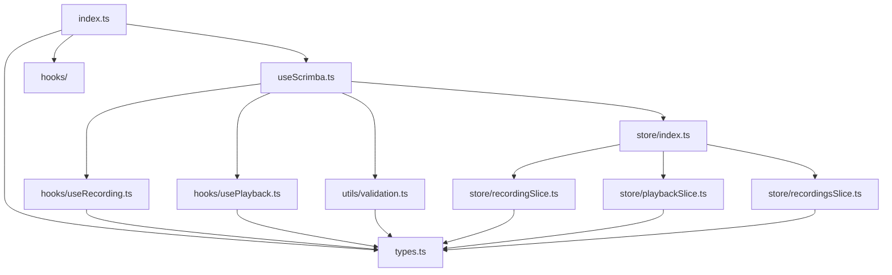

# use-scrimba Project Structure

## Directory Overview

```
packages/use-scrimba/
├── 📁 src/                    # Source code
│   ├── 📄 index.ts            # Main package exports
│   ├── 📄 useScrimba.ts       # Primary hook implementation
│   ├── 📄 types.ts            # TypeScript type definitions
│   ├── 📁 hooks/              # Internal React hooks
│   ├── 📁 store/              # Redux Toolkit state management
│   └── 📁 utils/              # Utility functions
├── 📁 examples/               # Usage examples and demos
├── 📁 dist/                   # Built package (generated)
├── 📁 node_modules/           # Dependencies
├── 📄 package.json            # Package configuration
├── 📄 tsconfig.json          # TypeScript configuration
├── 📄 rollup.config.js       # Build configuration
├── 📄 ARCHITECTURE.md        # Architecture documentation
├── 📄 PROJECT_STRUCTURE.md   # This file
└── 📄 README.md              # Package documentation
```

## Source Code Structure (`src/`)

### Core Files

#### 📄 `index.ts` - Package Entry Point
```typescript
// Main hook export
export { useScrimba } from './useScrimba';

// Type exports for users
export type {
  EditorSnapshot,
  Recording,
  CaptureEvents,
  UseScrimbaConfig,
  UseScrimbaReturn,
} from './types';

// Re-export internal hooks for advanced users
export { useRecording } from './hooks/useRecording';
export { usePlayback } from './hooks/usePlayback';
```

#### 📄 `useScrimba.ts` - Master Timeline Implementation
**Lines of Code**: ~600+
**Key Responsibilities**:
- Master timeline management using `performance.now()`
- Audio synchronization via `audioRef`
- Direct Monaco Editor manipulation
- Redux store orchestration
- Recording and playback controls

**Key Functions**:
```typescript
// Playback controls
play(), pause(), stop(), seekTo()

// Recording controls  
startRecording(), stopRecording()

// Timeline management
masterTimelineUpdate() // Core synchronization loop
```

#### 📄 `types.ts` - Type System
**Key Interfaces**:
- `UseScrimbaConfig` - Hook configuration
- `UseScrimbaReturn` - Hook return type
- `Recording` - Complete recording structure
- `EditorSnapshot` - Timestamped editor state
- `CaptureEvents` - Event capture configuration

### Hooks Directory (`src/hooks/`)

#### 📄 `useRecording.ts` - Event Capture
**Purpose**: Captures Monaco Editor events during recording
**Key Features**:
- Content change detection
- Cursor position tracking
- Selection change monitoring
- Scroll position capture
- Timestamp synchronization

#### 📄 `usePlayback.ts` - State Application
**Purpose**: Applies editor state during playback
**Key Features**:
- Safe state validation
- Position bounds checking
- View state restoration
- User interaction prevention

### Store Directory (`src/store/`)

#### 📄 `index.ts` - Redux Store Configuration
```typescript
export const createScrimbaStore = () => {
  return configureStore({
    reducer: {
      recording: recordingReducer,
      playback: playbackReducer,
      recordings: recordingsReducer,
    },
    middleware: (getDefaultMiddleware) =>
      getDefaultMiddleware({
        serializableCheck: false, // Allow Blob objects
      }),
  });
};
```

#### 📄 `recordingSlice.ts` - Recording State
**State Shape**:
```typescript
interface RecordingState {
  isRecording: boolean;
  recordingStartTime: number | null;
  currentRecording: {
    snapshots: EditorSnapshot[];
    duration: number;
    audioBlob?: Blob;
  } | null;
}
```

**Actions**: `startRecording`, `stopRecording`, `addSnapshot`, `clearCurrentRecording`

#### 📄 `playbackSlice.ts` - Playback State
**State Shape**:
```typescript
interface PlaybackState {
  isPlaying: boolean;
  isPaused: boolean;
  hasEnded: boolean;
  currentTime: number;
  playbackSpeed: number;
  loadedRecording: Recording | null;
  currentSnapshot: EditorSnapshot | null;
  editorState: EditorState;
}
```

**Actions**: `play`, `pause`, `stop`, `end`, `updateCurrentTime`, `seekTo`, `loadRecording`

#### 📄 `recordingsSlice.ts` - Recordings Library
**State Shape**:
```typescript
interface RecordingsState {
  recordings: Recording[];
}
```

**Actions**: `addRecording`, `deleteRecording`, `clearRecordings`, `setRecordings`

### Utils Directory (`src/utils/`)

#### 📄 `validation.ts` - Safety Functions
```typescript
// Editor readiness validation
export const isEditorReady = (editor: monaco.editor.IStandaloneCodeEditor): boolean

// State structure validation
export const isValidEditorState = (state: EditorState): boolean

// Snapshot state validation  
export const isValidSnapshotState = (state: any): boolean
```

## Configuration Files

### 📄 `package.json` - Package Configuration
```json
{
  "name": "use-scrimba",
  "version": "1.0.6",
  "description": "React hook for Scrimba-like interactive coding experiences",
  "main": "./dist/index.js",
  "module": "./dist/index.esm.js",
  "types": "./dist/index.d.ts",
  "exports": {
    ".": {
      "import": "./dist/index.esm.js",
      "require": "./dist/index.js",
      "types": "./dist/index.d.ts"
    }
  },
  "peerDependencies": {
    "react": "^18.0.0",
    "monaco-editor": "^0.44.0"
  }
}
```

### 📄 `tsconfig.json` - TypeScript Configuration
```json
{
  "compilerOptions": {
    "target": "ES2020",
    "module": "ESNext",
    "moduleResolution": "node",
    "strict": true,
    "esModuleInterop": true,
    "skipLibCheck": true,
    "declaration": true,
    "outDir": "./dist"
  },
  "include": ["src/**/*"],
  "exclude": ["node_modules", "dist", "examples"]
}
```

### 📄 `rollup.config.js` - Build Configuration
```javascript
import typescript from '@rollup/plugin-typescript';
import resolve from '@rollup/plugin-node-resolve';
import commonjs from '@rollup/plugin-commonjs';

export default [
  // ESM build
  {
    input: 'src/index.ts',
    output: { file: 'dist/index.esm.js', format: 'es' },
    plugins: [typescript(), resolve(), commonjs()],
    external: ['react', 'monaco-editor', '@reduxjs/toolkit']
  },
  // CommonJS build
  {
    input: 'src/index.ts', 
    output: { file: 'dist/index.js', format: 'cjs' },
    plugins: [typescript(), resolve(), commonjs()],
    external: ['react', 'monaco-editor', '@reduxjs/toolkit']
  }
];
```

## Examples Directory (`examples/`)

### 📄 `basic-usage.tsx` - Simple Integration
```typescript
import { useScrimba } from 'use-scrimba';

function BasicEditor() {
  const editorRef = useRef(null);
  const audioRef = useRef(null);
  
  const scrimba = useScrimba({
    editorRef,
    audioRef
  });
  
  return (
    <div>
      <MonacoEditor onMount={(editor) => editorRef.current = editor} />
      <audio ref={audioRef} style={{ display: 'none' }} />
      <button onClick={scrimba.play}>Play</button>
      <button onClick={scrimba.pause}>Pause</button>
    </div>
  );
}
```

### 📄 `advanced-usage.tsx` - Full Featured Implementation
```typescript
import { useScrimba } from 'use-scrimba';

function AdvancedEditor() {
  const editorRef = useRef(null);
  const audioRef = useRef(null);
  
  const scrimba = useScrimba({
    editorRef,
    audioRef,
    captureEvents: {
      content: true,
      cursorPosition: true,
      selection: true,
      scroll: true
    },
    onRecordingStart: () => console.log('Recording started'),
    onPlaybackUpdate: (time, snapshot) => {
      console.log('Playback update:', time, snapshot);
    },
    onStateChange: (state) => {
      console.log('Editor state changed:', state);
    }
  });
  
  return (
    <div>
      <MonacoEditor 
        onMount={(editor) => editorRef.current = editor}
        onChange={scrimba.handleEditorChange}
      />
      <audio ref={audioRef} style={{ display: 'none' }} />
      <MediaControls
        isPlaying={scrimba.isPlaying}
        currentTime={scrimba.currentTime}
        onPlay={scrimba.play}
        onPause={scrimba.pause}
        onSeek={scrimba.seekTo}
        onSpeedChange={scrimba.setPlaybackSpeed}
      />
      <RecordingsList
        recordings={scrimba.recordings}
        onLoad={scrimba.loadRecording}
        onDelete={scrimba.deleteRecording}
      />
    </div>
  );
}
```

## Build Output (`dist/`)

After building, the following files are generated:

```
dist/
├── 📄 index.js          # CommonJS build
├── 📄 index.esm.js      # ES Module build  
├── 📄 index.d.ts        # TypeScript declarations
└── 📁 types/            # Additional type files
```

## Development Workflow

### 1. **Development Mode**
```bash
npm run dev
# Watches for changes and rebuilds automatically
```

### 2. **Building**
```bash
npm run build  
# Creates production builds in dist/
```

### 3. **Type Checking**
```bash
npm run typecheck
# Validates TypeScript without emitting
```

### 4. **Testing**
```bash
npm test
# Runs Jest test suite
```

## Key Design Patterns

### 1. **Single Responsibility Principle**
- Each file has a focused, single purpose
- Hooks are composable and reusable
- Store slices manage distinct state domains

### 2. **Dependency Injection**
- Editor and audio refs passed as configuration
- Storage handled via callbacks
- Callbacks enable custom behaviors

### 3. **Event-Driven Architecture**
- Recording driven by Monaco Editor events
- Playback driven by master timeline events
- Clean separation of concerns

### 4. **Immutable State Management**
- Redux Toolkit for predictable state updates
- Pure functions for state transformations
- Time-travel debugging support

## File Interdependencies



This structure provides a clean, maintainable, and scalable foundation for the use-scrimba package with clear separation of concerns and excellent developer experience.